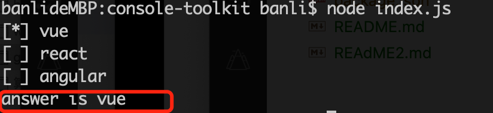
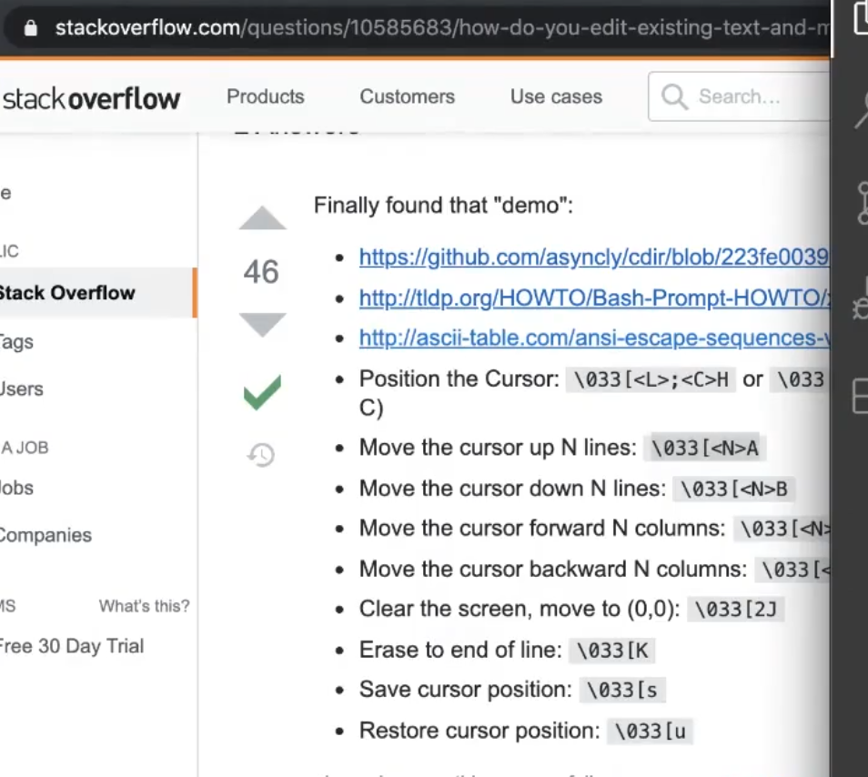

# 命令行的相关知识

问题

1. 如何控制命令行中光标的移动？
2. 如何在命令行中打印带颜色文字？

## 控制光标移动

如何在打印出选项信息后，使用键盘上下键来移动光标，选择完成后输出选择信息？如下图。





[查看 Demo](./index.js)

## 打印带样式的文字

在 Node 中，可以下面命令在控制太打印带有颜色的文字：

```
console.log('\x1b[106m \x1b[36m%s \x1b[0m', 'I am cyan');
console.log('i am banli');
```


- `\x1b[36m` 表示设置终端前景色为青色
- `\x1b[106m` 表示设置终端背景色为亮青色
- `\x1b[0m` 表示重置终端颜色。

其中 `\x1b[` 叫做 CSI(控制序列介绍器)，它相当于一个函数。

如`\x1b[0;1;34m`，可以这样阅读：

```
\x1b[ # call a function
0;1;34 # function arguments (0, 1, 34)
m # function name
```

关于前/背景色的颜色值列表如下:


关于样式：


- [更多：样式、颜色等控制](https://en.wikipedia.org/wiki/ANSI_escape_code#Colors)

`util.inspect(object,[showHidden],[depth],[colors])` 可以用于在控制台打印带颜色对象字符串，常用于警告报错。
