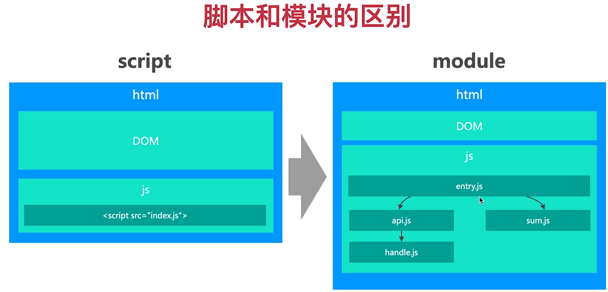

# 工程化

## 工程化发展史

- 1995年 Brendan Eich 发明 js
- 2005年 Ajax 广泛引用
- 2008年 v8 引擎发布
- 2009年 Node 发布
- 2010年 Npm 0.1 版本发布
- 2013年 Webpack 1.0 发布
- 2013年 React 1.0 发布
- 2014年 Vue 1.0 发布

## 开发模式进化过程

- 前后端混合(1995-2005): 服务端渲染，js 实现交互逻辑
- 前后端分离(2005-2013): 借助 ajax 前后端分离、SPA
- 模块化开发(2013-2014): npm、webpack 
- 模块化+MVVM(2014): 基于 React、Vue


## 解决的问题

- 前端开发效率、开发规范、访问性能
  - js 全局作用域冲突 - 模块化(npm、webpack打包)
  - 编码规范问题 - eslint
  - 资源合并和压缩问题 - 减少传输次数和体积
  - 高版本 js 预发降级 - babel

## 前端工程化在企业的应用场景

- 前端工程化贯穿整个研发流程，解决研发流程中的问题
- 工程化的核心目标是三点：效率、规范、性能
- 只有了解前端研发流程的痛点，才能进行诊断和优化
- 需要站在研发场景的角度去思考研发流程痛点

> ROI: 投入产出比

## 前端项目面临的真实问题

- 项目量级增加：几千行代码 -> 几万行代码
  - 解法：模块化(CommonJS 和 esm)、npm 包、webpack
- 项目数量扩大：几个项目 -> 几千个项目
  - 解法：研发平台、研发脚手架
- 项目复杂度高：Web 项目 -> h5/pc/小程序/服务端/脚手架
  - 解法：工程脚手架(统一解决不同技术栈的工程差异)
- 团队人数增长：几个前端 -> 几百前端
  - 解法：研发平台、研发脚手架

**应用场景**

- 研发模式升级(模块化 + MVVM)
- 工程脚手架
- 研发脚手架
- 项目性能优化

## 模块化

- 前端模块化是一种标准，不是实现
- 理解模块化是理解前端工程化的前提
- 前端模块化是前端项目模块化的必然结果

### 是什么

- 将复杂程序根据规范拆分成若干模块，一个模块包含输入和输出
- 模块的内部实现是私有的，对外暴露接口与其它模块通信
- 一个 HTML 页面可以引用的 script 包括：脚本和模块



### 模块化的进化过程

- 第一阶段：无模块化
  - 解决：使用 function 封装功能
  - 问题：全局变量冲突
- 第二阶段：namespace 模式, 通过对象封装模块
  - 问题：外部可以直接访问
- 第三阶段：IIFE, 通过自执行函数(函数作用域 + 闭包), 然后将导出对象挂载到 window 上
  - 问题：无法依赖其他模块
- 第四阶段：IIFE 增强, 支持传入自定义依赖
  - 多模块传入时，代码阅读困难
  - 无法支持大规范的模块化开发
  - 无特定语法支持，代码简陋

### CommonJS 规范

**规范**

- Node.js 默认的模块化规范，每个文件就是一个模块，有自己的作用域
- Node 中的 CJS 模块采用同步加载方式
- 通过 require 加载模块，通过 exports 或 module.exports 输出模块

**特点**

- 所有代码在模块内执行，不会影响全局环境
- 第一次加载会缓存，重复加载会从缓存中读取
- 同步加载

## CommonJS 原理

```js
function require(src){
  if(cache[src]){
    return cache[src]
  }

  ret = IIFE()
  cache[src] = ret
  return ret
}

IIFE(require, module, exports, __filename, __dirname){
  return module.exports
}
```

### browserify 打包原理

```
npm i browserify -g
browserify cjs/a.js -o cjs/bundle.js
```

**原理**

1. IIFE
2. 参数：模块对象表，缓存，入口模块
3. require 方法

### AMD 规范


- Node模块在本地，加载速度快，比较适合同步加载。
- 浏览器环境下，模块需要请求获取，适合异步加载。
- AMD 采用异步加载模块，允许指定回调函数。
- require.js 是 AMD 实现库。

### CMD 规范

- CMD 整合了 CommonJS 和 AMD 的优点，异步加载模块
- CMD 专门用于浏览器端，seajs 是具体实现。
- AMD、CMD 没有从根本语言上解决模块加载问题。

## ESModule 模块

- ESModule 设计理念是希望在编译时就确定模块依赖关系及输入输出
- CommonJS 和 AMD 必须在运行时才能确定依赖和输入、输出（自执行函数）
- ESM 通过 import 加载模块，export 输出模块

**注意** 

1. script标签需要加 `type="module"`
2. 模块里 import 时，需要写文件后缀 `.js`


### ESModule 和 CommonJS 对比

1. CommonJS 模块输出的是值的拷贝，ESModule 输出的是值的引用
2. CommonJS 模块是运行时加载，ES6模块是编译时输出接口
3. CommonJS 导出的是单个值，ESModule 可以导出多个值
4. CommonJS 模块是同步加载，ESModule 支持异步加载(`import('a.js').then`)
5. CommonJS 的 this 是当前模块 module.exports，ESModule 的 this 是 undefined
6. 语法不同

Node14 默认支持 ESM。


**脚本和模块对比**

- 模块具备更高的开发效率(可读性、复用性)
- 脚本写在一起(一个完整功能的 js 文件)，具有更高的页面性能(模块文件多，加载速度慢)
- 模块在浏览器下具有兼容问题

**浏览器模块化的局限**
- 缺乏模块管理能力
  - npm 
- 性能加载慢，无法在大型项目中使用
  - webpack

### npm 历史

- npm 由程序员 lsaac(https://github.com/isaacs) 2014 发明, 2010 被 github 收购
- 初步思路
  - 集中管理所有模块，都上传到仓库 registry
  - 模块内创建 package.json 包含模块信息
  - npm publish 发布模块，上传到仓库 registry
  - 通过 npm install 安装模块，模块安装到 node_modules 目录


- npm 解决的核心问题是模块管理问题

```
npm init
npm install
npm publish
npm link
npm config
npm run

npm 规范
package.json 管理模块信息
node_modules 保存依赖
```

npm 的局限

- npm 只能解决模块的管理和获取, 无法解决高效问题

### webpack 历史

- webpack 2012.3.10，作者是 Tobia（德国)
- 移植了 GWT(Google Web Toolkit) 的功能 (code splitting)
- 2014 Instagram 团队分享性能优化时，提到了 webpack 的 code splitting 特性
- webpack 的出现模糊了任务和构建的边界，使它们融为一体

### webpack 原理

- 最初 webpack 核心问题就是代码合并和拆分
- 将所有资源作为 js 模块，统一打包和处理
- 提供了 loader 和 plugins 完成功能扩展
