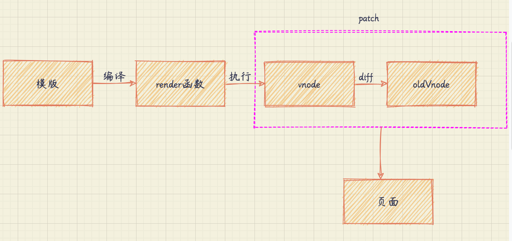

# 深入浅出 vue.js

## 5. 虚拟 DOM 简介

### 5.1 什么是虚拟 DOM

渲染： 状态 -> dom -> 显示在页面

状态变化时，dom 的更新：

- 暴力?，费性能
- 虚拟 DOM: 通过状态生成虚拟节点树(vnode 树)，使用虚拟节点树进行渲染，新生成的树与上一次的树进行比较，差异更新

### 5.2 为什么引入虚拟 DOM

angular 和 react 不知道哪些状态变化了，需要使用暴力对比，react 是虚拟 dom 的比对，angular 是脏检查。

vue 不一样，它知道具体哪些状态变化了，所以可以更细的更新。但是粒度太细，每个绑定都要一个 watcher 来观察变化，会增加内存开销，节点越多开销越大。所以 vue2 引入了虚拟 dom，组件级别是一个 watcher 实例。即组件内有 10 个节点使用了某个状态，但是只有一个 watcher 在监听变化，状态变化时，组件内部通过虚拟 dom 进行对比和渲染，这是一个折中方案。

### 5.3 Vue.js 中的虚拟 DOM

### 5.4 总结

虚拟 DOM 是状态映射为视图的一种解决方案，是通过状态生成虚拟节点，然后使用虚拟节点渲染视图。

之所以需要虚拟节点，是因为真实 DOM 会有一定程度的性能浪费。

## 第 6 章: VNode

### 6.1 什么是 Vnode

### 6.2 Vnode 的作用

### 6.3 Vnode 的类型

### 6.4 总结
