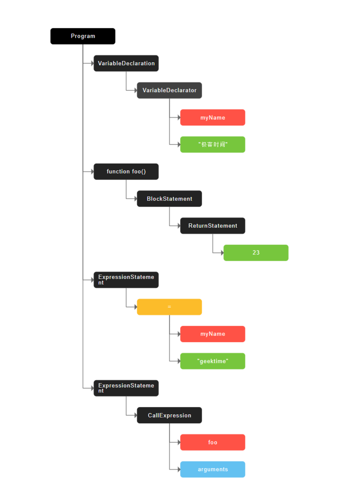
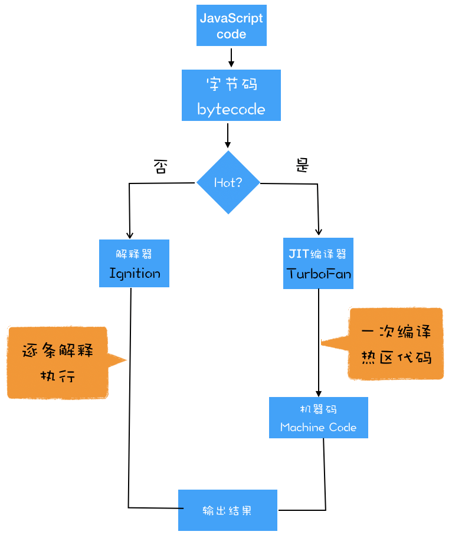

# 浏览器工作原理与实践

## v8 工作原理


js 执行时，主要有 3 种类型的内存空间：

- 代码空间： 存储可执行代码
- 栈空间：存储执行上下文（存储原始类型数据值）。
- 堆空间：存储引用类型数据，优点是大。缺点是分配和回收内存耗时长。

```js
function foo() {
  var a = "极客时间";
  var b = a;
  var c = { name: "极客时间" };
  var d = c;
}
foo();
```


为什么要堆和栈？

js 引擎需要用栈来维护程序执行期间上下文的状态，如果栈太大，会影响上下文切换效率，进而影响整个程序的执行效率。

如上面代码 foo() 执行完成后。只要将指针移动到上一个执行上下文即可。foo() 执行上下文栈区空间全部回收。


**闭包内存模型**

```js
function foo() {
  var myName = "极客时间";
  let test1 = 1;
  const test2 = 2;
  var innerBar = {
    setName: function (newName) {
      myName = newName;
    },
    getName: function () {
      console.log(test1);
      return myName;
    },
  };
  return innerBar;
}
// foo() 如果只调用 foo，则函数执行完后，闭包对象会回收掉，因为没有引用内部变量了
var bar = foo();
bar.setName("极客邦");
bar.getName();
console.log(bar.getName());
```


1. 创建 foo 空执行栈
2. 遇到 foo 里的内部函数，会进行词法扫描，发现内部引用了变量 myName，则 js 引擎判断这是一个闭包，会在堆里创建一个 `clourse(foo)` 的对象(js 无法方法)。然后将引用的变量放在这里对象里。
3. foo 函数退出后，栈被销毁了，但是返回的 getName、setName 方法都引用了`clourse(foo)` 对象，所以对象不会被销毁，当调用 setName 时，创建的执行上下文([[Scopes]])会重新创建对`clourse(foo)`的引用。

产生闭包的核心：

1. 预扫描内部函数
2. 将内部函数的引用变量保存在堆中

- [如何写出一个惊艳面试官的深拷贝?](https://juejin.im/post/6844903929705136141)

### 垃圾回收机制

栈里的垃圾是通过 ESP(记录当前执行状态的指针) 来回收的。当一个函数执行结束之后，JavaScript 引擎会通过向下移动 ESP 来销毁该函数保存在栈中的执行上下文。

堆里的垃圾是通过垃圾回收器来回收的。

代际假说（The Generational Hypothesis）：

- 大部分对象在内存中存在的时间很短，简单来说，就是很多对象一经分配内存，很快就变得不可访问；
- 第二个是不死的对象，会活得更久。

在 V8 中会把堆分为:

- 新生代区域：存放的是生存时间短的对象(1 ～ 8M)。使用副垃圾回收器回收。
- 老生代区域：存放的生存时间久的对象。使用主垃圾回收器回收。

副垃圾回收器和主垃圾回收器执行流程一样：

- 第一步是标记空间中活动对象和非活动对象。
- 第二步是回收非活动对象所占据的内存。
- 第三步是做内存整理。因为回收后会产生内存碎片。

副垃圾回收器采用 Scavenge 算法，将区间分为 2 部分

- 内存空间
- 空闲空间

当内存空间快满时，把存活对象拷贝到空闲区域，同时有序排列起来，然后角色反转。由于复制比较耗时，所以空间比较小。

由于新生区不大，所以很容易满，为了解决这个问题，v8 采用了对象晋升策略。即经过 2 次垃圾回收后依然存活的对象移动到老生区。

主垃圾回收器有 2 个特点：

1. 对象占用空间大，有些大对象直接存到老生区。
2. 对象存活时间长

老生区采用标记-清除(mark-sweep)算法。

1. 遍历调用栈，标记垃圾对象(不能访问到的对象)
2. 垃圾清除(容易产生碎片)，所以通常采用标记-整理(mark-compact)算法，将活动对象向一端移动，然后直接清除掉边界外的内存。


由于 js 只有一个主线程，所以执行垃圾回收算法时，js 脚本会停止。这种行为叫全停顿(stop-the-world)。

如果堆中数据较大，v8 垃圾回收时间会很长(1.5G 要 1s 以上)。会造成卡顿，这对新生代影响不大(比较小,存活对象少)，但是老生代不行，所以 v8 将标记过程分为一个个子标记过程，让垃圾回收器和 js 应用逻辑交替执行，这个算法叫增量标记(incremental marking)。


如何避免内存泄露：

1. 不用的临时变量置为 null
2. 少用闭包
3. 注意恰当时间取消事件、定时器。
4. DOM 引用

如何判断内存泄露：

1. 页面卡顿，可能是
2. 使用 chrome 的 Performance 面板，观察内存变化 如何多次垃圾回收后，整体趋势是向上，就存在内部泄漏的可能！

### js 代码执行过程

编译器和解释器的作用是将代码翻译成机器能读懂的机器语言。

按语言流程分类：

- 编译型语言：在程序执行之前，需要编译器将代码编译成二进制文件。如 C/C++、GO 等。优点是运行速度快,代码效率高,编译后的程序不可修改,保密性较好，缺点是可移植性差。
- 解释型语言：在程序运行时，需要解释器对程序进行动态解释和执行。比如 Python、Javascript 等。优点是可移植性较好，只要有解释环境，可在不同的操作系统上运行，可随时修改。缺点是运行需要解释环境，运行速度相对慢，占用资源也要多一些


V8 执行 Javascript 流程图如下：


> 解释器 Ignition，编译器 TurboFan
> 编译器或者解释器后续的工作都需要依赖于 AST，而不是源代码。

执行流程如下：

1. 生成抽象语法树(AST)和执行上下文

Babel 的工作原理就是先将 ES6 源码转换为 AST，然后再将 ES6 语法的 AST 转换为 ES5 语法的 AST，最后利用 ES5 的 AST 生成 JavaScript 源代码。

ESLint 是一个用来检查 JavaScript 编写规范的插件，其检测流程也是需要将源码转换为 AST，然后再利用 AST 来检查代码规范化的问题。



转为 ast 的步骤是：

- 第一阶段是分词（tokenize），又称为词法分析

  

- 第二阶段是解析（parse），又称为语法分析，其作用是将上一步生成的 token 数据，根据语法规则转为 AST。

有了 AST 后，那接下来 V8 就会生成该段代码的执行上下文。

2. 生成字节码

解释器 Ignition 会根据 AST 生成字节码，并解释执行字节码。

字节码就是介于 AST 和机器码之间的一种代码。但是与特定类型的机器码无关，字节码需要通过解释器将其转换为机器码后才能执行。


机器码所占用的空间远远超过了字节码，所以使用字节码可以减少系统的内存使用。

3. 执行代码

解释器 Ignition 除了生成字节码之外，还负责逐条解释执行字节码。如果发现有热点代码（HotSpot）(比如一段代码被重复执行多次)，后台的编译器 TurboFan 就会把该段热点的字节码编译为高效的机器码，然后当再次执行这段被优化的代码时，只需要执行编译后的机器码就可以了，这样就大大提升了代码的执行效率。

字节码配合解释器和编译器的技术叫做即时编译(JIT)。JIT 工作过程如下：



**JavaScript 的性能优化**

随着 V8 的架构调整，主要只需要关注三个内容:

1. 单次脚本执行速度，避免 JS 长任务霸占主线程
2. 避免大的内联脚本，因为在解析 HTML 的过程中，解析和编译也会占用主线程；
3. 减少 JavaScript 文件的容量，因为更小的文件会提升下载速度，并且占用更低的内存。

V8 执行时间越久，执行效率越高？

> JIT 把需要多次执行的代码变成了机器码。

## 浏览器中的页面循环系统
