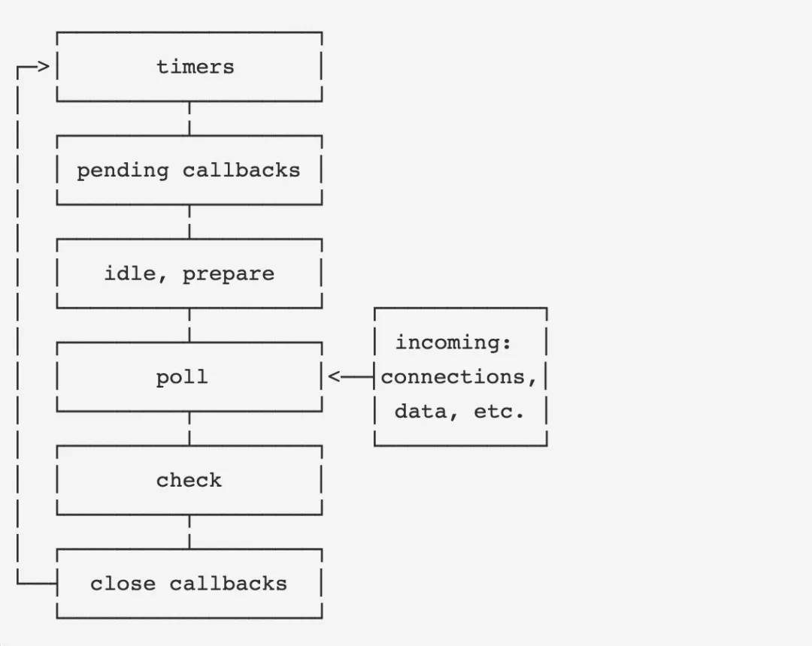

# 浏览器事件循环机制

## 为什么是事件循环

JS 所谓的事件(click、setTimeout 等)和触发本质是通过浏览器中转。ES 中没有定义事件循环，HTML 标准定义事件循环本质是 user-agent（如浏览器）用于协调用户交互（鼠标、键盘）、脚本（如 JavaScript）、渲染（如 HTML DOM、CSS 样式）、网络等行为的一个机制。

## 事件循环是什么

事件如何排队触发的机制，就是事件循环。这个排队分为：

- js 外部的队列：标准称为 Task Queue
  - DOM 操作(页面渲染)
  - 用户交互(鼠标、键盘)
  - 网络请求
  - History API
  - 定时器
  - script 执行
- js 内部的队列，标准称为 Microtask Queue
  - Promise 的 then 和 catch
  - MutationObserver

HTML 标准指定一个事件循环有一个或多个外部队列，每个外部事件源都有一个对应的外部队列。不同事件源队列可以有不同的优先级（如用户交互可以比网络请求优先级高，可以让用户感觉更流畅）。

## 浏览器与 node 事件循环差异

- 浏览器是 js 集成到 html 中，所以有渲染过程。
- node 是将 js 集成到 libuv I/O 循环中

由于 node 无 HTML，所以:

- 只有 Task 和 Microtask，没有渲染。
- Task 没有鼠标等，但是有文件等 IO。
- Microtask 只有 Promise 的 then 和 catch。

Node.js （libuv）在最初设计的时候是允许执行多次外部的事件再切换到内部队列的，而浏览器端一次事件循环只允许执行一次外部事件。Node.js 的这个问题在 11 之后的版本里修复了。

node 启动时，它会初始化事件循环，然后执行同步任务、发起异步请求、规划定时器时间、执行 process.nextTick，最后启动事件循环。

- timers 这个是定时器阶段，处理 setTimeout()和 setInterval()的回调函数。进入这个阶段后，主线程会检查一下当前时间，是否满足定时器的条件。如果满足就执行回调函数，否则就离开这个阶段。
- I/O callbacks
- idle, prepare 该阶段只供 libuv 内部调用
- Poll 这个阶段是轮询时间，用于等待还未返回的 I/O 事件，比如服务器的回应、用户移动鼠标等等。这个阶段的时间会比较长。如果没有其他异步任务要处理（比如到期的定时器），会一直停留在这个阶段，等待 I/O 请求返回结果。

（5）check

该阶段执行 setImmediate()的回调函数。

（6）close callbacks

该阶段执行关闭请求的回调函数，比如 socket.on('close', ...)。

## 参考

- https://mp.weixin.qq.com/s/E0vu7kJLcgDdJRVrAeyEIA
- http://www.ruanyifeng.com/blog/2018/02/node-event-loop.html
- https://www.cnblogs.com/guoyansi19900907/p/3959675.html
