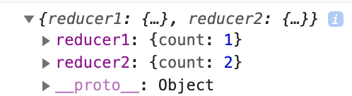

# Redux 使用与实现

## redux 简介

redux 的出现主要是为了解决:

- 单页应用中状态及状态变化越来越复杂难以管理
- 组件之间数据通过 props 一层层传递太麻烦

redux 的设计思想：

- redux 将整个应用的状态存放在一个地方，叫做 store
- 里面保存一棵树 state tree
- 组件可以派发 dispatch 行为 action 给 store，而不是直接通知其它组件
- 其它组件可以通过订阅 store 中的状态 state 来刷新自己的视图

**概念**

- store 仓库
  - reducer 处理器
  - state 状态
  - dispatch 派发
    - action 动作
    - subscribe 订阅

## redux 基本实现

### demo1.js

```js
import { createStore } from "./redux";

const reducer = function (state, action) {
  switch (action.type) {
    case "ADD":
      return { ...state, count: state.count + 1 };
    default:
      return state;
  }
};
const store = createStore(reducer, { count: 1 });

console.log(store.getState()); // {count: 1}
store.subscribe((state) => {
  console.log("触发了更新，新状态是", state);
});
store.dispatch({ type: "ADD" }); // 触发了更新，新状态是 {count: 2}
store.dispatch({ type: "ADD_NO" }); // 触发了更新，新状态是 {count: 2}
store.dispatch({ type: "ADD" }); // 触发了更新，新状态是 {count: 3}
```

### redux.js

```js
let store = null;

function createStore(reducer, initialState) {
  if (store) return store;
  let state = initialState;
  let listeners = [];
  store = {};
  store.getState = () => {
    return state;
  };
  store.dispatch = (action) => {
    state = reducer(state, action); // 执行 reducer，返回一个新的 state
    listeners.forEach((listener) => listener(state));
  };
  store.dispatch({ type: ActionTypes.INIT });
  store.subscribe = (listener) => {
    listeners.push(listener);
    return () => {
      listeners = listeners.filter((item) => item !== listener);
    };
  };
  return store;
}

export { createStore };
```

可以看到 redux 做的事情很简单，就是一个发布订阅模式：

- 通过接收 reducer 和 initState 来创建一个 store
- store 内部有一个 state 保存这当前数据
- 返回 3 个方法:
  - getState() 获取当前 state
  - subscribe() 订阅状态更新
  - dispatch(action) 触发动作，它首先会执行 reducer 返回一个 newState，然后执行订阅事件
- `store.dispatch({ type: ActionTypes.INIT })` 的作用是初始化 state。传入初始化 state 有 2 种方式
  - 通过 `createStore(reducer, initState)` 的第二个参数传入，这个会自动初始化。
  - 通过 `function reducer(state=initState)`，这种情况下如果不调用 INIT，它第一次就不能获取到最新的 state

### actionTypes.js

```js
const randomString = () =>
  Math.random().toString(36).substring(7).split("").join(".");

const ActionTypes = {
  INIT: `@@redux/INIT${randomString()}`,
};

export default ActionTypes;
```

可以看到 INIT 是一个如 "@@INIT1.n.o.3.y.4" 的字符串。

### redux 与 react 结合使用

```js
import React from "react";
import { createStore } from "./redux";

const reducer = function (state = { count: 1 }, action) {
  switch (action.type) {
    case "ADD":
      return { ...state, count: state.count + 1 };
    default:
      return state;
  }
};
const store = createStore(reducer);

class DEMO2 extends React.Component {
  componentDidMount() {
    store.subscribe(() => this.forceUpdate());
  }
  render() {
    return (
      <div>
        <div>count: {store.getState().count}</div>
        <button onClick={() => store.dispatch({ type: "ADD" })}>点击add</button>
      </div>
    );
  }
}
export default DEMO2;
```

可以看到，只需要在 react 组件的 componentDidMount 里订阅 forceUpdate 事件，用户点击按钮触发 dispatch 时，组件就可以自动更新了。

### bindActionCreators

为了简化调用 dispatch 的写法：

```js
// 原来
store.dispatch({ type: "ADD" });
store.dispatch({ type: "MINUS" });

// 简化1，还是麻烦
function add() {
  return { type: "ADD" };
}
function minus() {
  return { type: "MINUS" };
}
store.dispatch(add());
store.dispatch(minus());

// 简化2，还算简单
let boundActions = bindActionCreators({ add, minus }, store.dispatch);
boundActions.add();
```

```js
function bindActionCreator(action, dispatch) {
  return function (...args) {
    return dispatch(action.apply(this, args));
  };
}

function bindActionCreators(actions, dispatch) {
  if (typeof actions === "function") {
    return bindActionCreator(actions, dispatch);
  }
  let boundActions = {};
  for (let key in actions) {
    if (typeof actions[key] === "function") {
      boundActions[key] = bindActionCreator(actions[key], dispatch);
    }
  }
  return boundActions;
}

export default bindActionCreators;
```

可以看到就是简单的返回一个对象，key 是 action 的方法名，值是一个函数，调用时，回去执行这个函数，内部会 dispatch(action)。

### combineReducers

在真实项目中 reducer 里 会有很多 case 分支，如果写在一起会很难维护，为了解决这个问题，redux 提供了 combineReducers 方法来进行 reducer 的模块化拆分。

```js
import React from "react";
import { createStore, bindActionCreators, combineReducers } from "redux";

const reducer1 = function (state = { count: 1 }, action) {
  switch (action.type) {
    case "ADD":
      return { ...state, count: state.count + 1 };
    default:
      return state;
  }
};
const reducer2 = function (state = { count: 2 }, action) {
  console.log(state);
  switch (action.type) {
    case "ADD":
      return { ...state, count: state.count + 2 };
    default:
      return state;
  }
};
const reducer = combineReducers({
  reducer1,
  reducer2,
});
const store = createStore(reducer);
class DEMO extends React.Component {
  componentDidMount() {
    store.subscribe(() => this.forceUpdate());
  }
  render() {
    return (
      <div>
        <div>count1: {store.getState().reducer1.count}</div>
        <div>count2: {store.getState().reducer2.count}</div>
        <button onClick={() => store.dispatch({ type: "ADD" })}>
          count1 add
        </button>
        <button onClick={() => store.dispatch({ type: "ADD" })}>
          count2 add
        </button>
      </div>
    );
  }
}

export default DEMO;
```



```js
function combineReducers(reducers) {
  let combineState = {};
  let reducer = (state, action) => {
    for (let key in reducers) {
      if (!combineState[key]) {
        combineState[key] = state;
      }
      combineState[key] = reducers[key](combineState[key], action);
    }
    return combineState;
  };
  return reducer;
}

export default combineReducers;
```

这里要注意的是：

- state 需要合并
- 看 redux 的实现，reducer 里并没有在 type 前添加私有前缀，所以 action ADD 会导致两个 count 都增加。
