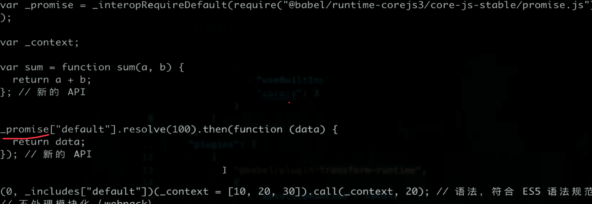

# vue 面试题

:::details
Vue 组件如何通讯
:::

:::details 描述组件渲染和更新的过程
:::

::: details 双向数据绑定 v-model 的实现原理

:::

基本使用

指令、插值
- 插值、表达式
- 指令、动态属性
- v-html: 会有 XSS 风险，会覆盖子组件

computed 和 watch
- computed 有缓存，依赖数据不变不会重新计算
- watch 如何深度监听 deep
- watch 监听引用类型，是拿不到 oldValue 的

class 和 style
- 使用动态属性
- 使用驼峰写法

v-show 和 v-if
- v-show 是 display:none，频繁销毁
- v-if 是不渲染，无节点

循环列表渲染
- 如何遍历对象  - v-for
- key 的重要性，key 不能乱写
- v-for 和 v-if 不能一起使用

```
v-for="(item, index) in listArr"
v-for="(val, key, index) in listObj"
```

事件

- 事件是挂载在当前对象的
- 事件对象是原生的事件对象

```
@click="add"  // 第一个参数是 event
@click="add(2, $event)"  // 最后一个参数 $event
```

事件修饰符

- `.stop`
- `.prevent`
- `.capture`
- `.self`
- `.once`
- `.passive`

```html
<!-- 阻止单击事件继续传播 -->
<a v-on:click.stop="doThis"></a>

<!-- 提交事件不再重载页面 -->
<form v-on:submit.prevent="onSubmit"></form>

<!-- 修饰符可以串联 -->
<a v-on:click.stop.prevent="doThat"></a>

<!-- 只有修饰符 -->
<form v-on:submit.prevent></form>

<!-- 添加事件监听器时使用事件捕获模式 -->
<!-- 即内部元素触发的事件先在此处理，然后才交由内部元素进行处理 -->
<div v-on:click.capture="doThis">...</div>

<!-- 只当在 event.target 是当前元素自身时触发处理函数 -->
<!-- 即事件不是从内部元素触发的 -->
<div v-on:click.self="doThat">...</div>
<!-- 点击事件将只会触发一次 2.1.4 新增-->
<a v-on:click.once="doThis"></a>

<!-- 滚动事件的默认行为 (即滚动行为) 将会立即触发 -->
<!-- 而不会等待 `onScroll` 完成  -->
<!-- 这其中包含 `event.preventDefault()` 的情况 -->
<div v-on:scroll.passive="onScroll">...</div>
```

按键修饰符

- `.exact` 修饰符允许你控制由精确的系统修饰符组合触发的事件。

鼠标按钮修饰符
```html

- .left
- .right
- .middle

<!-- 只有在 `key` 是 `Enter` 时调用 `vm.submit()` -->
<input v-on:keyup.enter="submit">

<!-- 可以将 KeyboardEvent.key 的有效按键名转换为 kebab-case 来作为修饰符 如 ArrowDown Alt-->
<!-- $event.key 等于 PageDown 执行 -->
<input v-on:keyup.page-down="onPageDown">

<!-- Alt + C -->
<input v-on:keyup.alt.67="clear">

<!-- Ctrl + Click -->
<div v-on:click.ctrl="doSomething">Do something</div>

<!-- 即使 Alt 或 Shift 被一同按下时也会触发 -->
<button v-on:click.ctrl="onClick">A</button>

<!-- 有且只有 Ctrl 被按下的时候才触发 -->
<button v-on:click.ctrl.exact="onCtrlClick">A</button>

<!-- 没有任何系统修饰符被按下的时候才触发 -->
<button v-on:click.exact="onClick">A</button>
```


表单
- v-model
- 常见表单项 textarea checkbox radio select
修饰符
- `.trim`
- `.lazy` 将 input 转为 change 事件
- `.number`


组件

组件通讯方式
1. 父子组件通过`props + $emit`: 父组件传递属性，子组件接收，组件上绑定事件，子组件里可以通过 $emit 触发

```
// 父，这里的 @m 是绑定在子组件实例身上
<List :a="a" @m="m">

// 子
this.$emit('m')
```
2. 兄弟组件，通过自定义事件，这是个发布订阅模式

```
event = new Vue()
event.$on 
event.$emit
event.$off 及时在 beforeDestroy 解绑自定义事件
```

组件生命周期

单个组件(背诵)
- 挂载 beforeCreated created beforeMount mounted
- 更新 beforeUpdate updated
- 销毁 beforeDestroy destoryed

父子组件：都是由外到内，再由内到外的
父先挂载，子先渲染
父先beforeUpdate，子先 updated
父先beforeDestroy，子先 destroyed

高级特性
ref="xx" -> this.refs.xx
自定义 v-model

```html
<Form v-model="xx">

// Form 组件
<template>
  <div>{{xx}}</div>
  <input type="text" :value="xx" @input="$emit('change', $event.target.value)" />
</template>
<script>
export default {
  {
    model: {
      value: 'xx',  // 对应 props xx
      event: 'change'
    }
  },
  props: {
    xx: {
      type: String,
      default(){
        return ''
      }
    }
  }
}
</script>
```

$nextTick 异步渲染，多次data 修改会做整合只会渲染一次，会在渲染完成后进行回调
slot
- 匿名插槽
- 具名插槽

```html
<NamedSlot>
  <template v-slot:header>
    <h1>将插入到 header slot中</h1>
  </template>
</NamedSlot>

<!-- NamedSlot 组件 -->
<div>
  <header>
    <slot name="header"></slot>
  </header>
</div>
```
- 作用域插槽：可以让 slot 往外传数据

```html
// 父
<ScopedSlotDemo>
  <template v-slot="props">{{props}}</template>
</ScopedSlotDemo>

// 子
<slot :props="xx"></slot>
```
动态组件: 根据不同的组件名去渲染对应的组件。

```
<component :is="component-name" />
```

异步组件
- import() 函数
- 按需加载，异步加载大组件。

```
{
  components: {
    A: ()=> import("./A") // 用到才会加载
  }
}
```

keep-alive
- 缓存组件
- 频繁切换，不需要重复渲染，如静态 tab
- Vue 常见性能优化

mixin
- 多个组件有相同的逻辑，抽离出来
- Vue3 composition API
- minxi 的问题
  - 变量来源不清晰，不便于阅读
  - 多个 mixins的 data methods 可能会造成命名冲突，会覆盖掉
  - mixin 和组件可能出现多对多关系，复杂


vuex 的使用
- 基本使用
- state 的数据结构设计

vue-router 的使用


vue 原理
- 原理不是源码
- 如何理解MVVM
m v vm 
viewmodel 将数据绑定到视图，并监听 dom 的事件修改数据。
view 变化时，会通过事件来修改 model。
model 变化时，会修改 view。

响应式数据的实现

监听对象
- Object.defineProperty 递归
- value 是闭包，set 时修改了，get 时能取到
- 修改某属性数据为对象时，在 set 里继续 observe

Object.defineProperty 的问题
- 无法监听新增、删除属性。(Vue.set, Vue.delete)
- 深度监听，需要递归到底，一次性计算量大

监听数组
- 创建一个中间对象继承自数组的原型，修改 push、pop、shift、unshift、reverse、splice、sort 7个方法，在内部更新视图并指向原来的push
- 如果是数组，就让它的原型指向这个中间对象

- 依赖搜集

虚拟DOM与 dom-diff 算法
- dom 操作是耗时的，js 是很快的
- 以前用 jquery，可以自动控制 DOM 操作的时机，手动调整
- vue 和 react 是数据驱动视图，如何有效控制 DOM 操作？

解决方案 -vdom
- 把计算转移到 js，js 执行速度快
- 用js模拟dom结构

树 diff 时间复杂度 O(n^3)，算法不可用
- 遍历 tree1、遍历 tree2、排序

O(n)
- 只比较同一层级，不跨级比较
- tag 不同，则直接删除重建，不深度比较
- tag 和 key 都相同，则认为是相同节点，不再深度比较。

1. 如果不是 vnode，就创建空 vnode，比如 el，它的 el会绑定上
2. 不同节点，直接删除removeVnodes 重建 addVnodes
3. 相同节点：samevnode，标签相同&&key相同(没有key undefined也是相等的)，就执行 patchVnode
  1. vnode.el = oldVnode.el
  2. 相同 return 
  3. 更新 data
  3. 新节点没有text，即是元素节点
    - 新旧节点都有 children， updateChildren
    - 只有新节点有 children，删除旧节点的textContent，新增 children
    - 只有旧节点有 children，删除 children(会执行destroy，同时移除事件)
    - 都没有 chilren，有 oldVnode.text，就清除
  4. 新的是文本节点，直接删除旧节点，再设置 textContent


updateChildren 过程
- 设置指针，并判断 null，是 null 则移动指针
- 判断 sameVnode，前前、后后、前后、后前，如果是则递归 patchVnode
- 否则
  - 给旧 vnode children 创建key map，能快速查找
  - 看当前节点的key 在keymap里有没有
    - 没有，则直接新建节点
    - 有，
      - 标签不同，则也是新建节点
      - 标签也相同，则将节点处置为undefined，并移动节点到 start 前面
- 最后将超出的节点删除掉，新增多的节点。

分析 列表中 key 的作用

没有 key 时

```
<li>A <input /></li>   // value=A
<li>B <input /> </li>  // value=B
<li>C <input /></li>   // value=C

<li>A <input /></li>  // value=A
<li>C <input /></li>  // value=B
第二个元素是 samevnode，更新对比子节点，修改 B 为 C，input 由于没有 v-model 具体的变量，所以是同一个节点，不会更新
```

模版编译原理
- 它不是 html，有指令、插值、js表达式，到底是什么
- `vue-template-compiler` 将模版编译称为 render 函数
- 执行 render 函数生成 vnode

```js
const compiler = require('vue-template-compiler')
const template = `
    <div>
        <p title="插值">{{message}}</p>
        <p title="表达式">{{flag ? message : 'no message'}}</p>
        <p title="属性" id="属性id" :style="style"></p>
        <div title="条件">
            <p v-if="flag === 'a'">A</p>
            <p v-else>B</p>
        </div> 
        <ul title="循环">
         <li v-for="item in list" :key="item.id">{{item.title}}</li>
     </ul>
     <button title="事件" @click="clickHandler">submit</button>
     <input title="v-model" type="text" v-model="name">
    </div>
`
const res = compiler.compile(template)
console.log(res.render)
```

```
with (this) {
    return _c('div', [_c('p', { attrs: { "title": "插值" } },

        [_v(_s(message))]), _c('p', { attrs: { "title": "表达式" } },

            [_v(_s(flag ? message : 'no message'))]),

    _c('p', { style: (style), attrs: { "title": "属性", "id": "属性id" } }),

    _c('div', { attrs: { "title": "条件" } }, [(flag === 'a') ? _c('p', [_v("A")]) : _c('p', [_v("B")])]),

    _c('ul', { attrs: { "title": "循环" } }, _l((list), function (item) { return _c('li', { key: item.id }, [_v(_s(item.title))]) }), 0),

    _c('button', { attrs: { "title": "事件" }, on: { "click": clickHandler } },

        [_v("submit")]), _c('input', { directives: [{ name: "model", rawName: "v-model", value: (name), expression: "name" }], attrs: { "title": "v-model", "type": "text" }, domProps: { "value": (name) }, on: { "input": function ($event) { if ($event.target.composing) return; name = $event.target.value } } })])
}
```

with 语法
- 改变{}内变量查找规则，找不到就会报错。
vue 模版编译成了什么？

渲染和更新
初次渲染
- 解析模版为 render 函数(开发环境下是 vue-loader)
- 触发响应式，监听 data 属性 getter(收集依赖) setter(触发更新)
- 执行 render 函数，生成 vnode，patch(elem, vnode)

更新过程
- 修改 data，触发 setter(此前 getter 中已经被监听，执行render时会访问属性)
- 重新执行 render，生成 newVnode
- patch(vnode, newVnode)

$nextTick 原理
- 异步执行的
- Promise
- MutationObserve
- setImmediate
- setTimeout


vue3升级内容
- 全部用 ts 重写(响应式、vdom、模版编译)
- 性能提升、代码量减少
- 调整部分 API

- 组件渲染和更新原理

vue-router 原理
- 稍微复杂一点的 SPA 都需要路由

onhashchange
- event.oldURL
- event.newURL
- location.hash
history
- pushState()
- back() forward()
- onpopstate 浏览器前进后退触发
- history.pushState()或history.replaceState()不会触发popstate事件

- vuex 原理

为什么 data 是一个函数？
```
{data:{}}
```
使用组件时，实际是实例化了一个 Vue，将配置传进去，data 就会指向同一个引用。如果是函数，会执行。

ajax 请求应该放在 mouted 里面。
- js 是单线程的，ajax 异步获取数据。
- 放在 mounted 之前没有用，只会让逻辑更加混乱。
- ajax 是宏任务，网络事件是宏任务。

如何将组件所有 props 传递给子组件
```
<List v-bind="$props" />
```

多个组件的逻辑如何抽离
- mixin
- mixin 的一些问题

何时使用异步组件
- 加载大组件
- 路由

beforeDestory
- 解绑自定义事件 event.$off
- 清除定时器
- 解除绑定的原生事件 removeListener

响应式原理
- 数据监听
- 组件更新 (收集依赖、通知依赖)

vue 常见性能优化
- 合理使用 v-show v-if： for 层级比 if 高，所以编译时还是会循环所有，可以用 computed 减少
- 合理使用 computed，缓存
- v-for 加 key，避免与 v-if 使用
- 事件及时销毁
- 合理使用异步组件
- keep-alive
- data 层级不要太深
- vue-loader 预编译
- webpack 层面的优化

proxy
- 提升性能 (获取到时，才会继续监听，而之前是一次性递归)
- 可以监听 新增/删除的属性
- 可以监听数组变化
- 无法兼容 ie11，无法 polyfill


Reflect作用
- 和 Proxy 一一对应
- 规范化、标准化、函数式
- 替代掉 Object 上的工具方法

## React

- React 组件如何通讯
- JSX 本质是什么
- context 是什么，有何用途
- shouldComponnetUpdate 的用途
- 描述 redux 单向数据流
- setState 是同步还是异步的?

jsx使用
```
dangerouslySetInnerHTML={{_html:x}}
```

event 是封装过的
event.nativeEvent

setState 

1. 使用不可变值。防止更新错误。
比如在 shouleComponentUpdate 里如果 list 相同就不更新。这样即使修改了 list 也不会更新。

2. 会批量更新

```
this.list.push('d') // 因为 nextState.list == this.state.list
```
3. 对象会合并

```
setState({
  count: this.state.count+1
})
setState({
  count: this.state.count+1     // 1
})
Object.assign({count: this.state.count+1})
```

上面的对象会合并，所以只会加 1，如果是函数，不会被合并。

```
setState((prevState, props)=>{
  return {count: prevState + 1}
})
```

组件生命周期
- constructor

https://projects.wojtekmaj.pl/react-lifecycle-methods-diagram/

React 高级特性

函数组件和类组件区别
函数组件
- 纯函数，只有 props
- 无 state

受控组件: 受react 管理
- state
- 事件
非受控组件: 必须操作 dom,setState 实现不了时，如文件上传，富文本
- ref
- defaultValue defaultChecked
- 手动操作DOM元素

```
this.inputRef = React.createRef()
<input defaultValue={this.state.name} ref={this.inputRef} />
```

Portals
- 组件默认会按照既定层次嵌套渲染
- 如何让组件渲染到父组件以外
- React.createPortal

```js
class Portals{
  render(){
    return ReactDOM.createPortal(<div>, document.body)
  }
}
```

context
- 公共信息如何传递给每个组件
- 用 props 太麻烦
- 用 redux 小题大做

```
const {Provider, Context} = React.createContext()
```

异步组件
- `import()`
- React.lazy
- React.Suspense

```
const ContextDemo = React.lazy(()=> import('./ContextDemo'))

<React.Suspense fallback={<div>Loading...</div>}
  <ContextDemo />
<React.Suspense>
```

性能优化
对 React 更重要，因为默认情况下，它是更新当前组件和所有子组件
- shouldComponentUpdate(nextProps, nextState)
    - 必须用吗？没性能问题就可以不使用
    - 为什么 react 不进行深度比较，然后进行更新
      - 因为不是所有开发者都会遵循setState 时用不可变量，比如 `this.state.list.push(['1'])`，然后在 setState ，如果进行了深度比较更新，shouldComponentUpdate就会有问题了，就不会更新了。
- PureComponent 
  - 浅比较
  - memo 函数组件中的 PureComponent
- 按需加载
- state 层级的设计
```
React.memo(FnComponent, (prevProps, nextProps)=>{return false})
```

immutable.js 不可变值

```
// props 类型检查
Input.propTypes = {
  x: PropTypes.func.isRequired
}
```

组件公共逻辑的抽离
- mixin, 已经被 react 废弃
- 高阶组件 HOC: 是一种设计模式
- Render Props： 处理函数式组件，通过一个函数 将class 组件的 state 作为 props 传递给函数组件

```
class Factory{
  // 多个组件的公共逻辑
  render(){
    return <div>{this.props.render(this.state)}</div>
  }
}
<Factory render={(props)=><p>{props.a}</p>}>
```

redux
- dispatch(action)
- reducer -> newState
- subscribe 触发通知

基本概念
单向数据流
react-redux
异步action
中间件： 改了 dispatch 方法

react-router

```
import {BrowserRouter as Router, Switch, Route} from 'react-router'
<Router>
<Suspense fallback={<div>loading</div>}>
  <Switch>
    <Route exact path="/" component={Home}>
    <Route exact path="/project/:id">
      <Project/>
    </Route>
    <Route exact path="*" component={NotFound}>
  </Switch>
  </Suspense>
<Router>

useParams()
const history = useHistory()
history.push('')

// 通过 parmas
this.props.history.push(  '/sort/'+'2'  )
通过  this.props.match.params.id 

// 通过 query
this.props.history.push({ path : '/sort' ,query : { name: ' sunny'} })
 this.props.location.query.name
//通过 state
  this.props.history.push({ pathname:'/sort',state:{name : 'sunny' } })
 this.props.location.state.name
```

函数式编程
- 范式
- 纯函数
- 不可变值

jsx 的本质
```
React.createElement('div')
React.createElement(List) // 类
```

合成事件
- 事件冒泡到 document 
- 封装 SyntheticEvent 对象
- dispatchEvent
  - 开启批量更新
  - 冒泡触发 target,target.parentNode 一层层绑定的事件
  - 批量更新

为什么合成事件?
- 更好的兼容性和跨平台，减少和 dom 的依赖
- 挂载到 document 上，减少内存消耗，避免频繁解绑
- 方便事件的统一管理(如事务机制)

https://segmentfault.com/q/1010000013892375?utm_source=tag-newest

setState 主流程
- setState(newState)
- newState 会存到 pending 队列
- 是否批量更新
  - 是，保存组件到 dirtyComponents 中
  - 否，遍历所有的 dirtyComponents，调用 updateComponent，更新 pending state 和 props

生命周期内和事件函数内。

transaction 事务机制


react patch 分为2个阶段
- reconciliation阶段 - 执行 diff 算法，纯 js 计算
- commit 阶段，将 diff 结果渲染 DOM

不分可能存在性能问题
- js 单线程，和 dom 公用一个线程
- 当组件足够复杂，组件更新时计算和渲染都压力大
- 同时再有 dom 操作需求(动画，拖拽)，会卡顿

解决方法 fiber：
- 将 reconciliation 阶段进行任务拆分(commit 无法拆分)
- DOM 需要渲染时暂停，空闲时恢复
  - window.requestIdleCallback 空闲时调用

react 和 vue 的区别
相同
- 都支持组件化
- 都是数据驱动视图
- 都使用 vdom 操作 DOM
不同
- React使用 jsx 拥抱 js，Vue 使用模版拥抱 html
- React 函数式编程 setState，Vue 声明式编程 x.a = 
- vue 更方便、react 自力更生，如循环v-for , map


## webpack

- 前端代码为何要进行构建和打包？
- module chunk bundle 分别是什么意思，有何区别？
- loader 和 plugin 的区别？
- webpack 如何实现懒加载？
- webpack 常见性能优化？
- babel-runtime 和 babel-polyfill 区别？
- vue-cli

基本配置
- 拆分配置和 merge
- 配置文件解析 样式、图片
- 配置本地服务 proxy
- 处理 es6
高级配置

多入口
- 配置 entry
- 配置多个 new HtmlWebpackPlugin

```
output: {
  filename: '[name].[contentHash:8].js'
}
new HtmlWebpackPlugin({
  template: path.join(srcPath, 'index.html'),
  filename: 'index.html',
  chunks: ['index'],
})
```

- 抽离压缩 css

```
{
  plugins: [
    new MiniCssExtractPlugin({
      filename: 'css/main.[contentHash:8].css'
    })
  ],
  optmization: {
    minimizer: [new TerserJSPlugin({}), new OptimizeCssAssetsPlugin()]
  }
}
```

抽离公共部分

```js
optmization: {
  splitChunks: {
    /** 配置
     *  initial 入口 chunk 对于异步文件不处理
     * async 异步chunk，只对异步导入的文件处理
     * all 全部 chunk
     */
    chunks: 'all',
    // 缓存分组
    cacheGroups: {
      // 第三方模块
      vendor: {
        name: 'vendor', // chunk名称
        priority: 1,  // 权重更高，优先抽离
        test: /node_modules/,
        minSize: 0,  // 大小限制
        minChunks: 1,  // 最少复用过几次
      },
      // 公共的模块
      common:{
        name: 'common',
        priority: 0,
        minSize: 0, 
        minChunks: 2
      }
    }
  }
}


new HtmlWebpackPlugin({
  template: path.join(srcPath, 'index.html'),
  filename: 'index.html',
  chunks: ['index', 'vendor'],
})
```

懒加载 `import('')`


处理 jsx vue
- presets: @babel/preset-react
- .vue -> vue-loader

module chunk bundle 区别
一切都是模块，能被引用
chunk 是多模块的合成，依赖的文件
- entry
- splitChunk
- import()
bundle - 最终的输出文件

性能优化
- 优化打包构建速度-开发体验和效率
- 优化产出代码-产品性能

构建速度
- 进化：升级 node webpack
- 减少工作量
  - 缩小范围(减少工作量)
    - 缩小查找范围 
      - alias
      - resolveLoader
    - 缩小 loader 处理范围
  - 优化 babel-loader
    - 开启缓存
    - 使用 include 或 exclude(exclude优先级高，排除node_modules里的某个可以https://github.com/webpack/webpack/issues/2031)
  - DllPlugin webpack 内置了 dllPlugin
    - DllPlugin 先打包一个dll
    - DllReferencePlugin 使用 dll

```
{
  test: /\.js$/,
  use: ['babel-loader?cacheDirectory'] // 开启缓存
  include: path.resolve(__dirname, 'src')
}
```
  - IgnorePlugin
  - noParse: 不去解析属性值代表的库的依赖，对类似jq这类依赖库，一般会认为不会引用其他的包

```
module:{
		noParse:/jquery/
...
```

- (帮手): happyPack 多进程打包

项目大、打包慢，开启多进程能提高速度
项目小，打包快，开启多进程会降低速度(进程开销)

```

```

- ParallelUglifyPlugin 多进程代码压缩
  - tenser

```
new TerserPlugin({
  exclude: /\/excludes/,
  parallel: true,
  terserOptions: {
    ecma: undefined,
    parse: {},
    compress: {
      drop_console: true
    },
  }
}),
```

- 自动刷新

```
// 配置了 webpack-dev-server 会自动开启刷新
module.export = {
  watch: true,
  watchOptions: {
    ignored: /node_modules/,
    aggregateTimeout: 300,
    poll: 1000
  }
}
```

- 热更新

自动刷新： 整个网页全部刷新，状态丢失
热更新：新代码生效，状态不会丢失

配置
```
new HotModuleReplacementPlugin()
devServer:{
  hot: true
}
```

优化产出
- 缓存
  - bundle 加 hash
  - 合理分包，不重复加载
- 减小体积更小
  - imagemin 压缩图片
  - 提取公共代码
  - IngorePlugin  去掉 moment 语言
- 增加请求效率
  - cdn 加速
- 减少请求数，内存使用更小
  - 小图片 base64
  - 懒加载
- 使用 production
  - 自动开启代码压缩
  - vue react 自动删掉调试代码(如开发环境的 warning)
  - treesharking：es6module 才行，commonjs不行
  - Scope Hosting: 默认打包会创建很多函数，执行是会产生大量作用域，开启后，函数直接将打包到另一个函数里了，多个函数合并成一个函数，这样就减少了函数作用域。production 自动开启。


es6module commonjs 区别
es6module 是静态引用，编译时引入
comonjs  是动态引入，执行时引入
只有编译时静态分析，实现 treesharking

babel
- 如何配置
  - .babelrc
  - presets 和 plugins，presets 是 plugins 的集合，套餐。
    - @babel/preset-env
    - @babel/preset-react
    - @babel/preset-typescript
- @babel/polyfill 就是下面 2 个包的集合，babel7.4 弃用了，推荐直接使用下面2个
  - core-js是所有的新语法 polyfill 的集合，不支持 generator
  - regenerator 

polyfill 按需引用

```
// .babelrc
{
  "presets": [
    [
      "babel-preset-env",
      {
        "useBuiltIns": "usage",
        "corejs": 3  // corejs 最新版本
      }
    ]
  ],
  "plugins": [
    // runtime
    "@babel/plugin-transform-runtime",
    {
      "absoluteRuntime": false,
      "corejs": 3,
      "helpers": true,
      "regenerator": true,
      "useESModules": false
    }
  ]
}
```


@babel/runtime

polyfill 还是污染了全局环境，如重定义了 window.Promise
runtime 会将这些改名



前端为何要打包和构建
- 体积更小(tree-sharking 压缩 合并)，加载更快
- 使用高级语言和特性(ts，es6+，模块化，scss)
- 兼容性和语法检查 polyfill eslint postcss
- 统一、高效的开发环境
- 统一的构建流程和产出标准
- 集成公司构建规范(提测、上线等)


loader plugin差别？ 有哪些？

如何打包一个 lib

```
output: {
  file: 'xx.js',
  library: {
      name: 'webpackNumbers',
      type: 'umd',
  },
  // 将包外部化
  externals: {
     lodash: {
       commonjs: 'lodash',
       commonjs2: 'lodash',
       amd: 'lodash',
       root: '_',
     },
   },
}
```


https://www.cnblogs.com/meituantech/p/9718677.html
