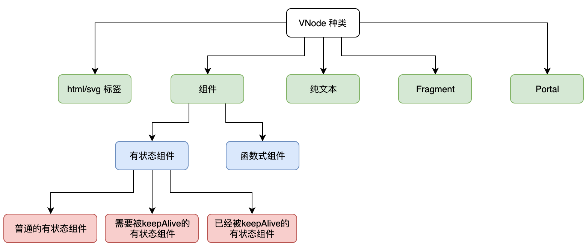

# 渲染器

## 组件的本质

对比一下模版引擎和 vue 渲染的区别：

- 模版引擎： 通过`字符串 + 数据`产出`html`，然后插入到页面中，当数据变化时，重新编译 html 再替换页面内容。
- vue: 通过 `render()`方法产出 vnode，然后使用 `patch` 方法插入到页面，当数据变化时，重新执行 `render()`生成新的 vnode，然后使用 `patch` 进行差异化更新。

```js
// 模版引擎
const MyComponent = (props) => {
  const compiler =
    MyComponent.cache ||
    (MyComponent.cache = lodash.template("<h1><%= title %></h1>"));
  return compiler(props);
};
MyComponent.cache = null;

document.getElementById("app").innerHTML = MyComponent({ title: "prev" });
setTimeout(() => {
  document.getElementById("app").innerHTML = MyComponent({ title: "now" });
}, 2000);
```

```js
import { h, init } from "snabbdom";
// h 函数用来创建 VNode，组件的产出是 VNode
// init 方法用来创建 patch 函数
const patch = init([]);

const MyComponent = (props) => {
  return h("h1", props.title);
};

const prevVnode = MyComponent({ title: "prev" });
const nowVnode = MyComponent({ title: "now" });
console.log(prevVnode, nowVnode);
// 将 VNode 渲染成真实 DOM
patch(document.getElementById("app"), prevVnode);
setTimeout(() => {
  patch(prevVnode, nowVnode);
}, 2000);
```

组件的本质是函数，它接收数据，返回要渲染的内容。

但是组件的产出发生了变化：

- jquery 时代是 html 内容
- vue/react 时代是 vnode，用来描述要渲染的内容

这样的好处是分层设计，产出 vnode，可以使得框架可以渲染到浏览器以外的平台，以及实现 SSR 等。

## 组件的分类

组件按目前框架分类为：

- 函数式组件
  - 是一个纯函数
  - 没有自身状态，只接收外部数据
  - 产出 VNode 的方式：单纯的函数调用
- 类组件(有状态组件)
  - 是一个类，可实例化
  - 可以有自身状态
  - 产出 VNode 的方式：需要实例化，然后调用其 render 函数

## Vnode 的设计

### Vnode 分类



- Fragment 只渲染其子元素
- Portal 可以渲染到任意位置，适用于 `<Mask/>` 遮罩。

vnode 的设计如下：

```js
const textVNode = {
  text: "文本内容",
};

const elementVNode = {
  tag: "div",
  data: null,
  children: {
    tag: MyComponent,
    data: null,
  },
};

const Fragment = Symbol();
const fragmentVNode = {
  // tag 属性值是一个唯一标识
  tag: Fragment,
  data: null,
  children: [
    {
      tag: "td",
      data: null,
    },
  ],
};

const Portal = Symbol();
const portalVNode = {
  tag: Portal,
  data: {
    target: "#app-root",
  },
  children: {
    tag: "div",
    data: {
      class: "overlay",
    },
  },
};
```

Vnode 会在 patch 阶段使用时才能知道其类型，这就导致 2 个问题：

- 无法从 AOT(预编译阶段) 的层面优化
- 开发者无法手动优化

解决方法是在创建 Vnode 时添加 flags 标记。这样在 patch 时就可以省掉判断的时间。

```js
if (flags & VNodeFlags.ELEMENT) {
  // VNode 是普通标签
  mountElement(/* ... */);
} else if (flags & VNodeFlags.COMPONENT) {
  // VNode 是组件
  mountComponent(/* ... */);
} else if (flags & VNodeFlags.TEXT) {
  // VNode 是纯文本
  mountText(/* ... */);
}
```

上面代码中，使用位运算提高性能。

### VNodeFlags

```js
const VNodeFlags = {
  // html 标签 32位表示 00.. 000000001
  ELEMENT_HTML: 1,
  // SVG 标签  00.. 000000010
  ELEMENT_SVG: 1 << 1,

  // 普通有状态组件
  COMPONENT_STATEFUL_NORMAL: 1 << 2,
  // 需要被keepAlive的有状态组件
  COMPONENT_STATEFUL_SHOULD_KEEP_ALIVE: 1 << 3,
  // 已经被keepAlive的有状态组件
  COMPONENT_STATEFUL_KEPT_ALIVE: 1 << 4,
  // 函数式组件
  COMPONENT_FUNCTIONAL: 1 << 5,

  // 纯文本  00.. 001000000
  TEXT: 1 << 6,
  // Fragment   00.. 010000000
  FRAGMENT: 1 << 7,
  // Portal   00.. 100000000
  PORTAL: 1 << 8,
};
```

使用 VnodeFlags 还可以派生出 3 个类型：

```js
// html 和 svg 都是标签元素，可以用 ELEMENT 表示
// 000000011
VNodeFlags.ELEMENT = VNodeFlags.ELEMENT_HTML | VNodeFlags.ELEMENT_SVG;
// 普通有状态组件、需要被keepAlive的有状态组件、已经被keepAlice的有状态组件 都是“有状态组件”，统一用 COMPONENT_STATEFUL 表示
// 000011100
VNodeFlags.COMPONENT_STATEFUL =
  VNodeFlags.COMPONENT_STATEFUL_NORMAL |
  VNodeFlags.COMPONENT_STATEFUL_SHOULD_KEEP_ALIVE |
  VNodeFlags.COMPONENT_STATEFUL_KEPT_ALIVE;
// 有状态组件 和  函数式组件都是“组件”，用 COMPONENT 表示
// 000111100
VNodeFlags.COMPONENT =
  VNodeFlags.COMPONENT_STATEFUL | VNodeFlags.COMPONENT_FUNCTIONAL;
```

有了 flags 后，创建 Vnode 的形式可以如下：

```js
// html 元素节点
const htmlVnode = {
  flags: VNodeFlags.ELEMENT_HTML,
  tag: "div",
  data: null,
};

// svg 元素节点
const svgVnode = {
  flags: VNodeFlags.ELEMENT_SVG,
  tag: "svg",
  data: null,
};

// 函数式组件
const functionalComponentVnode = {
  flags: VNodeFlags.COMPONENT_FUNCTIONAL,
  tag: MyFunctionalComponent,
};

// 普通的有状态组件
const normalComponentVnode = {
  flags: VNodeFlags.COMPONENT_STATEFUL_NORMAL,
  tag: MyStatefulComponent,
};

// Fragment
const fragmentVnode = {
  flags: VNodeFlags.FRAGMENT,
  // 注意，由于 flags 的存在，我们已经不需要使用 tag 属性来存储唯一标识
  tag: null,
};

// Portal
const portalVnode = {
  flags: VNodeFlags.PORTAL,
  // 注意，由于 flags 的存在，我们已经不需要使用 tag 属性来存储唯一标识，tag 属性用来存储 Portal 的 target
  tag: target,
};
```

判断 Vnode 否是组件类型:

```
// 使用按位与(&)运算
functionalComponentVnode.flags & VNodeFlags.COMPONENT // 真
normalComponentVnode.flags & VNodeFlags.COMPONENT // 真
htmlVnode.flags & VNodeFlags.COMPONENT // 假
```

### children 和 ChildrenFlags

一个节点的子节点可能存在情况有：

- 没有子节点
- 只有一个子节点
- 多个子节点
  - 有 key
  - 无 key
- 不知道子节点的情况

ChildrenFlags 用来表述上面的这些情况：

```js
const ChildrenFlags = {
  // 未知的 children 类型
  UNKNOWN_CHILDREN: 0,
  // 没有 children
  NO_CHILDREN: 1,
  // children 是单个 VNode
  SINGLE_VNODE: 1 << 1,

  // children 是多个拥有 key 的 VNode
  KEYED_VNODES: 1 << 2,
  // children 是多个没有 key 的 VNode
  NONE_KEYED_VNODES: 1 << 3,
};
```

可以派生出多子节点的情况：

```js
ChildrenFlags.MULTIPLE_VNODES =
  ChildrenFlags.KEYED_VNODES | ChildrenFlags.NONE_KEYED_VNODES;

// 判断多子节点
someVNode.childFlags & ChildrenFlags.MULTIPLE_VNODES;
```

ChildrenFlags 的作用是为了 diff 时优化。

Vnode 添加了 ChildrenFlags：

```js
const textVNode = {
  tag: null,
  data: null,
  children: "我是文本",
  childFlags: ChildrenFlags.NO_CHILDREN,
};
```

不过不是所有类型的 Vnode.children 都是用来存储子 Vnode，比如组件的子 Vnode 不应该作为 children，而应该是 slots。

### VNodeData

VNodeData 是 Vnode 里的 data 属性，用来存放 Vnode 的数据。

```js
{
  flags: VNodeFlags.ELEMENT_HTML,
  tag: 'div',
  data: {
    class: ['class-a', 'active'],
    style: {
      background: 'red',
      color: 'green'
    },
    // 其他数据...
  }
}
```

## h 方法

h 方法实际是 Vue 里的 createElement 方法，其内部会使用 `_createElement` 方法用来辅助创建 Vnode，它的内部流程是:

1. 确定 Vnode 的 flags
2. 确定其 children 的类型
3. 创建相应的 Vnode

### 确定 Vnode 的 flags

h 方法首先会根据 tag 来确定 Vnode 的 flags。tag 可能是：

- 字符串: 说明是元素，再进一步看是 svg 还是 html 元素
- Fragment
- Portal
- 一个对象，vue2 的对象式组件
  - 函数式组件
  - 有状态组件
- 一个函数
  - 函数式组件
  - class 内部有 render 方法，说明是 vue3 的类组件

```js
function h(tag, data = null, children = null) {
  let flags = null;
  if (typeof tag === "string") {
    flags = tag === "svg" ? VNodeFlags.ELEMENT_SVG : VNodeFlags.ELEMENT_HTML;
  } else if (tag === Fragment) {
    flags = VNodeFlags.FRAGMENT;
  } else if (tag === Portal) {
    flags = VNodeFlags.PORTAL;
    tag = data && data.target;
  } else {
    // 兼容 Vue2 的对象式组件
    if (tag !== null && typeof tag === "object") {
      flags = tag.functional
        ? VNodeFlags.COMPONENT_FUNCTIONAL // 函数式组件
        : VNodeFlags.COMPONENT_STATEFUL_NORMAL; // 有状态组件
    } else if (typeof tag === "function") {
      // Vue3 的类组件
      flags =
        tag.prototype && tag.prototype.render
          ? VNodeFlags.COMPONENT_STATEFUL_NORMAL // 有状态组件
          : VNodeFlags.COMPONENT_FUNCTIONAL; // 函数式组件
    }
  }
}
```

### 确定其 children 的类型

接着 h 方法会确定 Vnode 的 children 的类型，children 有可能是:

- 数组
  - 无子节点
  - 一个子节点
  - 多个子节点
- null
- 单个子节点
- 文本

```js
function h(tag, data = null, children = null) {
  // ...
  let childFlags = null;
  if (Array.isArray(children)) {
    const { length } = children;
    if (length === 0) {
      // 没有 children
      childFlags = ChildrenFlags.NO_CHILDREN;
    } else if (length === 1) {
      // 单个子节点
      childFlags = ChildrenFlags.SINGLE_VNODE;
      children = children[0];
    } else {
      // 多个子节点，且子节点使用key
      childFlags = ChildrenFlags.KEYED_VNODES;
      children = normalizeVNodes(children);
    }
  } else if (children == null) {
    // 没有子节点
    childFlags = ChildrenFlags.NO_CHILDREN;
  } else if (children._isVNode) {
    // 单个子节点
    childFlags = ChildrenFlags.SINGLE_VNODE;
  } else {
    // 其他情况都作为文本节点处理，即单个子节点，会调用 createTextVNode 创建纯文本类型的 VNode
    childFlags = ChildrenFlags.SINGLE_VNODE;
    children = createTextVNode(children + "");
  }
}
```

上面代码中，对于多个子节点没有区分节点是否带 key。这是因为 normalizeVNodes 会给无 key 的子节点添加上默认的 key。

```js
function normalizeVNodes(children) {
  const newChildren = [];
  // 遍历 children
  for (let i = 0; i < children.length; i++) {
    const child = children[i];
    if (child.key == null) {
      // 如果原来的 VNode 没有key，则使用竖线(|)与该VNode在数组中的索引拼接而成的字符串作为key
      child.key = "|" + i;
    }
    newChildren.push(child);
  }
  // 返回新的children，此时 children 的类型就是 ChildrenFlags.KEYED_VNODES
  return newChildren;
}
```

### 创建相应的 Vnode

```js
function createTextVNode(text) {
  return {
    _isVNode: true,
    // flags 是 VNodeFlags.TEXT
    flags: VNodeFlags.TEXT,
    tag: null,
    data: null,
    // 纯文本类型的 VNode，其 children 属性存储的是与之相符的文本内容
    children: text,
    // 文本节点没有子节点
    childFlags: ChildrenFlags.NO_CHILDREN,
    el: null,
  };
}
```

## 挂载

渲染器的任务：

- 将 vnode 渲染成真实 dom
- 控制部分组件生命周期钩子的调用
- 多端渲染的桥接
- vue3 的异步渲染
  - 要实现异步渲染，组件挂载就不能同步进行，dom 的变更要在合适时机
  - 需要真实 DOM 存在后的操作(如 ref) 也要在合适时机进行
  - 对于时机的控制是在调度器完成的
- diff 算法

渲染器代码如下：

```js
function render(vnode, container) {
  const prevVNode = container.vnode;
  if (prevVNode == null) {
    if (vnode) {
      // 没有旧的 VNode，只有新的 VNode。使用 `mount` 函数挂载全新的 VNode
      mount(vnode, container);
      // 将新的 VNode 添加到 container.vnode 属性下，这样下一次渲染时旧的 VNode 就存在了
      container.vnode = vnode;
    }
  } else {
    if (vnode) {
      // 有旧的 VNode，也有新的 VNode。则调用 `patch` 函数打补丁
      patch(prevVNode, vnode, container);
      // 更新 container.vnode
      container.vnode = vnode;
    } else {
      // 有旧的 VNode 但是没有新的 VNode，这说明应该移除 DOM，在浏览器中可以使用 removeChild 函数。
      container.removeChild(prevVNode.el);
      container.vnode = null;
    }
  }
}
```

- vnode: 要渲染的对象
- container 用来承载内容的挂载容器

## patch

## diff

## 自定义渲染器
