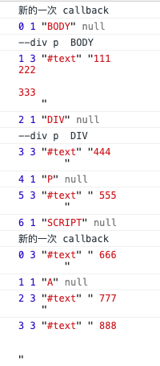

## Node 接口

类型|nodeType|常量|nodeName|nodeValue
---|---|---|---|---
`Element`|1|Node.ELEMENT_NODE|大写标签名|null
`Attribute`|2|Node.ATTRIBUTE_NODE|属性名|属性值
`Text`|3|Node.TEXT_NODE|`#text`|文本值
`Comment`|8|Node.COMMENT_NODE|`#comment`|注释文本
`Document`|9|Node.DOCUMENT_NODE|`#document`|null
`DocumentType`|10|Node.DOCUMENT_TYPE_NODE|文档的类型(如 `"html"`)|null
`DocumentFragment`|11|Node.DOCUMENT_FRAGMENT_NODE|`#document-fragment`|null

- Node.prototype.nodeValue 属性返回节点的文本值，可读写。只有文本节点、注释节点、属性节点有文本值。

- Node.prototype.textContent 属性返回当前节点和它所有后代节点的文本内容。

```js
// HTML 代码为
// <div id="divA">This is <span>some</span> text</div>

document.getElementById('divA').textContent
// This is some text

document.getElementById('divA').textContent = '<p>GoodBye!</p>';
```

该属性可读写，设置该属性值时，会替换原来的子节点，另外它自动对 HTML 标签转义，适合用于用户的输入。

对于文本节点、注释节点、属性节点，textContent 属性的值和 nodeValue 相同，对于其它节点，将返回所有子节点(不包括注释节点)的内容文本。如果没有子节点，则返回空字符串。Document 和 DocumentType 类型的 textContent 属性为 null。如果要读取整个文档的内容，可以使用`document.documentElement.textContent`。

- Node.prototype.baseURI 属性表示当前网页的绝对路径，浏览器根据这个属性，计算网页上相对路径的 URL。该属性只读。该属性的值一般由当前网址 URL (window.location)决定，但是可以使用 `<base>` 标签改变它。

```js
<base href="http://www.example.com/page.html">
```

设置后，baseURI 属性就返回 <base> 标签设置的值。

- Node.prototype.ownerDocument 返回当前节点所在的顶层文档对象，即 document 对象。`document.ownerDocument` 为 null。

- Node.prototype.nextSibling 返回后一个同级节点，如果没有，则返回 null。该属性还包含文本节点和注释节点。

```js
// 遍历所有子节点
var el = document.body.firstChild
while(el !== null){
    console.log(el.nodeName)
    el = el.nextSibling
}
```

- Node.prototype.previousSibling 返回前一个同级节点，如果没有，则返回 null。

- Node.prototype.parentNode  返回当前节点的父节点，可能是Element、Document 和 DocumentFragment。对于Document、DocumentFragment 和没有插入 DOM 树的节点，父节点都为 null。

- Node.prototype.parentElement 返回当前节点的父元素节点。如果没有父节点或父节点不是元素节点，则返回 null。

- Node.prototype.firstChild 返回当前节点的第一个节点，没有则返回 null。可能是元素节点、文本节点或注释节点。

- Node.prototype.lastChild 返回当前节点的最后一个节点，没有则返回 null。可能是元素节点、文本节点或注释节点。

- Node.prototype.childNodes 返回一个 NodeList 集合，包括所有子节点(元素节点、文本节点和注释节点)。它是一个动态集合。

- Node.prototype.isConnected 返回一个布尔值，表示当前节点是否在文档之中。没插入到文档的节点为 false。

- Node.prototype.appendChild() 将参数节点作为最后一个子节点插入当前文档，返回值是插入文档的子节点。如果参数节点在 DOM 中已经存在，appendChild() 方法会移动其位置。

- Node.prototype.hasChildNodes() 返回一个布尔值，表示当前节点是否有子节点。

判断节点有子节点的方法还有：`node.firstChild`、`node.childNodes && node.childNodes.length`。

遍历当前节点的所有后代节点：

```js
function DOMComb(parent, callback){
    if(parent.hasChildNodes()){
        var node = parent.firstChild
        while(node !== null){
            DOMComb(node, callback)
            node = node.nextSibling
        }
    }
    callback(parent)
}
DOMComb(document.body, console.log)
```

- Node.prototype.cloneNode() 用于克隆一个节点，它可以接收一个参数表示是否克隆子节点。返回新克隆的节点。

要注意的是：
1) 克隆时会拷贝所有属性，但 addEventListener 和 on- 绑定的事件不会拷贝。
2) 克隆的节点没有父节点，需要使用 appendChild 添加到文档中。
3) 克隆后，可能出现 id 或 name 相同的元素，所以需要修改。

- `Node.prototype.insertBefore(newNode, referenceNode)` 用于将某个节点插入父节点内的指定位置。返回值是插入的新节点。如果 referenceNode 为 null，则相当于 appendChild()。如果第二个参数省略会报错。如果要插入的节点是当前 DOM 的节点，则移动位置。

```js
// 没有 insertAfter，可以用 nextSibling 模拟
parent.insertBefore(s1, s2.nextSibling);
```

- Node.prototype.removeChild() 用于移除当前节点的子节点。返回值是移除的子节点。如果参数不是当前节点的子节点，会报错。

```js
// 移除某个子节点
var divA = document.getElementById('A');
divA.parentNode.removeChild(divA);

// 移除所有子节点
var element = document.getElementById('top');
while (element.firstChild) {
  element.removeChild(element.firstChild);
}
```

- Node.prototype.replaceChild(newChild, oldChild) 用新节点替换当前节点的某一节点。返回 oldChild。

```js
var divA = document.getElementById('divA');
var newSpan = document.createElement('span');
newSpan.textContent = 'Hello World!';
divA.parentNode.replaceChild(newSpan, divA);
```

- Node.prototype.contains() 返回一个布尔值，如果参数节点为当前节点或当前节点的子节点/后代节点，则返回 true。

- `Node.prototype.compareDocumentPosition()` 返回一个6位的二进制，表示参数节点与当前节点的位置关系。

二进制值 |	十进制值|	含义
---|---|---
000000 |	0 |	两个节点相同
000001 |	1 |	两个节点不在同一个文档（即有一个节点不在当前文档）
000010 |	2 |	参数节点在当前节点的前面
000100 |	4 |	参数节点在当前节点的后面
001000 |	8 |参数节点包含当前节点
010000 |	16 |	当前节点包含参数节点
100000 |	32 |浏览器内部使用

```js
// HTML 代码如下
// <div id="mydiv">
//   <form><input id="test" /></form>
// </div>

var div = document.getElementById('mydiv');
var input = document.getElementById('test');

div.compareDocumentPosition(input) // 20
input.compareDocumentPosition(div) // 10
```

上面代码中，节点div包含节点input（二进制010000），而且节点input在节点div的后面（二进制000100），所以第一个compareDocumentPosition方法返回20（二进制010100，即010000 + 000100），第二个compareDocumentPosition方法返回10（二进制001010）。

由于compareDocumentPosition返回值的含义，定义在每一个比特位上，所以如果要检查某一种特定的含义，就需要使用比特位运算符。

```js
var head = document.head;
var body = document.body;
if (head.compareDocumentPosition(body) & 4) {
  console.log('文档结构正确');
} else {
  console.log('<body> 不能在 <head> 前面');
}
```

上面代码中，compareDocumentPosition的返回值与4（又称掩码）进行与运算（&），得到一个布尔值，表示`<head>`是否在`<body>`前面。

- Node.prototype.isEqualNode() 检查两个节点是否相等，即类型、属性、子节点相同。

```js
var p1 = document.createElement('p');
var p2 = document.createElement('p');

p1.isEqualNode(p2) // true
```

- `Node.prototype.isSameNode()` 返回一个布尔值，表示两个节点是否为同一个节点。

- `Node.prototype.normalize()` 清理当前节点内部的所有文本节点，它会去掉空的文本节点，合并相邻的文本节点。

- `Node.prototype.getRootNode()` 返回当前节点所在文档的根节点 document，与 ownerDocument 相同，但是 `document.getRootNode()` 也是 document。

## NodeList 接口

- Node.childNodes
- document.querySelectorAll()

目前，只有 childNodes 返回的是一个动态集合，其它的 NodeList 都是静态集合。

- NodeList.prototype.length
- NodeList.prototype.forEach()
- NodeList.prototype.item() 索引超出或不合法时，返回 null，如果省略参数，会报错。
- NodeList.prototype.keys()
- NodeList.prototype.values()
- NodeList.prototype.entries()

```js
var children = document.body.childNodes;

for (var key of children.keys()) {
  console.log(key);
}
// 0
// 1
// 2
// ...

for (var value of children.values()) {
  console.log(value);
}
// #text
// <script>
// ...

for (var entry of children.entries()) {
  console.log(entry);
}
// Array [ 0, #text ]
// Array [ 1, <script> ]
// ...
```

## HTMLCollection 接口

HTMLCollection 是一个节点对象集合，只能包含元素节点。它没有 forEach 方法，只能使用 for 遍历。

- `document.links`
- `document.forms`
- `document.images`

HTMLCollection 实例都是动态集合。如果元素节点有 id 或 name 属性，那么 HTMLCollection 实例上可以用 id 或 name 引用该节点。如果没有对应节点，则返回 null。

```js
// HTML 代码如下
// 

var pic = document.getElementById('pic');
document.images.pic === pic // true
```

- HTMLCollection.prototype.length
- HTMLCollection.prototype.item()
- HTMLCollection.prototype.namedItem() 根据 id 或 name 返回元素


## ParentNode 接口

如果当前节点是父节点，就会继承`ParentNode`接口。只有元素节点、文档节点、文档碎片节点有子节点，能继承 ParentNode 接口。

- `ParentNode.children` 返回一个 HTMLCollection 实例，只读。只包含元素子节点。
- `ParentNode.firstElementChild` 返回第一个元素子节点，如果没有，则返回 null。
- `ParentNode.lastElementChild` 返回最后一个元素子节点，如果没有，则返回 null。

```js
document.firstElementChild.nodeName  // "HTML"
document.lastElementChild.nodeName  // "HTML"
```

- `ParentNode.childElementCount` 返回当前节点所有元素子节点的数量。
- `ParentNode.append()` 当前节点追加一个或多个子节点。能添加元素节点和文本子节点。没有返回值。

```js
var parent = document.body;

// 添加元素子节点
var p = document.createElement('p');
parent.append(p);

// 添加文本子节点
parent.append('Hello');

// 添加多个元素子节点
var p1 = document.createElement('p');
var p2 = document.createElement('p');
parent.append(p1, p2);

// 添加元素子节点和文本子节点
var p = document.createElement('p');
parent.append('Hello', p);
```

- `ParentNode.prepend()` 


## ChildNode 接口

如果一个节点有父节点，则它就继承了`ChildNode`接口。

- `ChildNode.remove()`  移除当前节点
- `ChildNode.before()`  在当前节点前面插入一个或多个同级节点。可以是文本节点或元素节点。
- `ChildNode.after()`   在当前节点后面插入一个或多个同级节点。可以是文本节点或元素节点。
- `ChildNode.replaceWith()`  使用参数节点，替换当前节点。参数节点可以是文本节点或元素节点。

## Document 节点

document节点对象代表整个文档，每张网页都有自己的document对象。window.document属性就指向这个对象。

document对象有不同的办法可以获取。

- 正常的网页，直接使用document或window.document。
- iframe框架里面的网页，使用iframe节点的contentDocument属性。
- Ajax 操作返回的文档，使用XMLHttpRequest对象的responseXML属性。
- 内部节点的`ownerDocument`属性。

document 对象继承了 EventTarget 接口、Node 接口、ParentNode 接口。

快捷方式属性

- `document.defaultView` 指向 document 所属的 window 对象，如果当前文档不属于 window 对象，则返回 null。
- `document.doctype` 返回文档类型(DTD)，如果没有，则返回 null。
- `document.documentElement` 返回当前文档的根元素节点，HTML 网页中通常是`<html>`。
- `document.body` 如果源码中没有 <head> 或 <body>，浏览器会自动创建。
- `document.head` 
- `document.scrollingElement` 返回文档的滚动元素。标准模式下，是 `document.documentElement`（即`<html>`），兼容(quirk)模式下，返回的是`<body>`元素，如果该元素不存在，则返回`null`。

```js
// 页面滚动到浏览器顶部
document.scrollingElement.scrollTop = 0
```

- `document.activeElement` 返回当前获取焦点的 DOM 元素。如果没有，则返回 `<body>` 或 null。
- `document.fullscreenElement` 返回当前以全屏状态展示的 DOM 元素，如果不是全屏状态，返回 null。

```js
if (document.fullscreenElement && document.fullscreenElement.nodeName == 'VIDEO') {
  console.log('全屏播放视频');
}
```

### 节点集合属性

- `document.links` 返回所有设定了`href`属性的`<a>`和`<area>`节点。
- `document.forms` 返回所有`<form>`表单节点。还可以用 id 或 name 来引用表单（document.forms.bar）。
- `document.images` 返回页面所有``图片节点。
- `document.embeds`、`document.plugins` 都返回所有`<embed>`节点。
- `docuemnt.scripts` 返回所有`<script>`节点。
- `document.styleSheets` 返回文档内嵌或引入的样式表集合 StyleSheetList。

除了`document.styleSheets`，以上集合都返回`HTMLCollection`实例。

### 文档静态信息属性

- `document.documentURI`， `document.URL`: 都返回当前文档的网址。不同的是，`documentURI` 继承自`Document`接口，可用于所有文档。`URL`继承自`HTMLDocument`接口，只能用于 HTML 文档。如果文档的锚点(#anchor)变化，这两个属性会跟着变化。

- `document.domain` 返回当前文档的域名，不包含协议和端口。比如，网页的网址是http://www.example.com:80/hello.html，那么domain属性就等于www.example.com。如果无法获取域名，该属性返回null。特殊情况是，比如，当前域名是a.sub.example.com，则document.domain属性可以设置为sub.example.com，也可以设为example.com。修改后，document.domain相同的两个网页，可以读取对方的资源，比如设置的 Cookie。

另外，设置 document.domain 会导致端口被修改为 null。所以双方网页都必须设置这个值，才能保证端口相同。

- `document.location` 和 `window.location` 相同。

- `document.lastModified` 返回当前文档的最后修改时间字符串，不同浏览器返回格式不同。需要用`Date.parse()`方法转换。如果页面上有 javascript 生成的内容，`document.lastModified` 总返回当前时间。

- `document.title` 当前文档的标题，可读写。

- `document.characterSet` 属性返回当前文档的编码，比如 utf8 等。

- `document.referrer` 返回当前文档从哪里来的。如果无法获取，或用户直接输入的网址进入，`document.referrer`将返回空字符串。与 HTTP 头 Referer 保持一致。不过`document.referrer`有两个`r`。

- `document.dir` 返回文字方向。`rtl`表示从右到左，阿拉伯文是这种方式。`ltr`表示从左往右。

- `document.compatMode` 返回浏览器处理文档的模式，可能是`BackCompat`(向后兼容模式)和`CSS1Compat`(严格模式)。如果声明了`DOCTYPE`，一般是严格模式。

### 文档状态属性

- `document.hidden` 表示当前页面是否可见，如果切换了tab、窗口最小化，将返回`true`。

- `document.visibilityState`返回文档的可见状态。可能值是：

> - `visible`：页面可见。注意，页面可能是部分可见，即不是焦点窗口，前面被其他窗口部分挡住了。
> - `hidden`：页面不可见，有可能窗口最小化，或者浏览器切换到了另一个 Tab。
> - `prerender`：页面处于正在渲染状态，对于用户来说，该页面不可见。
> - `unloaded`：页面从内存里面卸载了。

这个属性可以用在页面加载时，防止加载某些资源；或者页面不可见时，停掉一些页面功能。

- `document.readyState` 返回当前文档的状态，有三种可能值:`loading`(加载HTML代码节点，尚未完成解析)，`interactive`(加载外部资源阶段)，`complete`(加载完成)。

这个属性变化的过程如下。

浏览器开始解析 HTML 文档，document.readyState属性等于loading。
浏览器遇到 HTML 文档中的`<script>`元素，并且没有async或defer属性，就暂停解析，开始执行脚本，这时document.readyState属性还是等于loading。
HTML 文档解析完成，document.readyState属性变成interactive。
浏览器等待图片、样式表、字体文件等外部资源加载完成，一旦全部加载完成，document.readyState属性变成complete。
下面的代码用来检查网页是否加载成功。

```js
// 基本检查
if (document.readyState === 'complete') {
  // ...
}

// 轮询检查
var interval = setInterval(function() {
  if (document.readyState === 'complete') {
    clearInterval(interval);
    // ...
  }
}, 100);
```

- `document.cookie` 用来操作浏览器Cookie。

- `document.designMode` 控制当前文档是否可编辑。默认为`off`。设置为`on`表示可编辑，

```js
// HTML 代码如下
// <iframe id="editor" src="about:blank"></iframe>
var editor = document.getElementById('editor');
editor.contentDocument.designMode = 'on';
```

- `document.implementation` 返回一个`DOMImplementation`对象，该对象有三个方法，主要用于创建独立于当前文档的新的Document对象。

> - `DOMImplementation.createDocument` 创建一个XML文档。
> - `DOMImplementation.createHTMLDocument` 创建一个HTML文档。
> - `DOMImplemantation.createDocumentType` 创建一个DocumentType对象。

```js
var doc = document.implementation.createHTMLDocument('Title');
var p = doc.createElement('p');
p.innerHTML = 'hello world';
doc.body.appendChild(p);

document.replaceChild(
  doc.documentElement,
  document.documentElement
);
```

### 方法

- `document.open()`和`document.close()`

`document.open()`方法清除当前文档的内容，使文档处于可写状态，供`document.write()`方法写入内容。`document.close()`用于关闭`document.open()`打开的文档。

- `document.write()`、`document.writeln()`

`document.write()`用于向文档写入内容。在网页首次渲染阶段，只要页面还没有关闭写入(`document.close()`)，`document.write()`写入的内容就会追加到已有内容后面。如果页面已解析完成(`DOMContentLoaded`事件发生后)，再调用`write`，则会先调用`open()`清空文档内容，然后再写入。`document.write()`不会转义HTML。

`document.writeln()`与`write()`方法一样，只是会在尾部添加换行符。不过它添加的是ASCII码的换行符，在网页上显示不出来，网页上显示换行需要`<br>`。

- `document.querySelector()`、`document.querySelectorAll()`

`document.querySelector()`返回第一个匹配的元素节点，如果没有匹配，则返回`null`。`document.querySelectorAll()`方法返回一个`NodeList`对象，它是静态的，不是动态集合，包含所有匹配的节点。

这两个方法的参数，可以是用逗号分隔的多个CSS选择器。但是，它们不支持 CSS 伪元素的选择器（比如:first-line和:first-letter）和伪类的选择器（比如:link和:visited），即无法选中伪元素和伪类。这两个方法还定义在Element上。

- `document.getElementsByTagName()` 返回一个HTMLCollection对象，如果没有匹配，则返回一个空集，只有一个参数。因为HTML对大小写不敏感，所以它对大小写不敏感。Element上也定义了这个方法。

- `document.getElementsByClassName()` 返回一个HTMLCollection对象。参数可以是多个class，用空格分开。正常模式下CSS的`class`对大小写敏感(quirks mode下不敏感)。Element上也定义了这个方法。

- `document.getElementsByName()` 用于选择拥有`name`属性的HTML元素(如`<form>`、`<radio>`、``、`<frame>`、`<embed>`和`<object>`等)，返回一个NodeList对象，因为`name`属性相同的元素可能不止一个。

- `document.getElementById()` 返回匹配 id 的元素节点。如果没有匹配，则返回 null。对大小写敏感。这个方法只能在`document`上使用。

- `document.elementFromPoint()`、`document.elementsFromPoint()`

`document.elementFromPoint()`方法返回位于页面指定位置最上层的元素节点。

```js
var element = document.elementFromPoint(50, 50);
```

如果位于该位置的 HTML 元素不可返回（比如文本框的滚动条），则返回它的父元素（比如文本框）。如果坐标值无意义（比如负值或超过视口大小），则返回`null`。

`document.elementsFromPoint()`返回一个数组，成员是位于指定坐标（相对于视口）的所有元素。

- `document.caretPositionFromPoint()` 返回一个 CaretPosition 对象，包含指定坐标点在节点对象内部的位置信息。CaretPosition 对象就是光标插入点的概念，用于确定光标点在文本对象内部的具体位置。chrome 还没有实现。

```
var range = document.caretPositionFromPoint(clientX, clientY);
```

上面代码中，range是指定坐标点的 CaretPosition 对象。该对象有两个属性。

CaretPosition.offsetNode：该位置的节点对象
CaretPosition.offset：该位置在offsetNode对象内部，与起始位置相距的字符数。

- `document.createElement(tagName)` 用于生成元素，并返回该元素。tagName 对大小写不敏感。如果参数包含尖括号(即`<`和`>`)会报错。可以是自定义标签名，如`document.createElement('hello')`。

- `document.createTextNode()` 用来生成文本节点，并返回该节点。参数是文本节点的内容。

```js
var div = document.createElement('div');
div.appendChild(document.createTextNode('<span>Foo & bar</span>'));
console.log(div.innerHTML)
// &lt;span&gt;Foo &amp; bar&lt;/span&gt;
```

需要注意的是，该方法不对单引号和双引号转义，所以不能用来对 HTML 属性赋值。

```js
function escapeHtml(str) {
  var div = document.createElement('div');
  div.appendChild(document.createTextNode(str));
  return div.innerHTML;
};

var userWebsite = '" onmouseover="alert(\'derp\')" "';
var profileLink = '<a href="' + escapeHtml(userWebsite) + '">Bob</a>';
var div = document.getElementById('target');
div.innerHTML = profileLink;
// <a href="" onmouseover="alert('derp')" "">Bob</a>
```

- `document.createAttribute(name)` 用来生成一个新的属性节点，并返回它。参数`name`是属性的名称。

```js
var node = document.getElementById('div1');

var a = document.createAttribute('my_attrib');
a.value = 'newVal';

node.setAttributeNode(a);
// 或者
node.setAttribute('my_attrib', 'newVal');
```

- `document.createComment()`

- `document.createDocumentFragment()`

- `document.createEvent()`

- `document.addEventListener()`、`document.removeEventListener()`、`document.dispatchEvent()`

- `document.hasFocus()` 返回一个布尔值，表示当前文档中是否有元素被激活或获取焦点。注意，有焦点的文档必定被激活（active），反之不成立，激活的文档未必有焦点。比如，用户点击按钮，从当前窗口跳出一个新窗口，该新窗口就是激活的，但是不拥有焦点。

- `document.adoptNode()`、`document.importNode()`

- `document.createNodeIterator()`

- `document.createTreeWalker()`

- `document.execCommander()`、`document.queryCommandSupported()`、`document.queryCommandEnabled()`

- `document.getSelection()` 指向 `window.getSelection()`。

```js
document.getSelection === window.getSelection  // false
document.getSelection() === window.getSelection() // true
```


## Element

## 属性的操作

HTML 元素会被转成 DOM 树对象。单个属性本身也会转为 Attr 对象，但是很少使用，一般都是通过元素节点来操作。

### Element.attributes 属性

`Element.attributes`返回一个类似数组的动态对象(NamedNodeMap)，存放着当前HTML元素转为DOM后所有的属性集合。其它类型节点虽然也有这个属性，但是都返回`null`。

```js
<a href="xx.com" id="a" f="xx">你好</a>

a.attributes
// 获取属性对象
a.attributes[0]
a.attributes['href']
```

上面的HTML元素的 attributes 属性返回对象如下，每一个属性(如href、id)都是一个属性节点对象：


属性节点的 name 和 value 属性，等同于 nodeName 和 nodeValue 属性。

### 元素的标准属性

HTML 元素的标准属性，会自动成为 DOM 元素节点对象的属性。

```js
<a href="xx.com" id="a" f="xx">你好</a>

a.href // "file:///Users/banli/Desktop/training/interview-study/src/es5/dom/xx.com" 会转为绝对路径
a.id   // "a"
a.f    // undefined
```

```js
var f = document.forms[0];
f.action = 'submit.php';
f.method = 'POST';
```

注意，对于表单，虽然可以读写属性，但是无法用`delete`删除。

HTML 属性名转为 javascript 属性时，有 2 个特殊的：

- `for`属性改为`htmlFor`
- `class`属性改为`className`

HTML 属性值一般时字符串，但是 javascript 属性会自动转换类型，不如字符串`true`会转为布尔值，`onClick`的值会转为函数，`style`的值会转为`CSSStyleDeclaration`对象。

### 属性操作的标准方法

元素节点属性操作方法有6个：

- `getAttribute(name)` 返回当前元素节点的属性值，如果属性不存在，则返回`null`。
- `getAttributeNames()` 返回一个属性名组成的数组。
- `setAttribute(name, value)` 用于给当前元素新增或编辑属性，没有返回值。
- `hasAttribute(name)` 返回一个布尔值，表示当前元素节点是否有指定属性。
- `hasAttributes()` 返回一个布尔值，表示当前元素节点是否有属性。
- `removeAttribute(name)` 用于移除指定属性，没有返回值。

### dataset 属性

标准的`data-*`属性会变成元素节点对象的`dataset`属性(DOMStringMap)。所以可以通过`.dataset.`来操作它。可以用`delete` 删除它。

```js
// html
<div id="mydiv" data-foo="bar">

var n = document.getElementById('mydiv');
n.dataset.foo // bar
n.dataset.foo = 'baz'

delete document.getElementById('myDiv').dataset.foo;
```

注意，data-后面的属性名有限制，只能包含字母、数字、连词线（-）、点（.）、冒号（:）和下划线（_)。而且，属性名不应该使用A到Z的大写字母，比如不能有data-helloWorld这样的属性名，而要写成data-hello-world。

html 元素转 dom 时，`data-hello-world` 会变成`dataset.helloWorld`。js 设置时，`dataset.helloWorld` 会转成 `data-hello-world`。

## Text 节点

通常我们使用父节点的firstChild、nextSibling等属性获取文本节点，或者使用Document节点的createTextNode方法创造一个文本节点。
浏览器原生提供一个Text构造函数。它返回一个文本节点实例。它的参数就是该文本节点的文本内容。

```
// 空字符串
var text1 = new Text();

// 非空字符串
var text2 = new Text('This is a text node');
```

文本节点除了继承Node接口，还继承了CharacterData接口。以下的属性和方法大部分来自CharacterData接口。

### Text 节点的属性

- `data` 等同于`nodeValue`，用来设置和读取文本节点的内容。
- `wholeText` 将当前文本节点与毗邻的文本节点，作为整体返回。大多数情况下，返回值与`data`、`textContent`属性相同。但是有时会有差异。

```js
<p id="para">A <em>B</em> C</p>

// 相同
var el = document.getElementById('para');
el.firstChild.wholeText // "A "
el.firstChild.data // "A "

// 差异，移除<em> 后
el.removeChild(para.childNodes[1]);
el.firstChild.wholeText // "A C"
el.firstChild.data // "A "
```

- `length` 返回当前文本节点的文本长度

- `nextElementSibling`、`previousElementSibling` 返回元素节点，如果取不到，则返回`null`。

### Text 节点的方法

- `appendData(text)` 在Text节点尾部追加字符串
- `deleteData(start, length)` 删除Text节点内部的子字符串
- `insertData(start, text)` 在Text节点插入字符串
- `replaceData(start, length, text)` 用于替换文本
- `subStringData(start, length)` 用于获取子字符串
- `remove()`
- `splitText()` 将 `Text`节点一分为二，变成两个毗邻的`Text`节点，返回后一个字符串。它的参数就是分割位置，分割到该位置之前结束。如果分割位置不存在，则报错。分割后，原`Text`节点变成只包含分割位置前方的字符串。父元素的`normalize()`方法可以合并毗邻的`Text`节点。

```js
// html 代码为 <p id="p">foobar</p>
var p = document.getElementById('p');
var textnode = p.firstChild;

var newText = textnode.splitText(3);
newText // "bar"
textnode // "foo"

p.childNodes.length // 2

// 将毗邻的两个 Text 节点合并
p.normalize();
p.childNodes.length // 1
```

## DocumentFragment 节点

DocumentFragment节点代表一个文档的片段，本身就是一个完整的 DOM 树形结构。它没有父节点，parentNode返回null，但是可以插入任意数量的子节点。它不属于当前文档，操作DocumentFragment节点，要比直接操作 DOM 树快得多。

它一般用于构建一个 DOM 结构，然后插入当前文档。document.createDocumentFragment方法，以及浏览器原生的DocumentFragment构造函数，可以创建一个空的DocumentFragment节点。然后再使用其他 DOM 方法，向其添加子节点。

```js
var docFrag = document.createDocumentFragment();
// 等同于
var docFrag = new DocumentFragment();

var li = document.createElement('li');
li.textContent = 'Hello World';
docFrag.appendChild(li);

document.querySelector('ul').appendChild(docFrag);
```

上面代码创建了一个DocumentFragment节点，然后将一个li节点添加在它里面，最后将DocumentFragment节点移动到原文档。

注意，DocumentFragment节点本身不能被插入当前文档。当它作为appendChild()、insertBefore()、replaceChild()等方法的参数时，是它的所有子节点插入当前文档，而不是它自身。一旦DocumentFragment节点被添加进当前文档，它自身就变成了空节点（textContent属性为空字符串），可以被再次使用。如果想要保存DocumentFragment节点的内容，可以使用cloneNode方法。

```js
document
  .querySelector('ul')
  .appendChild(docFrag.cloneNode(true));
```

下面是一个例子，使用DocumentFragment反转一个指定节点的所有子节点的顺序。

```js
function reverse(n) {
  var f = document.createDocumentFragment();
  while(n.lastChild) f.appendChild(n.lastChild);
  n.appendChild(f);
}
```

DocumentFragment节点对象没有自己的属性和方法，全部继承自Node节点和ParentNode接口。

## CSS 操作


## Mutation Observer API

Mutation Observer API 用来监视 DOM 变动。节点的增减、属性的变动、文本内容的变动，这个 API 都可以得到通知。

它和事件的区别是：事件是同步触发，即 DOM 的变动立刻会触发相应的事件。Mutation Observer 则是异步触发，DOM 的变动并不会马上触发，而是等到当前所有 DOM 操作都结束才触发。

这样的设计是为了应付 DOM 变动频繁的特点。举例来说，如果文档中连续插入1000个<p>元素，就会连续触发1000个插入事件，执行每个事件的回调函数，这很可能造成浏览器的卡顿；而 Mutation Observer 完全不同，只在1000个段落都插入结束后才会触发，而且只触发一次。

Mutation Observer 有以下特点：

- 异步触发，即等
- 它将 DOM 变动记录封装成一个数组进行处理，而不是一条条个别处理。
- 它可以观察 DOM 的所有变动，也可以观察某一类变动。

### 用法

```js
// mutations 表示变化记录的对象
// observer 就是下面的监控对象
function callback(mutations, observer){}
// 创建监控对象
var observer = new MutationObserver(callback)

var body = document.body  // 要监控的元素

var options = {
    // options 必须下面3个中的一个，否则报错
    childList: true,     // 是否监控子元素变化(新增、删除、修改)
    attributes: true,    // 是否监控属性的变化
    characterData: true  // 节点内容或文本的变化

    // 其它选项
    subtree: true,       // 是否将该观察器用于该节点的所有后代节点
    attributeOldValue: true, // 属性变化时，是否记录变动前的属性值
    characterDataOldValue: true, // 文本变化时，是否记录变动前的值
    // attributeFilter: ['class', 'src'] // 需要观察的属性
}

observer.observe(body, options)
```

多次添加同一个观察器，回调函数只触发一次。但是如果`options`不同，就会当作两个不同的观察器。

- `observer.disconnected()` 方法用来停止观察。
- `observer.takeRecords()` 方法用来清除变动记录。即不再处理未处理的变动。该方法返回变动记录的数组。

### MutationRecord 对象

DOM 每次发生变化，就会生成一条变动记录（MutationRecord 实例）。该实例包含了与变动相关的所有信息。Mutation Observer 处理的就是一个个MutationRecord实例所组成的数组。

MutationRecord对象包含了DOM的相关信息，有如下属性：

- `type`：观察的变动类型（attributes、characterData或者childList）。
- `target`：发生变动的DOM节点。
- `addedNodes`：新增的DOM节点。
- `removedNodes`：删除的DOM节点。
- `previousSibling`：前一个同级节点，如果没有则返回null。
- `nextSibling`：下一个同级节点，如果没有则返回null。
- `attributeName`：发生变动的属性。如果设置了attributeFilter，则只返回预先指定的属性。
- `oldValue`：变动前的值。这个属性只对attribute和characterData变动有效，如果发生childList变动，则返回null。

如果遇到`<script>`标签，会立即触发一次 callback。

```js
<!DOCTYPE html>

<head>
    <script>
        const callback = mutations => {
            console.log('新的一次 callback')
            mutations.forEach((mutation, i) => {
                // 这里的 node 是新增的节点
                [...mutation.addedNodes].forEach(node => {
                    console.log(i, node.nodeType, node.nodeName, node.nodeValue)
                    if (node.nodeType !== 1) return;
                    if (node.querySelector('div p'))
                        console.log('--div p ', node.nodeName);
                    if (node.querySelector('div a'))
                        console.log('--div a ', node.nodeName);
                });
            });
        };
        const opts = {
            childList: true,
            subtree: true
        };
        new MutationObserver(callback).observe(document, opts);
    </script>111
</head>222

<body>333
    <div>444
        <p></p> 555
        <script></script> 666
        <a></a> 777
    </div> 888
</body> 

</html>
```



上面显示，新增 script 后立即触发了一次 MutationObserver 的 callback。所以 script 分开了两个 mutations，script 前可以找到`div p`，但是 script 后，就与前面的记录无关了(即body, div之前已经添加完成了)。

## 事件

DOM 的事件操作（监听和触发），都定义在EventTarget接口。所有节点对象都部署了这个接口，其他一些需要事件通信的浏览器内置对象（比如，XMLHttpRequest、AudioNode、AudioContext）也部署了这个接口。

该接口主要提供三个实例方法。

addEventListener：绑定事件的监听函数
removeEventListener：移除事件的监听函数
dispatchEvent：触发事件


