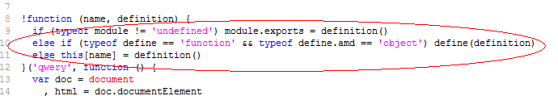

---
        title: 无名
        ---
        # UMD规范

## 学习资料

- [JavaScript模块化编程简史](https://yuguo.us/weblog/javascript-module-development-history/)
- [UMD和ECMAScript模块](https://www.cnblogs.com/snandy/archive/2012/03/19/2406596.html)

## UMD简介和实现

UMD规范是为了兼容 AMD 和 CommonJS 规范，它的实现很容易。

```javascript
;(function(){
    this.util = {
        getUrl: function(){},
        parseUrl(): function(){},
        ...
    }
})(this);
```

上面是一个工具库，接下来我会将它改成 UMD 规范。这样就能够兼容浏览器、Node 和 AMD 规范了。

```javascript
(function(root, factory){
    if(typeof define === 'function' && define.amd){
        // amd 规范
        define(factory)
    }else if(typeof exports === 'object'){
        // commonjs 规范
        module.exports = factory()
    }else{
        // 浏览器上
        root.util = factory()
    }
})(this, function(){
    var util = {
        getUrl: function(){},
        parseUrl(): function(){},
        ...
    }

    return util
});
```

下面是《JavaScript设计模式》作者Dustin Diaz开发的qwery里面的代码。



UMD 规范还是比较简单的，它的目的只是为了兼容其他规范。


