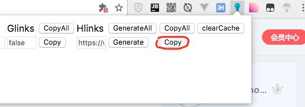

---
        title: 无名
        ---
        # 百度盘下载方法

百度官方的下载太慢了。下面有2个方法

## 方法一：baidudl插件 + 迅雷

1. 安装谷歌插件:[baidudl](https://github.com/Kyle-Kyle/baidudl)获取下载地址。

2. 打开百度盘资源地址后，点击右上角灯泡图标，然后点击那个copy按钮，就得到了下载地址。接着可以通过迅雷进行下载。

## 方法二：百度网盘助手插件 + Aria2GUI

1. 先安装谷歌插件：[百度网盘助手](https://github.com/acgotaku/BaiduExporter)。
2. 下载[Aria2GUI软件](https://github.com/yangshun1029/aria2gui)。
3. 双击打开Aria2GUI软件(注意：一定要打开)。
3. 之后打开要下载的文件的地址(文件夹也可以)，然后页面上会多出一个导出下载，点击`aria2 rpc`按钮即可。
