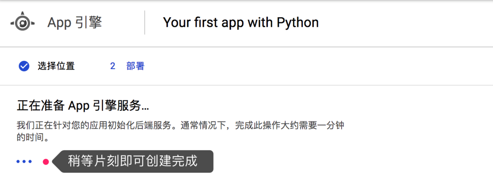

## 安装步骤

1、确保可以正常访问 google 服务。

2、打开[APP引擎中心](https://console.cloud.google.com/appengine)，创建一个 APP 引擎 (如果之前没有创建过 Project，需要创建一个项目)。

3、APP 引擎选 Python，然后地区选择亚洲，点击 Next 开始创建。




4、创建完成，点击继续，点击激活控制台 shell，如果弹出教程，[退出教程] 即可。


激活远端 shell 后，拷贝下面命令粘贴到 Google 云端 shell，回车执行。

```bash
rm -f uploader.sh* && \
wget https://raw.githubusercontent.com/kindlefere/KindleEar-Uploader/master/uploader.sh && \
chmod +x uploader.sh && \
./uploader.sh
```

5、按照脚本的提示，输入 Gmail 地址和 APP 引擎的 APPID。回车，等待执行完成。


6、已经成功了。如果需要重新安装代码或更新代码，可以输入下面命令：

```bash
./uploader.sh
```

*提示：KindleEar github 地址：[https://github.com/kindlefere/KindleEar-Uploader](https://github.com/kindlefere/KindleEar-Uploader)

## 使用方法

1、刷新[APP引擎中心](https://console.cloud.google.com/appengine)页面。点击下面的链接，即可访问。


2、账号密码默认都是 admin。


3、登录后，点击 [我的订阅] 进行设置，如果出现 [internal server error]，是因为系统没有完全部署完成，稍等五分钟左右就可以正常使用。


**注意：推送之前，要确保下面操作已经完成。**

1.设置 Gmail 邮箱到 Kindle 信任邮箱中，在[我的亚马逊](https://www.amazon.cn/mn/dcw/myx.html/ref=kinw_myk_redirect#/home/content/booksAll/dateDsc/) 中【管理我的内容和设备】--【设置】在 【已认可的发件人电子邮箱列表】中添加。

2.打开 [APP 引擎中心](https://console.cloud.google.com/appengine) ，添加 【已获授权的发件人】。


设置投递选项，注意修改后需要选择 [保存设置]。


【投递日志】用来查看投递的状态，由于 RSS 内容抓取需要一定的时间，所以日志可能会有延迟。


【账户管理】可以当前账户密码，也可以添加新成员，这样你就可以把系统分享给你的好朋友是用了，相互之间互不影响。

【高级设置】大家可以根据需要自行研究，比如批量导入订阅源，保存内容到Pocket Instapaper。

## 验证是否成功

手动推送漫画，看看亚马逊网站上是否有发送记录。

## RSS大全

```
优设 http://www.uisdc.com/feed
政见 http://cnpolitics.org/feed/
阮一峰的网络日志 http://feeds.feedburner.com/ruanyifeng
知乎每日精选 https://www.zhihu.com/rss
前端之巅 http://feedmaker.kindle4rss.com/feeds/frontshow.weixin.xml
```

## 参考资料

- [Kindle Ear](https://github.com/cdhigh/KindleEar)
- [使用 Kindle Ear 推送 RSS 到 Kindle 设备](https://sspai.com/post/40509)
- [KindleEar 搭建教程：推送 RSS 订阅到 Kindle](https://bookfere.com/post/19.html)
- [readable rss](http://reabble.com/help)


