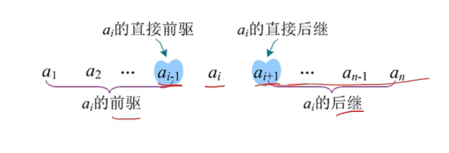
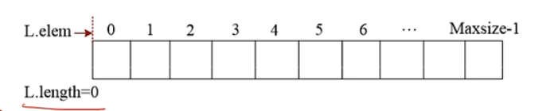
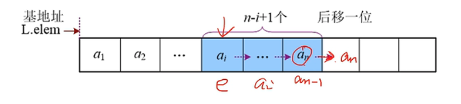
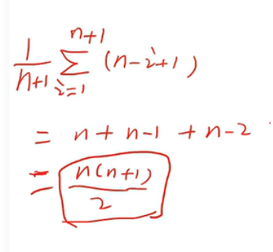

# 01 顺序表

## 线性表

线性表是由 n (n>=0) 个相同类型的数据元素组成的有限序列，它是最基本、最常用的一种线性结构。线性表就像一条线，不会分叉。除了第一个元素，每个元素都有唯一的直接前驱；除了最后一个元素，每个元素都有唯一的直接后继。



线性表有两种存储方式：顺序存储和链式存储。采用顺序存储的线性表被称为顺序表，采用链式存储的线性表被称为链表。

顺序表是顺序存储方式，存储是连续的，中间不允许有空，可以快速定位某个元素，但是插入、删除时需要移动大量元素。根据分配空间方法的不同，顺序表可以分为静态分配(一开始就分配好固定大小空间)和动态分配(运行时分配)两种。

数据结构静态定义：

```
typeof int ElemType;
#define MaxSize
struct sqlist{
	ElemType data[MaxSize];
	int length;
}
```

数据结构动态定义

```
struct sqlist{
	int *elem; // 基地址
	int length;
}

L.elem = new int[MaxSize]
```

## 初始化

初始化是指为顺序表分配一段与定义大小相同的连续空间，elem 记录基地址，顺序表长度 length 为 0。



```
// 引用参数
init(sqlist &L) {
	L.elem = new int[MaxSize];
	if(!L.elem){
		// 分配空间时要判断是否分配成功。
		return false;
	}
	L.length = 0;
	return true;
}
```

## 取值

顺序表中的任何一个元素都可以立即找到，称为随机存取方式。

- 寻找时要先判断 i 是否合理。
- 位序和索引下标。

## 查找

按照顺序一个个进行查找，如果相等，则返回元素索引，如果没有找到，则返回 -1。

```
find(){
	for(int i = 0;i < L.length; i++){
		if(L.elem[i] == e){
			return i; 
		}
	}
	return -1; // 没有找到
}
```

## 插入

- 首先要为元素腾出位置，从后向前，依次往后移动一位。
- 要判断 i 的合法性。 `i = [0, len]`。
- 插入完后, length 加 1。





## 删除

在顺序表中删除第 i 个元素，直接把后面元素往前移动一位即可, `a[i]` 可以直接被 `a[i+1]` 覆盖掉。

- 判断 i 的合法性。`i = [0, len-1]`


## 时间复杂度分析

- 初始化 O(1)
- 取值 O(1)
- 查找 O(n)
- 插入 O(n)
- 删除 O(n)