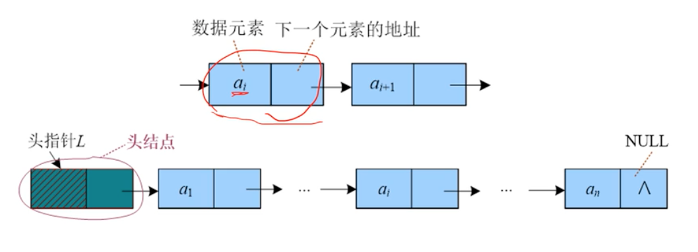
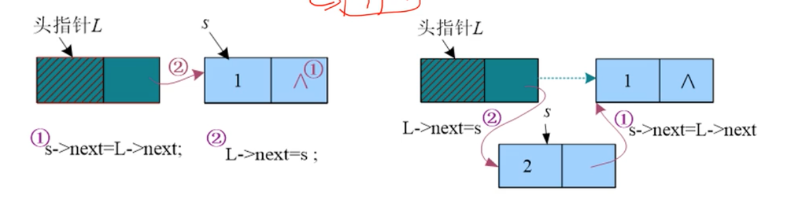
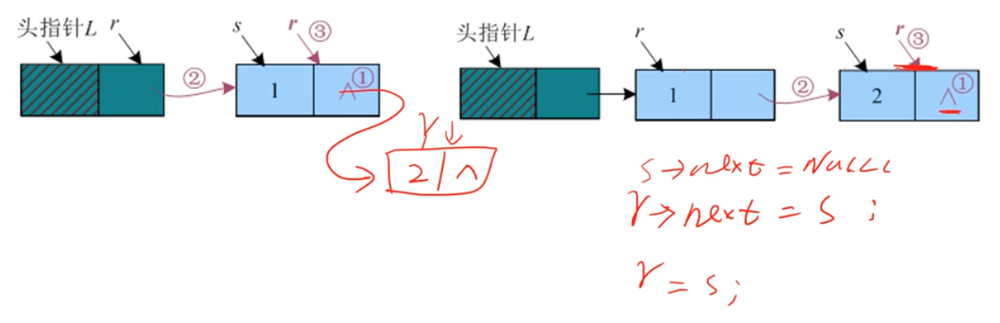
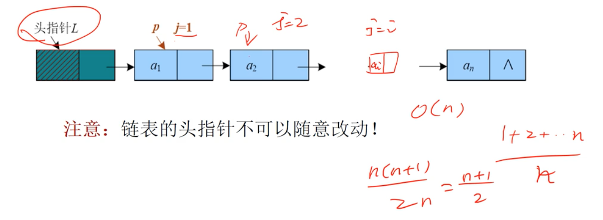
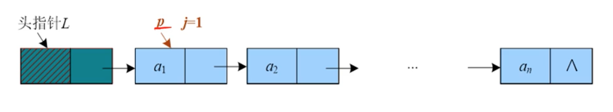
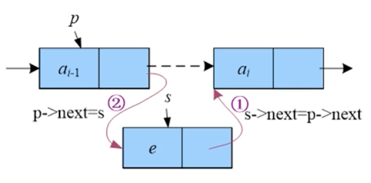
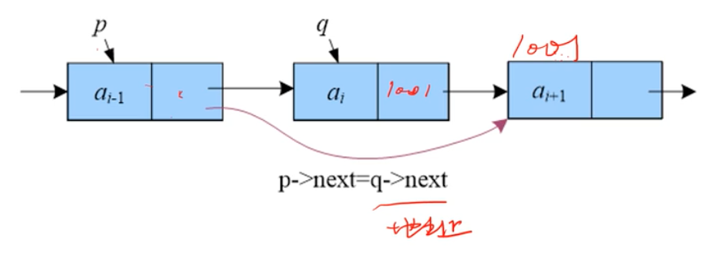
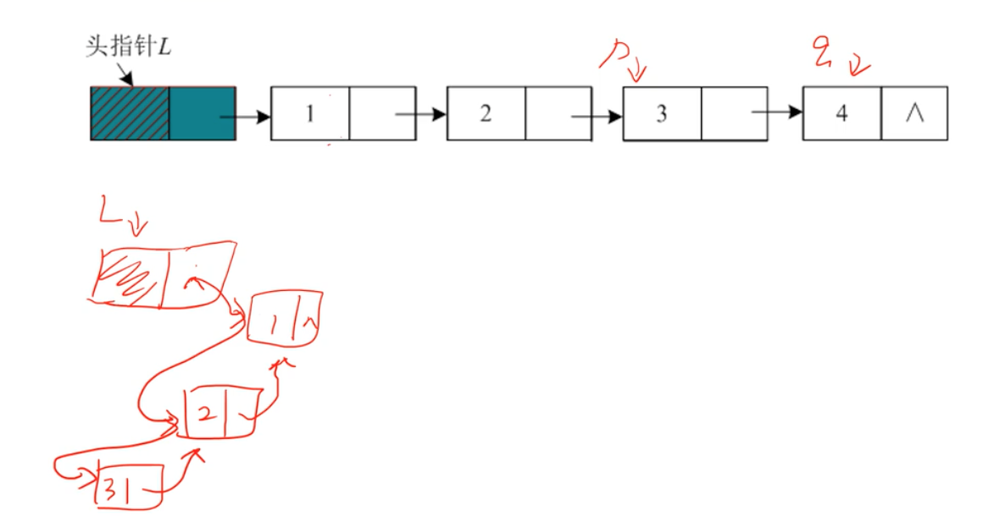

# 02 单链表

单链表中每个节点的内存可以是分散的，不需要连续的内存空间。
每个节点存储了两个域：数据元素和下一个元素的地址。
头节点是没有元素的，指向第一个元素。头节点可以用来方便的操作第一个元素。



数据结构定义：

```
struct Lnode {
	int data;
	struct Lnode *next;
}
```

## 创建(头插法)

头插法每次把新节点插入到头节点之后，创建的单链表和数据输入正好相反(逆序)。




## 创建(尾插法)

尾插法建表每次把新节点链接到链表的尾部，其创建的单链表和数据输入顺序一致。

要记录一个尾指针，用来方便添加节点。每次插入一个节点，尾指针就要向后移动一次。



## 取值

单链表的取值不像顺序表那样可以随机访问任何一个元素，必须从第1个节点开始顺序向后找，一致找到第i个节点。



## 查找

在一个单链表中查找是否存在元素 e, 一个个往后查找。如果最后 p->next 为 Null，则查找失败。



## 插入

如果要在第 i 个节点之前插入一个元素，则必须先找到第 i-1 个节点。



## 删除

删除一个节点，实际是把这个节点跳过去。要跳过第 i 个节点，就必须先找到第 i-1 个节点。



## 单链表就地逆置

将带有头节点的单链表就地逆置，辅助空间复杂度为 O(1)。



- 首先记录第一个元素地址 p。
- 设置头节点为 Null。
- 利用头插法，依次插入元素。
- p 用来记录要操作的节点，q 用来记录下一个节点。

## 时间复杂度分析

- 创建 O(n)
- 取值 O(n)
- 查找 O(n)
- 插入 O(1) 只看插入的动作，不看查找
- 删除 O(1) 只看插入的动作，不看查找