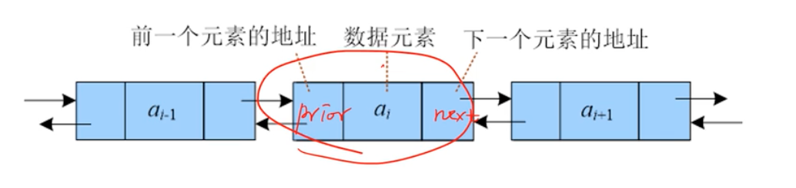
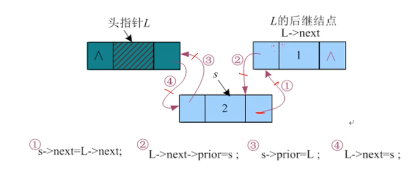
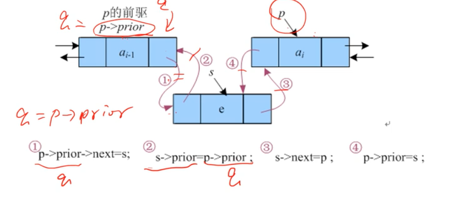
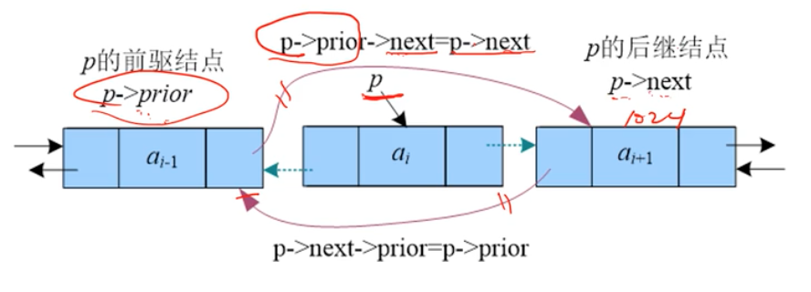
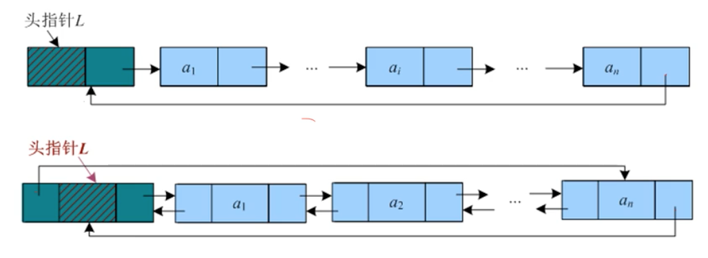
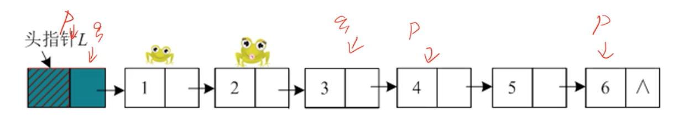
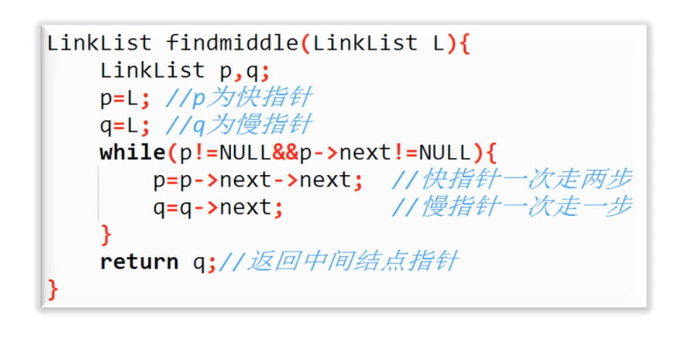
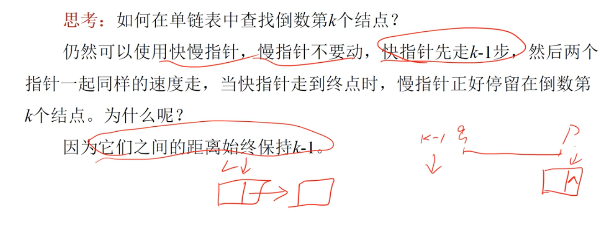

# 03 双向链表

单向链表有一个指针，只能向后操作，不可以向前操作。双向链表有两个指针，可以向前后两个方向操作。



## 数据结构定义

```
typedef
	struct DbLnode {
		int data;
		DbLnode *next;
		struct DbLnode *prev;
	} 
DbLnoe, *DBLinkList; // 取别名
```

## 创建

双向链表也可以采用头插法和尾插法创建，一般采用头插法。



## 插入

单向链表要在第 i 个节点之前插入一个元素，则必须先找到第 i-1 个节点。双向链表直接找到第 i 个节点，就可以把新节点插入到第 i 个节点之前。



## 删除

删除一个节点，实际上是把这个节点跳过去。单向链表中，必须先找到第 i-1 个节点，才能把第 i 个节点跳过去。双向链表直接找到第 i 个节点，然后修改指针即可。



## 循环链表

带有头节点的单链表 L，设计一个高效算法求 L 中的中间节点。

下面是单向链表和双向链表时的循环链表。



## 快慢指针大法

带有头节点的单链表 L，设计一个高效算法求 L 中的中间节点。

笨办法：从头到尾数一遍有多少个节点，然后找 N/2 的节点，时间复杂度是 O(n)。

思路：使用快慢指针来解决。一个快指针，一个慢指针，快指针走两步慢指针走一步，当快指针指向结尾时，慢指针刚好指向中间节点。







## 链表的优缺点

优点：链表是动态存储，不需要预先分配最大空间。插入删除不需要移动元素。

缺点：每次动态分配一个节点，每个节点的地址是不连续的，需要有指针域记录下一个节点的地址，指针域需要占用一个 int 的空间，因此存储密度低。存取元素必须从头到尾按顺序查找，属于顺序存取。