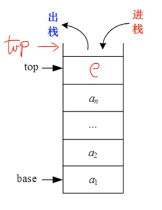
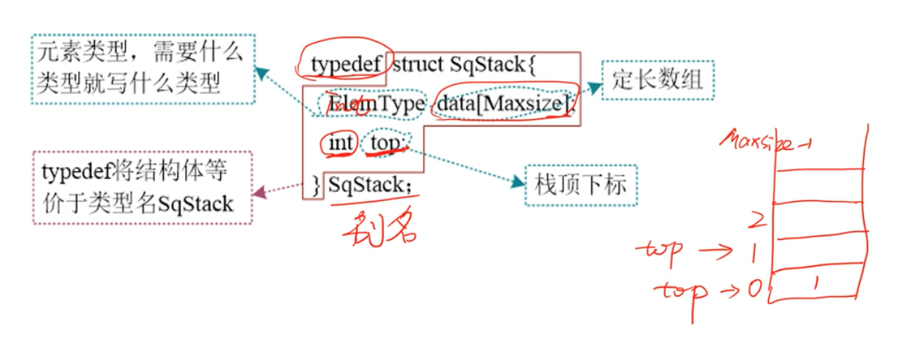
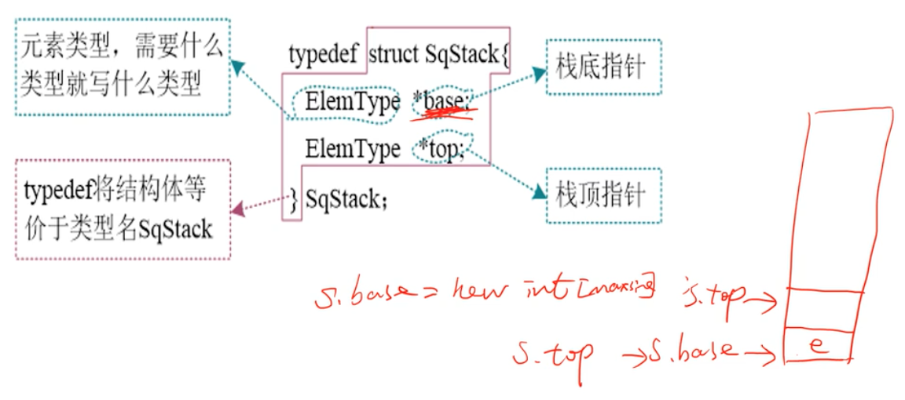
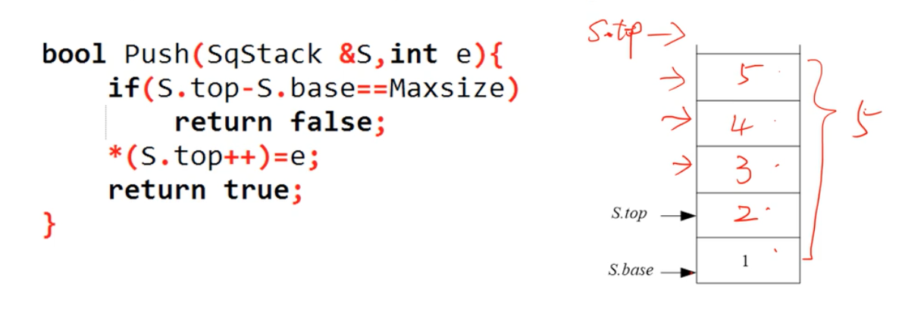
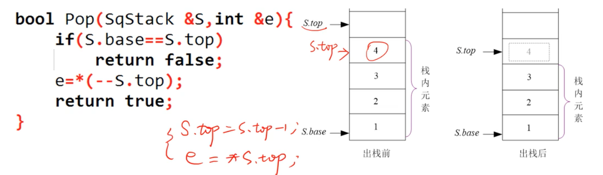
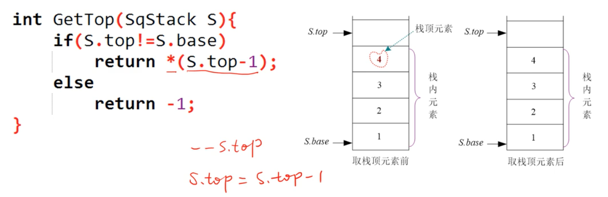

# 04 栈

后进先出(Last In First Out, LIFO) 的线性序列被称为栈。栈也是一种线性表，只不过是操作受限的线性表，只能在一端进行操作。进出的一端被称为栈顶，另一端被称为栈底。栈可以采用顺序存储，也可以采用链式存储，分别被称为顺序栈和链栈。

## 数据结构静态定义

使用数组存储，栈顶可以就是一个下标，top 永远指向空。

## 动态定义

## 初始化

初始化一个空栈，动态分配 Maxsize 大小的空间，用 S.top 和 S.base 指向该空间的基地址。

## 入栈

入栈前要判断是否栈满，如果栈已满（top == 5），则入栈失败；否则将元素放入栈顶，栈顶指针向上移动一个位置(top++)。

## 出栈

出栈前要判断是否栈空，如果栈是空的，则出栈失败；否则将栈顶元素暂存给一个变量，栈顶指针向下移动一个空间(top--)。

栈内元素是 [S.base, S.top-1]，出栈后，虽然 4 存在，但是不属于栈内元素，再入栈时，会覆盖掉它。

## 取栈顶元素

取栈顶元素时，栈顶元素不出栈，S.top 不改变。

## 时间复杂度分析

- 初始化 O(1)
- 入栈 O(1)
- 出栈 O(1)
- 取栈顶 O(1)