# 05 队列

先进先出(First In First Out, FIFO) 的线性序列被称为队列。队列是一种线性表，只不过是操作受限的线性表，只能在两端进行操作。从一端进，从另一端出。进的一端被称为队尾(rear)，出的一端被称为队头(front)。队列可以采用顺序存储，也可以采用链式存储。

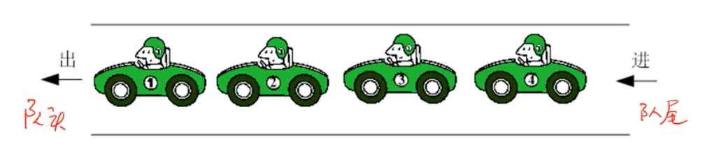

## 数据结构静态定义

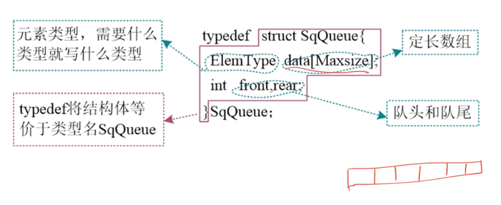

## 动态定义

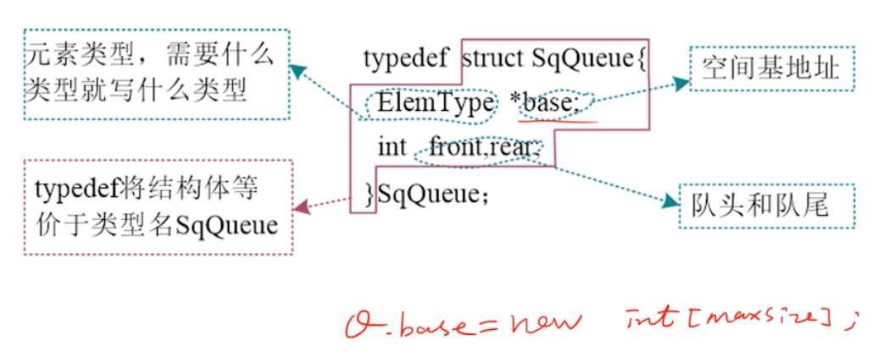

## 假溢出

明明有空间，却出现了队满的情况，这种情况称为假溢出。

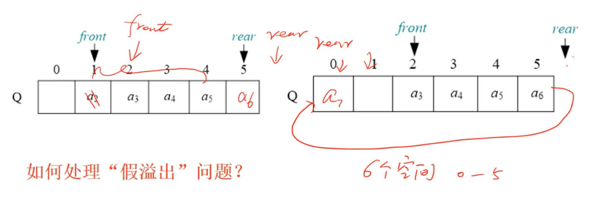

rear 指向最后时，如果 0 有位置，让 rear 指向 0。

解决方法是循环队列。

如何判断队满？

- 用标识符
- 留一个空位即 rear 处不存储数据，判断 rear + 1 = front 时，队满

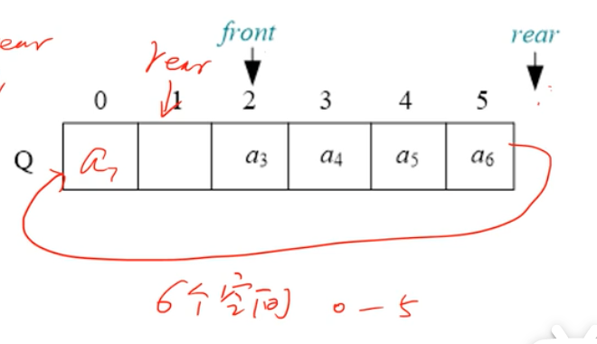

## 队空

循环队列队空的判断条件：Q.front == Q.rear。

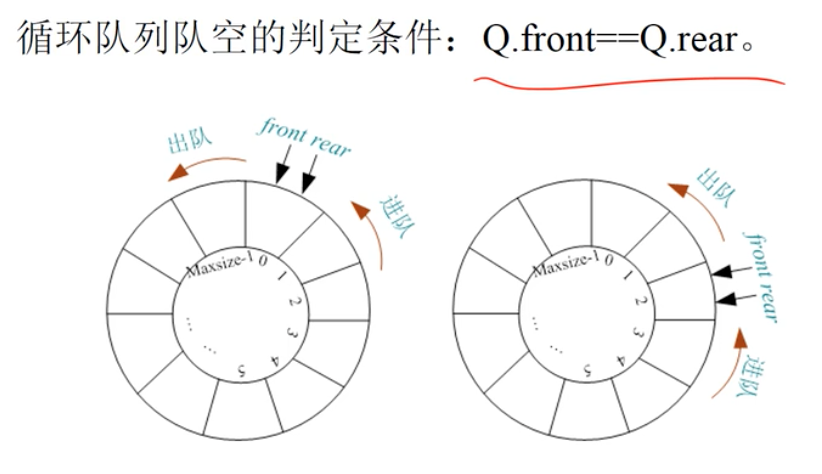

## 队满

循环队列满的判断条件：(Q.rear+1) % Maxsize == Q.front。

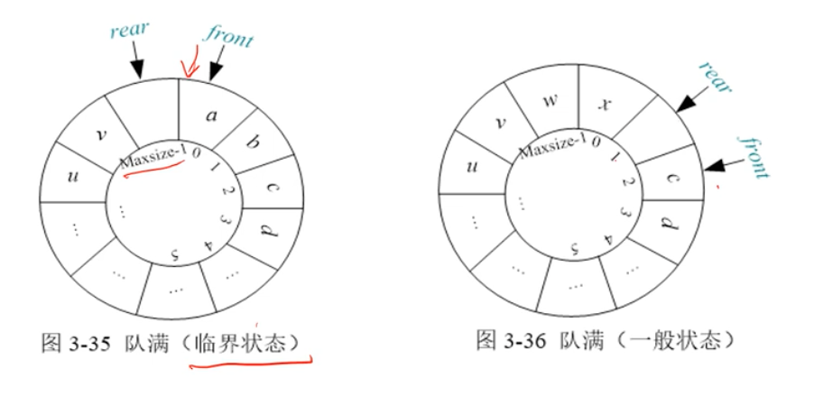

## 初始化

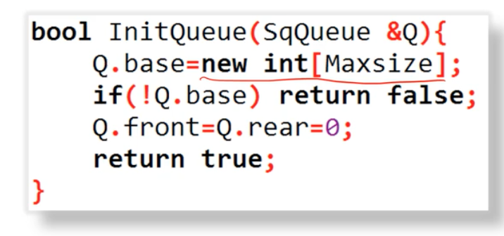

## 入队

入队时，首先将 x 放入 Q.rear 所指空间，然后 Q.rear 后移一位。

```
Q.base[Q.rear] = x // 将元素 x 放入 Q.rear 所指空间
Q.rear = (Q.rear + 1) % Maxsize // Q.rear 后移一位
```

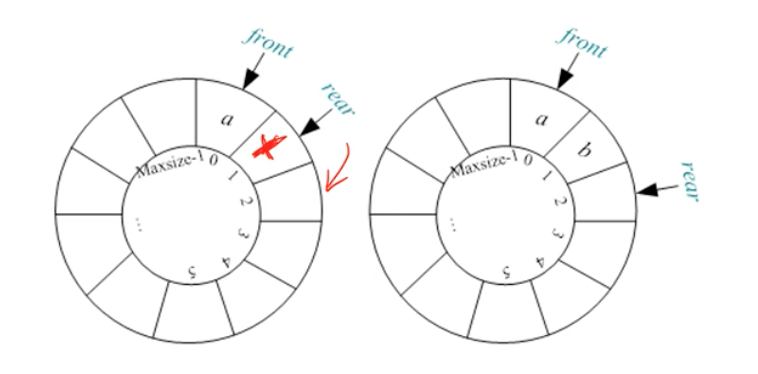

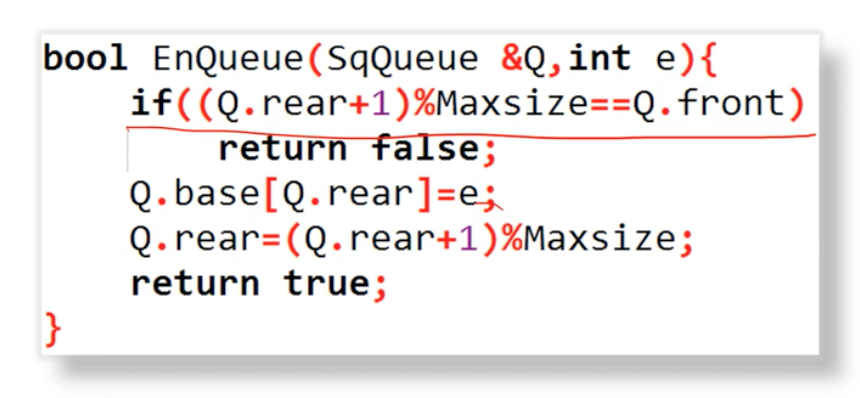

## 出队

先用变量保存队头元素，然后队头 Q.front 后移一位。

```
e = Q.base[Q.front] // 用变量记录 Q.front 所指元素
Q.front = (Q.front + 1) % Maxsize // Q.front 后移一位
```

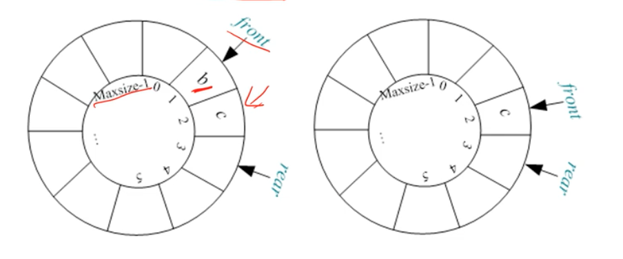

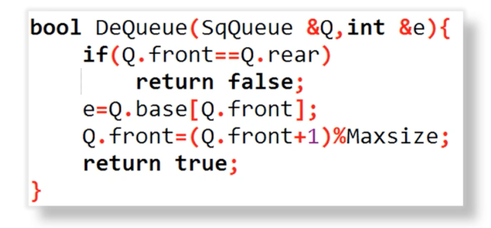

## 取队头 

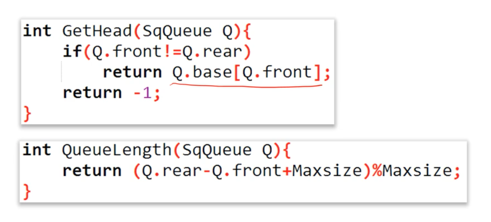

## 队列长度

循环队列中的内容实际上为 Q.front 到 Q.rear - 1 这个区间的数据元素。

```
Q.rear >= Q.front 元素个数为 Q.rear - Q.front
Q.rear < Q.font  元素个数为 Q.rear - Q.front + Maxsize, 加 Maxsize 防止为负数
```

统一公式为： (Q.rear - Q.front + Maxsize) % Maxsize
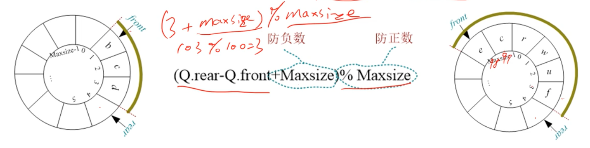

## 总结

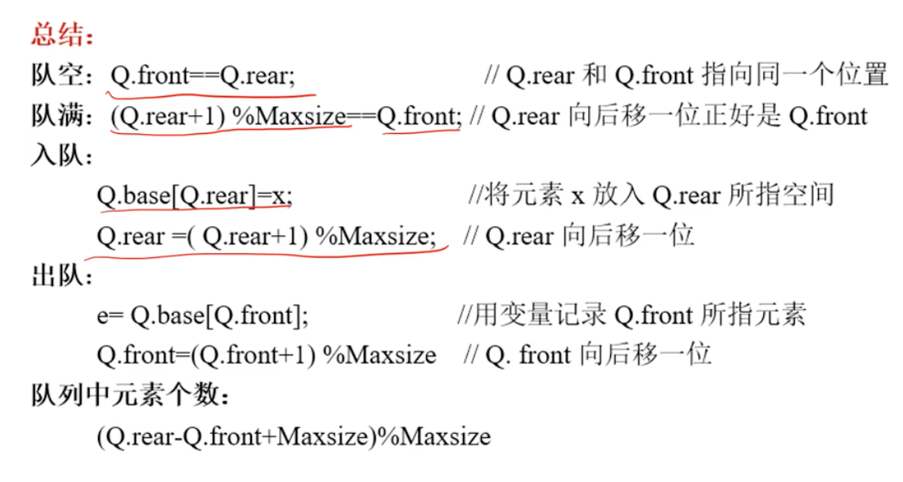

## 时间复杂度分析

- 初始化 O(1)
- 入队 O(1)
- 出队 O(1)
- 取队头 O(1)