# 06 树、森林与二叉树的转换

## 树

### What

- n>=0 个节点的有限集合
- 空树
- 非空树
	- 有且只有一个根
	- 除根外，其余节点可以分为 n 个树。

## 树的存储

- 父节点
- 子节点

表示法

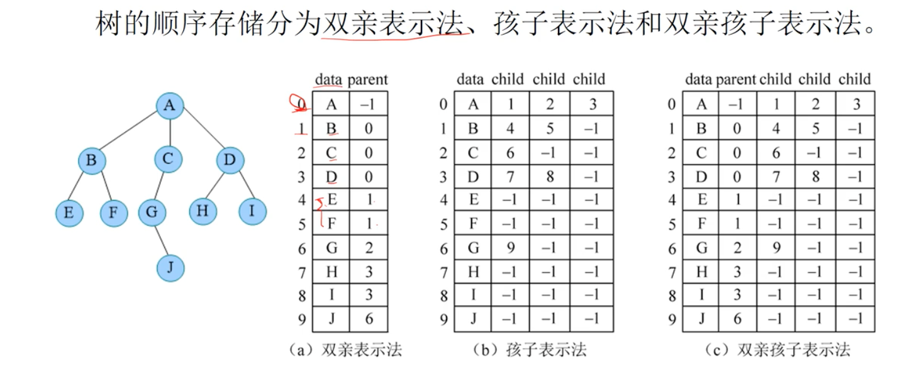

孩子使用 vector 或者链表来存储。

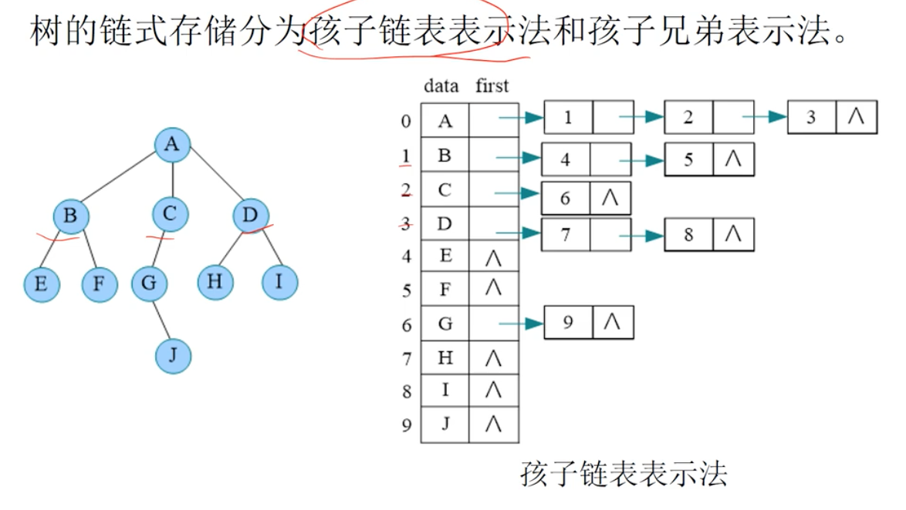

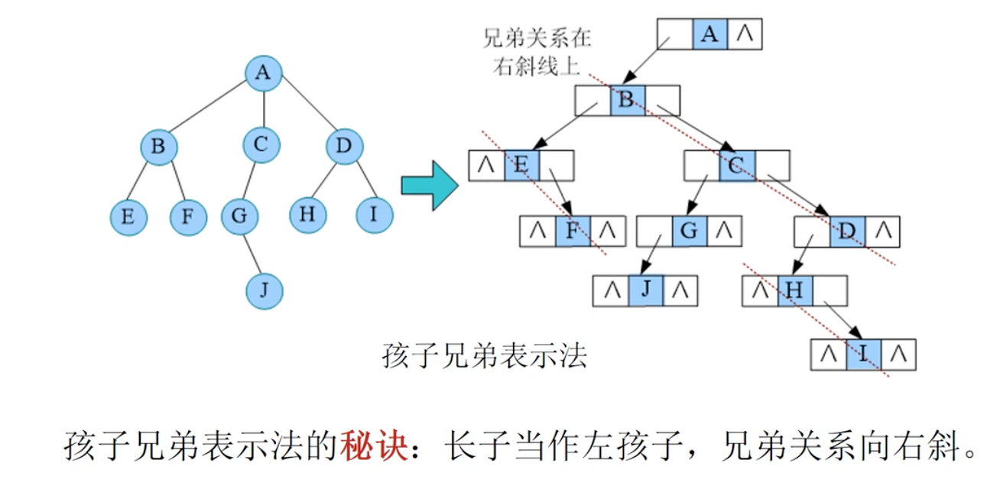

孩子兄弟表示法也叫二叉链表法。

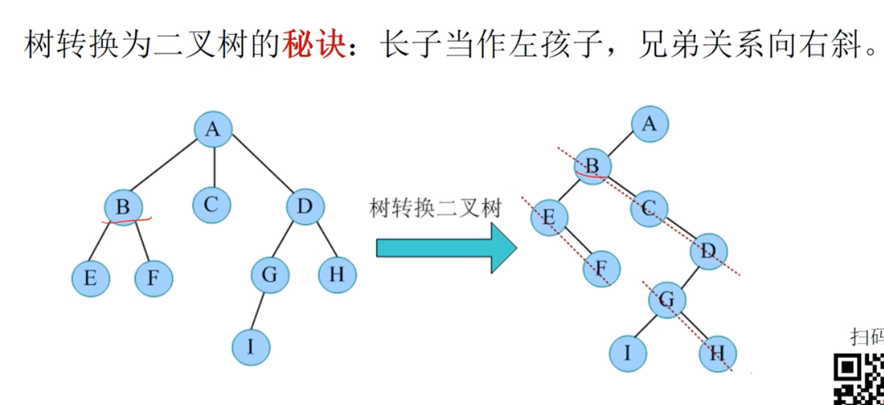

森林转二叉树

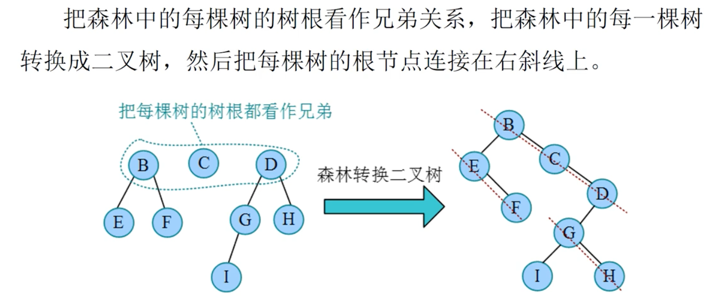

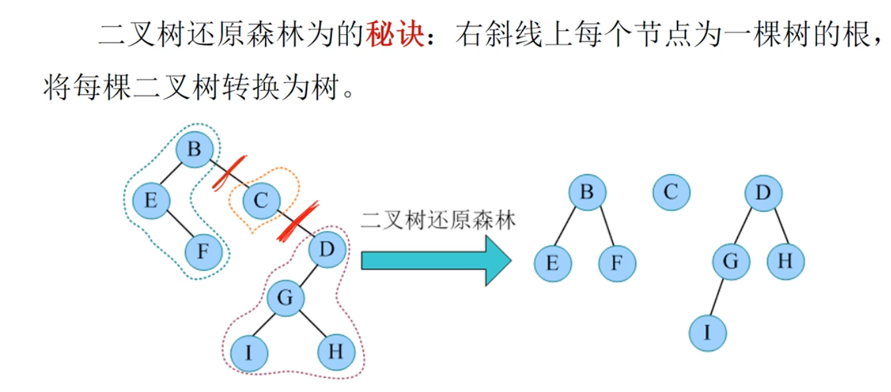

## 二叉树的性质

二叉树是有 n 个节点构成的集合。非空树 T 满足：

1. 有且只有一个根
2. 除根外，其他的节点也构成二叉树。

二叉树的种类：

- 空树
- 只有根
- 根 + 左节点
- 根 + 右节点
- 根 + 左节点 + 右节点

**性质**

1. 在二叉树的第 i 层上至多有 2^(i-1) 个节点。

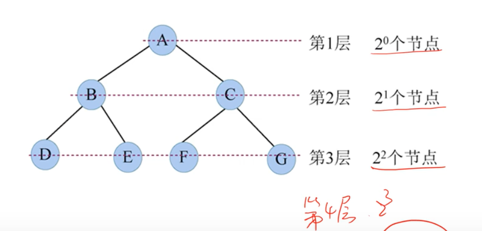

2. 深度为 k 的二叉树至多有 2^k - 1 个节点。

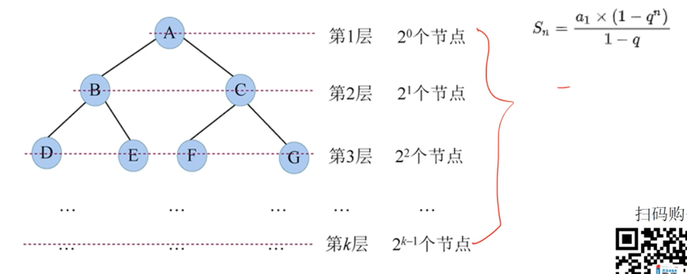

等比数列。

3. 对于任何一棵二叉树，若叶子数为 n0，度为 2 的节点数为 n2，则 n0 = n2 + 1。

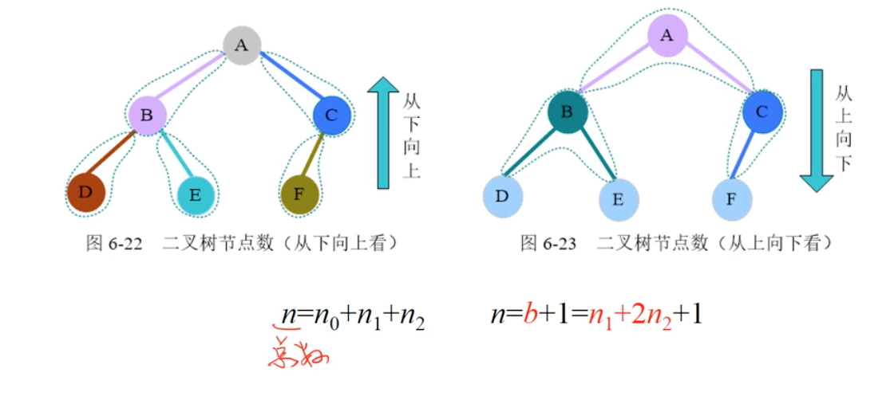

b 为分支数。

满二叉树和完全二叉树。

4. 具有 n 个节点的完全二叉树的深度必为 log2n + 1。

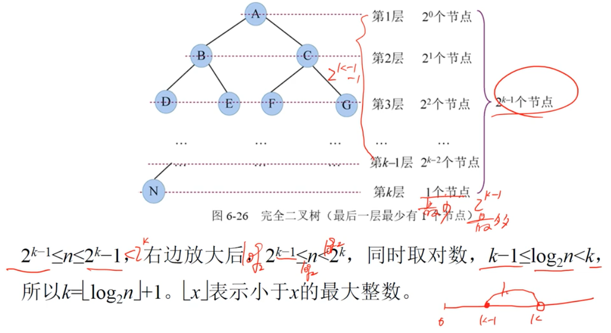

5. 对于完全二叉树，编号。

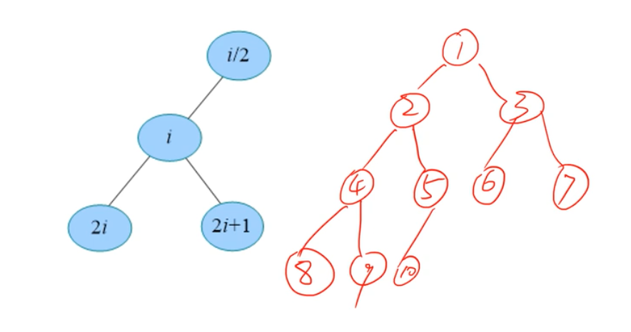

二叉树的存储

- 顺序存储，如果不是完全二叉树，会造成空间浪费，补为完全二叉树。
- 链式存储，叫二叉链表

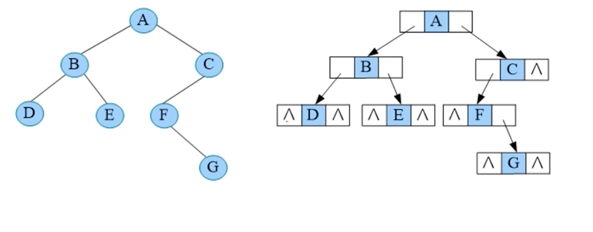