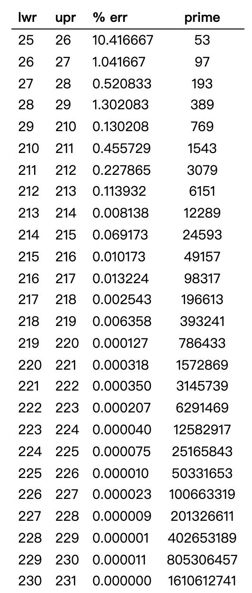
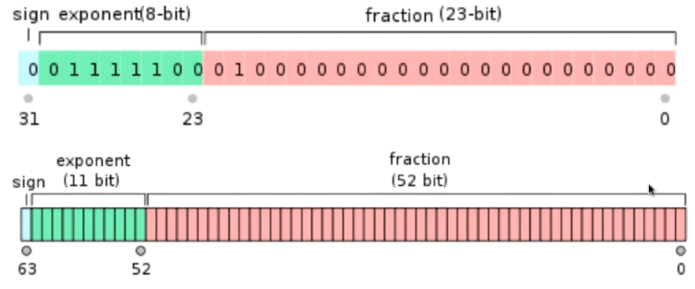

# 哈希表与 SQRT 分解

## 哈希表

> leetcode 387.找第一个不重复的字符, 都是小写字母。

解法：

1. 开辟一个长度 26 的数组来存储频率。
2. 遍历存储频率
3. 遍历查找为 1 的索引，没有则返回 -1

哈希表是根据关键码值(Key value)而直接进行访问的数据结构。也就是说，它通过把关键码值映射到表中一个位置来访问记录，以加快查找的速度。
哈希函数：将键转换为索引的函数。 如名字 转为 a-z。
哈希冲突：很难将所有的键和索引一一对应，一般来说，不同的键会对应相同的索引。

-   哈希表充分体现了算法领域的经典思想：空间换时间。
    -   极端情况：无限空间和 O(1)空间。
    -   如身份证号：1321321321321321，可以用 999999999999999999 来存储，但是要花费很多内存，而且因为身份证是 18 位的，所以前 17 位空间是浪费的，如 1 - 99999999999999999。
    -   如果只有 O(1)空间，那么会变成链表，查询时间复杂度会变成 O(n)。
-   哈希表是时间和空间的平衡
-   哈希函数的设计很重要
-   key 通过哈希函数得到索引的分布越均匀越好

## 哈希函数的设计

将数据转换为整型。

**整型**

-   小范围的正整数可以直接使用，来作为数组索引。
-   小范围的负整数可以进行偏移， `[- 100, 100]` -> `[0, 200]`

**大整数**

如身份证 110108198512166666

通常的做法是：取模，比如取后四位，等同于 mod 10000，开 10000 的数组。
取后六位？等同于 1000000。

但是后面 16 其实是日期，应该在 [01, 31] 区间内，所以会造成分布不均。

这就是取模的陷阱。要具体问题具体分析。

另一个问题是没有利用数据的所有信息，只利用了后面几位。这其实也增加了哈希冲突的几率。因为只要后面几位一样，就会放在一起。

通常的做法是模一个素数。

-   如果数据是无规律的，模一个合数或素数，哈希冲突的概率可能都不大。
-   如果数据是有规律的，模一个合数，哈希冲突的概率会比较大。

```
模合数, 分布不均匀
10 % 4 -> 2
20 % 4 -> 0
30 % 4 -> 2
40 % 4 -> 0
50 % 4 -> 2

// 模素数, 五个值都不同
10 % 7 -> 3
20 % 7 -> 6
30 % 7 -> 2
40 % 7 -> 4
50 % 7 -> 1
```

对于某范围内数据模的素数参考表格。

http://planetmath.org/goodhashtableprimes。



**浮点型**

在计算机中，都是 32 位或 64 位二进制来表示的，只不过计算机解析成了浮点数。

单精度和双精度浮点数：



将 32 位或 64 位空间，转为整型处理(忽略小数点)。

**字符串**

转成整型处理。

```
166 = 1 * 10^2 + 6 * 10^1 + 6 * 10^0

code = c * 26^3 + o * 26^2 + d * 26^1 + e * 26^0
     = 2 * 26^3 + .....
[a - z] -> [0, 25]

// 如果还有其它符号, 可以看作是 B(Base) 进制
code = c * B^3 + o * B^2 + d * B^1 + e * B^0

hash(code) = (c * B^3 + o * B^2 + d * B^1 + e * B^0) % M
M 是素数

// 如果 B ^ k, 这里 k 太大，计算也会很慢，可以转换为下面形式
hash(code) = (((c * B) + o * B + d) * B + e) % M

// 上面表达式还可能会造成整型溢出, 可以用下面表达式
hash(code) = ((((c % M) * B + o) % M * B + d) % M * B + e) % M
```

代码如下, 利用迭代：

```js
let hash = 0
for(int i = 0; i< s.length; i++){
    hash = (hash * B + s.charAt(i)) % M
}
```

**复合类型**

转成整型处理。

```
hash(code) = ((((c % M) * B + o) % M * B + d) % M * B + e) % M
```

Date: year, month, day

```
hash(date) = (((date.year % M) * B + date.month) % M * B + date.day) % M
```

原则：

-   一致性：如果 a == b，则 hash(a) == hash(b)
-   高效性：计算高效简便
-   均匀性：哈希值均匀分布
