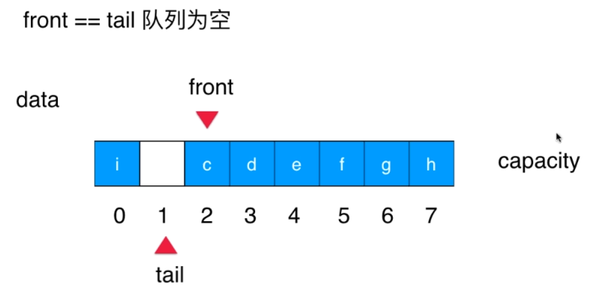

# 栈和队列

## 栈

相比数组，栈的操作是数组的子集。
插入元素只能从最后插入，取出也只能从栈顶取出。但是逻辑很重要。
后进先出。Last In First Out(LIFO)

栈的应用

- undo 操作(撤销)，如编辑器打字，打错了撤销删除字 ctrl+z
- 程序调用的系统栈，如函数 A() 里调用了 B()，B() 里调用了 C()，C 执行完成后执行哪？跳回 B 里的某个中断位置 B2 继续执行。

```
栈的实现有多种
Interface Stack<E>
- void push(e)
- E pop()
- E peek()
- int getSize()
- boolean isEmpty()

ArrayStack 用动态数组来实现
```

入栈、出栈都是 O(1) 的。

- 检查括号匹配 - 编译器

## 队列

queue
FIFO 先进先出

```
Queue<E>
void enqueue(E) 入 O(1)
E dequeue() 出  O(n)，后面要往前移动
E getFront()      O(1)
int getSize()     O(1)
boolean isEmpty()   O(1)
```

数据量大时，出队时间复杂度高

解决方法：循环队列 loopQueue
front 指向第一个元素
tail 指向要放入元素的位置，即动态数组的 size

入队时，只需要 tail + 1 即可，如果达到 capacity 了，则可以往前面放，tail 为 0，不过要小于 front，当 tail+1 = front 时，就不能放元素了，必须留一个空的位置，因为要 front == tail（准确时 ） 时表示队列为空,
(tail+1)%c == front 队列满了
出队时，将 front +1，就无需移动其它元素位置，时间为 O(1)



循环队列与数组队列复杂度分析。
