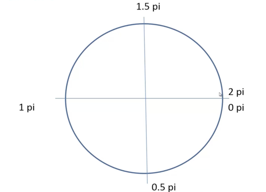
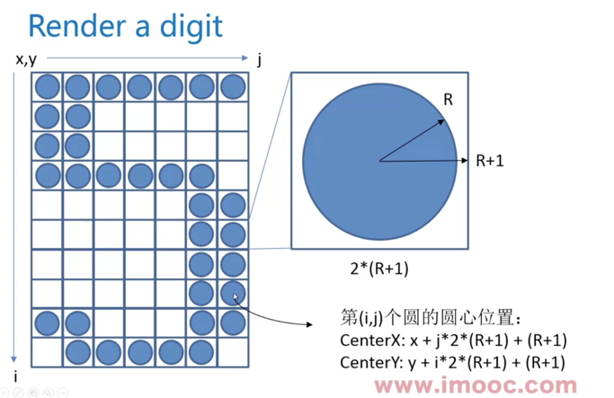

# 炫丽的倒计时效果 Canvas 绘图与动画基础

-   https://www.imooc.com/video/2434

## 基础

canvas 默认 `300 * 150`

不要使用 css 指定大小，它只是设置了 canvas 标签的大小 a*b，而不是设置 canvas 默认大小，这样会导致，里面画的元素依然是在 `300*150`坐标里绘制的，只不过画布整体会缩放到`a\*b` 大小。
要使用 width height 指定。


```
var canvas = document.getElementById('canvas')
canvas.width
canvas.height
var context = canvas.getContext('2d')
```

## Draw a line

```js
// 先描述状态
context.moveTo(100, 100)
context.lineTo(100, 100)

// 再开始绘制
context.stroke()
```

```js
// 用来区分状态, 否则后面的状态会覆盖前面的
context.beginPath()
context.closePath()
```

## Draw an arc

```js
context.arc(
    centerx, centery, radius,
    startingAngle, endingAngle,
    anticlockwise, // 是否逆时针绘制
)
```




