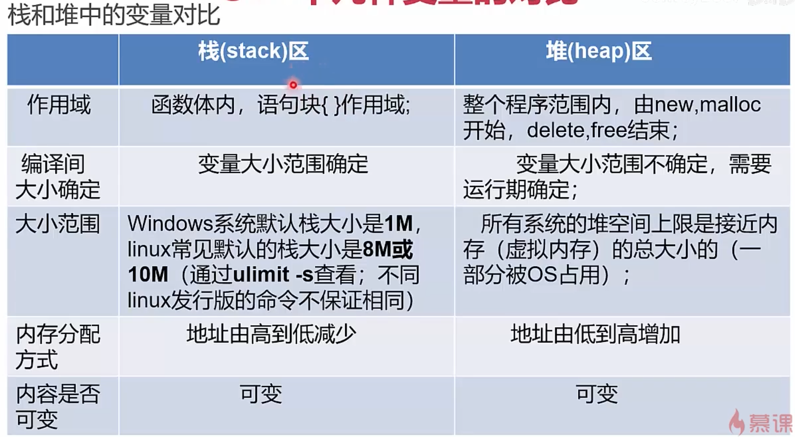
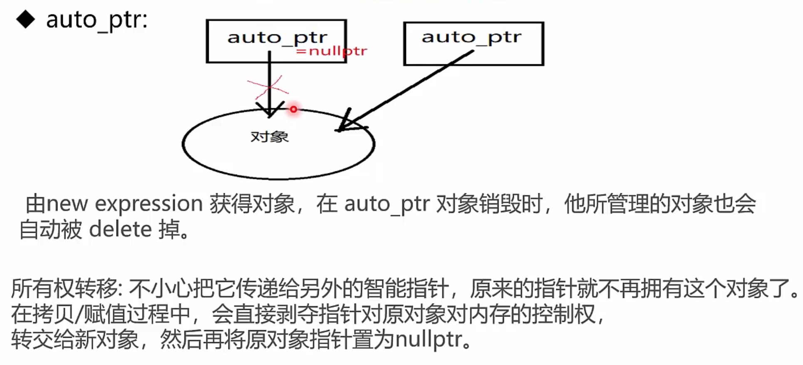
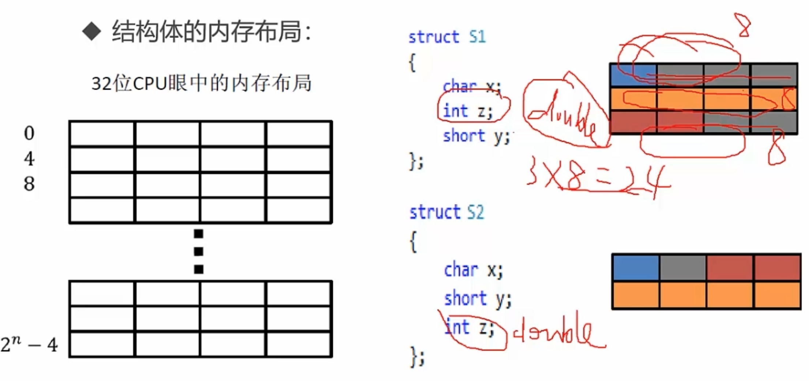
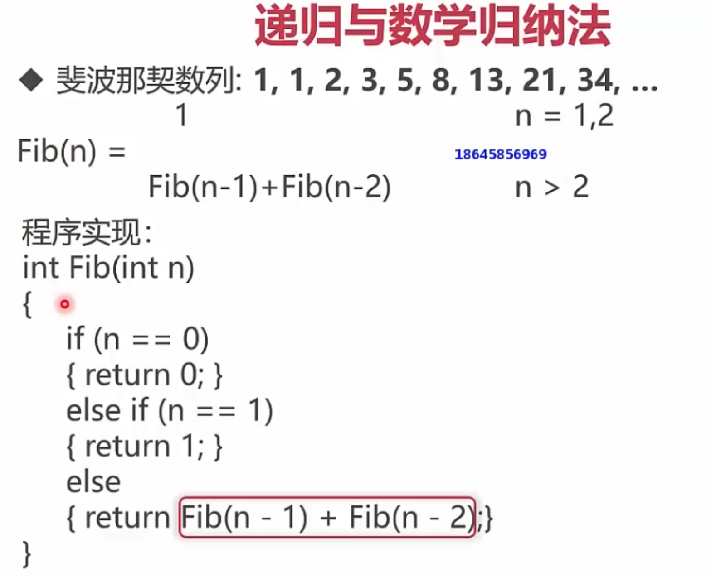
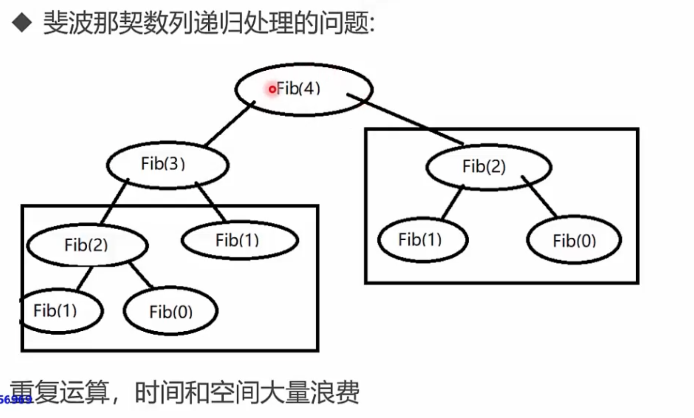
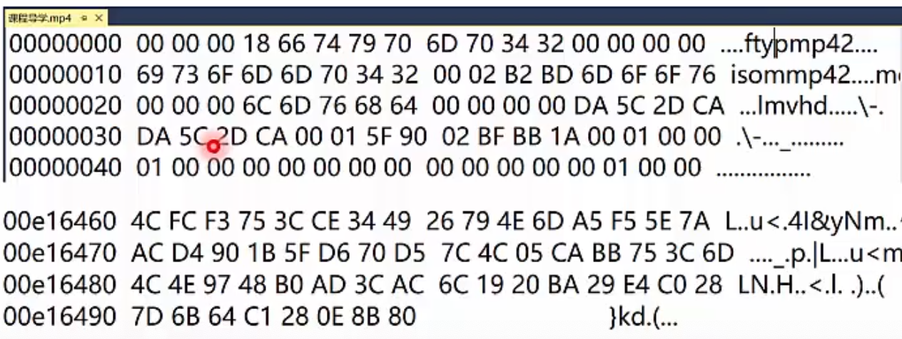

# C++ 学习笔记

优点：

1. 抽象封装能力强大
2. 高性能
3. 低功耗，适用于嵌入式

应用

1. 大型桌面应用程序，如 google chrome, microsoft office
2. 大型网站的后台，如 Google 的搜索引擎
3. 游戏和游戏引擎(如 Unity)
4. 视觉库和 AI 引擎(如 Opencv 和 Tensorflow)
5. 数据库(SQL Server 和 Mongodb)
6. 其它(如自动驾驶、嵌入式开发)

总结：C++开发成本高，适合用在对内存和 CPU 要很高、低功耗并且程序被调用非常频繁等场景中。

编程语言的层次和类型：

- 机器语言，汇编语言(移植性差)等
- 编译型语言，如 C++，C 等，编译成不同平台的语言
- 解释型语言 basic，python 等，通过解释器跨平台
- 脚本语言，如 bash，csh 等

编译型语言一般需要经历编译和链接的过程，才能变成真正可执行的程序。


https://medium.com/jspoint/a-simple-guide-to-load-c-c-code-into-node-js-javascript-applications-3fcccf54fd32

## 2. C++基础语法

### 2.1 编译型语言


脚本语言 - 边解释边执行
非脚本语言 - 编译后执行

编译型语言一般需要经历编译和链接的过程，才能编程真正可执行的程序。

动态程序一般有两种实现方式，一是二进制方式，一是脚本方式。 二进制方式是先将我们编写的程序进行编译，变成机器可识别的指令代码（如.exe 文件），然后再执行。这种编译好的程序我们只能执行、使用，却看不到他的程序内容。脚本简单地说就是一条条的文字命令，这些文字命令是我们可以看到的（如可以用记事本打开查看、编辑），脚本程序在执行时，是由系统的一个解释器，将其一条条的翻译成机器可识别的指令，并按程序顺序执行。因为脚本在执行时多了一道翻译的过程，所以它比二进制程序执行效率要稍低一些。
script 的原意是“手写的，区别于印刷的东西”。即可修改。

### 2.2 数据类型


宽字节是用 2 个字节来表示一个字符。

### 标识符与关键字

标识符规则

- 开头：`[a-zA-Z_]`，后面可以是 `[a-zA-Z0-9_]`
- 不能数字开头、不能有 @ & %
- 区分大小写
- 不能用关键字，原则上长度不超过 32 位

常见的关键字


一些新的 keyword


所有 keyword: https://en.cppreference.com/w/cpp/keyword

原则：

- 符合团队项目规范
- 见名知意
- `min-length&max-infomation`原则
- 变量名采用名词或形容词+名词。避免出现数字，如 value1。函数采用动词+名词
- 命名法
  - 微软匈牙利命名法: int iMaxAge，首字母是类型缩写，后续为名称，名称的首字母大写
  - 驼峰 camel: int maxAge
  - pascal 命名法: int MaxAge

### 变量和常量

```
// 变量
int m = 1;
```

常量的定义方法：

- #define, 如 #define PI 3.14，(不推荐，编译期间不会报错)
- const, 如 const double PI = 3.14，(推荐，编译期间会报错)

- #define 和 const 的区别?

整数常量: 可以是十进制、八进制(0 开头)、十六进制(0x 或 0X 开头)的常量。
整数常量也可以带一个后缀，后缀是 U 和 L 的组合，U 表示无符号整数 unsigned，L 表示 long 长整数，后缀不区分大小写和顺序。


布尔常量

- true
- false

字符常量：单引号，

宽字符 2 个字节，没有 L 是一个字节


### 运算符表达式


算术运算符


## 3. C++的运算符与表达式

cout cin 在 iostream 库下，C++ 预定义了标准的输入输出流设备，键盘和屏幕。可以更改输入输出设备。endl 是换行。

```c++
#include "iostream"

using namespace std;  // 如果找不到的变量或方法，会在命名空间下查找
int main() {
    int a = -10;
    cout << a << endl;
    cout << "hello world";
}
```

### 3.2 - 3.7 运算符表达式


```c++
#include <assert.h>
```


^ 异或 ～非


sizeof 返回的是占用的大小，整数占 4 个字节。字符占一个字节。


结构体


### 3.8 注释

代码的解释、提高源代码的可读性
单行注释、多行注释，注释中的字符会被 C++ 编译器忽略。

```
//
/**/
```

在注释里使用 `//`或`/**/`，它只被作为注释内容。

1. 好的命名和代码本身就是最好的注释，无需添加额外的注释。注释并不是越多越好。
2. 重要复杂代码段，先写注释、再写代码，保证两者的一致性
3. 如果更新了代码，也相应更新注释

### 3.10 - 3.12 补码

无符号数在计算机中是以机器码存的。
有符号数，正数是机器码，负数是补码。

32 位计算机用 4 byte 来表示一个字符。

真值：就是 10 进制的数。
补码转真值的计算公式:
第一种方法：

```
10000001 -> -1 * 2^7 + ... + 1 * 2 ^ 0
```

第二种方法：
机器码的反码 +1，就是补码

内存查看器为了简化、方便表示，用了 16 进制来表示。

补码数值的范围：在 16 进制，有符号最大是 0x80000000(-2147483648)，最小是 0x7fffffff(2147483647)。

字节序的表示方法有 2 种：

- 大端法：大多数 IBM 机器(在内存中是正序)
- 小端法：Intel 兼容机(个人机器)(在内存中是倒序)

比如 10 的机器码是 00 00 00 0a，但在内存中是小端法表示的。


**关于位移操作的说明**

- 左移操作: 低位补 0
- 右移操作: 有符号数，移动有 2 种方式
  - 逻辑移位，最高位是补 0
  - 算术移位，负数最高位是补 1。
  - 因为不同的机器采用的方式可能不同，所以负数右移可能会产生 bug，应该避免负数右移

## 第 4 章 C++基础容器

### 4.1 - 4.5 数组


思考：x>=11 x<=21 有多少个数？转为左闭，右开的区间 [11, 22) ，然后作减法 22 - 11 = 11

所以 for 循环这样写：

```
for(int i = 0; i< 10;i++){}
```


数组越大，移动时间越长。

数组的访问： O(1)


C、C++中没有提供 直接获取数组长度的函数，对于存放字符串的字符数组提供了一个 strlen 函数获取长度，那么对于其他类型的数组如何获取他们的长度呢？其中一种方法是使 用`sizeof(array) / sizeof(array[0])`, 在 C 语言中习惯上在 使用时都把它定义成一个宏，比如`#define GET_ARRAY_LEN(array,len) {len = (sizeof(array) / sizeof(array[0]));}` 。而在 C++中则可以使用模板 技术定义一个函数，比如：

```c++
template <class T>

int getArrayLen(T& array)

{
return (sizeof(array) / sizeof(array[0]));

}
```

若数组为存储 字符串的字符数组，则所求得的长度还需要减一,原因为存储字符串的字 符数组末尾有一个'\0'字符，需要去掉它。


插入元素：

```
vec.insert(vec.begin() + 1, 6) // 往 begin + 1 后插入，即第2个元素
vec.insert(vec.end(), 6)  // 往 end 前插入，即最后
```

end 是末尾+1 的位置，即结束符。

### 4.6 - 4.11 字符串


计算机硬件有两种储存数据的方式:大端字节序(big endian)和小端字节序(little endian)
utf8 是变长，1byte 表示字符，比如有些汉字用 2byte ，所以字节占用可能是： 1 2 1 。
utf16 用 2 个字节来表示，传输到另一台计算机中，不知道它的字节序。不好还原。
utf32 浪费空间了，大部分字都不需要 4 个字节。

编码知识


大端 FF FE 开头
小端 FE FF 开头


## 第 5 章 彻底学会 C++ 指针，引用

存储器系统是一个具有不同容量，成本和访问时间的存储设备的层次结构。


越往上，存储越小，速度越快，单价越贵。

CPU 高速缓存的容量比内存小的多但是交换速度却比内存要快得多。缓存的出现主要是为了解决 CPU 运算速度与内存读写速度不匹配的矛盾，因为 CPU 运算速度要比内存读写速度快很多，这样会使 CPU 花费很长时间等待数据到来或把数据写入内存。

当处理器发出内存访问请求时，会先查看缓存内是否有请求数据。如果存在（命中），则不经访问内存直接返回该数据；如果不存在（失效），则要先把内存中的相应数据载入缓存，再将其返回处理器。

**关于内存**

- 内存由很多内存单元组成，这些内存单元用于存放各种类型的数据。
- 计算机对内存的每个内存单元都进行了编号，这个编号就称为内存地址，地址决定了内存单元在内存中的位置。
- 记住这些内存单元地址不方便，于是 C++ 语言的编译器让我们通过名字来访问这些内存位置。

例如：

```c++
int a = 112, b = -1;
float c = 3.14;
int* d = &a;  // 存储的a的地址
float* e = &c;
```


指针就是一个变量，它存储的值是一个地址。`T*`表示类型为 T 的一个对象的地址。

通过指针访问它所指向地址的过程叫做间接访问或者指针引用。通过单目操作符`*` 来实现间接访问操作。

```c++
cout << *d << endl;  // 112
cout << *e << endl;  // 3.14
```

一个变量有 3 个重要信息需要存储：

- 变量值
- 变量地址
- 变量类型(存储在编译器中)

指针变量是一个专门用来记录变量地址的变量。通过指针变量可以间接访问另一个变量的值。

**`char a[]` 和 `char *p` 的区别**

1. 数据类型不同，一个是数组，一个是指针
2. sizeof 不同
3. a 和 &a 相同，p 和 &p 不同
4. 存储区域不同
5. a++ 无效，p++ 有效
6. 可读性


- https://www.geeksforgeeks.org/whats-difference-between-char-s-and-char-s-in-c/

**左值和右值**

左值：编译器为其单独分配了一块存储空间，可以取其地址的，左值可以放在赋值运算符左边。如函数或变量名字。比如`char *p`，在内存中实际上有一个指针存储空间。

右值：指的是数据本身，不能取到其自身地址，右值只能放在赋值运算符的右边。一般也叫临时对象。比如 `char a[]` 里的 a，不能放左边，编译器没有单独给它分配内存？

### 一般指针、指针数组和数组指针

一般指针 `T*`。 T 是一个泛型，泛型指任何一种类型。 如:

```cpp
int i = 4;
int *ip = &i;
cout << (*ip) << endl;
double d = 3.14;
double *dp = &d;
cout << (*dp) << endl;
char c = 'a';
char *cp = &c;
cout << (*cp) << endl;
```

- 指针数组(array of pointers): 每个元素都是指针，`T *t[]`。
- 数组指针(a pointer to an array): `T (*t)[]`。

如：

```cpp
int testPoint3() {
    // int	4 个字节	-2147483648 到2147483647
    double c[4] = {0x80000000, 0xFFFFFFFF, 0x00000000, 0x7FFFFFFF};
    double *a[4];
    double (*b)[4];
    b = &c;  // 这里数组个数需要匹配

    cout << a << endl;  // 0x7ffee962d4a0
    cout << sizeof(a) << endl;  // 32位 4个字节
    cout << sizeof(c) / sizeof(c[0]) << endl;

    for (unsigned int i = 0; i < sizeof(c) / sizeof(c[0]); i++) {
        a[i] = &c[i];
    }
    cout << 0x80000000 << endl;  // 2147483648
    cout << *(a[0]) << endl;  // 2.14748e+09
    cout << (*b)[3] << endl;  // 2.14748e+09
    return 0;
}
```

`[]` 优先级要比`*`高。

### const 与指针

const 修饰规则：看左边最近的部分，如果没有则看右边最近的。

```cpp
unsigned int MAX_LEN = 11;
char str[] = {"helloworld"};
char const* pStr1 = "helloworld";  // const char* 表示值不能修改
char* const pStr2 = str;          // 修饰指针 表示指向不能修改
char const* const pStr3 = "helloworld";

pStr1 = str;
//pStr2 = str;  pStr2不可改
//pStr3 = str;  pStr3不可改

unsigned int len = strnlen_s(pStr2, MAXLEN);
cout << len << endl;
for(unsigned int index= 0; index < len; index++){
  //pStr1[index] += 1;  pStr1 里的值不可改
  pStr2[index] += 1;
  //pStr3[index] += 1;  pStr3 里的值不可改
}
```

### 指向指针的指针

```cpp
int a = 10;
int *b = &a;
int **c = &b;
```

### 野指针

指针如果没有初始化，就不知道它指向哪里。在使用时可能会报错(定位到非法地址)或者覆盖本来正在使用的区域。比如：

```cpp
int *a;
*a = 12;
```

NULL 指针，没有指向任何区域的指针。

野指针：在开发中要避免野指针。野指针是：

1. 指针变量没有初始化
2. 使用完后没有设置为 NULL 的指针，如 delete 和 free 之后的指针。
3. 指针操作超越了变量的作用范围，如一块区域生命周期结束后(函数)，指针还指向它。

指针需要初始化(如果不知道初始化什么值，就设为 NULL)。在使用指针时，需要判断它是否是 NULL。

```cpp
int a = 12;
int *pa = NULL;
pa = &a;
if(pa != NULL){
  cout << (*pa) << endl;
}
pa = NULL;
```

### 内存分布

栈和队列

栈和堆

```cpp
int a = 0             // (GVAR)全局初始化区
int *p1;              // (bss)全局未初始化区
int main(){           // (text)代码区
  int b = 1;          // (stack)栈区变量
  char s[] = "abc";   // (stack)栈区变量
  int *p2 = NULL;     // (stack)栈区变量
  char *p3 = "123456";// 123456\0 在常量区(不能修改)，p3 在(stack)栈区
  static int c = 0;   // (GVAR)全局(静态)初始化区
  p1 = new int(10);   // (heap)堆区变量，new 会分配到堆，可以用 delete 释放
  p2 = new int(20);   // (heap)堆区变量
  char *p4 = new char[7];  // (stack)栈区变量
  strcpy_s(p4, 7, "123456") // (text)代码区

  if(p1 != NULL){
    delete p1;
    p1 = NULL;
  }
  if(p2 != NULL){
    delete p2;
    p2 = NULL;
  }
  if(p4 != NULL){
    delete[] p4;  // 数组是 delete[]
    p4 = NULL;
  }

  return 0;                 // (text)代码区
}
```


栈空间是系统或编译器分配的，堆空间是可以由程序员分配的。常量区在 heap 和 bss 之间。

heap 堆是一种动态分配资源的形式

1. 从现代编程语言角度来看，使用堆，或者说使用动态内存分配，是一件很自然的事情。
2. 动态内存带来了不确定性：内存分配耗时需要多久？失败了怎么办？在实时性要求高的场合，如嵌入式控制器和电信设备。
3. 一般而言，当我们在堆上分配内存时，很多语言会使用 new，有些语言则使用隐式分配，在 c++ 中 new 的对应词是 delete，因为 c++ 是可以让程序员完全接管内存的分配释放的。

程序通常需要牵涉到三个内存管理器的操作：

1. 分配一个某个大小的内存块。
2. 释放一个之前分配的内存块。
3. 垃圾收集操作，寻找不再使用的内存块并予以释放；

这个回收策略需要实现性能、实时性、额外开销等各方面的平衡，很难有统一和高效的做法(内存碎片，导致有时很难分配大空间)；

C++ 做了 1，2 两件事(程序员自己管理内存)，而 Java 做了 1,3 两件事，无法很好做一些高效的事情(释放空间，立马新建一个空间)如图像处理，性能实时性有影响。

### 资源管理方案 - RALL

RALL(Resource Acquisition Is Initialization):

- C++ 所特有的资源管理方式。有少量其它语言，如 D，Rust 也采纳了 RALL，但主流编程语言中，C++ 是唯一一个依赖 RALL 来做资源管理的。
- RALL 依赖栈和析构函数(即栈退出时在析构函数中释放内存)，来对所有的资源 - 包括堆内存在内进行管理。
- RALL 有些比较成熟的智能指针代表：如 std::auto_ptr 和 boost:shared_ptr。

### 几种变量的对比




### 内存泄漏

**什么是内存泄露问题?**

指程序中已动态分配的堆内存由于某种原因程序未释放或无法释放，造成系统内存的浪费，导致程序运行速度减慢甚至系统崩溃等严重后果

**内存泄露发生原因和排查方式**

1. 内存泄露主要发生在堆内存分配方式中，即配置了内存后，所有指向该内存的指针都遗失了。若缺乏语言这样的垃圾回收机制，这样的内存片就无法归还系统（除非程序停止执行后，系统才会收回）。
2. 因为内存泄露属于程序运行中的问题，无法通过编译识别，所以只能在程序运行过程中来判别和诊断。

```cpp
while(true){
  int *a = new int(10);
}
```

### 智能指针

使用指针是非常危险的行为，可能存在空指针、野指针等问题，并可能导致内存泄露。但是指针有非常高效，所以需要更安全的方式来使用指针。

一般有两种典型的方案:

1. 使用更安全的指针 - 智能指针。
2. 不使用指针，使用更安全的方式 - 引用。

C++ 中退出了四种常用的智能指针：

- unique_ptr
- share_ptr
- weak_ptr
- auto_ptr，C++11 已经废弃，在 C++17 中被正式删除

从下面几个角度来分析这几种指针

- 应用场景：
  - 对象使用权
  - 生命周期
- 性能分析

**auto_ptr**



### 引用

引用是一种特殊的指针，不允许修改的指针。

使用指针有哪些坑：

1. 空指针
2. 野指针
3. 不知不觉改变了指针的值，却继续使用

使用引用，则可以：

1. 不存在空引用
2. 必须初始化
3. 一个引用永远指向它初始化的那个对象

引用的基本使用：可以认为是指定变量的别名，使用时可以认为是变量本身。

```cpp
int x = 1,x2 = 3;
int& rx = x;
rx = 2;
cout << x << endl; // 2
cout << rx << endl; // 2
rx = x2;
cout << x << endl;  // 3
cout << rx << endl; // 3
```

```cpp
// 交换 int a,b 的值
// 不行，因为参数会参数另外的变量，而不是传入的变量了
void swap(a, b)
{
  int tmp = a;
  a = b;
  b = tmp;
}
void swap2(int& a, int& b)
{
  int tmp = a;
  a = b;
  b = tmp;
}
void swap3(int* a, int* b)
{
  int tmp = a;
  a = b;
  b = tmp;
}
int a = 3, b = 2;
swap2(a, b)
assert(a == 4 && b == 3)
swap3(&a, &b) // 需要传指针
```

有了指针为什么还需要引用？

> Bjarne Stroustrup 的解释是：为了支持函数运算符重载。(让参数传递好看些)

有了引用为什么还需要指针？

> Bjarne Stroustrup 的解释：为了兼容 C 语言。

补充，关于函数传递参数类型的说明：

1. 对内置基础类型(如 int, double 等)而言，在函数中传递时传值(pass by value)更高效。
2. 对 OO 面向对象中自定义类型而言，在函数中传递时传引用(pass by reference to const)更高效，因为变量大。

## 第 6 章 C++基础句法

图灵机

三种基本的程序结构：

- 顺序、分支和循环

单一语句: 在任何一个表达式后面加上分号(;)。如：

```cpp
c = a+b; cout << "hello world" << endl;
```

复合语句：用一对花括号 {} 括起来的语句块，在语法上等效于一个单一的语句。

```cpp
if(p != NULL) {
  cout << *p << endl;
} else if {
} else {
}
```

1. 实现一个函数，输入一个年份，判断是否是闰年。

```cpp
// if(year % 400 == 0 || (year % 4 == 0 && year %100 != 0))
if((year % 4 == 0 && year %100 != 0) || year % 400 == 0) {
  return true
} else {
  return false
}
```

2. 判断一个整数是否是另一个整数的倍数。

```cpp
if((a!=0)&&(b%a==0)){
  return true;
}
```

switch

```cpp
typedef enum __COLOR {
    RED = 3,
    GREEN,
    BLUE,
    UNKOWN
} color;  // 定义一个结构体叫 color

color color0;
color0 = GREEN;
if (color0 == BLUE) {
    cout << "蓝色" << endl;
} else {
    // 非蓝色 4
    cout << "非蓝色" << color0 << endl;
}

switch (color0) {
    case GREEN:
        cout << "绿色" << endl;
        break; // 如果不加 break，满足条件后，后面的条件不符合也会指向
    case RED:
        cout << "红色" << endl;
        //break;
    case BLUE:
        cout << "蓝色" << endl;
        //break;
    default:
        cout << "其它" << endl;
        break;
}
```

### 枚举

使用 #define 和 const 创建符号常量，使用 enum 不仅能够创建符号常量，还能定义新的数据类型。

枚举类型 enum (enumeration) 的声明和定义：

```cpp
// 声明 wT 类型
enum wT {
  Monday,
  Tuesday,
  Wednesday,
  Thursday,
  Friday,
  Saturday,
  Sunday
}
wT weekday;  // 定义
weekday = Monday;  // 只能赋wT里定义好的值，不能直接给int值
weekday = wT(1); // 做了强制类型转换，但是不推荐

int a = Wednesday;
cout << a << endl;
```

### 结构体和联合体

联合体(共用体)是一种特殊的数据类型，允许您在相同的内存位置存储不同的数据类型。您可以定义一个带有多成员的共用体，但是任何时候只能有一个成员带有值。共用体提供了一种使用相同的内存位置的有效方式。

结构体是组合式。联合体是重叠式。

```cpp
union Score{
  // 联合体，只有一个成员有值，sizeof 是最大的成员的值
  double ds;  // 8
  char level; // 1
}
struct Student{
  char name[6];
  int age;
  Score s;
}
cout << sizeof(Score) << endl;   // 8
cout << sizeof(Student) << endl; // 18

Student s1;
strcpy_s(s1.name, 'lili');
s1.age = 16;
s1.s.ds = 95.5;
s1.s.level = 'A';
cout << sizeof(Student) << endl; // 24
```

结构体的内存分布按照缺省对齐原则。



1. 分块按照最大的数据类型的倍数扩充。
2. 相邻的如果小，会组合在一起。如果被拆开了，会每个都占最大数据的一倍大小。

试验一下顺序不同导致了 sizeof 的不同。

```cpp
// sizeof 24
struct Student{
  int age;     // 4
  int x;
  double a;
  Score s;     // 8
};
// sizeof 32
struct Student{
  int age;     // 4
  double a;
  int x;
  Score s;     // 8
};
```

修改默认编译选项：

- visual c++
  - `#pragma pack(n)` 设置最小单元，如果设置为 1，则会让内存相邻排布
- g++
  - `__attribute__(aligned(n))`
  - `__attribute__(__packed__)`


### 循环

C++ 中提供了三种循环语句：while , do while 和 for。

### 函数

一个 C++ 程序是由若干个源程序文件构成，而一个源程序是由若干个函数构成，函数将一段逻辑封装起来，便于复用。

从用户角度看，函数分为：

- 库函数：标准函数，由 C++ 系统提供，如 strcpy_s 等。
- 用户自定义函数：需要用户定义后使用；比如自己判断闰年函数 isLeapYear;

函数的所有组成部分：

1. 返回类型
2. 函数实际名，函数名和参数列表一起构成了函数签名
3. 参数：由参数类型、个数、名称
4. 函数主体：大括号里的函数执行任务语句。

函数重载 overload 与 C++ Name Mangling（名字碾碎）:

```cpp
int test(int a);
int test(double a);
int test(int a, double d);
```

实际上 C++ 编译器内部会进行函数签名，将上面的函数名转为其它名字：

```
int test(int)  -> test@xxx
int test(double)  -> test@xxx
int test(int, double)  -> test@xxx
```

> main 函数最好不用 void。

### 内联(inline)函数

如果一个函数是内联的，那么在编译时，编译器会把该函数的代码副本放置在每个调用该函数的地方。

内联函数的目的是为了解决程序中函数调用的效率问题。(内联后不用开辟新栈了，空间换时间)。

> 注意：内联函数内部不能有太复杂的逻辑，编译器有时会有自己的优化策略，所以内联不一定起作用；一般有复杂的循环、判断、递归等，编译器不会进行内联。

### 返回函数的指针与返回指针的函数

每个函数都占用一段内存单元，它们都有一个起始地址，指向函数入口地址的指针叫做函数指针。

- `int (*p)(int)`: 函数指针，返回函数入口地址。常用于回调函数。
- `int* p(int)`: 指针函数，返回值是一个指针。

```cpp
int add(int x, int y) {
  return x + y;
}

// 将函数当作回调使用，传入指针函数
int testFnPoint(int x, int y, int (*p)(int, int)) {
  cout << "testFnPoint 计算 x+y 的值为" << p(x, y) << endl;
  return 0;
}

int main() {
  testFnPoint(1, 2, add);  // 3

  int (*add2)(int, int);
  add2 = add;
}
```

### 命名空间

命名空间用来解决同名冲突问题。它可以作为附加信息来区分不同库中相同名称的函数、类、变量等，命名空间即定义了上下文。本质上，命名空间就是定义了一个范围。

关键词：using 和 namespace 的使用。

```cpp
int add(int x, int y) {
    return x + y;
}
namespace my {
    int add(int x, int y) {
        cout << "这是命名空间 my 下的 add";
        return x + y;
    }
}
int main(){
  cout << add(10, 20) << endl;
  cout << my::add(10, 20) << endl; // 使用命名空间调用add
}
```

如果多个`using namespace`里有同名方法，则会引发冲突。这时需要带上自己的命名空间才行。

```
using namespace a;
using namespace b;

// a b 里都有 add 方法，需要使用前缀
a::add()
b::add()
```

### 递归


但是计算了大量的重复。



https://www.runoob.com/w3cnote/cpp-header.html

## 第 7 章 C++高级语法

### 面向对象

抽象是一种认识事物本质的方法。

C++使用 struct、class 来定义一个类。

- struct 的默认成员权限是 public。
- class 的默认成员权限是 private。

除此之外，二者基本无差别。

```cpp
class Student {
  private: // 成员变量
    string name;
    double score;
  public:  // 成员函数
    double GetScore(){
      return score;
    }
}
```

### IO 流

stream: 从一端到另一端，字节的流动。

传统的 C 中 I/O 有 printf, scanf, getch, gets 等函数，他们的问题是：

- 不可编程，仅仅能识别固有的数据类型。
- 代码可移植性差，有很多坑。

C++ 中有 I/O 流 istream, ostream 等：

- 可编程，对于类库的设计者很有用
- 简化编程，使得 I/O 风格一致

```
- ios
  - istream
    - ifstream
    - istrstream
    - iostream(共有)  - fstream
  - ostream
    - ostrstream
    - ofstream

streambuf - strstreambuf
          - filebuf
```


### IO 缓存区

标准 IO 提供的三种类型的缓存模式：

1. 按块缓存(一次性全部加载)：如文件系统
2. 按行缓存(一行行读取)： \n
3. 不缓存(直接读取)


缓存区优点: 更加高效

```cpp
int testCache() {
    int a;
    int index = 0;
    // 如果输入float 1.1，回车时程序 float 转 int 转换会异常退出
    // 如果输入的个数小于 5 个，则会执行后继续等待输入
    while (cin >> a) {
        cout << "the number is " << a << endl;
        index++;
        if (index == 5) {
            break;
        }
    }
    cin.ignore(numeric_limits<streamsize>::max(), '\n');
    char ch;
    cin >> ch;
    cout << "the last number is " << ch << endl;
    return 0;
}
```

上面的代码中，cin 是按行缓存的，直到输入回车后，才会从缓冲区中读取数据。如果输入`1 2 3 4 5 6 \n`。while 循环时会依次从缓冲区读取 `1 2 3 4 5`来执行(`while(cin>>a)`)。当循环退出后，程序没有等待 ch 的输入，而是从缓冲区直接获取了还存在的 6，所以如果不清空缓冲区，6 会赋值给 ch。导致程序异常。

### 文件操作

输入流的起点和输出流的终点都可以是磁盘文件。

文件 C++ 把每个文件都看成是一个有序的字节序列，每个文件都以文件结束标识结束。



按照文件中数据的组织形式可以把文件分成：

1. 文本文件: 文件中信息形式为 ASCII 码文件，每个字符占一个字节；
2. 二进制文件: 文件中的信息的形式与其在内存中的形式相同；

文件操作：

1. 打开文件用于读和写 open。
2. 检查打开是否成功 fail。
3. 读或者写 read, write。
4. 检查是否读完 EOF(end of file)。
5. 使用完后关闭文件 close。


```cpp
int testFstream() {
    int a;
    int index = 0;
    fstream fout;
    fout.open("../fstream.txt");
    // 或者 if(!fout)
    if (fout.fail()) {
        cout << "open file faild " << endl;
    }
    while (cin >> a) {
        fout << "the number is " << a << endl;
        index++;
        if (index == 5) {
            break;
        }
    }
    cin.ignore(numeric_limits<streamsize>::max(), '\n');
    char ch;
    cin >> ch;
    fout << "the last number is " << ch << endl;
    return 0;
}
```

**拷贝二进制文件**

```cpp
static const int bufferLen = 2048;

bool testCopyFile(const string &src, const string &dst) {
    ifstream in(src.c_str(), std::ios::in | std::ios::binary);
    ofstream out(dst.c_str(), std::ios::out | std::ios::binary);

    if (!in || !out) {
        return false;
    }

    char temp[bufferLen];
    while (!in.eof()) {
        in.read(temp, bufferLen);
        streamsize count = in.gcount(); // 实际读取了多少，比如最后一点，可能不足 bufferLen
        out.write(temp, count);
    }

    in.close();
    out.close();
    return true;
}

cout << testCopyFile("../a.gif", "../b.gif") << endl;
```

clion 读取文件路径问题：

### 头文件的重复包含问题

为了避免同一个文件被 include 多次，有两种方式：

1. ifndef(`if not define`)

```
#ifndef __SOMEFILE_H__
#define __SOMEFILE_H__
...
#endif
```

使用宏来防止同一个文件被多次包含：优点：可移植性好；缺点：无法防止宏名重复，难以排错。

2. `#program once`

使用编译器来防止同一个文件被包含多次，优点是防止宏名重复，容易排错，缺点是可移植性不好。

可以将头文件全部包含在 `stdafx.h` 中。

c++ 获取当前路径

## 第 8 章 C++编程思想

## 第 9 章 C++进阶编程

## 第 10 章 桌面应用项目实战：设计项目的架构和标准

## 第 11 章 实现项目《慕影》的通用组件模块

## 第 12 章 《慕影》播放器 UI 模块开发

## 第 13 章 实现《慕影》音视频模块开发

## 第 14 章 《慕影》播放器项目总结

## 15


## 问题

1. cMakeLists.txt 删除后，重新打开编辑器，执行第二个命令 `new cmake project from source`

```

```
