# C++ 学习笔记

优点：

1. 抽象封装能力强大
2. 高性能
3. 低功耗，适用于嵌入式

应用

1. 大型桌面应用程序，如 google chrome, microsoft office
2. 大型网站的后台，如 Google 的搜索引擎
3. 游戏和游戏引擎(如 Unity)
4. 视觉库和 AI 引擎(如 Opencv 和 Tensorflow)
5. 数据库(SQL Server 和 Mongodb)
6. 其它(如自动驾驶、嵌入式开发)

总结：C++开发成本高，适合用在对内存和 CPU 要很高、低功耗并且程序被调用非常频繁等场景中。

编程语言的层次和类型：

- 机器语言，汇编语言(移植性差)等
- 编译型语言，如 C++，C 等，编译成不同平台的语言
- 解释型语言 basic，python 等，通过解释器跨平台
- 脚本语言，如 bash，csh 等

编译型语言一般需要经历编译和链接的过程，才能变成真正可执行的程序。


https://medium.com/jspoint/a-simple-guide-to-load-c-c-code-into-node-js-javascript-applications-3fcccf54fd32

## 2. C++基础语法

### 2.1 编译型语言


脚本语言 - 边解释边执行
非脚本语言 - 编译后执行

编译型语言一般需要经历编译和链接的过程，才能编程真正可执行的程序。
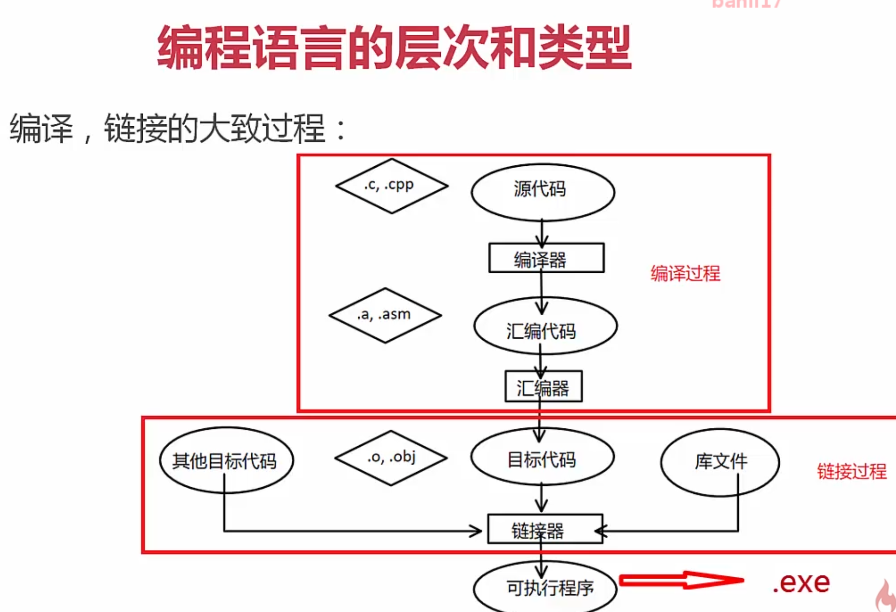
动态程序一般有两种实现方式，一是二进制方式，一是脚本方式。 二进制方式是先将我们编写的程序进行编译，变成机器可识别的指令代码（如.exe 文件），然后再执行。这种编译好的程序我们只能执行、使用，却看不到他的程序内容。脚本简单地说就是一条条的文字命令，这些文字命令是我们可以看到的（如可以用记事本打开查看、编辑），脚本程序在执行时，是由系统的一个解释器，将其一条条的翻译成机器可识别的指令，并按程序顺序执行。因为脚本在执行时多了一道翻译的过程，所以它比二进制程序执行效率要稍低一些。
script 的原意是“手写的，区别于印刷的东西”。即可修改。

### 2.2 数据类型


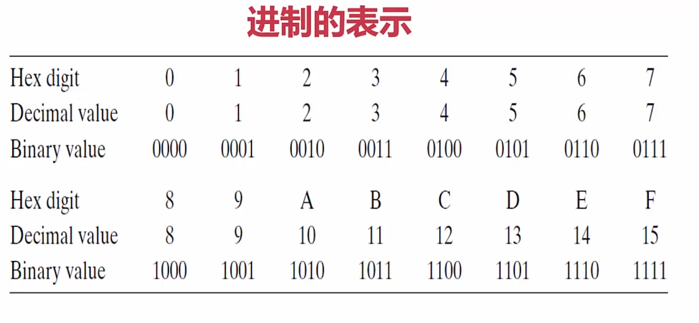


宽字节是用 2 个字节来表示一个字符。

### 标识符与关键字

标识符规则

- 开头：`[a-zA-Z_]`，后面可以是 `[a-zA-Z0-9_]`
- 不能数字开头、不能有 @ & %
- 区分大小写
- 不能用关键字，原则上长度不超过 32 位

常见的关键字
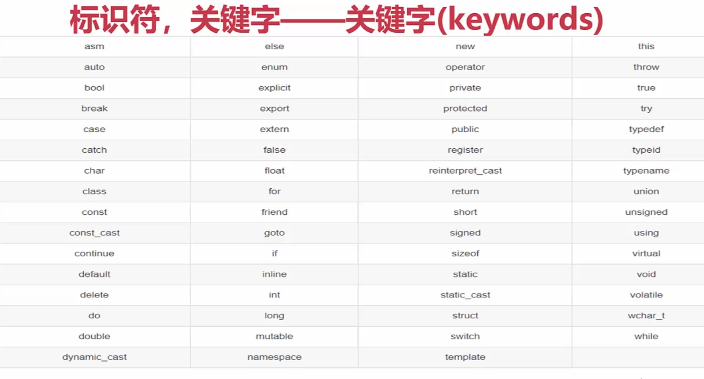

一些新的 keyword


所有 keyword: https://en.cppreference.com/w/cpp/keyword

原则：

- 符合团队项目规范
- 见名知意
- `min-length&max-infomation`原则
- 变量名采用名词或形容词+名词。避免出现数字，如 value1。函数采用动词+名词
- 命名法
  - 微软匈牙利命名法: int iMaxAge，首字母是类型缩写，后续为名称，名称的首字母大写
  - 驼峰 camel: int maxAge
  - pascal 命名法: int MaxAge

### 变量和常量

```
// 变量
int m = 1;
```

常量的定义方法：

- #define, 如 #define PI 3.14，(不推荐，编译期间不会报错)
- const, 如 const double PI = 3.14，(推荐，编译期间会报错)

- #define 和 const 的区别?

整数常量: 可以是十进制、八进制(0 开头)、十六进制(0x 或 0X 开头)的常量。
整数常量也可以带一个后缀，后缀是 U 和 L 的组合，U 表示无符号整数 unsigned，L 表示 long 长整数，后缀不区分大小写和顺序。


布尔常量

- true
- false

字符常量：单引号，
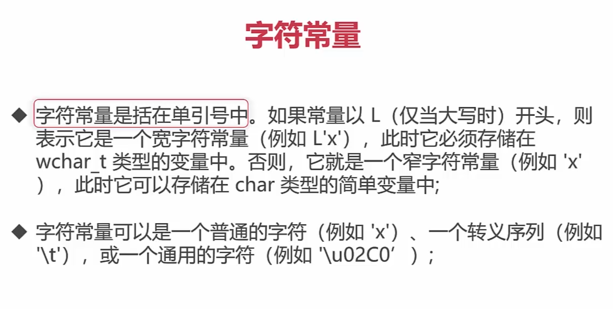
宽字符 2 个字节，没有 L 是一个字节
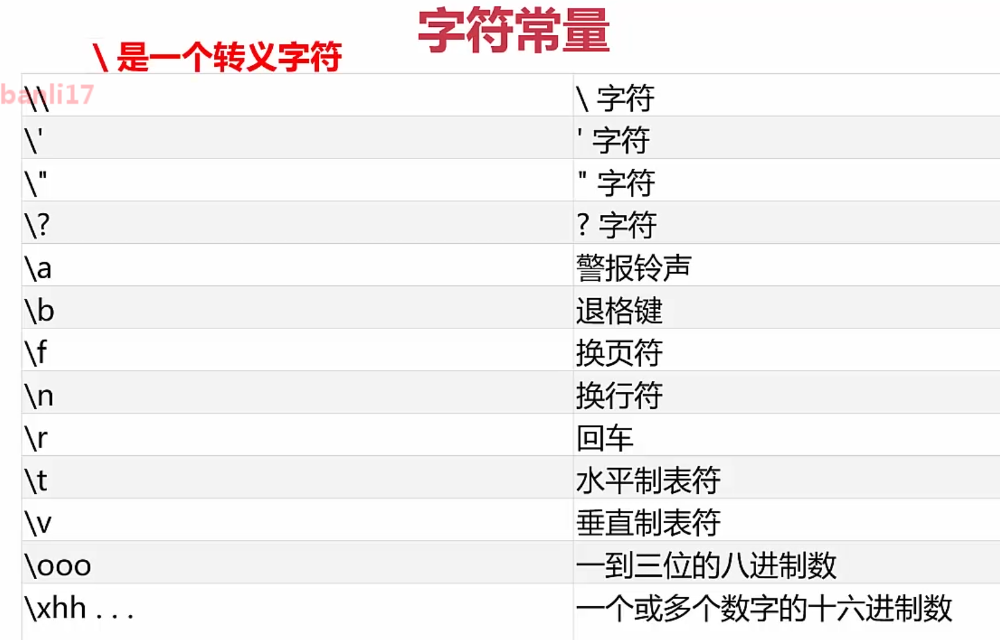

### 运算符表达式


算术运算符


## 3. C++的运算符与表达式

cout cin 在 iostream 库下，C++ 预定义了标准的输入输出流设备，键盘和屏幕。可以更改输入输出设备。endl 是换行。

```c++
#include "iostream"

using namespace std;  // 如果找不到的变量或方法，会在命名空间下查找
int main() {
    int a = -10;
    cout << a << endl;
    cout << "hello world";
}
```

### 3.2 - 3.7 运算符表达式


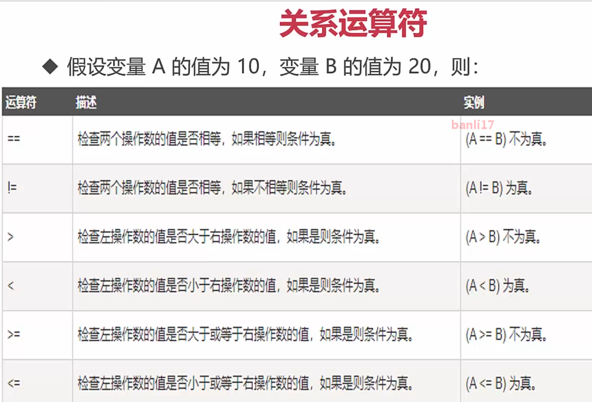


```c++
#include <assert.h>
```


^ 异或 ～非


sizeof 返回的是占用的大小，整数占 4 个字节。字符占一个字节。


结构体


### 3.8 注释

代码的解释、提高源代码的可读性
单行注释、多行注释，注释中的字符会被 C++ 编译器忽略。

```
//
/**/
```

在注释里使用 `//`或`/**/`，它只被作为注释内容。

1. 好的命名和代码本身就是最好的注释，无需添加额外的注释。注释并不是越多越好。
2. 重要复杂代码段，先写注释、再写代码，保证两者的一致性
3. 如果更新了代码，也相应更新注释

### 3.10 - 3.12 补码

无符号数在计算机中是以机器码存的。
有符号数，正数是机器码，负数是补码。

32 位计算机用 4 byte 来表示一个字符。

真值：就是 10 进制的数。
补码转真值的计算公式:
第一种方法：

```
10000001 -> -1 * 2^7 + ... + 1 * 2 ^ 0
```

第二种方法：
机器码的反码 +1，就是补码

内存查看器为了简化、方便表示，用了 16 进制来表示。

补码数值的范围：在 16 进制，有符号最大是 0x80000000(-2147483648)，最小是 0x7fffffff(2147483647)。

字节序的表示方法有 2 种：

- 大端法：大多数 IBM 机器(在内存中是正序)
- 小端法：Intel 兼容机(个人机器)(在内存中是倒序)

比如 10 的机器码是 00 00 00 0a，但在内存中是小端法表示的。


**关于位移操作的说明**

- 左移操作: 低位补 0
- 右移操作: 有符号数，移动有 2 种方式
  - 逻辑移位，最高位是补 0
  - 算术移位，负数最高位是补 1。
  - 因为不同的机器采用的方式可能不同，所以负数右移可能会产生 bug，应该避免负数右移

## 第 4 章 C++基础容器

### 4.1 - 4.5 数组


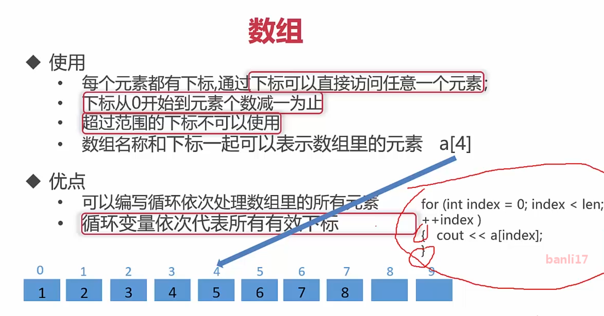

思考：x>=11 x<=21 有多少个数？转为左闭，右开的区间 [11, 22) ，然后作减法 22 - 11 = 11

所以 for 循环这样写：

```
for(int i = 0; i< 10;i++){}
```


数组越大，移动时间越长。

数组的访问： O(1)


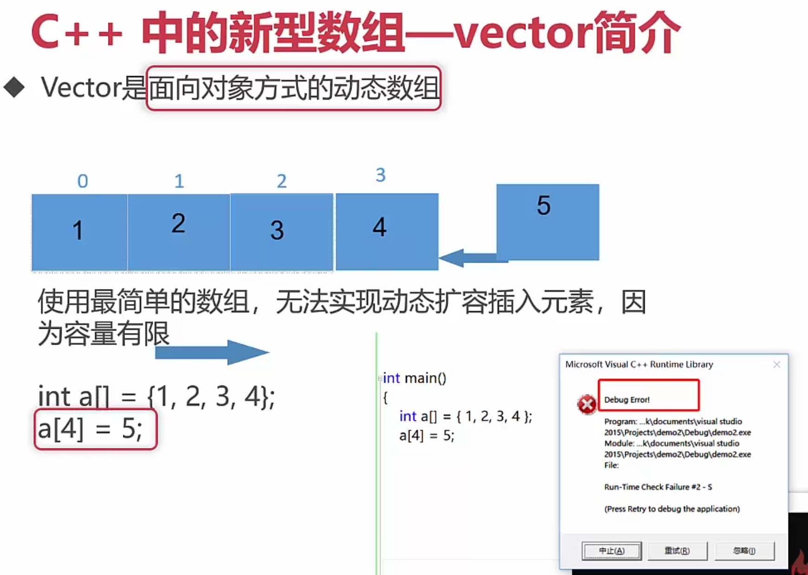
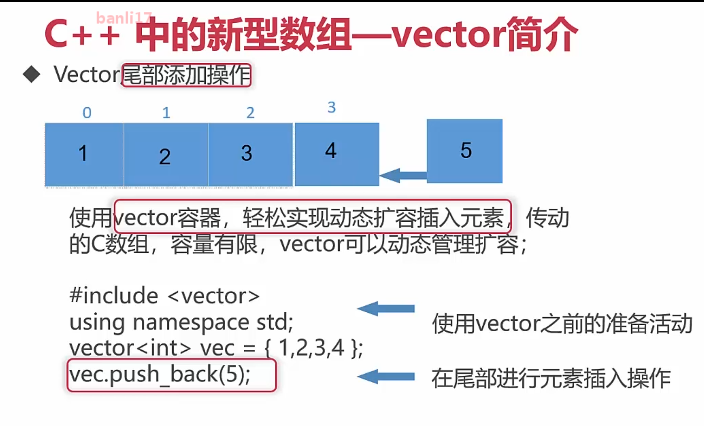


C、C++中没有提供 直接获取数组长度的函数，对于存放字符串的字符数组提供了一个 strlen 函数获取长度，那么对于其他类型的数组如何获取他们的长度呢？其中一种方法是使 用`sizeof(array) / sizeof(array[0])`, 在 C 语言中习惯上在 使用时都把它定义成一个宏，比如`#define GET_ARRAY_LEN(array,len) {len = (sizeof(array) / sizeof(array[0]));}` 。而在 C++中则可以使用模板 技术定义一个函数，比如：

```c++
template <class T>

int getArrayLen(T& array)

{
return (sizeof(array) / sizeof(array[0]));

}
```

若数组为存储 字符串的字符数组，则所求得的长度还需要减一,原因为存储字符串的字 符数组末尾有一个'\0'字符，需要去掉它。


插入元素：

```
vec.insert(vec.begin() + 1, 6) // 往 begin + 1 后插入，即第2个元素
vec.insert(vec.end(), 6)  // 往 end 前插入，即最后
```

end 是末尾+1 的位置，即结束符。

### 4.6 - 4.11 字符串

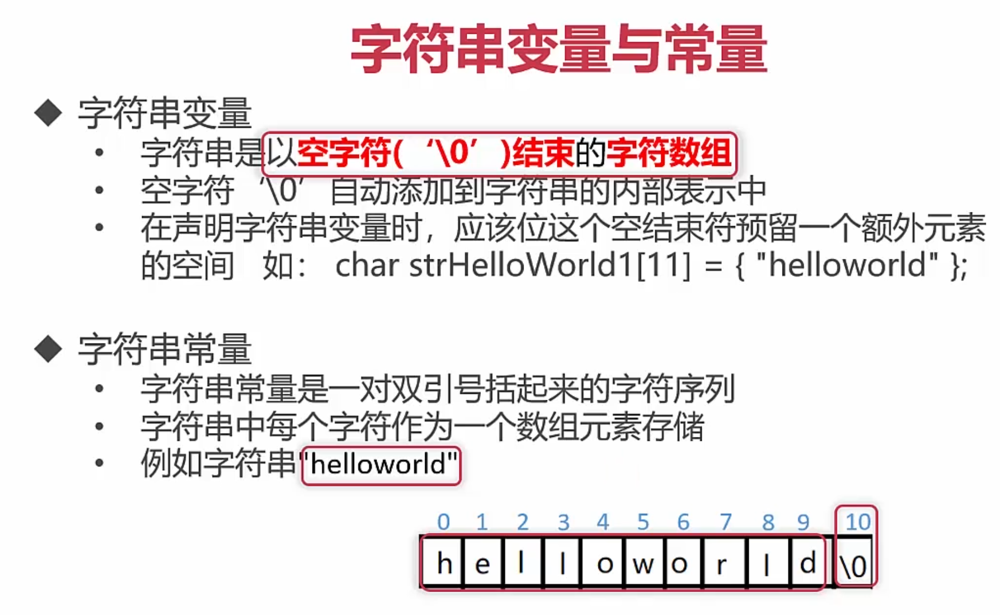


计算机硬件有两种储存数据的方式:大端字节序(big endian)和小端字节序(little endian)
utf8 是变长，1byte 表示字符，比如有些汉字用 2byte ，所以字节占用可能是： 1 2 1 。
utf16 用 2 个字节来表示，传输到另一台计算机中，不知道它的字节序。不好还原。
utf32 浪费空间了，大部分字都不需要 4 个字节。

编码知识


大端 FF FE 开头
小端 FE FF 开头


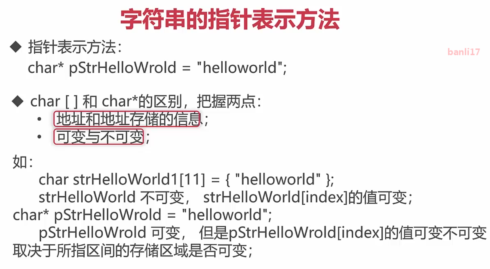
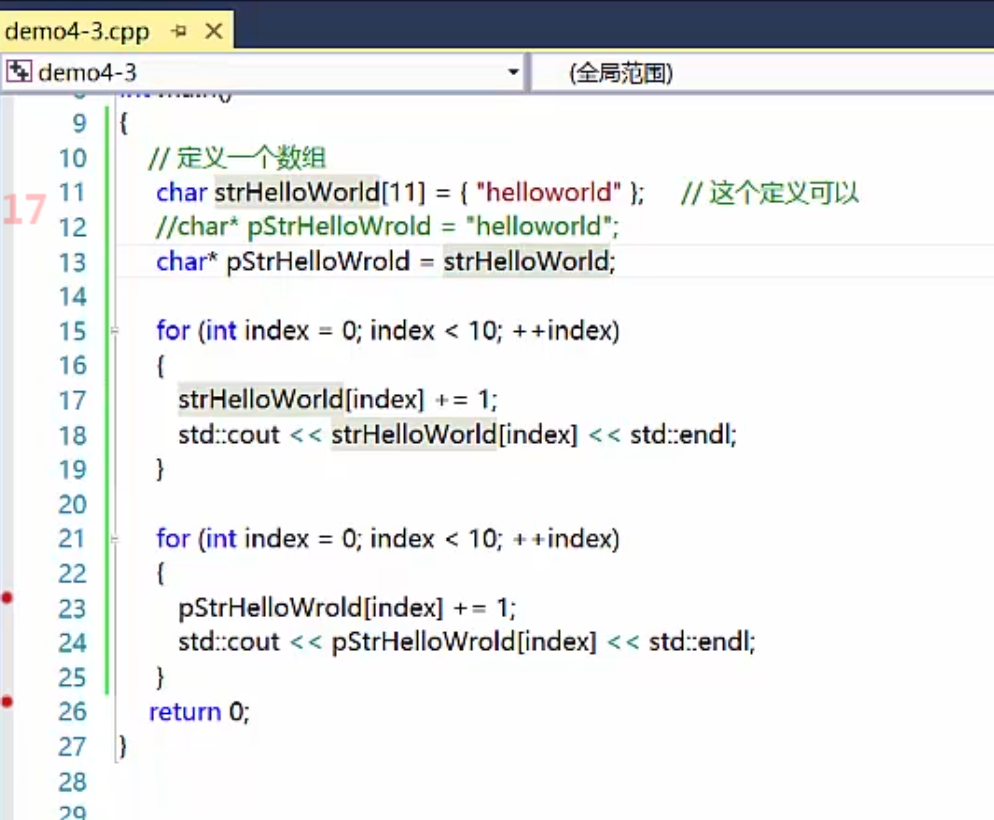


## 第 5 章 彻底学会 C++ 指针，引用

存储器系统是一个具有不同容量，成本和访问时间的存储设备的层次结构。


越往上，存储越小，速度越快，单价越贵。

CPU 高速缓存的容量比内存小的多但是交换速度却比内存要快得多。缓存的出现主要是为了解决 CPU 运算速度与内存读写速度不匹配的矛盾，因为 CPU 运算速度要比内存读写速度快很多，这样会使 CPU 花费很长时间等待数据到来或把数据写入内存。

当处理器发出内存访问请求时，会先查看缓存内是否有请求数据。如果存在（命中），则不经访问内存直接返回该数据；如果不存在（失效），则要先把内存中的相应数据载入缓存，再将其返回处理器。

**关于内存**

- 内存由很多内存单元组成，这些内存单元用于存放各种类型的数据。
- 计算机对内存的每个内存单元都进行了编号，这个编号就称为内存地址，地址决定了内存单元在内存中的位置。
- 记住这些内存单元地址不方便，于是 C++ 语言的编译器让我们通过名字来访问这些内存位置。

例如：

```c++
int a = 112, b = -1;
float c = 3.14;
int* d = &a;  // 存储的a的地址
float* e = &c;
```


指针就是一个变量，它存储的值是一个地址。`T*`表示类型为 T 的一个对象的地址。

通过指针访问它所指向地址的过程叫做间接访问或者指针引用。通过单目操作符`*` 来实现间接访问操作。

```c++
cout << *d << endl;  // 112
cout << *e << endl;  // 3.14
```

一个变量有 3 个重要信息需要存储：

- 变量值
- 变量地址
- 变量类型(存储在编译器中)

指针变量是一个专门用来记录变量地址的变量。通过指针变量可以间接访问另一个变量的值。

**`char a[]` 和 `char *p` 的区别**

1. 数据类型不同，一个是数组，一个是指针
2. sizeof 不同
3. a 和 &a 相同，p 和 &p 不同
4. 存储区域不同
5. a++ 无效，p++ 有效
6. 可读性


- https://www.geeksforgeeks.org/whats-difference-between-char-s-and-char-s-in-c/

**左值和右值**

左值：编译器为其单独分配了一块存储空间，可以取其地址的，左值可以放在赋值运算符左边。如函数或变量名字。比如`char *p`，在内存中实际上有一个指针存储空间。

右值：指的是数据本身，不能取到其自身地址，右值只能放在赋值运算符的右边。一般也叫临时对象。比如 `char a[]` 里的 a，不能放左边，编译器没有单独给它分配内存？

### 一般指针、指针数组和数组指针

一般指针 `T*`。 T 是一个泛型，泛型指任何一种类型。 如:

```cpp
int i = 4;
int *ip = &i;
cout << (*ip) << endl;
double d = 3.14;
double *dp = &d;
cout << (*dp) << endl;
char c = 'a';
char *cp = &c;
cout << (*cp) << endl;
```

- 指针数组(array of pointers): 每个元素都是指针，`T *t[]`。
- 数组指针(a pointer to an array): `T (*t)[]`。

如：

```cpp
int testPoint3() {
    // int	4 个字节	-2147483648 到2147483647
    double c[4] = {0x80000000, 0xFFFFFFFF, 0x00000000, 0x7FFFFFFF};
    double *a[4];
    double (*b)[4];
    b = &c;  // 这里数组个数需要匹配

    cout << a << endl;  // 0x7ffee962d4a0
    cout << sizeof(a) << endl;  // 32位 4个字节
    cout << sizeof(c) / sizeof(c[0]) << endl;

    for (unsigned int i = 0; i < sizeof(c) / sizeof(c[0]); i++) {
        a[i] = &c[i];
    }
    cout << 0x80000000 << endl;  // 2147483648
    cout << *(a[0]) << endl;  // 2.14748e+09
    cout << (*b)[3] << endl;  // 2.14748e+09
    return 0;
}
```

`[]` 优先级要比`*`高。

### const 与指针

const 修饰规则：看左边最近的部分，如果没有则看右边最近的。

```cpp
unsigned int MAX_LEN = 11;
char str[] = {"helloworld"};
char const* pStr1 = "helloworld";  // const char* 表示值不能修改
char* const pStr2 = str;          // 修饰指针 表示指向不能修改
char const* const pStr3 = "helloworld";

pStr1 = str;
//pStr2 = str;  pStr2不可改
//pStr3 = str;  pStr3不可改

unsigned int len = strnlen_s(pStr2, MAXLEN);
cout << len << endl;
for(unsigned int index= 0; index < len; index++){
  //pStr1[index] += 1;  pStr1 里的值不可改
  pStr2[index] += 1;
  //pStr3[index] += 1;  pStr3 里的值不可改
}
```

### 指向指针的指针

```cpp
int a = 10;
int *b = &a;
int **c = &b;
```

### 野指针

指针如果没有初始化，就不知道它指向哪里。在使用时可能会报错(定位到非法地址)或者覆盖本来正在使用的区域。比如：

```cpp
int *a;
*a = 12;
```

NULL 指针，没有指向任何区域的指针。

野指针：在开发中要避免野指针。野指针是：

1. 指针变量没有初始化
2. 使用完后没有设置为 NULL 的指针，如 delete 和 free 之后的指针。
3. 指针操作超越了变量的作用范围，如一块区域生命周期结束后(函数)，指针还指向它。

指针需要初始化(如果不知道初始化什么值，就设为 NULL)。在使用指针时，需要判断它是否是 NULL。

```cpp
int a = 12;
int *pa = NULL;
pa = &a;
if(pa != NULL){
  cout << (*pa) << endl;
}
pa = NULL;
```

## 第 6 章 C++基础句法

## 第 7 章 C++高级语法

## 第 8 章 C++编程思想

## 第 9 章 C++进阶编程

## 第 10 章 桌面应用项目实战：设计项目的架构和标准

## 第 11 章 实现项目《慕影》的通用组件模块

## 第 12 章 《慕影》播放器 UI 模块开发

## 第 13 章 实现《慕影》音视频模块开发

## 第 14 章 《慕影》播放器项目总结

## 15


## 问题

1. cMakeLists.txt 删除后，重新打开编辑器，执行第二个命令 `new cmake project from source`

```

```
