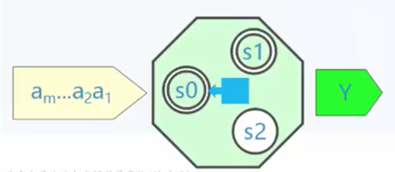

# 形式语言与自动机：有限状态机

## 句子识别

- 给定一个字符串，判断是否属于给定语法G的语言L(G)。
- 对于正则语法和正则语言，可以通过一个`识别机器`来判定。



字符串经过`识别机器`处理后，得到结果。

## 机器

- 机器可以理解为一个系统，接受输入，改变自身状态，产生输出。
- 状态指为了完成机器的任务而对输入序列进行的一种临时归类。
- 逐个接受字符的过程中，机器状态发生多次改变，最终停在某个状态，并产生输出。
- 如果对于所有的输入，机器状态的数目有限，就叫做有限状态机(FSM: finite state matchine)

## 有限状态机

有限状态机是一个五元组M(A, S, Y, S0, F)

- A: 输入字符串的字母表
- S: 机器的有限状态集合
- Y: 被称作`接受`的一些状态，属于集合 S
- S0: 初始状态，属于集合 S
- F: `S x A -> S` 状态转移函数，指明某个状态下接受输入字符所引起的状态变迁

例如：

```
A = {a, b}
S = {s0, s1, s2}, Y = {s0, s1}, s0 为初始状态
```

F 表如下


上面可以看到如果到 s2 状态，不管接受 a 还是 b 字符，都会一直陷入 s2 状态。所有 s0 和 s1 才是可接受状态 Y。而 s2 不是。

## 状态图

