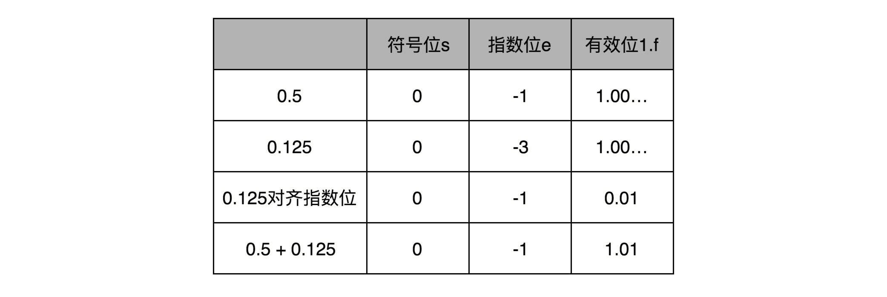

# 彻底弄懂 0.1 + 0.2 != 0.3

## 浮点数和定点数

浮点数的不确定性：指的是如 `0.1 + 0.2 != 0.3` 这样的问题。

```
>>> 0.1 + 0.2
0.30000000000000004
```

计算机通常用 32/64 个 bit 来表示一个数，如果用 32 bit，能表达 2 ^ 32 个不同的数，差不多 40 亿个，但是实数集合是无限多的，如何来尽量表示这么多的实数呢？

### 定点数表示法

0 - 9 的整数至少需要四个比特，32 个比特就可以表示 8 个这样的整数，如果将 6 个整数表示为整数部分，2 个整数表示为小数部分，这样就可以表示 0 - 999999.99 这样的一亿个实数。

这种用二进制来表示十进制的编码方式，叫做 BCD 编码（Binary-Coded Decimal），常用于超市、银行这样需要小数记录金额的情况里，因为超市金额的小数最多也就是分。

这样表示的缺点是：

1. 本来 32 位可以表示 40 亿个数，但是 BCD 编码只能表示 1 亿个。金额精确到分，也最多只能表示 100w。
2. 实际我们需要很大的数字，比如光速：`3 * 10^8`。

### 浮点数表示法

如何表示光速呢？32 个比特来表示数字只是空间层面的限制，我们可以用科学计数法来表示更大的数字。

浮点数的科学计数法有个 IEEE754 标准，定义了两种格式 float32(单精度) 和 float 64(双精度)。

单精度和双精度类似，先看单精度表示法。


单精度 32 位分为三个部分:

1. 符号位 s， 1 个 bit，0 表示正号，1 表示负号。
2. 指数位 e，8 个 bit。整数空间 0-255，这里用 1-254 映射到 -126-127 正负数上，没用 0 和 255，这样可以同时表示很大的数，也可以表示接近 0 的数。用 e 表示。
3. 有效位数 f，23 个 bit。

浮点数公式可以表示为： `(-1)^s * 1.f * 2^e`。

这里的公式无法表示出 0 、无穷大 或 NaN（0/0）这些特殊的数，所以用指数位 e 的 0 和 255 作标记位来表示。


以 0.5 为例，s = 0, f = 0, e = -1。即

```
-1^0 * 1.0 * 2^-1
```

注意 e 的偏移是 127，所以 -1，就是 (127 + -1) = 126。计算机里存储的就是：


在这样的浮点数表示下，不考虑符号，能表示的数的范围是 `1.17 * 10^-38` - `3.40 * 10^38`。

像这种表示法中，小数点的位置会随 e 的不同而变动，所以叫浮点数。对应的 BCD 编码中，小数点固定在一个位置，这叫做定点数。

思考：对于 BCD 编码的定点数，如果我们用 7 个比特来表示连续两位十进制数，也就是 00 ～ 99，是不是可以让 32 比特表示更大一点的数据范围？如果我们还需要表示负数，那么一个 32 比特的 BCD 编码，可以表示的数据范围是多大？

1 位符号位，3bit + 31/7 = 4 个整数
7999999.99

浮点数的二进制表示

以 9.1 为例：要变成 `s + e + f` 的组合。

1. 整数部分 9 位 1001。公式是`除以 2 看余数`。

```
9/2 = 4 余 1
4/2 = 2 余 0
2/2 = 1 余 0
1/2 = 0 余 1
```

2. 小数部分 0.1 转换公式和整数相反，为`乘以二，看是否超过1，超过则记录1，并将结果减去1，否则记录 0，进一步循环`：

```
0.1 * 2 = 0.2 -> 0
0.2 * 2 = 0.4 -> 0
0.4 * 2 = 0.8 -> 0
0.8 * 2 = 1.6 减去1 -> 1
0.6 * 2 = 1.2 减去1 -> 1
0.2 * 2 = 0.4 -> 0 和第二行一样，开始循环了

所以是 0 0011 0011...
```

9.1 整数部分和小数部分拼接在一起二进制表示就是 1001.0 0011 0011....。

然后使用浮点数表示法，需要转换为 1.f，也就是小数点左移 3 位，如下：

```
-1^0 * 1.001 0 0011 0011... * 2^3
```

s 为 0，由于 f 只有最多 23 位，所以需要截断，即 f = 0010 0011 0011 00110011 001。而指数 e = 3 实际上会映射为 130(偏移量 127 + 3 = 130)，二进制表示为 10000010。

对应的计算机中存储为：


所以 9.1 的二进制表示为 010000010 0010 0011001100110011 001。

再将这个浮点数转换为十进制。实际得到的值为 9.09999942779541015625。

```
010000010 0010 0011001100110011 001
1001.0 0011001100110011 001
1 * 2 ^ -4

let a = '00011001100110011001'
let b= 0
a.split('').forEach((item, i)=>{
    if(item == 1){
        b += Math.pow(2, -1 + i * -1)
    }
})
console.log(b)  // 0.09999942779541016
```

浮点数加法和精度损失
浮点数加法的原理是：先对齐指数位，再计算。



32 位浮点数有效长度位 23 位，如果两个数的指数位差出了 23 位，较小的数右移 24 位后，所有的有效位都丢失了，也就是说计算过程中两个数差了 2 ^ 24 (1600 万)后，这两个数相加，结果完全不会变化。

```java
public class FloatPrecision {
  public static void main(String[] args) {
    float a = 20000000.0f;
    float b = 1.0f;
    float c = a + b;
    System.out.println("c is " + c);
    float d = c - a;
    System.out.println("d is " + d);
  }
}

c is 2.0E7
d is 0.0
```

上面代码中，java 32 位浮点数相加小的数全部损失了。

Kahan Summation 算法

工程中，一般数积少成多的计算中，小的数会全部丢失。

```
public class FloatPrecision {
  public static void main(String[] args) {
    float sum = 0.0f;
    for (int i = 0; i < 20000000; i++) {
    	float x = 1.0f;
    	sum += x;
    }
    System.out.println("sum is " + sum);
  }
}
sum is 1.6777216E7
```

上面代码中，当累计到 1600w 后，再相加，小数就直接忽略了。

为了解决这个问题。科学家想出了 Kahan Summation 算法。

```java
public class KahanSummation {
  public static void main(String[] args) {
    float sum = 0.0f;
    float c = 0.0f;
    for (int i = 0; i < 20000000; i++) {
    	float x = 1.0f;
    	float y = x - c;
    	float t = sum + y;
    	c = (t-sum)-y;
    	sum = t;
    }
    System.out.println("sum is " + sum);
  }
}

sum is 2.0E7
```

就是在每次的计算过程中，都用一次减法，把当前加法计算中损失的精度记录下来，然后在后面的循环中，把这个精度损失放在要加的小数上，再做一次运算。

再实践应用中，需要精确的金额，一般会用定点数类型来存储。比如 MySQL 里的 `decimal(12,2)`。如果用浮点数表示，金额相加时会损失掉。

浮点数适合用于不需要精确计算结果的情况，比如距离。

对于 64 位浮点数的加法，两个数相差多少的情况后，较小的哪个数在加法过程中会完全丢失呢？2^ 54。

注：js 里是 64 位精度。
