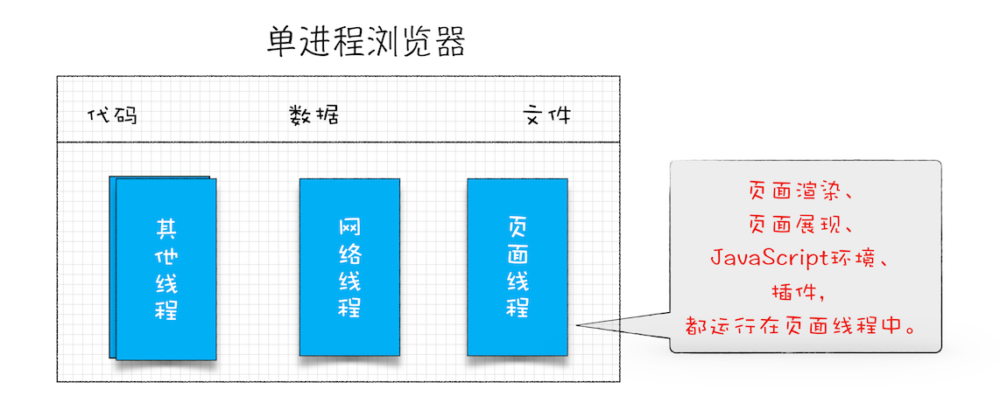
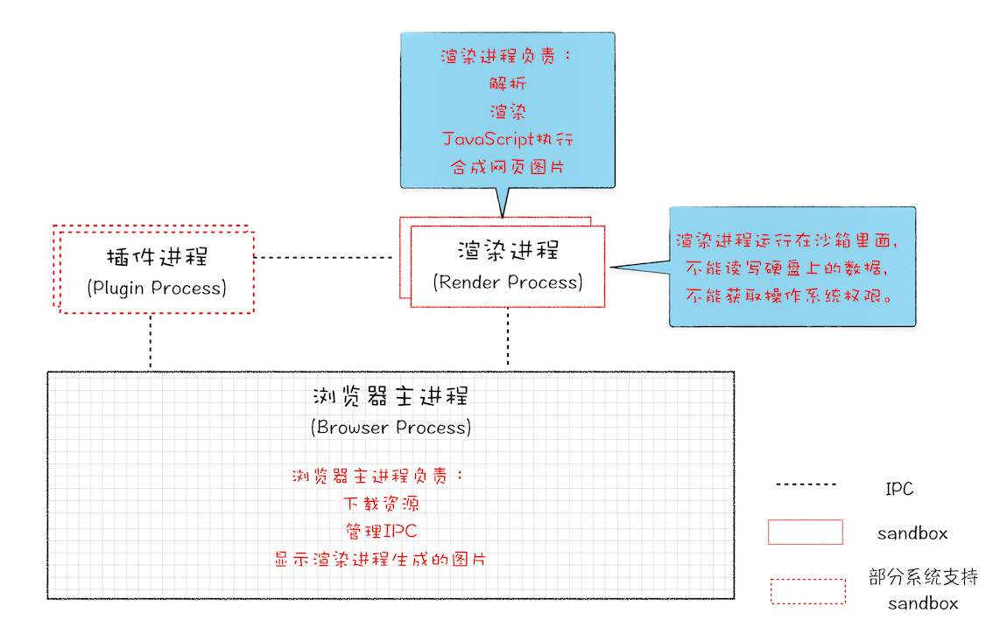
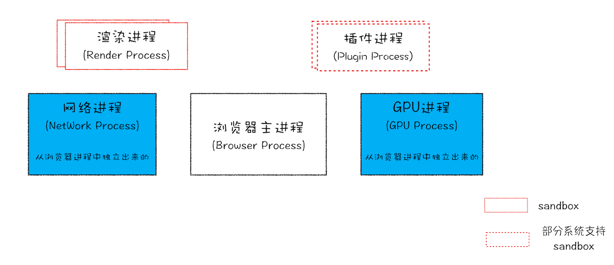

# Chrome 架构

## 什么是进程、线程

- 进程是程序的运行实例。在程序启动时，操作系统给程序分配的一块内存，用来存放代码、运行中的数据和一个执行任务的主线程。这样一个运行环境叫做进程。
- 线程是用来执行任务的，它不能独立存在，必须由进程来启动和管理。

> 进程可以使用多线程（多核下有效，单核会增加切片时间会慢）来提高运算效率。

进程与线程的特点：

- 进程中一个线程出错，会导致整个进程崩溃。
- 线程之间共享进程的数据。
- 当一个进程关闭后，操作系统会回收进程所占用的内存。
- 进程之间是相互隔离的，一个挂了不影响另一个。之间数据通信需要使用 IPC 的机制。

## 浏览器模型发展史

### 单进程模型

单进程浏览器是指浏览器的所有功能模块都是运行在同一个进程里。

单进程浏览器存在的问题是：

- 不稳定，一个线程出错，就导致进程崩溃。
- 不流畅
  - 如果只有一个线程，死循环时，其它的任务都要等待。
  - 页面的内存泄漏，积累越多后会导致浏览器越来越慢
- 不安全，插件或页面代码能使用主进程数据，对系统进行操作,，直接控制电脑。因为主进程不可能隔离，这样浏览器就不能读写系统了。另外，其它页面的内容，如果是在写邮件，也没了。

### 早期多进程模型

- 解决不稳定，因为进程是隔离的，互不影响
- 解决不流畅，即使 js 阻塞，也不影响浏览器和其它页面，死循环只影响当前 tab
- 解决不安全，使用安全沙箱，给渲染进程和插件进程上锁。无法获取系统权限。

### 当前多进程模型

- 浏览器主进程： 负责界面显示，用户交互，子进程管理，存储
- 渲染进程: 负责 html css js 转成网页，排版引擎 blink 和 js 引擎 v8 都在这，默认情况下，每个 tab 会创建一个渲染进程。同一个站点如,x.y.com z.y.com 新页面会复用同一个进程，因为有时需要共享 js 执行环境。iframe 也会新开进程。
- 插件进程
- 网络进程
- GPU 进程：初衷是实现 css 3d，后来用来绘制 UI 界面
- v8 代理解析工具进程： chrome 支持使用 js 写连接代理的脚本，也称为在线 pac 代理脚本，这个进程叫 Utility: V8 Proxy Resolver。
- Audio 服务进程，对所有页面提供基础服务。

缺点：

- 更高的资源占用
- 更复杂的体系架构：耦合高、扩展性差

### 面向服务的模型

2016 年 chrome 官方提出了“面向服务的架构”（Services Oriented Architecture，简称 SOA）。

- 面向服务的架构，将原来的模块重构成服务，每个服务定义好接口，通过 IPC 来通信，从而内聚，松耦合，易于维护和扩展

- 此外，chrome 还提供了灵活的弹性架构，在资源受限制的设备上，会将多个服务整合到一个进程，节省内存。
  
