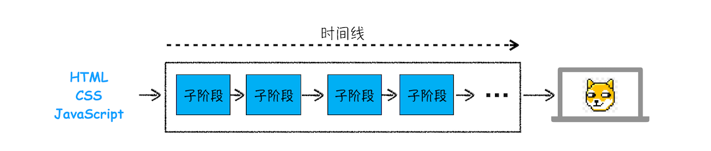
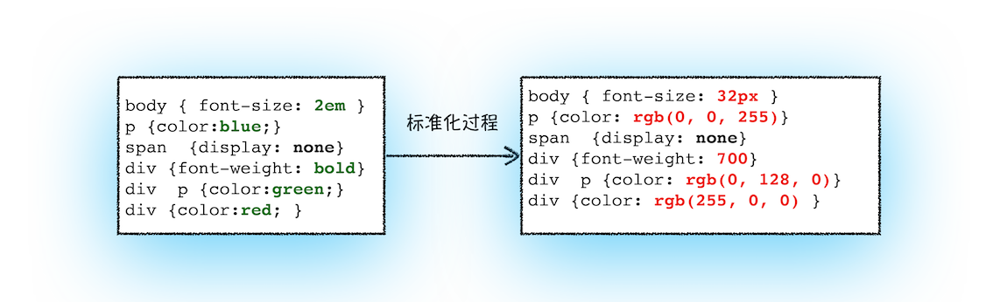
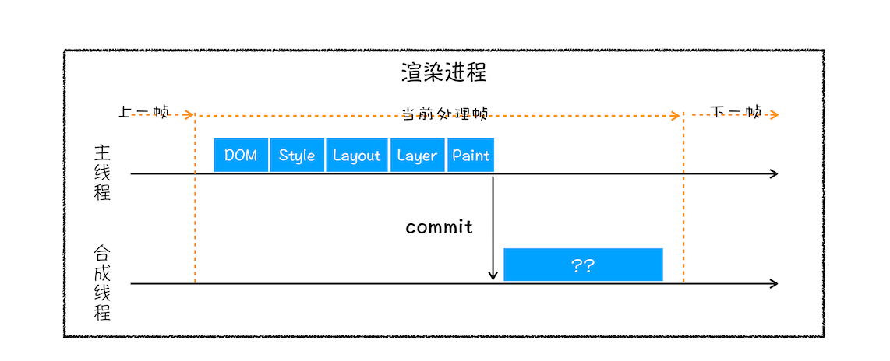
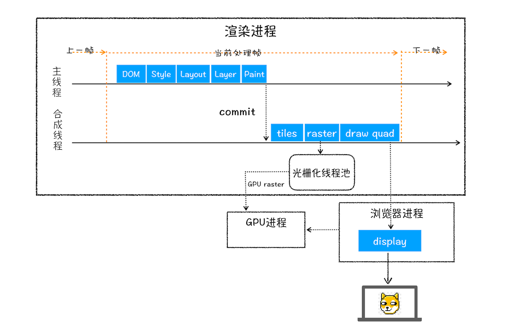

# 从输入 URL 到页面展示

从输入 URL 到页面展示 分为 5 个阶段

1. 根据用户输入生成 URL
2. 发起请求
3. 准备渲染进程
4. 提交文档
5. 渲染页面

## 用户输入

- 合成 URL
  - 不是 URL: 和浏览器默认搜索引擎合成 URL。
  - 是 URL: 加协议等，合成完整的 URL。
- 回车
  - 询问 beforeunload，如果否，则取消导航
  - 标签页图标变成加载状态，但是页面内容不变。

## URL 请求过程

- 浏览器进程把 URL 发给网络进程
- 网络进程查找本地缓存，没有则发起网络请
  - DNS 解析
  - 如果是 HTTPS 还要建立 TLS
  - 建立 TCP 连接
- 网络进程收到响应行和响应头开始解析
  - 处理状态码
    - 重定向： 301 或 302，读 Location，重新导航请求
    - 200 浏览器继续处理请求
  - 根据 Content-Type 选择解析方式
    - Content-Type: 响应体数据是什么类型
      - `application/octet-stream`: 字节流，按下载类型处理，同时该 url 请求导航流程结束
      - `text/html`: 继续导航

## 准备渲染进程

通常一个标签会新开一个渲染进程，而从页面链接打开（点击左键，而右键会新开渲染进程)，且是同一站点(`same-site`，即域名相同)，就会复用父页面的渲染进程。这个原则叫`process-per-site-instance`。另外，使用 `noopener noreferrer`新打开的子窗口会新开渲染进程，因为它不需要访问父窗口的任何内容，这是为了防止一些钓鱼网站窃取父窗口的信息。

## 提交文档

提交文档是指浏览器进程将网络进程接收到的 HTML 数据提交给渲染进程。

- 网络进程将请求头发给浏览器进程后，浏览器进程会发送"提交导航"消息到渲染进程。
- 渲染进程收到消息后，会和网络进程建立连接，网络进程将文档数据发送给渲染进程。
- 渲染进程收到文档数据后，渲染进程会返回"确认提交"的消息给浏览器进程。
- 浏览器进程更新安全状态、历史记录前进后退、地址栏 URL、更新页面。

更新页面就来到了 渲染阶段。

## 渲染阶段

按照渲染的时间顺序，流水线可分为如下几个子阶段：构建 DOM 树、样式计算、布局阶段、分层、绘制、分块、光栅化和合成。

### 构建 DOM 树

浏览器将 HTML 转成 DOM 树。这样是为了后续方便操作和 js 也可以操作它。

### 样式计算

样式计算的目的是为了计算出 DOM 节点中每个元素的具体样式，这个阶段大体分为三步。

1. 把 CSS 代码转换成浏览器能理解的结构 styleSheets，CSS 样式来源有：`link标签`、`style 标签`、`内嵌 style 样式`。
2. 标准化样式表中的属性。因为 CSS 文本的属性值多种多样，不容易解析，所以需要标准化。
   
3. 计算出 DOM 树中每个节点的具体样式。这里涉及到样式的继承与层叠。

### 布局阶段

布局是计算出的 DOM 树中可见元素的位置。它的任务是创建布局树和布局计算。

**1. 创建布局树**

- 它会遍历 DOM 树中的所有可见节点，并加入到布局树中。
- 不可见的节点会被布局树忽略掉。

**2. 布局计算**

得到布局树后，就要计算每个节点的坐标位置了。

### 分层

页面中有很多复杂的效果，如一些复杂的 3D 变换、页面滚动，或者使用 z-indexing 做 z 轴排序等，为了更加方便地实现这些效果，渲染引擎还需要为特定的节点生成专用的图层，并生成一棵对应的图层树（LayerTree）。

通常情况下，并不是布局树的每个节点都包含一个图层，如果一个节点没有对应的层，那么这个节点就从属于父节点的图层。

下面情况会提升为一个单独图层。

1. 拥有层叠上下文属性的元素会被提升为单独的一层。如：z-index、opacity、css 滤镜 等。
   
2. 需要裁切的地方也会被创建图层。比如溢出滚动条。
   

### 图层绘制

渲染引擎实现图层的绘制，会把一个图层的绘制拆分成很多小的绘制指令。

### 分块与光栅化

绘制列表只是用来记录绘制顺序和绘制指令的列表，而实际上绘制操作是由渲染引擎中的合成线程来完成的。

当图层的绘制列表准备好之后，主线程会把该绘制列表提交（commit）给合成线程。

1. 由于可视区域外的图层是可以不绘制的，合成线程会将图层划分为图块（tile），这些图块的大小通常是 256x256 或者 512x512。
2. 然后合成线程会按照视口附近的图块来优先生成位图，实际生成位图的操作是由栅格化来执行的。所谓栅格化，是指将图块转换为位图。渲染进程维护了一个栅格化的线程池，所有的图块栅格化都是在线程池内执行的。通常，栅格化过程都会使用 GPU 来加速生成，使用 GPU 生成位图的过程叫快速栅格化，或者 GPU 栅格化，生成的位图被保存在 GPU 内存中。

### 合成与显示

1. 一旦所有图块都被光栅化，合成线程就会生成一个绘制图块的命令——“DrawQuad”，然后将该命令提交给浏览器进程。
2. 浏览器进程里面有一个叫 viz 的组件，用来接收合成线程发过来的 DrawQuad 命令，然后根据 DrawQuad 命令，将其页面内容绘制到内存中，最后再将内存显示在屏幕上。

### 渲染流程总结

结合上图，一个完整的渲染流程大致可总结为如下：

- 渲染进程将 HTML 内容转换为能够读懂的 DOM 树结构。
- 渲染引擎将 CSS 样式表转化为浏览器可以理解的 styleSheets，计算出 DOM 节点的样式。
- 创建布局树，并计算元素的布局信息。
- 对布局树进行分层，并生成分层树。
- 为每个图层生成绘制列表，并将其提交到合成线程。
- 合成线程将图层分成图块，并在光栅化线程池中将图块转换成位图。
- 合成线程发送绘制图块命令 DrawQuad 给浏览器进程。
- 浏览器进程根据 DrawQuad 消息生成页面，并显示到显示器上。

## 参考资料

- [https://developers.google.com/web/updates/2018/09/inside-browser-part1](https://developers.google.com/web/updates/2018/09/inside-browser-part1)
- [https://developers.google.com/web/updates/2018/09/inside-browser-part2](https://developers.google.com/web/updates/2018/09/inside-browser-part2)
