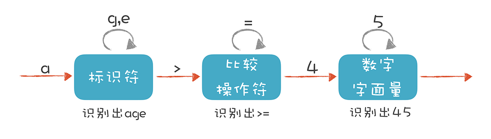
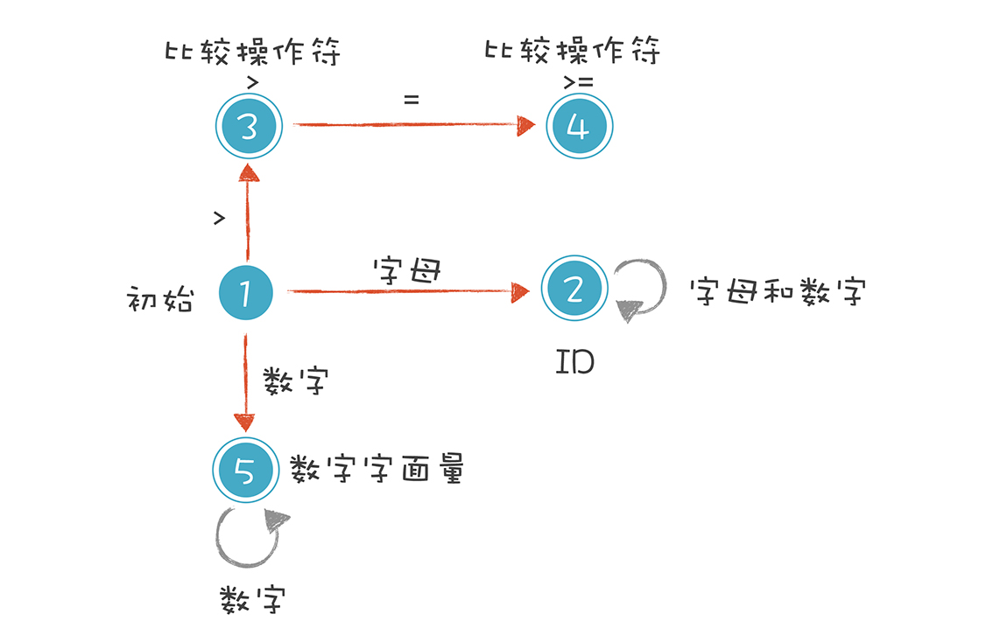
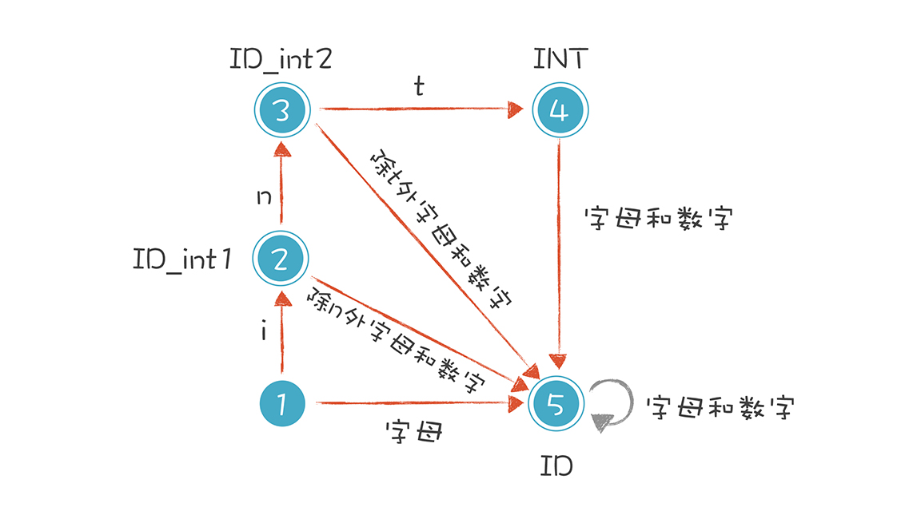

# 编译原理

## 编译程序总体结构

**翻译程序**
一种语言的程序（源程序）翻译成等价的另一种语言程序（目标程序）

源程序是高级语言程序，目标程序是汇编或机器程序。

**解释程序**
源程序一句一句输入，翻译成目标程序

**编译程序**
源程序全部一次翻译成目标程序。

**编译系统**
编译系统 = 编译程序 + 运行系统（为程序运行提供环境，如运行库、链接等）

**其它翻译程序**

- 汇编 ： 汇编-》机器
- 反汇编
- 交叉编译： 电脑上写的程序编译成 手机程序。


## 词法分析

词法分析 (lexical-analyser) 由词法分析器完成，词法分析器一个个扫描源程序的字符，输出一个个 Token。

Token 的规则可以通过正则表达式确立。依据这些规则，可以构造有限自动机。

比如 `age >= 45` 这条语句，有三种 Token 词法规则：



- **标识符**: 第一个字符必须是字母，后面字符可以是字母或数字。
- **比较操作符**: `>` 或 `>=`。
- **数字字面量**: `45`。

有限自动机如下图。



```ts
Identifier  age
GE          >=
IntLiteral  45
```

上面这三种 Token 词法规则，可以使用正则表达式描述。

```ts
Identifier  [a-zA-Z_][a-zA-Z_0-9]*
IntLiteral  [0-9]+
GE           '>='
GT           '>'
```

如果需要解析 `int age = 40`，会遇到标识符和关键字规则的冲突。

上面，关键字 int 也满足 Identifier 的规则。

```ts
Int         int
Identifier  [a-zA-Z_][a-zA-Z_0-9]*
Assignment  '='
```

这种情况下，显然 int 关键字的规则，比标识符的规则优先级高。有限自动机可以修改成下面的样子，以解决关键字和标识符的冲突。



如何写好有限自动机：

1. 确定好所有的状态，和状态的转移。
2. 发射 Token 后，状态机恢复初始状态。

模版如下：

```ts
const States = {
  Initial: 1,
  Identifier: 2,
  GE: 3,
};

const state = States.Initial;
let token = {
  type: state,
  value: "",
};

let tokens = [];

function parse(source) {
  let i = 0;
  let len = source.length;

  while (i < len) {
    const ch = source[i];
    nextToken(ch);
    i++;
  }
}

function nextToken(ch) {
  if (state === States.Initial) {
    // 初始状态
    if (isAlpha(ch)) {
      state = States.Identifier;
      token.value += ch;
      nextToken(ch);
    } else {
      //...
    }
  } else if (state === States.Identifier) {
    if (isAlpha(ch)) {
      token.value += ch;
    } else {
      emitToken(ch);
    }
  }
  // ...
}

function emitToken(ch) {
  tokens.push(token);
  state = States.Initial; // 初始化状态

  if (ch) {
    nextToken(ch); // 注意这里，发射 token 时，当前 ch 需要继续处理
  }
}
```

从性能的角度，词法分析可以用查表的方法实现状态迁移。在每个状态，接收什么字符，切换到另外的状态。那样更快，这是常用的方法。

不光词法分析可以这么做，语法分析也可以。基于表驱动。这时候，最重要的是构造那张表。

## 语法分析

