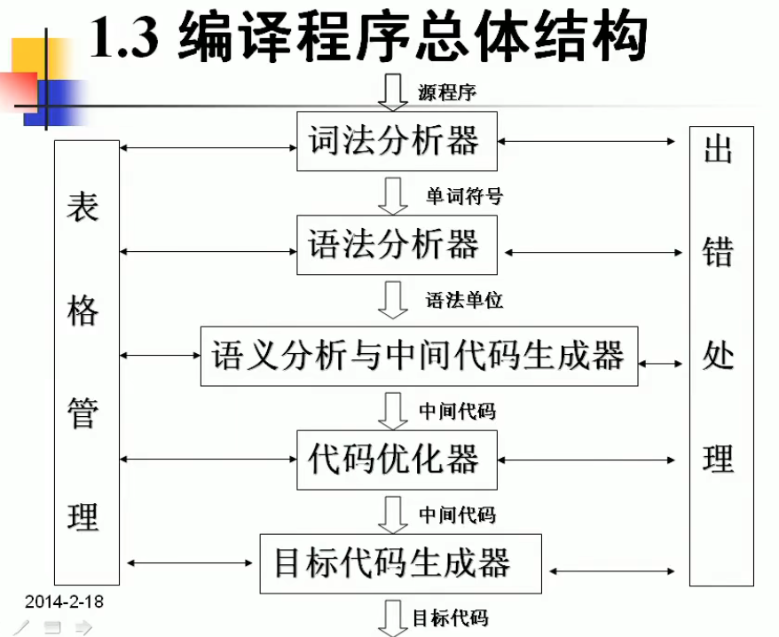

# 编译原理

## 编译程序总体结构

**翻译程序**
一种语言的程序（源程序）翻译成等价的另一种语言程序（目标程序）

源程序是高级语言程序，目标程序是汇编或机器程序。

**解释程序**
源程序一句一句输入，翻译成目标程序

**编译程序**
源程序全部一次翻译成目标程序。

**编译系统**
编译系统 = 编译程序 + 运行系统（为程序运行提供环境，如运行库、链接等）

**其它翻译程序**
- 汇编 ： 汇编-》机器
- 反汇编
- 交叉编译： 电脑上写的程序编译成 手机程序。

## 词法分析

为了语法分析，需要把单词进行归类。

比如描述赋值语句： 标识符 + 赋值号 就是赋值语句

词法分析由词法分析器 ( Lexical Analyzer, 或 Scanner）完成。
词法分析器一个个扫描字符，输出一个个 token。