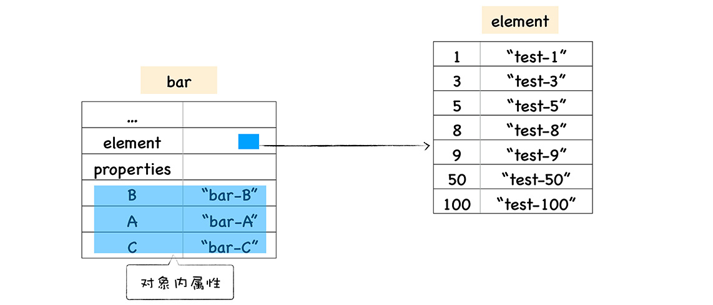

# 图解 v8 学习笔记

## 快慢属性

js 对象像一个字典，但是 v8 实现对象存储并没有完全按字典实现。字典是非线性结构，查找速度比线性结构慢。

它有两类属性，elements 排序属性, properties 常规属性。

事实上，这是为了满足 ECMA 规范 要求所进行的设计。按照规范中的描述，可索引的属性应该按照索引值大小升序排列，而命名属性根据创建的顺序升序排列。

存储在线性结构里的属性叫快属性，非线性结构里的属性叫慢属性。

数字类型属性会排序放在 elements 里，是线性存储，查找快，添加删除慢。字符串属性按照添加顺序放在 properties 里，是字典存储，它虽然降低了查找速度，但是提高了增删速度。

这样每次会多访问一层 elements 或 properties，为了提高访问速度，v8 会将前 n 个属性直接作为对象内属性存储。如果没有多余属性，就不会生成 properties 属性,对象内属性数量取决于初始对象大小。

实践: 给一个对象添加数字属性和常规属性，查看 chrome 浏览器中常规属性少于 10 个，多余 10 个时的内存图。

为什么不推荐 delete 属性？
删除后可能导致重新生成内部属性

Just do:

user.password = undefined;
instead of:

delete user.password;
