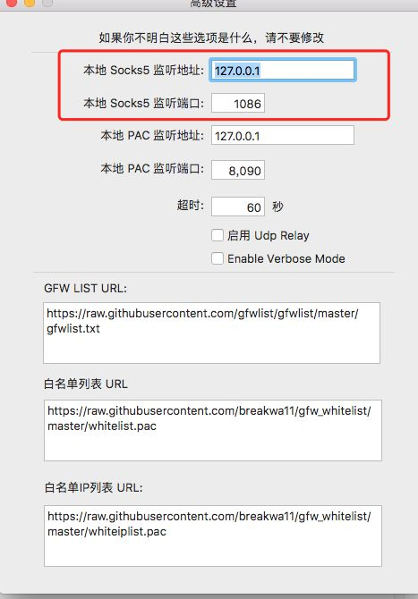

# Git

## 如何做 git 操作

```
master |    dev     | release
不操作    dev/0.0.1
								       release打tag0.0.1
				 dev/0.0.2
```

1. fork 到你的分支
2. git clone 到本地
3. 切换到新分支，git checkout -b 新分支
4. 修改代码, git add 和 git commit
5. git pull
6. git push
7. 发起 pr，合并 commit 到主仓库
8. codereview, 创建 tags 并删除开发分支

## 常见问题

### Failed to connect to 127.0.0.1 port 1081 after 2074 ms: Connection refused

https://juejin.cn/post/6999811900368224263

https://www.ipaddress.com/site/github.com

C:\Windows\System32\drivers\etc\hosts

### git clone 或 push 慢、卡住 ?

1. 首先查看自己 socks5 的端口号
2. 

3. 我这里记下来是 127.0.0.1:1086



3. 然后输入命令

```bash
git config --global http.https://github.com.proxy socks5://127.0.0.1:1086
git config --global https.https://github.com.proxy socks5://127.0.0.1:1086
```

> 参考 https://www.zhihu.com/question/27159393/answer/141047266

**另外对于 http 代理**

只对 github 进行代理，对国内的仓库不影响。

```bash
git config --global http.https://github.com.proxy https://127.0.0.1:1080
git config --global https.https://github.com.proxy https://127.0.0.1:1080
```

同时，如果在输入这条命令之前，已经输入全局代理的话，可以输入进行取消

```bash
git config --global --unset http.proxy
git config --global --unset https.proxy
```

### windows 配置 github ssh key 问题

```sh
Admin@PS2021WJVPMNZO MINGW64 /d
$ git clone git@github.com:banli17/course-ts.git
Cloning into 'course-ts'...
kex_exchange_identification: Connection closed by remote host
Connection closed by UNKNOWN port 65535
fatal: Could not read from remote repository.

Please make sure you have the correct access rights
and the repository exists.

Admin@PS2021WJVPMNZO MINGW64 /d
$ ssh -T git@github.com
@@@@@@@@@@@@@@@@@@@@@@@@@@@@@@@@@@@@@@@@@@@@@@@@@@@@@@@@@@@
@ WARNING: REMOTE HOST IDENTIFICATION HAS CHANGED! @
@@@@@@@@@@@@@@@@@@@@@@@@@@@@@@@@@@@@@@@@@@@@@@@@@@@@@@@@@@@
IT IS POSSIBLE THAT SOMEONE IS DOING SOMETHING NASTY!
Someone could be eavesdropping on you right now (man-in-the-middle attack)!
It is also possible that a host key has just been changed.
The fingerprint for the RSA key sent by the remote host is
SHA256:rEmlJenVMSL5GVemSY0Gk8WGw6B4ege4J85M+vup8R0.
Please contact your system administrator.
Add correct host key in /c/Users/Admin/.ssh/known_hosts to get rid of this message.
Offending ED25519 key in /c/Users/Admin/.ssh/known_hosts:5
Host key for github.com has changed and you have requested strict checking.
Host key verification failed.

Admin@PS2021WJVPMNZO MINGW64 /d
$ ssh -T git@github.com
The authenticity of host 'github.com (223.75.236.241)' can't be established.
RSA key fingerprint is SHA256:rEmlJenVMSL5GVemSY0Gk8W.
This key is not known by any other names
Are you sure you want to continue connecting (yes/no/[fingerprint])? yes
Warning: Permanently added 'github.com' (RSA) to the list of known hosts.
git@github.com: Permission denied (publickey,password,keyboard-interactive).

Admin@PS2021WJVPMNZO MINGW64 /d
$ git clone git@github.com:banli17/course-ts.git
Cloning into 'course-ts'...
git@github.com: Permission denied (publickey,password,keyboard-interactive).
fatal: Could not read from remote repository.

Please make sure you have the correct access rights
and the repository exists.

Admin@PS2021WJVPMNZO MINGW64 /d
$ git clone git@github.com:banli17/course-ts.git
Cloning into 'course-ts'...
git@github.com: Permission denied (publickey,password,keyboard-interactive).
fatal: Could not read from remote repository.

Please make sure you have the correct access rights
and the repository exists.

Admin@PS2021WJVPMNZO MINGW64 /d
$ ssh-keygen -t rsa -C "8xx@qq.com" -f ~/.ssh/id_rsa_github
Generating public/private rsa key pair.
/c/Users/Admin/.ssh/id_rsa_github already exists.
Overwrite (y/n)? y
Enter passphrase (empty for no passphrase):
Enter same passphrase again:
Your identification has been saved in /c/Users/Admin/.ssh/id_rsa_github
Your public key has been saved in /c/Users/Admin/.ssh/id_rsa_github.pub
The key fingerprint is:
SHA256:xFo9Hgs7BEjCfEq 8xx@qq.com
The key's randomart image is:
+---[RSA 3072]----+
| +o=... |
|.o%.o o . |
+----[SHA256]-----+

Admin@PS2021WJVPMNZO MINGW64 /d
$ git clone git@github.com:banli17/course-ts.git
Cloning into 'course-ts'...
git@github.com: Permission denied (publickey,password,keyboard-interactive).
fatal: Could not read from remote repository.

Please make sure you have the correct access rights
and the repository exists.

Admin@PS2021WJVPMNZO MINGW64 /d
$ ssh -T git@github.com
git@github.com: Permission denied (publickey,password,keyboard-interactive).

Admin@PS2021WJVPMNZO MINGW64 /d
$ ^C

Admin@PS2021WJVPMNZO MINGW64 /d
$ git@github.com: Permission denied (publickey,password,keyboard-interactive).ssh-agent -s^C

Admin@PS2021WJVPMNZO MINGW64 /d
$ ssh-agent -s
SSH_AUTH_SOCK=/tmp/ssh-fuCVUi3vFTcM/agent.1990; export SSH_AUTH_SOCK;
SSH_AGENT_PID=1991; export SSH_AGENT_PID;
echo Agent pid 1991;

Admin@PS2021WJVPMNZO MINGW64 /d
$ ssh-add ~/.ssh/id_rsa
Could not open a connection to your authentication agent.

Admin@PS2021WJVPMNZO MINGW64 /d
$ eval `ssh-agent -s`
Agent pid 2000

Admin@PS2021WJVPMNZO MINGW64 /d
$ eval `ssh-agent -s`^C

Admin@PS2021WJVPMNZO MINGW64 /d
$ ssh-add ~/.ssh/id_rsa_github
Enter passphrase for /c/Users/Admin/.ssh/id_rsa_github:
Identity added: /c/Users/Admin/.ssh/id_rsa_github (867889876@qq.com)

Admin@PS2021WJVPMNZO MINGW64 /d
$ git clone git@github.com:banli17/course-ts.git
Cloning into 'course-ts'...
@@@@@@@@@@@@@@@@@@@@@@@@@@@@@@@@@@@@@@@@@@@@@@@@@@@@@@@@@@@
@ WARNING: REMOTE HOST IDENTIFICATION HAS CHANGED! @
@@@@@@@@@@@@@@@@@@@@@@@@@@@@@@@@@@@@@@@@@@@@@@@@@@@@@@@@@@@
IT IS POSSIBLE THAT SOMEONE IS DOING SOMETHING NASTY!
Someone could be eavesdropping on you right now (man-in-the-middle attack)!
It is also possible that a host key has just been changed.
The fingerprint for the RSA key sent by the remote host is
SHA256:nThbg6kXUpJWGl7E1IGOCspRomTxdCARLviKw6E5SY8.
Please contact your system administrator.
Add correct host key in /c/Users/Admin/.ssh/known_hosts to get rid of this message.
Offending RSA key in /c/Users/Admin/.ssh/known_hosts:1
Host key for github.com has changed and you have requested strict checking.
Host key verification failed.
fatal: Could not read from remote repository.

Please make sure you have the correct access rights
and the repository exists.

Admin@PS2021WJVPMNZO MINGW64 /d
$ ssh -T git@github.com
@@@@@@@@@@@@@@@@@@@@@@@@@@@@@@@@@@@@@@@@@@@@@@@@@@@@@@@@@@@
@ WARNING: REMOTE HOST IDENTIFICATION HAS CHANGED! @
@@@@@@@@@@@@@@@@@@@@@@@@@@@@@@@@@@@@@@@@@@@@@@@@@@@@@@@@@@@
IT IS POSSIBLE THAT SOMEONE IS DOING SOMETHING NASTY!
Someone could be eavesdropping on you right now (man-in-the-middle attack)!
It is also possible that a host key has just been changed.
The fingerprint for the RSA key sent by the remote host is
SHA256:nThbg6kXUpJWGl7E1IGOCspRomTxdCARLviKw6E5SY8.
Please contact your system administrator.
Add correct host key in /c/Users/Admin/.ssh/known_hosts to get rid of this message.
Offending RSA key in /c/Users/Admin/.ssh/known_hosts:1
Host key for github.com has changed and you have requested strict checking.
Host key verification failed.


Admin@PS2021WJVPMNZO MINGW64 /d
$ ssh -T git@github.com
The authenticity of host 'github.com (<no hostip for proxy command>)' can't be established.
ED25519 key fingerprint is SHA256:+DiY3wvvV
This key is not known by any other names
Are you sure you want to continue connecting (yes/no/[fingerprint])? yes
Warning: Permanently added 'github.com' (ED25519) to the list of known hosts.
Hi banli17! You've successfully authenticated, but GitHub does not provide shell access.

Admin@PS2021WJVPMNZO MINGW64 /d
$ git clone git@github.com:banli17/course-ts.git
Cloning into 'course-ts'...
remote: Enumerating objects: 69, done.
remote: Counting objects: 100% (69/69), done.
remote: Compressing objects: 100% (52/52), done.
remote: Total 69 (delta 9), reused 65 (delta 9), pack-reused 0
Receiving objects: 100% (69/69), 91.69 KiB | 260.00 KiB/s, done.
Resolving deltas: 100% (9/9), done.

```

### 文件名大小写问题

首先，Windows 下 git 默认配置是对文件/文件夹名称的大小写不敏感：

```
git config --get core.ignorecase # true
```

这就导致了一些时候的难以预料问题的产生，针对这个配置，先引用一下官方帮助文档的原话：

The default is false, except git-clone or git-init will probe and set core.ignoreCase true if appropriate when the repository is created.

即 git 默认对大小写敏感，但是会在仓库克隆或初始化时，根据当前系统来设置是否忽略大小写，比如 Windows 下会设置为 true，即不敏感，而 Linux 中不会忽略；相信有不少开发者的项目开发与协同工作都是在 Windows 系统下进行的。

解决方法；

**规范重命名**

如果分支上直接在编辑器或资源管理器上修改项目中的文件名（只变更大小写），本地虽然可以调试通过，但是 git 并不会识别和记录这个修改，所以下一次提交推送时并不会带上这个重命名修改，远程仓库中这个文件名还是保持不变；

因此，如果检出其他分支或者其他协作者拉取代码，项目就会报错，因为一个本地文件的名称如果由小写变成了大写，使用这个文件的代码部分也改成了大写，推送到远程后，远程的这个文件依然是小写，但远程上使用该文件的代码却成功变成了大写，那边启动项目就多半会提示文件不存在了；

对于这种情况 git 提供了一种规范的做法，使用 git mv 命令：

```
git mv test.txt TEST.txt
```

以此来实现对文件的重命名，同时 git 也会将其识别为 Rename 的变更类型，然后正常提交推送就能同步到远程仓库了；如果是重命名文件夹，由于 Windows 下对文件夹的大小写也不敏感（-\_-），所以直接使用上面的方法会失败：

```
git mv test-dir TEST-DIR # Rename from 'test-dir' to 'Test-dir/test-dir' failed.
```

这里就只有迂回一下，先把文件夹命名成其他名称，然后再命名为大写就行了：

```
git mv test-dir tmp
git mv tmp TEST-DIR
```

参考资料：https://knightyun.github.io/2021/01/18/git-ignorecase


### ssh: connect to host github.com port 22: Connection timed out

**windows**

在 `[用户目录]/.ssh` 增加 config 文件。

```sh
Host github.com
Hostname ssh.github.com
Port 443
```