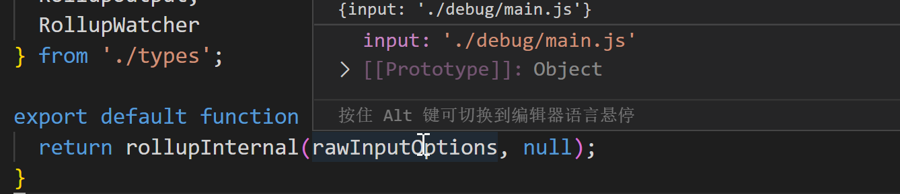

# 整体流程

```js
const fs = require("fs");
const path = require("path");
const rollup = require("rollup");

const inputOption = {
  input: "./debug/main.js",
};
const outputOption = {
  dir: "debug-dist",
};

(async function () {
  const bundle = await rollup.rollup(inputOption);

  bundle.write(outputOption);
})();
```

## rollupInternal

调用 rollup() 方法时，会执行内部的 rollupInternal() 方法。

```ts
export default function rollup(
  rawInputOptions: RollupOptions
): Promise<RollupBuild> {
  return rollupInternal(rawInputOptions, null);
}
```

rawInputOptions 是传入的原始 inputOption 选项值。



```ts
export async function rollupInternal(
  rawInputOptions: RollupOptions,
  watcher: RollupWatcher | null
): Promise<RollupBuild> {
  //...
}
```

rollupInternal 第二个参数是一个 watcher 对象，目前值为 `null`。

rollupInternal 内部做的第一个事情是处理输入配置。

```ts
const { options: inputOptions, unsetOptions: unsetInputOptions } =
  await getInputOptions(rawInputOptions, watcher !== null);
```

返回值是一个经过 build 后的 result 对象。它包含 rollup 提供的两个 API： `generate()`和 `write()`。分别用于将 build 结果写入到内存或文件系统中。
