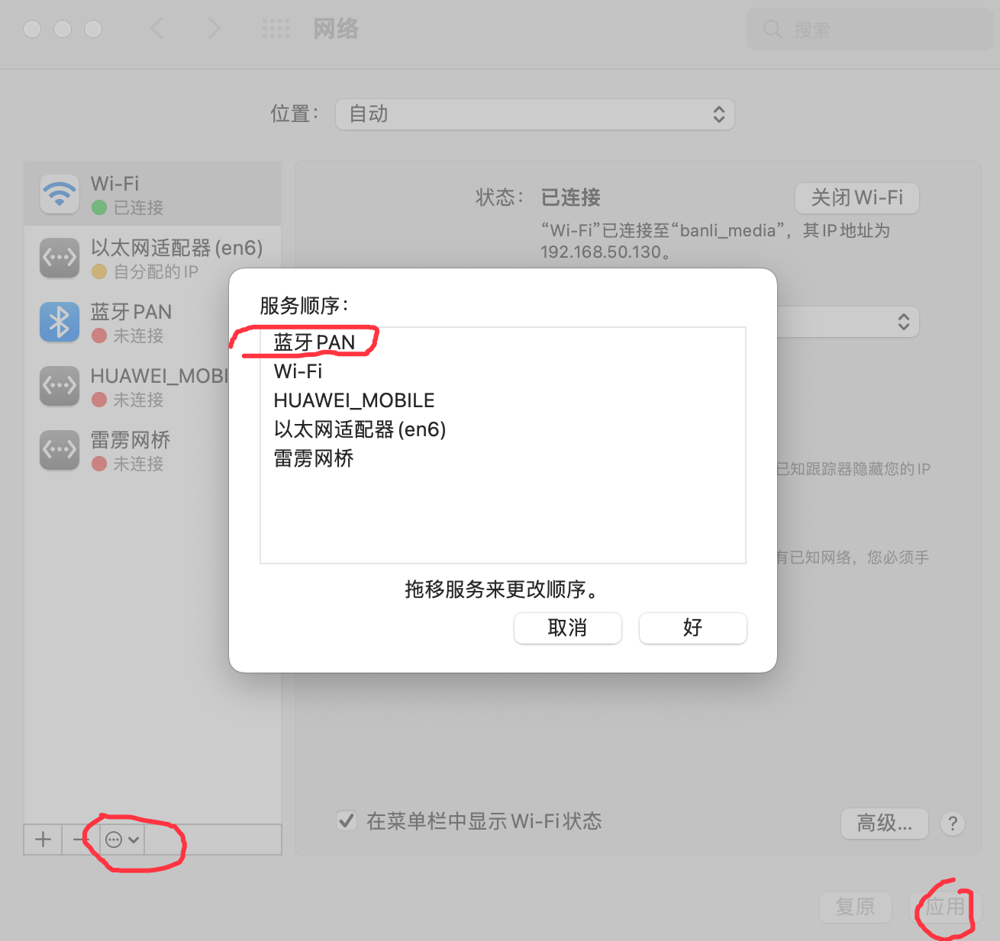

# macos 常见问题


## brew install 报错

```sh
Cloning into '/usr/local/Homebrew/Library/Taps/homebrew/homebrew-core'...
fatal: unable to access 'https://github.com/Homebrew/homebrew-core/': Failed to connect to 127.0.0.1 port 1080 after 6 ms: Connection refused
Error: Failure while executing; git clone https://github.com/Homebrew/homebrew-core /usr/local/Homebrew/Library/Taps/homebrew/homebrew-core --origin=origin --template= exited with 128.
```

解决方法，输入下面命令：

```sh
git clone git://mirrors.ustc.edu.cn/homebrew-core.git/ /usr/local/Homebrew/Library/Taps/homebrew/homebrew-core --depth=1
```

## 连接 4k 显示器，鼠标键盘卡顿

- 使用有线鼠标和键盘。**有效**

- 调整网络，将蓝牙 pan 移动到最上面。**测试无效**



https://www.zhihu.com/question/37574080
