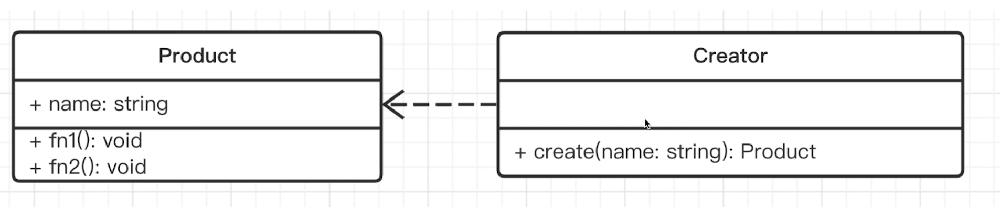
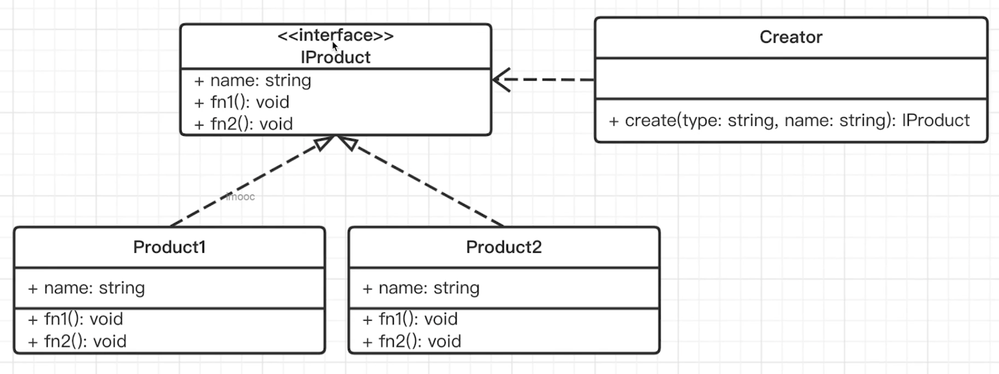

# 工厂模式

工厂模式是一个创建型模式，它将创建者和构造函数分离，把创建对象的操作(new)封装在工厂类中，让上层只需要使用工厂的方法来创建对象，不用关心工厂中生产产品的细节（比如不用关心应该 new 那种产品、产品变化后怎么办）。

当需要使用 new 时，就要考虑是否使用工厂模式。

**好处**

1. 不用写 new
2. 当产品发生变化时，只需要修改工厂函数即可，如果不用工厂，就需要修改每一个 new Class。

**工厂模式的分类**

- 简单工厂模式：一个产品一个工厂，十个产品一个工厂，里面通过 if else 判断。总结：工厂可以生产所有产品
- 工厂方法：一个产品一个工厂，十个产品十个工厂，避免大量 if else。总结：工厂只能生产一个产品
- 抽象工厂模式：N 个产品 M 个工厂。总结：工厂可以灵活的生产商品。

**简易工厂模式**



> 虚线: 依赖关系，没有属性用到 Project，但是返回值用到了。

小 A 准备办个工厂，生产 hp 键盘。于是他：

```js
class HpKeyboard {
  color: string;
  constructor(color: string) {
    this.color = color;
  }

  showColor() {
    console.log("color", this.color);
  }
}

class KeyboardFactory {
  create(name) {
    return new HpKeyboard(name);
  }
}

let creator = new KeyboardFactory();

let p1 = creator.create("绿色");
p1.showColor();

let p2 = creator.create("红色");
p2.showColor();
```

上面的代码可以看到，调用 Creator 的 create 方法就可以创建产品，如果产品有变化，比如产品停产或升级了，只需要在工厂类内部处理，无需修改上层代码。

**简单工厂模式升级**

随着工厂生意越来越到，小 A 决定生产不同品牌的键盘。有 hp ， dell 等。



```js
interface Keyboard {
    color: string
    showColor: () => void
}
class HpKeyboard implements Keyboard {
    color: string
    constructor(color: string) {
        this.color = color
    }

    showColor() {
        console.log('hp 键盘, color 是', this.color)
    }
}

class DellKeyboard implements Keyboard {
    color: string
    constructor(color: string) {
        this.color = color
    }

    showColor() {
        console.log('dell 键盘, color 是', this.color)
    }
}

class KeyboardFactory {
    create(type, color) {
        if (type === 'hp') {
            return new HpKeyboard(color)
        }
        if (type === 'dell') {
            return new DellKeyboard(color)
        }
        throw new Error(`没有生产 ${type} 的键盘`)
    }
}

let creator = new KeyboardFactory()

let p1 = creator.create('hp', '绿色')
p1.showColor()

let p2 = creator.create('dell', '红色')
p2.showColor()
```

这个工厂可以生产多个产品了，但是缺点是扩展性较差，每次新增一个商品，都需要修改工厂，进行 if else 判断。当商品非常多且杂时，会显得很复杂。比如小 A 还开始生产鼠标、主机、硬盘等等，这样都需要在工厂里进行 if else。

### 工厂方法

为了解决上面大量商品所带来的 if else 问题，小 A 决定多建一些工厂，使用最初的生产 hp 键盘的方式，针对每个产品 都建立 一个工厂。这样用户买商品时，去对应的工厂就可以了，比如买 hp 键盘，就去 hp 键盘厂，买 dell 键盘，就是 dell 键盘厂。买 hp 鼠标，就去 hp 鼠标厂，买 dell 鼠标，就去 dell 鼠标厂。


```js
interface Keyboard {
    color: string
    showColor: () => void
}
class HpKeyboard implements Keyboard {
    color: string
    constructor(color: string) {
        this.color = color
    }

    showColor() {
        console.log('hp 键盘, color 是', this.color)
    }
}

class DellKeyboard implements Keyboard {
    color: string
    constructor(color: string) {
        this.color = color
    }

    showColor() {
        console.log('dell 键盘, color 是', this.color)
    }
}

class HpKeyboardFactory {
    create(color) {
        return new HpKeyboard(color)
    }
}

class DellKeyboardFactory {
    create(color) {
        return new HpKeyboard(color)
    }
}

let hpCreator = new HpKeyboardFactory()
let dellCreator = new DellKeyboardFactory()

let p1 = hpCreator.create('绿色')
p1.showColor()

let p2 = dellCreator.create('红色')
p2.showColor()
```

虽然这样很清晰，可以不用 if else 判断了，但是缺点也很明显：一个商品一个工厂，如果业务涉及的商品越来越多，难道每一个商品都要对应一个工厂类吗？这样会使得系统中类的个数成倍增加，增加了代码的复杂度。

### 抽象工厂模式

于是小 A 想到了另一个方法，就是将 商品进行归类分组，比如按品牌分类，或者按照产品分类(比如键盘，鼠标)。这样去建立工厂。

它将多个产品进行分组，放在同一个工厂中生产，每个小产品的生产对应 工厂中的一个方法。比如不同品牌的电脑，每个电脑包含不同品牌的显示器、键盘、主机等商品。

另外每个工厂 生产 某个 产品时，可以任意的组合。最终 client 客户端，调用 工厂 的方法进行生产产品。


```js
interface Mouse {}
class HpMouse implements Mouse {}
class DellMouse implements Mouse {}

interface Keyboard {}
class HpKeyboard implements Keyboard {}
class DellKeyboard implements Keyboard {}

// 工厂基础类
class Factory {
  createPC() {
    const mouse = this.createMouse();
    const keyboard = this.createKeyboard();
    return { mouse, keyboard };
  }

  createMouse() {}
  createKeyboard() {}
}

class HpFactory extends Factory {
  createMouse() {
    return new HpMouse();
  }
  createKeyboard() {
    return new HpKeyboard();
  }
}

class DellFactory extends Factory {
  createMouse() {
    return new DellKeyboard();
  }
  createKeyboard() {
    return new DellKeyboard();
  }
}

class MixFactory extends Factory {
  createMouse() {
    return new DellKeyboard();
  }
  createKeyboard() {
    return new HpKeyboard();
  }
}

const hpfactory = new HpFactory();
hpfactory.createMouse();
```

优缺点：扩展一个新的品牌很简单，加一个工厂和商品类就可以，无需修改已有工厂，但是如果要新加商品，就需要修改之前的每个工厂，都需要新增商品。

抽象工厂模式解决的是 产品多了之后，工厂方法产生大量工厂的问题。

### 应用场景

**1、jquery 实例的创建就是工厂模式**

```js
// 扩展 window.$
declare interface Window {
  $: (selector: string) => JQuery
}

class JQuery {
  selector: string
  length: number
  constructor(selector: string) {
    const domList = Array.prototype.slice.call(document.querySelectorAll(selector)) const length = domList.length for (let i = 0; i < length; i++) {
      this[i] = domList[0]
    }
    this.selector = selector
    this.length = length
  }
  append(elem: HTMLElement): JQuery {
    return this
  }
  addClass(key: string, value: string): JQuery {
    return this
  }
  html(htmlStr: string): JQuery | string {
    if (htmlStr) {
      // set html
      return this
    } else { // get html
      const html = 'xxx'
      return html
    }
  }
}

window.$ = (selector) => {
  return new JQuery(selector)
}
```

这样我们只需要使用`$()`即可，如果使用`new $()`书写起来麻烦，而且链式调用会很繁杂(因为都需要写 new)。另外如果 jQuery 名称修改为了 zQuery，那么上层代码都需要修改。

**2、Vue 的 createElementVNode **

在线编译 https://vue-next-template-explorer.netlify.app/

```js
<div>
	<span>静态文字</span>
  <span :id="hello" class="bar">{{ msg }}</span>
</div>
```

编译成

```js
export function render(_ctx, _cache, $props, $setup, $data, $options) {
  return (
    _openBlock(),
    _createElementBlock("div", null, [
      _createElementVNode("span", null, "静态文字"),
      _createElementVNode(
        "span",
        {
          id: _ctx.hello,
          class: "bar",
        },
        _toDisplayString(_ctx.msg),
        9 /* TEXT, PROPS */,
        ["id"]
      ),
    ])
  );
}
```

`_createElementBlock()`, `_createElementVNode()` 就是工厂模式。

**3、React.createElement**

在线编译 https://www.babeljs.cn/repl

```js
const profile = (
  <div>
    
    <h3>{[user.firstName, user.lastName].join(" ")}</h3>{" "}
  </div>
);
```

编译成

```js
var profile = /*#__PURE__*/ React.createElement(
  "div",
  null,
  /*#__PURE__*/ React.createElement("img", {
    src: "avatar.png",
    className: "profile",
  }),
  /*#__PURE__*/ React.createElement(
    "h3",
    null,
    [user.firstName, user.lastName].join(" ")
  ),
  " "
);
```

createElement 就是工厂模式。

## 资料

- https://www.zhihu.com/question/27125796/answer/1615074467
