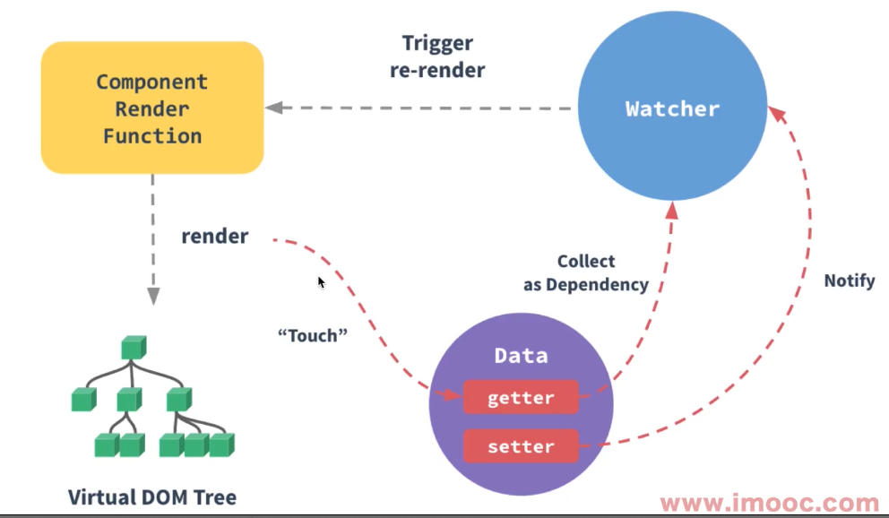
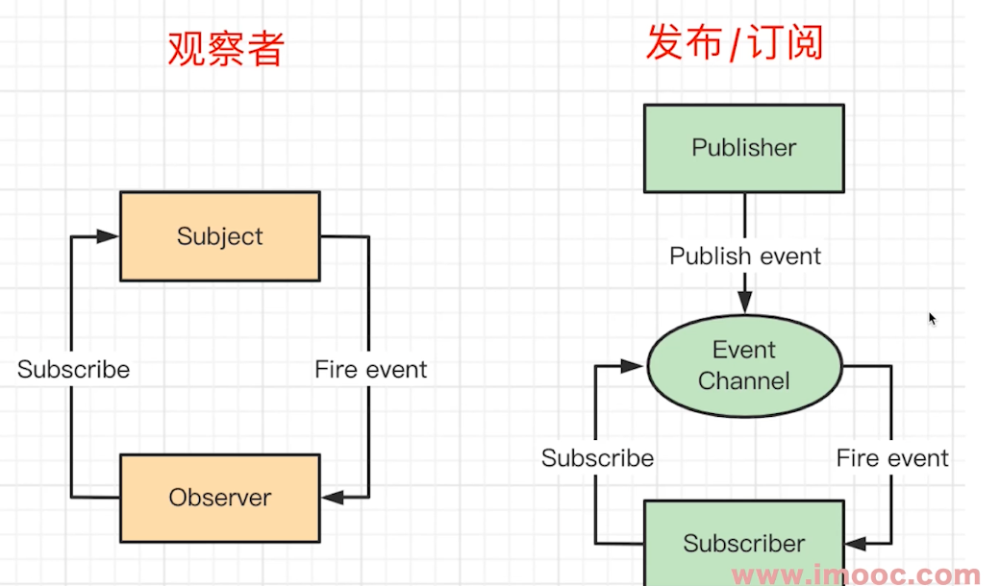

# 观察者模式

有些人经常将发布订阅模式和观察者模式弄混淆，实际发布订阅模式是观察者模式衍生出来的产物，它们是有区别的。

## 观察者模式

### 简介

观察者模式是软件设计模式的一种。在此种模式中，一个目标物件管理所有相依于它的观察者物件，并且在它本身的状态改变时主动发出通知。


被观察目标管理多个观察者，当内部状态变化时，通过 notify() 方法通知观察者(调用观察者的 update() 方法)。观察者和被观察者是紧耦合的。

:::tip 为什么要使用观察者模式?
降低耦合：降低了目标与观察者之间的耦合关系，两者之间是抽象耦合关系。符合依赖倒置原则； <br/>
即时触达：在目标与观察者之间建立了一套触发机制，当目标状态改变时，可以即时的触发；
:::

### 应用场景

- nodejs 中：处理 http 请求(http.createServer 回调)，多进程通讯
- MutationObserve()
- DOM 事件
- 图片加载 onload 等
- Vue 生命周期
- Vue Watch



### 优缺点

观察者模式的主要的作用就是对对象解耦，将观察者和被观察者完全隔离。

程序中包括一个被观察者和多个被观察者，开发和调试比较复杂。一个观察者的卡顿会影响整体的执行效率。在这种情况下，一般考虑采用异步的方式。

### 代码实现

```ts
class Subject {
  constructor() {
    this.observers = [];
    this.state = 0;
  }

  getState() {
    return this.state;
  }

  setState(newState) {
    this.state = newState;
    this.notify();
  }

  // 添加观察者
  attach(observer) {
    this.observers.push(observer);
  }

  // 撤销观察
  detach(observer) {}

  // 通知观察者
  notify() {
    this.observers.forEach((observer) => observer.update(this.state));
  }
}

class Observer {
  constructor(name) {
    this.name = name;
  }
  update(state) {
    console.log(`${this.name} updated, state is ${state}`);
  }
}

const o1 = new Observer("o1");
const o2 = new Observer("o2");
const s = new Subject();
s.attach(o1);
s.attach(o2);
s.setState(3);
```

打印结果如下：

```sh
o1 updated, state is 3
o2 updated, state is 3
```

### 示例-stream

```ts
const fs = require("fs");
const readStream = fs.createReadStream("./1.txt");
let length = 0;
readStream.on("data", function (chunk) {
  length += chunk.toString().length;
});
readStream.on("end", function () {
  console.log(length);
});
```

### 示例-readline

readline 可以一行行的读文件内容。

```ts
// 4、
const readline = require("readline");
const rl = readline.createInterface({
  input: process.stdin,
  output: process.stdout,
});
rl.on("line", (input) => {
  // 在回车 \n \r \r\n 时触发
  console.log(`Received: ${input}`);
});
rl.on("close", () => {
  console.log(`Readline closed.`);
});
```

### 示例-MutationObserve

```ts
const el = document.querySelector(".container");
const callback = (mutationList, observer) => {
  console.log("record", mutationList);
};

const mutationObserve = new MutationObserver(callback);

// childList、attributes 和 characterData 中，必须有一个参数为 true。否则会抛出 TypeError 异常
mutationObserve.observe(el, {
  attributes: true, // 观察所有监听节点属性值的变化
  // attributeFilter: [], // 哪些属性名会被监听
  // attributeOldValue: true, // 记录上一次被监听的节点的属性变化
  childList: true, // 监听 target 节点中发生的节点的新增和删除
  characterData: true, // 文本内容
  characterDataOldValue: true, // 记录上一个被监听节点中发生的文本变化
  subtree: true, // 将监听 el 为根节点的整个子树
});
```

**characterDataOldValue**

characterDataOldValue 为 true 时，characterData 默认为 true。


## 发布订阅模式

### 简介

发布订阅模式不是传统的 23 种设计模式之一，它是一种消息范式，消息发布者和订阅者是解耦无关的，它们之间通过消息中心来管理。消息可以分为多个类别，不关注订阅者。订阅者可以订阅一个或多个类别感兴趣的消息，也不关心发布者。(它实际是去除了发布者和订阅者，只关注消息的发布和订阅)。

### 代码实现

```ts
function Event() {
  this.callbacks = [];
}

Event.prototype.on = function (fn) {
  this.callbacks.push(fn);
};

Event.prototype.emit = function () {
  this.callbacks.forEach((callback) => {
    callback.apply(this, arguments);
  });
};

var e = new Event();
e.on(function (a) {
  console.log(1, a);
});
e.on(function (a, b) {
  console.log(2, a, b);
});
e.emit("hi", "zhangsan");
```

打印结果如下：

```ts
1 'hi'
2 'hi' 'zhangsan'
```

## 观察者模式和发布订阅模式的区别

发布订阅模式是最常用的一种观察者模式的实现。观察者模式是耦合的，它强调目标和观察者，当目标变化通知观察者。但是大多数场景中我们并不关心目标和观察者，而是只关心目标的变化。所以发布订阅模式只通过消息中心来调度，它去除了发布者和订阅者(解耦)，只管消息的订阅和发布。

优缺点也很明显，紧密耦合的方式简单直接，扩展性差，而且要求两端同时存在。松散耦合不直接产生依赖，更容易扩展，想在哪里用就在哪里用，但是代码分散，不知道在哪订阅了消息。

观察者模式下，只能去观察某个目标，而不能主动去触发事件，而发布订阅模式下，可以主动触发。



:::tip 如何判断观察者模式和发布订阅模式?
看是否需要手动触发 emit
:::

## 应用场景实例

- 网页事件绑定：点击按钮的时候触发绑定的事件
- Promise

```ts
result
  .then(() => {
    // then这里是绑定，等到promise pending状态变化时触发
  })
  .then();
```

- jQuery callbacks

```ts
var callbacks = $.Callbacks();
callbacks.add(function (info) {
  console.log(info);
}); // fire
callbacks.fire("fire");
```

### 示例-自定义事件

```ts
const EventEmitter = require("events").EventEmitter;
const emitter = new EventEmitter();
emitter.on("end", function () {
  console.log("hi");
});
emitter.emit("end");

class Person extends EventEmitter {}
let p = new Person();
p.on("talk", () => {
  console.log("talk");
});
p.emit("talk");
```

## 示例-iframe postMesage

```ts
// parent.html
window.addEventListener("message", (e) => {
  console.log(e.data);
});
window.iframe.contentWindow.postMessage("hello", "*");

// child.html
window.parent.postMessage("data", "*");
```

## 参考资料

- [设计模式（三）：观察者模式与发布/订阅模式区别](http://www.cnblogs.com/lovesong/p/5272752.html)
- [观察者模式和发布订阅模式有什么不同？](https://www.zhihu.com/question/23486749)
