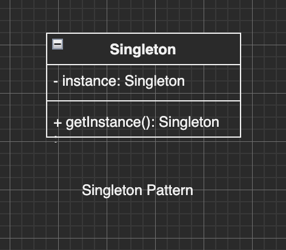

# 单例模式

## 简介

单例模式，是某个类在全局只有一个实例，不能创建多个实例。



## 应用场景

- 全局遮罩，登陆框，一个系统只有一个即可，多了无用(没必要，浪费)。
- Vuex, Redux，EventBus 一个系统只有一个，多了会出错。

上面模式不一定是严格的单例模式，但它是单例思想。

## 代码实现

单例模式所要做的，是如何在代码层面，确保用户只创建单个实例，而不能创建多个实例。

```ts
class Singleton {
  private static instance;

  // private 无法在实例外 new
  private constructor(name) {
    this.name = name;
  }

  public static getInstance(name) {
    // this 指向 Singleton, 而非实例
    if (!this.instance) {
      this.instance = new Singleton(name);
    }
    return this.instance;
  }
}
```

上面代码中，用户只能通过 `Singleton.getInstance()` 方法获取实例，在 getInstance 内部，会判断是否曾经创建过 instance 实例，如果没创建过，则新建，否则会直接返回该实例。

:::tip
如果使用 ts 语法，可以给 constructor 添加 private，外部在 new Singleton() 时会报错。
如果使用 js 语法，可以在 constructor 方法中添加 Singleton.instance 判断，如果有值，则返回。
:::

在模块化文件形式下，代码会更简单。

```ts
class Singleton {}

// 导出一个单例
export default new Singleton();

// 或者导出一个函数
const instance = null;
export default () => {
  if (!instance) {
    instance = new Singleton();
  }
  return instance;
};
```

## 登陆框实例

```ts
class LoginForm {
  static instance = null;
  constructor() {
    if (LoginForm.instance) {
      return LoginForm.instance;
    }

    LoginForm.instance = this;
  }
  show() {
    console.log("show");
  }

  hide() {
    console.log("hide");
  }

  static getInstance() {
    if (this.instance) {
      return this.instance;
    }
    console.log("ggg");
    return (this.instance = new LoginForm());
  }
}

const lf1 = new LoginForm();
const lf2 = new LoginForm();
const lf3 = LoginForm.getInstance();
const lf4 = LoginForm.getInstance();
console.log(lf1 === lf2); // true
console.log(lf3 === lf4); // true
console.log(lf1 === lf3); // true
```

js 版本 LoginForm 实现时，需要注意 constructor 构造函数中，instance 的判断和 `LoginForm.instance = this` 赋值。

## 注意事项

- 前端对单例模式并不常用，但是单例的思想\*\*随处可见。
