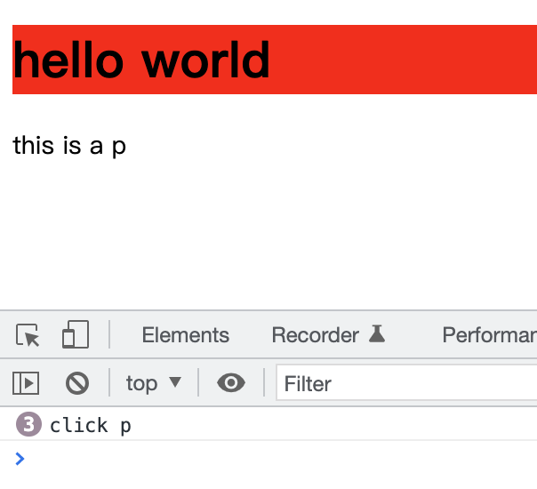

# 虚拟 DOM 实现原理

## 什么是虚拟 DOM

虚拟 DOM(VirtualDom, 简称 Vdom)是一个编程概念，它是使用 js 对象来描述真实 dom。

## 为什么要用虚拟 DOM

dom 操作的历程：

1. 手动操作 DOM 太麻烦，还需要考虑浏览器兼容
2. 为了简化视图操作，可以使用模版引擎。但是模版引擎没有解决状态变化的问题，它没有保存上一次状态，数据变化后，它需要重新执行 render() 渲染，另外，它是直接删除 dom 进行更新。
3. MVVM 框架解决了视图和状态的同步问题

虚拟 DOM 解决了 dom 更新的性能问题，当状态改变时，不会立即更新 DOM，只创建一个虚拟树来描述 dom，内部会 diff 然后再更新 DOM。

github 上 virtual-dom 的描述

- 虚拟 DOM 可以维护程序状态，跟踪上一次状态
- 通过对比两次状态的差异更新真实 DOM

**为什么直接不直接更新 dom**

因为真实 DOM 属性很多，操作时昂贵的，而创建虚拟 DOM 属性很少，操作起来开销很小。

## 虚拟 DOM 的作用

- 维护视图和状态的关系
- 复杂视图情况下提升渲染性能，简单场景下可能比手动操作 dom 性能要差。它实际上是操作复杂度与性能的平衡。
- 跨平台
  - 浏览器平台渲染 DOM
  - 服务器渲染 ssr(nuxt.js, next.js)
  - weex/react-native
  - 小程序 uni-app, taro

## snabbdom 基本使用

[Snabbdom](https://github.com/snabbdom/snabbdom) 是一个 Virtual DOM 库。

- Vue 2.x 内部使用的 Virtual DOM 就是改造的 Snabbdom
- 大约 200 行
- 通过模块可扩展
- 源码使用 TS 开发
- 最快的 Virtual DOM 之一

**snabbdom 示例 1**

```js
import { init } from "snabbdom/build/init.js";
import { h } from "snabbdom/build/h.js";

const patch = init([]);

// 第一个参数：标签 + 选择器
// 第二个参数：如果是字符串就是标签中的文本内容
let vnode = h("div#container.cls", "hello world");
let app = document.querySelector("#app");

// 第一个参数，旧 vnode
// 第二个参数，新 vnode
// 会使用新的 vnode 替换旧的 vnode
let oldVnode = patch(app, vnode);

vnode = h("div#container.xxx", "hello snabbdom");
patch(oldVnode, vnode);
```

运行结果如下：


**snabbdom 示例 2**

```js
import { init } from "snabbdom/build/init.js";
import { h } from "snabbdom/build/h.js";

const patch = init([]);

// 子元素可以是一个数组， 每个元素又是一个 vnode, 用 h 函数创建
let vnode = h("div#container.cls", [h("h1", "hello world"), h("p", "ppp")]);
let app = document.querySelector("#app");

let oldVnode = patch(app, vnode);

setTimeout(() => {
  // vnode = h("div#container", [h("h1", "hello world"), h("p", "this is a p")]);
  // patch(oldVnode, vnode);

  // 会生成一个注释节点 <!---->
  patch(oldVnode, h("!"));
}, 1000);
```

### 模块的使用

snabbdom 核心不能处理属性、样式、事件等。可以通过 snabbdom 默认提供的模块来实现。

snabbdom 的模块可以用来扩展功能，它的实现是通过注册全局钩子函数来实现的。

snabbdom 提供了 6 个模块:

- attributes: 通过 setAttribute 实现，对布尔类型进行了处理
- props: 通过 obj.x 实现
- style
- class
- dataset
- eventlisteners

示例

```js
import { init } from "snabbdom/build/init.js";
import { h } from "snabbdom/build/h.js";
import { styleModule } from "snabbdom/build/modules/style";
import { eventListenersModule } from "snabbdom/build/modules/eventlisteners";

const patch = init([styleModule, eventListenersModule]);

// 子元素可以是一个数组， 每个元素又是一个 vnode, 用 h 函数创建
let vnode = h("div#container.cls", [
  h(
    "h1",
    {
      style: {
        backgroundColor: "red",
      },
    },
    "hello world"
  ),
  h(
    "p",
    {
      on: {
        click: clickHandler,
      },
    },
    "this is a p"
  ),
]);

let app = document.querySelector("#app");

setTimeout(() => {
  patch(app, vnode);
}, 1000);

function clickHandler() {
  console.log("click p");
}
```



## snabbdom 源码分析

### 开始

**运行示例**

1. 克隆项目
2. npm run build
3. npm run example

snabbdom 的 h 函数早期版本事件支持传入一个数组，后面取消了这种用法。

```ts
// old
h("div", {
  on: {
    click: [handle, movie], // 第一个参数是事件处理函数，第二个参数是函数的参数
  },
});

// new
h("div", {
  on: {
    click: () => handle(movie),
  },
});
```

### h() 函数

h 函数用于生成 VNode 节点，它支持多种传参数方式。

```ts
// h 函数返回一个 Vnode
// h('div.x')
export function h(sel: string): VNode;
// h('div.x', { styles: {}, on: {}})
export function h(sel: string, data: VNodeData | null): VNode;
// h('div.x', ['hello', 3, new String(3), Vnode,...])
export function h(sel: string, children: VNodeChildren): VNode;
// h('div.x', { styles: {}, on: {}}, ['hello', 3, new String(3), Vnode,...])
export function h(
  sel: string,
  data: VNodeData | null,
  children: VNodeChildren
): VNode;
```

VNodeChildren 是一个数组，子元素可以是 VNode，字符串，数字等。最终每一项都会转成 VNode。

```ts
export type VNodeChildElement =
  | VNode
  | string
  | number
  | String
  | Number
  | undefined
  | null;
export type ArrayOrElement<T> = T | T[];
export type VNodeChildren = ArrayOrElement<VNodeChildElement>;
```

h 函数具体代码如下：

```ts
export function h(sel: any, b?: any, c?: any): VNode {
  let data: VNodeData = {};
  let children: any;
  let text: any;
  let i: number;
  if (c !== undefined) {
    if (b !== null) {
      data = b;
    }
    if (is.array(c)) {
      // c 是数组
      children = c;
    } else if (is.primitive(c)) {
      // c 是 string 或 number
      text = c.toString();
    } else if (c && c.sel) {
      // c 是 VNode
      children = [c];
    }
  } else if (b !== undefined && b !== null) {
    if (is.array(b)) {
      children = b;
    } else if (is.primitive(b)) {
      text = b.toString();
    } else if (b && b.sel) {
      children = [b];
    } else {
      // b 是对象 { on: {}, ...}
      data = b;
    }
  }
  // 将 children 每一项都转成 VNode
  if (children !== undefined) {
    for (i = 0; i < children.length; ++i) {
      if (is.primitive(children[i]))
        children[i] = vnode(
          undefined,
          undefined,
          undefined,
          children[i],
          undefined
        );
    }
  }

  // 如果是 svg，创建 svg
  // h('svg') h('svg.x') h('svg#x')
  if (
    sel[0] === "s" &&
    sel[1] === "v" &&
    sel[2] === "g" &&
    (sel.length === 3 || sel[3] === "." || sel[3] === "#")
  ) {
    addNS(data, children, sel);
  }

  return vnode(sel, data, children, text, undefined);
}
```

上面代码，主要是做了 3 件事情：

1. 参数归一化，获得 sel, data, children, text
2. 将 children 元素统一转换为 VNode
3. 最后返回 VNode 对象。

如果是 svg，就利用 addNS 函数，给 data 添加 ns 属性，并且会递归给子 Vnode 也添加 ns 属性。addNS 函数如下：

```ts
/**
给 vnode 节点的 data 增加 ns 属性
addNS({
    on: {click:()=>{}}, 
    ns: "http://www.w3.org/2000/svg"
  },
  ['hello', { data: {}, sel, children} as VNode],
  'svg'
) 
**/
export function addNS(
  data: any,
  children: Array<VNode | string> | undefined,
  sel: string | undefined
): void {
  data.ns = "http://www.w3.org/2000/svg";
  if (sel !== "foreignObject" && children !== undefined) {
    for (let i = 0; i < children.length; ++i) {
      const child = children[i];
      if (typeof child === "string") continue;
      const childData = child.data;
      if (childData !== undefined) {
        addNS(childData, child.children as VNodes, child.sel);
      }
    }
  }
}
```

### vnode() 函数

vnode 函数返回一个 VNode 对象。

VNode 对象就是一个 js 对象，它有 6 个属性：

```ts
export interface VNode {
  sel: string | undefined;
  data: VNodeData | undefined;
  children: Array<VNode | string> | undefined;
  elm: Node | undefined;
  text: string | undefined;
  key: Key | undefined;
}

export type Key = string | number | symbol;
```

- sel 是选择器
- data 是模块数据，如事件、属性等
- children 是子元素，它和 text 是互斥的
- elm 是 VNode 真实的 dom 元素
- text 是元素的文本内容
- key 节点标识， 可以是字符串，数字或 symbol

data 数据定义如下：

```ts
export interface VNodeData {
  props?: Props;
  attrs?: Attrs;
  class?: Classes;
  style?: VNodeStyle;
  dataset?: Dataset;
  on?: On;
  attachData?: AttachData;
  hook?: Hooks;
  key?: Key;
  ns?: string; // for SVGs
  fn?: () => VNode; // for thunks
  args?: any[]; // for thunks
  is?: string; // for custom elements v1
  [key: string]: any; // for any other 3rd party module
}
```

最后是 vnode 函数。

```ts
export function vnode(
  sel: string | undefined,
  data: any | undefined,
  children: Array<VNode | string> | undefined,
  text: string | undefined,
  elm: Element | DocumentFragment | Text | undefined
): VNode {
  const key = data === undefined ? undefined : data.key;
  return { sel, data, children, text, elm, key };
}
```

上面可以看到，VNode 的 key 是会从 data 上获取的。vnode 函数就是简单的将参数转换成了一个对象。

### init() 函数

https://github.com/banli17/note/blob/main/packages/snabbdom-source/src/init.ts

snabbdom init 函数主要做的事情如下：

1. 注册钩子
2. 定义了很多内部函数，createEle, patchVnode, updateChildren 等
3. 返回 patch 函数

**注册钩子**

init 方法可以传入 modules, domAPI, options 三个参数。

```ts
export function init(
  modules: Array<Partial<Module>>,
  domApi?: DOMAPI,
  options?: Options
) {
...
return patch
}
```

module 实际就是一个对象。

```ts
export type Module = Partial<{
  pre: PreHook;
  create: CreateHook;
  update: UpdateHook;
  destroy: DestroyHook;
  remove: RemoveHook;
  post: PostHook;
}>;
```

可以看到，可以定义 6 个方法。这些方法在 init 内部，会注册到一个 cbs 变量上。

```ts
const hooks: Array<keyof Module> = [
  "create",
  "update",
  "remove",
  "destroy",
  "pre",
  "post",
];

const cbs: ModuleHooks = {
  create: [],
  update: [],
  remove: [],
  destroy: [],
  pre: [],
  post: [],
};

for (const hook of hooks) {
  for (const module of modules) {
    const currentHook = module[hook];
    if (currentHook !== undefined) {
      (cbs[hook] as any[]).push(currentHook);
    }
  }
}
```

将 domAPI 抽象出来，可以做到跨平台。默认使用 htmlDomApi 。

https://github.com/banli17/note/blob/main/packages/snabbdom-source/src/htmldomapi.ts

```ts
export interface DOMAPI {
  createElement: (
    tagName: any,
    options?: ElementCreationOptions
  ) => HTMLElement;
  createElementNS: (
    namespaceURI: string,
    qualifiedName: string,
    options?: ElementCreationOptions
  ) => Element;
  createDocumentFragment?: () => SnabbdomFragment;
  createTextNode: (text: string) => Text;
  createComment: (text: string) => Comment;
  insertBefore: (
    parentNode: Node,
    newNode: Node,
    referenceNode: Node | null
  ) => void;
  removeChild: (node: Node, child: Node) => void;
  appendChild: (node: Node, child: Node) => void;
  parentNode: (node: Node) => Node | null;
  nextSibling: (node: Node) => Node | null;
  tagName: (elm: Element) => string;
  setTextContent: (node: Node, text: string | null) => void;
  getTextContent: (node: Node) => string | null;
  isElement: (node: Node) => node is Element;
  isText: (node: Node) => node is Text;
  isComment: (node: Node) => node is Comment;
  isDocumentFragment?: (node: Node) => node is DocumentFragment;
}
```

**patch() 函数**

patch 函数的作用：

1. 执行 pre, insert, post 钩子函数
2. 对比两个 vnode 节点，使用新 vnode 的 elm 更新 oldVnode 的 elm。

- 如果 oldVnode 是 dom ，就将它转成 vnode
- 如果两个 vnode 是相同， 执行 patchVnode
- 否则，使用 createEle(vnode) 创建新 vnode 的 elm，然后将 elm 插入到页面，并且删除 oldVnode 的 elm。

```ts
return function patch(
  oldVnode: VNode | Element | DocumentFragment,
  vnode: VNode
): VNode {
  let i: number, elm: Node, parent: Node;
  const insertedVnodeQueue: VNodeQueue = [];
  // 执行 pre
  for (i = 0; i < cbs.pre.length; ++i) cbs.pre[i]();

  // api.isElement, 如果是 dom 元素 nodeType=== 1，则创建 vnode
  if (isElement(api, oldVnode)) {
    oldVnode = emptyNodeAt(oldVnode);
  } else if (isDocumentFragment(api, oldVnode)) {
    // 如果是 fragment, 支持 fragment 更新？
    oldVnode = emptyDocumentFragmentAt(oldVnode);
  }

  if (sameVnode(oldVnode, vnode)) {
    patchVnode(oldVnode, vnode, insertedVnodeQueue);
  } else {
    elm = oldVnode.elm!;
    parent = api.parentNode(elm) as Node;

    // 创建 vnode 的 elm
    createElm(vnode, insertedVnodeQueue);

    if (parent !== null) {
      // 插入新 dom
      api.insertBefore(parent, vnode.elm!, api.nextSibling(elm));
      // 删除旧 dom
      removeVnodes(parent, [oldVnode], 0, 0);
    }
  }

  // 插入的 vnode 队列，依次调用 hook.insert，不是模块钩子
  for (i = 0; i < insertedVnodeQueue.length; ++i) {
    insertedVnodeQueue[i].data!.hook!.insert!(insertedVnodeQueue[i]);
  }
  // 执行 post
  for (i = 0; i < cbs.post.length; ++i) cbs.post[i]();
  return vnode;
};
```

**isSameVnode 函数**

```ts
function sameVnode(vnode1: VNode, vnode2: VNode): boolean {
  const isSameKey = vnode1.key === vnode2.key;
  const isSameIs = vnode1.data?.is === vnode2.data?.is; // ??
  const isSameSel = vnode1.sel === vnode2.sel;
  const isSameTextOrFragment = // ??
    !vnode1.sel && vnode1.sel === vnode2.sel
      ? typeof vnode1.text === typeof vnode2.text
      : true;

  return isSameSel && isSameKey && isSameIs && isSameTextOrFragment;
}
```

之前的版本，其实只判断了 key 和 sel。

### createElm() 函数

createElm 函数会根据 vnode 创建真实的 dom，并且将 dom 挂在 vnode.elm 属性上，并返回真实的 dom。

```ts
function createElm(vnode: VNode, insertedVnodeQueue: VNodeQueue): Node {
  //...
  return vnode.elm;
}
```

createElm 函数所做的事情如下：

1. 调用 vnode.data.hook.init() 函数

```ts
let i: any;
let data = vnode.data;
if (data !== undefined) {
  const init = data.hook?.init;
  if (isDef(init)) {
    init(vnode);
    data = vnode.data;
  }
}
```

2. 根据 vnode 创建真实 dom，这里可能创建 注释(sel === !)、元素节点(sel !== undefined) 、 text 和 fragments。

```ts
if (sel === "!") {
  if (isUndef(vnode.text)) {
    vnode.text = "";
  }
  vnode.elm = api.createComment(vnode.text!);
} else if (sel !== undefined) {
  // 创建元素节点
} else if (options?.experimental?.fragments && vnode.children) {
  // 创建 fragment
} else {
  vnode.elm = api.createTextNode(vnode.text!);
}
```

3. 创建元素节点，

```ts
if (sel !== undefined) {
  // Parse selector
  // 检查 sel 是否有 # .， 并获取位置
  const hashIdx = sel.indexOf("#");
  const dotIdx = sel.indexOf(".", hashIdx);
  const hash = hashIdx > 0 ? hashIdx : sel.length;
  const dot = dotIdx > 0 ? dotIdx : sel.length;

  // 获取标签,   div#id.class
  const tag =
    hashIdx !== -1 || dotIdx !== -1 ? sel.slice(0, Math.min(hash, dot)) : sel;

  const elm = (vnode.elm =
    isDef(data) && isDef((i = data.ns))
      ? api.createElementNS(i, tag, data) // 有 namespace，一般是创建 svg
      : api.createElement(tag, data)); // 这里第二个参数 data 可以在 webcomponent 里可以用

  // 设置 id，这个 hash dot 值很妙，可以直接用来判断
  if (hash < dot) elm.setAttribute("id", sel.slice(hash + 1, dot));
  // 设置 class
  if (dotIdx > 0)
    elm.setAttribute("class", sel.slice(dot + 1).replace(/\./g, " "));

  // 调用模块的 create 钩子
  for (i = 0; i < cbs.create.length; ++i) cbs.create[i](emptyNode, vnode);

  // 如果有 children，递归 appendChildren
  if (is.array(children)) {
    for (i = 0; i < children.length; ++i) {
      const ch = children[i];
      if (ch != null) {
        api.appendChild(elm, createElm(ch as VNode, insertedVnodeQueue));
      }
    }
  } else if (is.primitive(vnode.text)) {
    // 如果是数字或字符串，当作文本节点，注意 children 和 text 是互斥的
    api.appendChild(elm, api.createTextNode(vnode.text));
  }

  const hook = vnode.data!.hook;
  if (isDef(hook)) {
    hook.create?.(emptyNode, vnode); // 调用 vnode.data.hook.create() 钩子
    if (hook.insert) {
      // 如果有 insert 钩子，存储 vnode 到 insertedVnodeQueue 中，等 dom 节点插入到页面后再调用
      insertedVnodeQueue.push(vnode);
    }
  }
}
```

4. 创建 fragment，目前是个实验性功能。

```ts
// 如果有children
if (options?.experimental?.fragments && vnode.children) {
  // 创建 fragment
  vnode.elm = (api.createDocumentFragment ?? documentFragmentIsNotSupported)();

  // 执行模块的 create 钩子
  for (i = 0; i < cbs.create.length; ++i) cbs.create[i](emptyNode, vnode);

  // 遍历 children，将 children 插入到 vnode.elm 中
  for (i = 0; i < vnode.children.length; ++i) {
    const ch = vnode.children[i];
    if (ch != null) {
      api.appendChild(vnode.elm, createElm(ch as VNode, insertedVnodeQueue));
    }
  }
}
```

### 为什么创建 svg 需要使用 createElementNS()

使用 document.createElement 创建 svg 元素时，会发现一个诡异的现象，svg 元素无法在页面上显示，但是通过调试器，可以看到该 svg 元素的存在。

解决方法是用 document.createElementNS 代替 document.createElement,因为 XML 是有命名空间的。

svg 是属于 xml 的，xml 中，多个相同标签组合使用时会产生冲突，需要加前缀，而定义前缀需要使用命名空间。

```xml
<root>

<h:table xmlns:h="http://www.w3.org/TR/html4/">
<h:tr>
<h:td>Apples</h:td>
<h:td>Bananas</h:td>
</h:tr>
</h:table>

<f:table xmlns:f="http://www.w3cschool.cc/furniture">
<f:name>African Coffee Table</f:name>
<f:width>80</f:width>
<f:length>120</f:length>
</f:table>

</root>
```

https://www.runoob.com/xml/xml-namespaces.html

### document.createElement() 的第二个参数是什么

第二个参数可以是一个带 is 属性的对象，is 属性的值是前面用 customElements.define() 定义的标签名。

https://developer.mozilla.org/en-US/docs/Web/API/Document/createElement

```ts
// Create a class for the element
class ExpandingList extends HTMLUListElement {
  constructor() {
    // Always call super first in constructor
    super();

    // constructor definition left out for brevity
  }
}

// Define the new element
customElements.define("expanding-list", ExpandingList, { extends: "ul" });

let expandingList = document.createElement("ul", { is: "expanding-list" });
```

### removeVnodes() 和 addVnodes() 函数

removeVnodes() 函数从父元素删除子元素。vnode 节点可能是元素、fragment、文本。

```ts
function removeVnodes(
  parentElm: Node,
  vnodes: VNode[],
  startIdx: number,
  endIdx: number
): void {
  for (; startIdx <= endIdx; ++startIdx) {
    let listeners: number;
    let rm: () => void;
    const ch = vnodes[startIdx]; // 当前要删除的元素

    // 不用处理 null/undefined
    if (ch != null) {
      // 如果是 vnode
      if (isDef(ch.sel)) {
        // 执行 destroy hook
        invokeDestroyHook(ch);

        // 防止重复删除 dom 节点，真实的删除 dom 会在所有的 remove 钩子执行完后
        listeners = cbs.remove.length + 1;
        // 用户调用 rm 可能是在异步函数里
        rm = createRmCb(ch.elm!, listeners);
        // 执行 remove 钩子，--listeners
        for (let i = 0; i < cbs.remove.length; ++i) cbs.remove[i](ch, rm);

        // 执行 data.hook.remove
        const removeHook = ch?.data?.hook?.remove;
        if (isDef(removeHook)) {
          removeHook(ch, rm); // 需要用户手动调用 rm()
        } else {
          rm();
        }
      } else if (ch.children) {
        // Fragment node
        invokeDestroyHook(ch);
        removeVnodes(
          parentElm,
          ch.children as VNode[],
          0,
          ch.children.length - 1
        );
      } else {
        // Text node
        api.removeChild(parentElm, ch.elm!);
      }
    }
  }
}
```

invokeDestroyHook() 是执行 destroy 钩子函数。会先执行自身的 data.hook.destroy()，再执行 children 的 data.hook.destroy()。

```ts
function invokeDestroyHook(vnode: VNode) {
  const data = vnode.data;
  if (data !== undefined) {
    // 执行 data.hook.destroy
    data?.hook?.destroy?.(vnode);
    for (let i = 0; i < cbs.destroy.length; ++i) cbs.destroy[i](vnode);
    // 再递归 children，执行 child 的 destroy
    if (vnode.children !== undefined) {
      for (let j = 0; j < vnode.children.length; ++j) {
        const child = vnode.children[j];
        if (child != null && typeof child !== "string") {
          invokeDestroyHook(child);
        }
      }
    }
  }
}
```

addVnodes() 函数就是简单的递归插入 vnode 节点。

```ts
function addVnodes(
  parentElm: Node,
  before: Node | null,
  vnodes: VNode[],
  startIdx: number,
  endIdx: number,
  insertedVnodeQueue: VNodeQueue
) {
  for (; startIdx <= endIdx; ++startIdx) {
    const ch = vnodes[startIdx];
    if (ch != null) {
      api.insertBefore(parentElm, createElm(ch, insertedVnodeQueue), before);
    }
  }
}
```

### patchVnode() 函数

patchVnode 函数主要是对比两个 vnode ，进行 patch 更新。它做的事情如下：

1. 执行 prepatch 钩子
2. 执行 update 钩子
3. patch vnode
   - 新 非 text
     - 新旧 children，updateChildren()
     - 新 children，addVnodes()
     - 旧 children, removeVnodes()
     - 旧 text，清空 textContent
   - 新 text
     - 旧 children
     - 旧 text
4. 执行 postpatch 钩子

```ts
function patchVnode(
  oldVnode: VNode,
  vnode: VNode,
  insertedVnodeQueue: VNodeQueue
) {
  const hook = vnode.data?.hook;
  hook?.prepatch?.(oldVnode, vnode); // call prepatch hook

  const elm = (vnode.elm = oldVnode.elm)!; // 相同节点时，才会 patchVnodes
  if (oldVnode === vnode) return;

  //  调用 update 钩子
  // 这里合并处理了，只有 vnode.data 有值 才可能调用 vnode.data.hook.update
  // ??
  if (
    vnode.data !== undefined ||
    (isDef(vnode.text) && vnode.text !== oldVnode.text)
  ) {
    vnode.data ??= {};
    oldVnode.data ??= {};
    for (let i = 0; i < cbs.update.length; ++i) cbs.update[i](oldVnode, vnode);
    vnode.data?.hook?.update?.(oldVnode, vnode);
  }

  const oldCh = oldVnode.children as VNode[];
  const ch = vnode.children as VNode[];
  if (isUndef(vnode.text)) {
    if (isDef(oldCh) && isDef(ch)) {
      if (oldCh !== ch) updateChildren(elm, oldCh, ch, insertedVnodeQueue);
    } else if (isDef(ch)) {
      if (isDef(oldVnode.text)) api.setTextContent(elm, "");
      addVnodes(elm, null, ch, 0, ch.length - 1, insertedVnodeQueue);
    } else if (isDef(oldCh)) {
      removeVnodes(elm, oldCh, 0, oldCh.length - 1);
    } else if (isDef(oldVnode.text)) {
      api.setTextContent(elm, "");
    }
  } else if (oldVnode.text !== vnode.text) {
    if (isDef(oldCh)) {
      removeVnodes(elm, oldCh, 0, oldCh.length - 1);
    }
    api.setTextContent(elm, vnode.text!);
  }
  hook?.postpatch?.(oldVnode, vnode);
}
```
