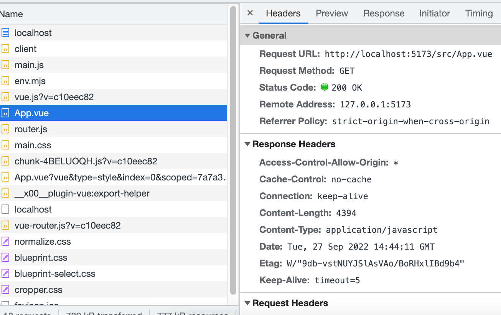
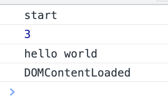

# Vite

## Vite as Vue-cli

- vite 开发模式下不需要打包可以直接运行
- Vue-cli 开发模式下必须对文件进行打包
- vite 生产环境使用 rollup esmodule 打包，打包体积更小
- vue-cli 是 webpack 打包

## Vite 特点

- 快速冷启动
- 按需编译 （浏览器不识别的文件才编译）
- 模块热更新

### vite 启动服务为什么快

vite 没有进行复杂的打包，只是对文件进行了转换。比如 .Vue, .css 文件都是转成了 js 文件，服务返回的 `Content-Type: application/javascript`，利用浏览器自带的 esmodule 加载方案来加载执行。




## Vite 创建项目

```sh
npm init vite-app <project-name>
cd <project-name>
npm install
npm init
```

基于模版创建项目

```sh
npm init vite-app --template react
npm init vite-app --template preact
```

## 依赖预构建

https://cn.vitejs.dev/guide/dep-pre-bundling.html


## 常见问题

浏览器上可以通过 script type = module 加载 es module 模块代码。

type=module 默认是 defer 异步的。它会在 dom 解析完, DOMContentLoaded 事件之前进行执行。

index.html

```html
<script>
  console.log("start");

  window.addEventListener("DOMContentLoaded", () => {
    console.log("DOMContentLoaded");
  });
</script>
<script src="./main.js" type="module"></script>
<div id="app">hello world</div>
```

main.js

```js
import { add } from "./add.js";

console.log(add(1, 2));

const app = document.querySelector("#app");

console.log(app.innerHTML);
```

最后执行顺序是：



demo: packages/vite-learn/d1
