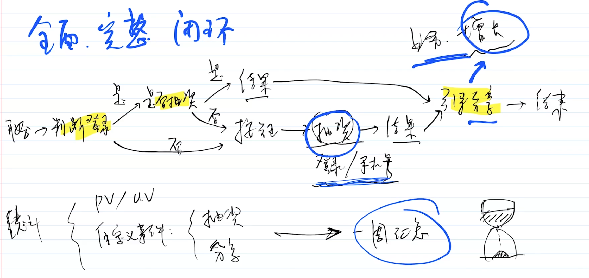

# 3、以架构师的思维来分析需求

你作为前端负责人，来开发一个 h5 页，某个抽奖功能的活动运营。你会要求 server 端提供哪些接口和能力？

- PM
- RD: 后端
## 分析

架构师思维：

- 整体全局思维: 整体流程全面，要看到背后的事情。
- 闭环思维： 活动要什么结果？

接口是根据详细的业务流程来定的。

业务流程：

- 登录
- 展示奖品、活动详情
- 点击抽奖
- 提示抽奖成功、失败
- 成功：填写手机号、地址？然后发放
- 分享: 理解业务、对业务增长负责
- 运营需要数据
	- uv、pv
	- 自定义事件：点击率、停留时常
	- 活动访客来源，可能投入广告，链接加参数，分渠道统计

## 接口

功能：

- 活动详情、奖品
- 抽奖接口: 抽奖、是否已抽过奖
- 登录？是否已抽过奖
- 查看中奖
- 如何发放奖品？填写个人电话、地址？

运营统计

- 埋点：pv、uv、按钮点击、分享？、停留时长
- 分渠道统计、转换率？

