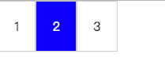

## 基础

### 什么是断言

断言是对结果的一种预期，它是单元测试的核心。很多语言都内置了断言接口，比如`node`的`Assert`，`console.assert`等。

比如现在有个需求，实现两个数的相加。所以写了下面的代码：

```javascript
const add = (a, b) => a + b
```

上面的代码显然是正确的，但是无法证实，而且我有可能写错了，写成了：

```javascript
const add1 = (a, b) => a + b + 2
```

所以我需要验证一下方法的正确性。比如我期望`add(1, 2)`的结果是`3`。这就是一个断言。于是我封装了一个`assert`方法。

```javascript
/**
 * 期望fn()运行结果是result
 */
function assert(message,fn, result){
    return fn() === result
}
asset('我希望1 + 2 = 3', ()=> add(1,2) , 3)  // true
asset('我希望1 + 2 = 3', ()=> add1(1,2) , 3)  // false
```

### 测试框架设计原则

项目中我们往往使用测试框架来进行测试。我们期望测试框架设计成：

1. 抽离代码，避免污染源代码
2. 放在专门的目录,持久化
3. 整体设计
4. 自动运行，显示结果并统计

按照上面的要求可以简单的封装成一个函数。

```javascript
function testCase(message, tests){
    var total = 0
    var success = 0
    for(var test in tests){
        total += 1
        var ret = tests[test](test)

        if(ret){
            success += 1
        }
    }
    console.log( success + '/' + total)
}

function assert(expression, message) {
    console.log(expression, message)
    return expression
}

// 测试用例
testCase('query', {
    'test name = 3'(message){
        return assert(query('name', 'name=3') === 3, message)
    },
    'test name = 3'(message){
        return assert(query('name', '?name=3&age=12') === 3, message)
    }
})
```

上面的代码很简单，只要函数的运行结果和我们的预期一致，则表示这个测试用例成功。

### 什么是TDD测试驱动开发

TDD 是 Test Driven Development。它的流程如下: `分析需求 -> 任务、模块拆解 ->  编写测试用例 -> 快速构建代码(代码差也不要紧，测试保证重构不出错) -> 重构 -> 功能测试、发布`。

- 先有测试，再来开发，测试保障开发不出问题。
- 测试用例和断言
- 单元测试(模块测试)
- 测试框架

TDD 这个理念，很多人推崇，也有很多人反感，我们用它好的地方就行。一些开源库，如 jQuery，lodash ，TDD 再也合适不过的，当然也有不合适的地方，那就不用。

### 持续集成

持续集成是一种软件开发实践，即团队开发成员经常集成他们的工作，通常每个成员每天至少集成一次，也就意味着每天可能会发生多次集成。每次集成都通过自动化的构建（包括编译，发布，自动化测试)来验证，从而尽快地发现集成错误。持续集成的目的是避免集成的问题。

### 持续交付


- [浅谈测试驱动开发（TDD）](https://www.ibm.com/developerworks/cn/linux/l-tdd/)
- [The Difference Between TDD and BDD](https://joshldavis.com/2013/05/27/difference-between-tdd-and-bdd/)


### 流行测试框架

- `qunit` jquery browser
- `mocha` node && browser expressjs
- `jasmine` node && browser vue jsunit演化而来
- `karma` angular a test-runner，让系统的浏览器自动跑，搭配其它框架使用
- `jest` react koa 零配置，内置代码覆盖率，强大的mocks

## jest

### 入门

将`package.json`里的`script test`，改成`jest`。

```javascript
// 测试用例 testCase
test('url parse', ()=>{
    expect(url.parse('?a=1', 'a')).toBe('1')  // 断言
    expect(url.parse('?a=1&b=2', 'b')).toBe('2')
})

test('format date', ()=>{
    expect(formatDate('20110101')).toBe('2011-01-01')
})

// test group
describe('test date', ()=>{
    // test case
    test('format date', ()=>{
        // assert
        expect(formatDate('20110101')).toBe('2011-01-01')
    })

    // test case
    test('format date to timestamp', ()=>{
        expect(formatDate('20110101')).toBe('1312321321')
    })
})
```

- test suits 测试套件，每个文件
- test group
- test case
- test asset

## 配置

可以在`package.json`、`jest.config.js`或者命令行配置。

```javascript
// jest.config.js
module.exports = {
    // testMatch和testRegex互斥，只用一个
    testMatch: ['**/test/**/*.js?(x)', '**/?(*.)(spec|test).js?(x)'], // ['<rootDir>/test/**/*.js']
    testRegex:'',
    testEnvironment:'jsdom', // node
    rootDir:'', // 默认是package.json所在目录，没有则pwd
    moduleFileExtensions: ['js', 'json', 'jsx', 'node]
}

// package.json
{
    "jest":{}
}

// 命令行
jest --watch
```

## 常用的Matchers

因为有些东西不好比较，比如`{a:1}`和`{a:1}`是否值相等。所以出现了matchers。

- `toBe()`: 全等，是通过 Object.is() 实现的。
- `toEqual()`：值相等，可以用于判断对象，如 {a:1} 和 {a:1} 是相等的。
- `not`：将 Matchers 取反，如 not.toBe()
- `toBeNull()`：只能是 null
- `toBeUndefined()`：只能是 undefined
- `toBeDefined()`：非 undefined
- `toBeTruthy()`：匹配为 true 的表达式
- `toBeFalsy()`：匹配为 false 的表达式
- `toBeGreaterThan()`：数字大于
- `toBeGreaterThanOrEqual()`：数字大于或等于
- `toBeLessThan()`：小于
- `toBeLessThanOrEqual()`：小于或等于
- `toBeCloseTo()`： 近似，比如 expect(0.1+0.2).toBeCloseTo(0.3)
- `toMatch()`：可以使用正则 expect('Christoph').toMatch(/stop/)
- `toContain()`：数组包含某个值
- `toThrow()`：匹配抛出的错误，可以是正则或字符串
- `toHaveProperty()`查看某个对象有某个属性

```javascript
// 例子1
function compileAndroidCode() {
    throw new ConfigError('you are using the wrong JDK');
}

test('compiling android goes as expected', () => {
  expect(compileAndroidCode).toThrow();
  expect(compileAndroidCode).toThrow(ConfigError);

  // You can also use the exact error message or a regexp
  expect(compileAndroidCode).toThrow('you are using the wrong JDK');
  expect(compileAndroidCode).toThrow(/JDK/);
});

// 例子2
let person = {
    name: '张三',
    age: 12,
    parent: {
        name: '张二',
        age: 50
    }
}

describe('test person', () => {
    test('person has property', () => {
        expect(person).toHaveProperty('parent')
        expect(null).toBeNull()
        expect('123').toMatch(/\d+/)
        expect('123').not.toMatch(/\d+/)
    })
})

// 例子3
const removeItemByIndex = (i, arr) => {
    arr.splice(i, 1)
    return arr
}

describe('remoteItemByIndex', () => {
    test('remove item by index', () => {
        expect(removeItemByIndex(1, [1, 2, 3])).toEqual([1, 3])
        expect(removeItemByIndex(0, [1, 2, 3])).toEqual([2, 3])
    })
})
```

## 测试DOM

jest 之所以能够测试 dom，是因为内置了`jsdom`(配置里有个`testEnvironment:'jsdom'`)。这是一个 npm 包，它主要是给`nodejs`使用。除了`jsdom`，还有其它一些解决方案，如：`phantomjs`、`chrome headless`。vuejs 的测试方案是 `jasmine+karma`，karma 会捕获本机器上的浏览器并自动运行测试代码。

```javascript
// 例子1: 测试移除dom元素
Pencil.removeNode = (node) => {
    return node.parentNode.removeChild(node)
}
test('remove node', () => {
    document.body.innerHTML = '<div id="p"><p id="c">hello</p></div>'
    const p = document.querySelector('#p')
    expect(p.nodeName.toLowerCase()).toBe('div')
    const c = document.querySelector('#c')
    Pencil.removeNode(c)
    expect(document.querySelector('#c')).toBeNull()
})

// 例子2: 测试点击事件
Pencil.on = (node, type, handler) =>{
    node.addEventListener(type, handler, false)
}
test('on event', () => {
    document.body.innerHTML = '<div id="p"><p id="c">hello</p></div>'
    const p = document.querySelector('#p')
    Pencil.on(btn, 'click', ()=>{
        p.innerHTML = 'clicked'
    })
    p.click()
    expect(p.innerHTML).toBe('clicked')
})
```

## 测试UI组件

下面展示一个测试UI组件的例子，点击按钮时变色，其它按钮恢复原状。



```javascript
// html 结构
<ul>
    <li></li>
    <li></li>
    <li></li>
</ul>

// radio.js 功能文件
function initRadio() {
    const lis = document.querySelectorAll('li')
    let prev = null
    let cur = 0

    lis.forEach((li, i) => {
        li.setAttribute('data-index', i)
        li.addEventListener('click', function () {
            prev = cur
            cur = this.getAttribute('data-index')
            lis[prev].classList.remove('active')
            lis[cur].classList.add('active')
        })
    })
}

module.exports = initRadio


// radio.test.js 测试文件
const fs = require('fs')
const initRadio = require('../js/radio')

describe('test radio', () => {
    test('radio init', () => {
        document.body.innerHTML = fs.readFileSync('./index.html')
        initRadio()

        const lis = document.querySelectorAll('li')
        lis[0].click()
        expect(lis[0].classList.contains('active')).toBe(true)
        expect(lis[1].classList.contains('active')).toBe(false)
        expect(lis[2].classList.contains('active')).toBe(false)

        lis[1].click()
        expect(lis[0].classList.contains('active')).toBe(false)
        expect(lis[1].classList.contains('active')).toBe(true)
        expect(lis[2].classList.contains('active')).toBe(false)
    })
})
```

## 测试异步流程

异步流程需要在完成后调用`done()`方法，否则`jest`会报超时错误。下面是一个简单的例子。

```javascript
function ajax(success) {
    setTimeout(() => {
        const data = { name: 3 }
        success(data)
    }, 1000)
}

test("ajax data.name is 3", done => {
    const success = data => {
        expect(data.name).toBe(3)
        done()
    }
    ajax(success)
})
```

实际中不能访问远程的数据，因为没有`XMLHttpRequest`对象。所以需要使用`mocks`模拟远程数据。

下面是一个测试防抖函数`debounce`的例子。

```javascript
/**
 * 创建 debounce 函数
 * @param {Function} callback
 * @param {Number} time
 */
function createDebounce(callback, time) {
    var timer
    time = time || 300 // 给个默认值

    return function () {
        if (timer) {
            clearTimeout(timer)
        }

        timer = setTimeout(() => {
            callback()
        }, time)
    }
}
describe('debounce', () => {
    test('debounce', done => {
        let a = 1
        let debounce = createDebounce(() => { // 创建一个 debounce
            a = 2
        }, 1000)
        debounce()
        expect(a).toBe(1)
        setTimeout(() => {
            debounce()
            expect(a).toBe(1)
        }, 500)
        setTimeout(() => {
            expect(a).toBe(1)
        }, 1000)
        setTimeout(() => {
            expect(a).toBe(2)
            done()
        }, 2500)
    })
})
```

> 好的代码，能被测试的代码，都是模块化的。

## mocks

擦除函数的实际实现来测试代码之间的链接，模拟对函数的调用。`jest`里的 mocks 有2种：`Mock Function` 和 `Manual mock`。

```javascript
// Mock Function
const forEach = (arr, callback) => {
    for (let i = 0; i < arr.length; i++) {
        callback(arr[i])
    }
}

test('forEach', () => {
    const mockFn = jest.fn()
    forEach([1, 2, 3], mockFn)

    // 调用多少次
    expect(mockFn.mock.calls.length).toBe(3)

    // 参数，第1次的第1个参数
    expect(mockFn.mock.calls[0][0]).toBe(1)
    expect(mockFn.mock.calls[2][0]).toBe(3)
})


// Manual Mock 模拟模块，需要在同级目录创建 __mocks__ 文件夹。
// jquery.js 
module.exports = (selector) => document.querySelector(selector)

// jquery.test.js
jest.mock('jquery')
let $ = require('jquery')

test('jquery', () => {
    document.body.innerHTML = '<div id="box">hello</div>'
    expect($('#box').innerHTML).toBe('hello')
})
```


## 代码覆盖率

代码覆盖率包括：

- line coverage 行覆盖率
- function coverage 函数覆盖率
- branch coverage 分支覆盖率
- statement coverage 语句覆盖率，因为有时候一行写了多条语句，最好把语句按行分开规范化代码

jest 内置了 [istanbul](https://github.com/gotwarlost/istanbul) 生成代码测试覆盖率。

```bash
node_modules/.bind/jest --coverage

// 或者
npx jest --coverage
```

运行上面的命令会在项目根目录生成一个 coverage 的目录。打开 `Icov-report/index.html` 可以查看到测试覆盖率，点击网页上具体的文件，可以看到那些代码没有测试到。


## 怎么使用 es6 的 import 和 export

node 默认是不支持 es6 的模块导入导出的，需要使用 babel 进行转义。具体方法如下：

**1. 安装插件**

```shell
npm i --save-dev babel-jest babel-core regenerator-runtime babel-plugin-transform-es2015-modules-commonjs babel-preset-env
```

- `babel-jest`：安装jest时它会被自动安装，作用是将代码通过 babel 转义。
- `babel-plugin-transform-es2015-modules-commonjs`：用于将es6的 import 和 export 转义
- `regenerator-runtime`：facebook自己出的用于 async/generator 转义的插件
- `babel-preset-env`：会根据当前环境转换不支持的代码。当前环境是指执行编译后代码的环境，比如浏览器比如nodejs 等。babel-preset-env 中存储的是 各个浏览器和其它运行环境的核心版本号以及支持js的版本标识。然后自动生成一个配置给babel来做编译转换。babelrc里设置{  "presets": ["env"] } 会自动转换那些环境不支持的代码。

**2. 配置babel**

jest 默认运行环境就是 test。所以在根目录的 .babelrc 文件新增下面代码：

```javascript
{
    "presets": ["env"],
    "env": {
        "test": {
            "plugins": ["transform-es2015-modules-commonjs"]
        }
    }
}
```

**3. 使用**

```javascript
// es6模块文件：util.js
const util = {
    query: function(str){
        return str.replace(/^.+=/, '')
    }
}

export default util


// 测试文件：__test__/util.js
import util from "../src/query"

test("query a  =  3", () => {
    expect(util.query("a=3")).toBe("3")
})
```


## 介绍

**1. 安装jest**

```
yarn add --dev jest
npm i jest
```

**2. 运行**

```
# 测试，配置package.json的test， { "test": "jest --watchAll"}
npm run test

# 运行某个目录的测试
npx jest src/ --notify --config=config.json

# 运行单文件测试
npx jest 1.test.js
```

### 配置文件

通过`jest --init`命令初始化创建，会在根目录创建`jest.config.js`。

### 使用Babel

```
# 安装 babel-jest regenerator-runtime
yarn add --dev babel-jest babel-core regenerator-runtime

# babel 7，需要安装babel-jest, babel-core@^7.0.0-bridge.0, @babel/core
yarn add --dev babel-jest babel-core@^7.0.0-bridge.0 @babel/core regenerator-runtime
```

如果使用`npm 3/4`或`yarn`不需要安装`regenerator-runtime`。

如果使用es6和react.js，需要配置.babelrc的预设：

```json
{
  "presets": ["env", "react"]
}
```

> 注意：Babel 的 env 配置，jest会自动定义 NODE_ENV 为`test`，它不会在 Babel 没有设置 NODE_ENV 时使用`development`。

> 注意：如果关闭了 es6 module，`{"modules": false}`，需要在测试环境打开它

```json
{
  "presets": [["env", {"modules": false}], "react"],
  "env": {
    "test": {
      "presets": [["env"], "react"]
    }
  }
}
```

> 提示：如果有 babel 配置，安装 jest 时会自动安装`babel-jest`来自动转换文件。如果不需要可以修改`transform`配置。

```json
// package.json
{
    "jest": {
        "transform": {}
    }
}
```

要用 typescript，可以使用[`ts-jest`](https://github.com/kulshekhar/ts-jest)。

## Matchers

toBe使用`Object.js`测试确切的相等性。如果要检查对象值相等，用`toEqual`。

```javascript
// Object.is  和  === 的区别
Object.is(0, +0)  // true
Object.is(-0, +0) // false
Object.is(-0, 0)  // false
Object.is(NaN, NaN) // true

// 测试对象值相等
test('object assignment', () => {
  const data = {one: 1};
  data['two'] = 2;
  expect(data).toEqual({one: 1, two: 2});
});

// 测试反面
expect(3).not.toBe(4)
```

测试中，有时需要区分`undefined`、`null`以及`false`。jest相关的matchers如下：

- `toBeNull`只匹配`null`
- `toBeUndefined`只匹配`undefined`
- `toBeDefined`
- `toBeTruthy`匹配if判断为true的内容
- `toBeFalsy`匹配if判断为false的内容


数字的比较:

```javascript
test('two plus two', () => {
  const value = 2 + 2;
  expect(value).toBeGreaterThan(3);
  expect(value).toBeGreaterThanOrEqual(3.5);
  expect(value).toBeLessThan(5);
  expect(value).toBeLessThanOrEqual(4.5);

  // toBe and toEqual are equivalent for numbers
  expect(value).toBe(4);
  expect(value).toEqual(4);
});
```

对于浮点数相等，使用`toBeCloseTo`而不是`toEqual`，因为您不希望测试依赖于微小的舍入误差。。

```
expect(0.1+0.2).toBeCloseTo(0.3)
```

检查字符串可以使用toMatch:

```
expect('team').not.toMatch(/I/);
expect('Christoph').toMatch(/stop/);
```

数组可以使用`toContain`，不会隐式转换数字和字符串:

```javascript
expect(arr).toContain(1);
```

测试抛出异常：

```
function compileAndroidCode() {
  throw new ConfigError('you are using the wrong JDK');
}

test('compiling android goes as expected', () => {
  expect(compileAndroidCode).toThrow();
  expect(compileAndroidCode).toThrow(ConfigError);

  // You can also use the exact error message or a regexp
  expect(compileAndroidCode).toThrow('you are using the wrong JDK');
  expect(compileAndroidCode).toThrow(/JDK/);
});
```

## 异步代码测试

### 回调函数，使用done

### promise，直接在then或catch里测试，注意要使用return

```javascript
const fetchData1 = () => {
    return new Promise((resolve, reject) => {
        setTimeout(() => {
            resolve(10)
        }, 1000)
    })
}

test('this data is hello', () => {
    return fetchData1().then(data => {
        expect(data).toBe(10)
    })
})

// 使用.resolves将自动resolve()
return expect(fetchData()).resolves.toBe('peanut butter');
// 使用.resolves将自动reject()
return expect(fetchData()).rejects.toBe('peanut butter');
```

### async/await

很简单，像同步即可。

```
test('the data is peanut butter', async () => {
  expect.assertions(1);
  const data = await fetchData();
  expect(data).toBe('peanut butter');
});

test('the fetch fails with an error', async () => {
  expect.assertions(1);
  try {
    await fetchData();
  } catch (e) {
    expect(e).toMatch('error');
  }
});

// 也可以使用.resolves、.rejects
test('the data is peanut butter', async () => {
  expect.assertions(1);
  await expect(fetchData()).resolves.toBe('peanut butter');
});

test('the fetch fails with an error', async () => {
  expect.assertions(1);
  await expect(fetchData()).rejects.toMatch('error');
});
```


## 钩子

```
// 会在每个测试用例test调用之前或之后执行，可以处理异步，使用done
beforeEach(()=>{})
afterEach(()=>{})
beforeEach(()=>{
  return new Promise()
})

// 在测试之前和之后执行
beforeAll()
afterAll()
```

关于作用域问题：

```javascript
// 作用域当前文件的所有testApplies to all tests in this file
beforeEach(() => {
  return initializeCityDatabase();
});

test('city database has Vienna', () => {
  expect(isCity('Vienna')).toBeTruthy();
});

test('city database has San Juan', () => {
  expect(isCity('San Juan')).toBeTruthy();
});

describe('matching cities to foods', () => {
  // 作用于当前describe
  beforeEach(() => {
    return initializeFoodDatabase();
  });

  test('Vienna <3 sausage', () => {
    expect(isValidCityFoodPair('Vienna', 'Wiener Schnitzel')).toBe(true);
  });

  test('San Juan <3 plantains', () => {
    expect(isValidCityFoodPair('San Juan', 'Mofongo')).toBe(true);
  });
});
```

忽略其它的test。使用`test.only()`进行调试。

## mock

```

function forEach(items, callback) {
    for (let index = 0; index < items.length; index++) {
        callback(items[index])
    }
}

const mockCallback = jest.fn(x => 42 + x)

forEach([0, 1], mockCallback)

expect(mockCallback.mock.calls.length).toBe(2)
expect(mockCallback.mock.calls[0][0]).toBe(0)
expect(mockCallback.mock.calls[1][0]).toBe(1)
expect(mockCallback.mock.result[0].value).toBe(42)

// 调用函数的this实例
expect(someMockFunction.mock.instances.length).toBe(2);
```

### mock返回值

```
const myMock = jest.fn();
console.log(myMock());
// > undefined

myMock
  .mockReturnValueOnce(10)
  .mockReturnValueOnce('x')
  .mockReturnValue(true);

console.log(myMock(), myMock(), myMock(), myMock());
// > 10, 'x', true, true

// 例子
const filterTestFn = jest.fn();

// Make the mock return `true` for the first call,
// and `false` for the second call
filterTestFn.mockReturnValueOnce(true).mockReturnValueOnce(false);

const result = [11, 12].filter(filterTestFn);

console.log(result);
// > [11]
console.log(filterTestFn.mock.calls);
// > [ [11], [12] ]
```

## 模拟模块

下面的方法，模拟axios模块后，再模拟get的返回值。

```javascript
// users.js
import axios from 'axios';

class Users {
  static all() {
    return axios.get('/users.json').then(resp => resp.data);
  }
}

export default Users;


// users.test.js
import axios from 'axios';
import Users from './users';

jest.mock('axios');

test('should fetch users', () => {
  const resp = {data: [{name: 'Bob'}]};
  axios.get.mockResolvedValue(resp);

  // or you could use the following depending on your use case:
  // axios.get.mockImplementation(() => Promise.resolve(resp))

  return Users.all().then(users => expect(users).toEqual(resp.data));
});
```


## 周边库

## 快照测试

## dom操作


## 学习资料

- [行为驱动开发（BDD）全面介绍](https://blog.csdn.net/winteroak/article/details/81585299)
- [前端自动化测试探索](http://fex.baidu.com/blog/2015/07/front-end-test/)
- [如何进行前端自动化测试？](https://www.zhihu.com/question/29922082)
- [jest document](https://facebook.github.io/jest/docs/en/getting-started.html)
- [jest matchers](https://jestjs.io/docs/en/expect.html)
- [断言库chaijs](https://www.chaijs.com/)
- [实例解析防抖动（Debouncing）和节流阀（Throttling）](https://jinlong.github.io/2016/04/24/Debouncing-and-Throttling-Explained-Through-Examples/)
