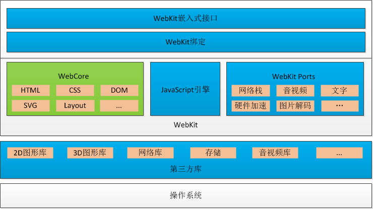

# 前端面试题大全

https://juejin.cn/post/6844904094281236487#heading-19
https://juejin.cn/post/6844904121510854664#heading-28
https://juejin.cn/post/6844904041915351048
https://gitee.com/zhufengpeixun/projects
https://github.com/mqyqingfeng/Blog
## 其它

简单自我介绍, 做过哪些项目, 使用哪些技术栈 ?
如何看待前端框架选型 ?
工作中最出色的点, 和你最头疼的问题 如何解决的 ?
平时如何学习, 最近接触了解了哪些新的知识 ?
简单自我介绍, 介绍一下你的项目, 技术栈 ?
工作中最得意和出色的点, 头疼的点, 问题如何解决的
为何换工作?

## 计算机基础

- 介绍你所理解的工厂模式?
- 介绍你所理解的装饰器模式?

::: details 你所理解,同步和异步的区别是什么?阻塞与非阻塞？
- 同步异步关注的是消息通信机制，同步是调用者主动等待被调用者的结果，异步是被调用者来通知调用者结果。是针对调用者来说的(如 js 发 ajax)。
- 阻塞和非阻塞关注的是程序(不是指调用者，也可能是被调用者)等待结果时的状态，阻塞是结果返回之前，调用者挂起，非阻塞是结果返回之前，调用者仍然运行。往往是针对被调用者(浏览器线程)来说的。
:::

::: details 扫描二维码登录网页是什么原理，前后两个事件是如何联系的?
1.  用户打开页面，会返回一个临时的 uuid，网页端不停发 login 请求检查登陆，会请求 uuid 的绑定信息（请求 pending 状态)，超时则重发(timeout=35s)。
2.  用户使用微信 app 扫码(会发送微信账号密码等验证)成功后，微信 server 返回给网页用户的头像信息。
3.  网页端继续发 login 请求，当用户点确定时，微信 server 返回网页端 token 登陆成功。
4.  在超时、网络断开、其他设备上登录后，此前获得的令牌或丢失、或失效，对授权过程形成有效的安全防护。
:::

## HTML

- 简单说下你理解的语义化，怎样来保证你写的符合语义化？HTML5 语义化标签了解下？
- DOCTYPE 的作用是什么?

## CSS

- 在 css 中 link 和@import 的区别是什么？
- CSS 伪类和伪元素区别
- Css 预处理器的概念
- 什么情况下出现浏览器分层？

## JavaScript

- 多种方式实现数组去重、扁平化、对比优缺点

:::details 多种方式实现深拷贝、对比优缺点
1. JSON.stringify + JSON.parse
2. 
:::

- 手写函数柯里化工具函数、并理解其应用场景和优势
- 手写防抖和节流工具函数、并理解其内部原理和应用场景

:::details 实现一个sleep函数
```js
funciton sleep(n, callback){
  return new Promise((resolve)=>{
    setTimeout(resolve, n*1000)
  }).then(()=>{
    callback && callback()
  })
}
```
:::
- 手动实现call、apply、bind
- 手动实现符合Promise/A+规范的Promise、手动实现async await
- 手写一个EventEmitter实现事件发布、订阅
- 可以说出两种实现双向绑定的方案、可以手动实现
- 手写JSON.stringify、JSON.parse
- 手写一个模版引擎，并能解释其中原理
- 手写懒加载、下拉刷新、上拉加载、预加载等效果
- 防抖节流原理、区别以及应用，请用 js 实现。
- 请用 JS 代码实现事件代理
- 使用 TS 的优势有哪些?
- 说明一下 JS 封装的原理
- 说明下 JS 继承的原理？

::: details 手写实现下 Object.freeze
```js
// 无法新增 编辑 删除现有属性，可以修改第二级对象的属性值
function freeze(obj) {
  Object.keys(obj).forEach((key) => {
    Object.defineProperty(obj, key, {
      writable: false,
      // configurable: false
    });
  });
  Object.seal(obj); //不能添加新属性和删除属性，可修改，不可配置
}

function deepFreeze(object) {
  const propNames = Object.getOwnPropertyNames(object);
  for (const name of propNames) {
    const value = object[name];
    if (value && typeof value === "object") {
      deepFreeze(value);
    }
  }
  return Object.freeze(object);
}
```
:::

- js 异步解决方案有哪几种

```
callback
setTimeout
Promise
async await
```

- Promise.resolve(obj), obj 有几种形式
- 说说 ES6 对 Object 类型做了哪些优化更新?
- 介绍 class 和 ES5 的类以及区别
- javascript 创建对象的几种方式?
- Promise 构造函数是同步还是异步执行，then 呢？
- promise 有没有解决异步的问题
- 请解释下 jsonp 的工作原理
- JS 为什么要区分微任务和宏任务?

## 浏览器相关

- 介绍一下你对浏览器内核的理解?

```
浏览器内核就是浏览器引擎，主要包含渲染引擎和 js 引擎。

产品       浏览器内核    js引擎
Mozilla     Gecko      spiderMonkey
Google/Edge  Blink           v8
Apple       Webkit    javascriptcore
ie          Trident
Chromium 是 Google 的一个开源浏览器项目

```



- 什么是同源限制？同源限制的目的？哪些地方会有同源限制？
- 为什么要限制 ajax 同源？答案：[why-the-cross-domain-ajax-is-a-security-concern](https://stackoverflow.com/questions/466737/why-the-cross-domain-ajax-is-a-security-concern)
- [我知道的跨域与安全](https://juejin.im/post/5a6320d56fb9a01cb64ee191)
- 浏览器的本地存储 cookie 了解多少？WebStorage 了解多少？

```
localStorage 在各浏览器中的存储大小是多少？超出会怎样？e.name === QuotaExceededError
```

- 浏览器缓存机制对于开发很重要，介绍一下协商缓存和缓存位置？
- 如何加快页面渲染速度，都有哪些方式？
- 说一下栈和堆的区别，垃圾回收时栈和堆的区别？
- 添加原生事件不移除为什么会内存泄漏，还有哪些地方会存在内存泄漏？

## Vue

- vue优点？
- Vue 是如何收集依赖的?
- Vue 中的 key 有什么作用?
- 说一下 Vue 的父组件和子组件生命周期钩子函数执行顺序？
- 使用过 Vue SSR 吗？说说 SSR？
- 说一下 Vue 的$nextTick 原理
- 说一下 Vue 单页与多页的区别?
- v-model 是如何实现的，语法糖实际是什么？
- 怎样理解 Vue 的单向数据流？
- 关于对 Vue 项目进行优化，你有哪些方法?
- 对虚拟 DOM 的理解？虚拟 DOM 主要做了什么？虚拟 DOM 本身是什么？
- 说一下 Vue 的 keep-alive 是如何实现的，具体缓存的是什么？
- Redux 和 Vuex 有什么区别,说一下它们的共同思想?
- 为什么组件中的 data 必须是一个函数，然后 return 一个对象，而 new Vue 实例里，data 可以- 直接是一个对象？
- 直接给一个数组项赋值，Vue 能检测到变化吗？
- Vue 组件间通信有哪几种方式？
- 子组件可以直接改变父组件的数据么？说说你的理由？(vue 部分)
- Vuex 和 localStorage 的区别是什么？
- 说一下 Vue 的生命周期以及每个阶段做的事情
- 说一下 Vue template 到 render 的过程
- 能说下 vue-router 中常用的 hash 和 history 路由模式实现原理吗？
- SSR 和 客户端渲染有什么区别 , vue 是如何实现绑定事件的 ?
- react 和 vue 的比较 ?
- vue常用的修饰符及作用？
- 计算属性和 watch 的区别？
::: details vue 的双向绑定的原理是什么？
- 自定义组件的语法糖 v-model 是怎样实现的？
1. 它会将对象变成一个 Observer 对象
  1. 对象会递归调用 Object.defineProperty 设置 get set 
  2. 数组会改写 push pop 等方法
  3. 新增的对象和数组元素里的对象也会变成响应式
::: 

- `keep-alive`的作用是什么?
- 如何获取dom?
- 计算属性和普通属性的区别是什么
- Vue-cli 默认是单页面的，如果要开发多页面应该怎么办?
- 说说 Vue 开发如何针对搜索引擎做 SEO 优化?
- 介绍下 vue-router 中的导航钩子函数
- 说一下 vue-router 的原理是什么?
- 说出几种vue当中的指令和它的用法？
1.熟练使用Vue的API、生命周期、钩子函数
2.MVVM框架设计理念
3.Vue双向绑定实现原理、Diff算法的内部实现
4.Vue的事件机制
5.从template转换成真实DOM的实现机制


https://juejin.cn/post/6844904097544405000
## React

::: details 为什么 JSX 中不能直接使用 if…else
jsx 会编译成 createElement 方法，它是根据结果来创建 vdom，里面不支持执行 js 代码。只能渲染一个结果。
:::

::: details jsx条件渲染的方式? 如何在 JSX 中调试代码？
1. 三元运算符
2. 自执行函数，内部可以 if 判断后返回 return 
拆分之后，就可以在里面 console.log 了。
:::

::: details 如何让 jsx 支持 v-for
在编译时，对 ast 进行处理。如返回类似如下代码
list.map(item=> React.createElement())
:::

- 介绍 React 高阶组件，适用于什么场景？

- react 里组件通信有几种方式，分别怎样进行通信？
- React 组件中怎么做事件代理？它的原理是什么？
::: details shouldComponentUpdate 是为了解决什么问题？
:::
- 说一下 mobx 和 redux 有什么区别？

:::details React 里 setState 到底是异步还是同步？ 
React 控制的事件处理过程，setState 不会同步更新 this.state。而在 React 控制之外的情况， setState 会同步更新 this.state。
内部有个批量更新的开关，在事件处理函数执行时会打开，然后往2个队列里分别添加更新的状态和回调。事件处理函数的末尾会去依次执行这些更新，然后再依次执行回调，执行完成后，会将开关关闭。
::: 

- react-redux 的工作流程是什么？

- 说一下你对 React context 的理解

::: details 说一下 React.Component 和 React.PureComponent 的区别
PureComponent 继承自 Component，改写了 shouldComponentUpdate 方法，如果props和state浅比较 shadowEqual 相等的话，就不会更新
::: 

- 使用 import 时，webpack 对 node_modules 里的依赖会做什么?
- React SSR 实现过程？
- React SSR 实现原理是什么,需要注意什么事项？

::: details 为什么在开发过程中，尽量减少类似将最后一个节点移动到列表首部的操作？
:::

::: details 有key 一定快吗?
不一定，比如一个列表，需要修改下id 和内容，有 key 会 diff 和移动位置。而直接改文字和 id 反而更快。
:::

- 请解释 React 中 props 和 state 的区别？
- react-router 里的 Link 标签和 a 标签有什么区别？
- 介绍下你所理解的 React 设计思路,它的理念是什么?
- 说一下 React setState 原理
- React 高阶组件、Render props 和 hooks 有什么区别,为什么不断迭代?
- React 怎么做数据检查和变化？
- 请你谈谈对无状态的理解(React 部分)
- react 虚拟 DOM 是什么? 如何实现? 说一下 diff 算法 ?
- React Diff 算法 ?
- 和一面前 3 问基本一致,简述项目,React vue 区别 virsualDOM 实现
- React 事件绑定原理是什么？
- React key 是干什么用的,为什么要加上 key 呢?
- 说一下你所了解的 react-fiber?
1.React 和 vue 选型和优缺点、核心架构的区别
- https://www.zhihu.com/question/301860721/answer/724759264
2.React 中 setState 的执行机制，如何有效的管理状态
3.React的事件底层实现机制
4.React的虚拟DOM和Diff算法的内部实现
5.React的Fiber工作原理，解决了什么问题
6.React Router和Vue Router的底层实现原理、动态加载实现原理
7.可熟练应用React API、生命周期等，可应用HOC、render props、Hooks等高阶用法解决问题
8.基于React的特性和原理，可以手动实现一个简单的React

## 工程化与 webpack

::: details 常见的 loader 以及作用的总结
- css 类
  - less-loader
  - style-loader
  - css-loader
  - 提取css的？
  - postcss-loader
- js 类
  - ts-loader
  - babel-loader
- 文件类
  - file-loader
  - url-loader
  - image-loader 压缩图片
  - svg-inline-loader 将 svg 变成行内
- html-loader 将 HTML 导出为字符串
- raw-loader 加载文件原始内容 utf8
- vue-loader
- eslint-loader: 检查 js 代码
- tslint-loader: 检查 ts 代码
:::

::: details 常见的 plugin 以及作用的总结
- html-webpack-plugin
- clean-webpack-plugin
- copy-webpack-plugin
- mini-css-extract-plugin 分离 css
- terser-webpack-plugin 压缩 js
- webpack.definePlugin
:::

::: details Loader 和 Plugin 的区别是什么？
loader 主要是用来处理文件，因为 webpack 默认只能处理 js、json 文件，它本质是个函数，将上一个 loader 返回的结果或源代码处理，返回新的代码
plugin 能做 loader 不能做的事情，基于 tapable 事件流，类似 node 里的 EventEmitter。比如编译前删除文件，拷贝文件、能改变输出结果等。
loader 配置 module.rules 里，可以配置 test use options 等
plugins 传入的是个插件实例数组
:::

::: webpack 中 source map 是什么？生产环境怎么用？
webpack 会将源代码经过 loader 转换，比如 es6 生成 es5。
sourcemap 可以根据转换后的位置定位到源代码的位置
生产环境一般是 hidden-source-map，利用插件 proxx 将 sourcemap 从打包目录移动到另外目录。sourcemap 里的地址换成只能内网或限制ip访问的 url。或者自己本地代理。
:::

- webpack 介绍?
::: details webpack 打包的整个过程？
- 初始化 compiler
  - 初始化基本配置
  - 初始化文件环境，将 node fs 挂到 compiler 上，方便读写文件
  - 注册内置、配置里的插件
  - 挂载一些默认配置
  -  每个入口文件创建一个 EntryPlugin 钩子，然后调用，会挂载编译 make 钩子
- compiler run 方法开始编译
  - beforeRun
  - run
  - beforeCompile
  - compile
    - 创建 Compilation，里面有个 NormalModuleFactory 用来创建每个模块
  - make 开始构建，就是初始化时注册的 make
    - Compilation.addEntry 根据入口文件开始搜集模块
      - 搜集模块时，会读取源文件，将代码转成 ast
      - 遍历 ast,找到 require import，删除替换成 __webpack_require__ 函数
      - 重新将 ast 转换成代码
      - 每个模块build完成后，会调用钩子 succeedModule
    - 搜集完成后，如果有依赖就继续递归搜集，搜集过程中会将 entries、modules挂载到 Compilation 上
    - Compilation seal，
      - beforeChunks
      - chunks 就是根据入口和模块生产 Chunk,和入口同名的就是一个chunk
      - afterChunks
      - 将要产出的文件放在assets上
  - afterCompile
- 输出文件阶段
  - should-emit 
  - emit 开始输出文件，就是遍历 assets 开始写文件，可以修改输出内容
  - after-emit
  - done
  - failed
:::

::: details Import 和 CommonJs 在 webpack 打包过程中有什么不同
es6 import 会转成 commonjs 规范，export default 会放在对象的 default 上
:::

- dev-server 是怎么跑起来的？
- 如何实现 webpack 持久化缓存?
- webpack 热更新的原理
- webpack 打包时 Hash 码是怎样生成的？随机值存在一样的情况，如何避免？
- webpack 做了什么？使用 webpack 构建是有无做了一些自定义操作？
- webpack 如何用 localStorage 离线缓存静态资源？

::: details webpack 里面的插件是如何实现的？
:::

- 说一下关于 tree-shaking 的原理
- webpack 生命周期？loader 和 plugin 有什么区别?
   loader 是在部分生命周期内执行的，主要目的是为了转换模块。plugin 是 webpack 的核心，webpack 本身就是基于它的，存在于各个生命周期中，能做更多事情。
- webpack loader 的设计原则?
- 项目优化？
- 抽取公共文件是怎么配置的？

::: details import { Button } from 'antd' ，打包的时候只打包 button，分模块加载，是怎么做到的?
是使用 ast 转换成了 import Button from 'antd/button'
::: 

- 使用 import 时，webpack 对 node_modules 里的依赖会做什么?
::: detail webpack 如何配 less，需要配哪些 loader? 配 css 需要哪些 loader?
   less-loader, css-loader, style-loader
:::

- 如何配置把 js、css、html 单独打包成一个文件?简单的活动页。

::: details 如何实现异步加载? 
使用 import()函数
:::

- 如何实现分模块打包（多入口)?
- 使用 webpack 构建时有无做一些自定义操作?
- webpack 的原理, loader 和 plugin 是干什么的? 有自己手写过么?
- Rollup 和 webpack 区别, treeshaking 是什么?

## 测试

## 网络协议

## 安全

- 能不能说一说 XSS 攻击？
- 能不能说一说 CSRF 攻击？

## NodeJs

**Storage**

1. `storage`事件什么时候触发，它能做什么？事件对象里的`key`、`newValue`、`oldValue`、`storageArea`、`url`属性分别是什么？

### 网页元素接口

## nodejs

### OS

- 什么是 TTY? 如何判断是否处于 TTY 环境?
- 不同操作系统的换行符 (EOL) 有什么区别?
- 什么是负载？怎么查看？不同值的负载表示什么？[答案](/note/nodejs/eleme-os/)
- 如何知道我的系统有多少核心？[答案](/note/nodejs/eleme-os/)
- CPU 负载和 CPU 使用率的区别？[答案]
- 什么是 CPU 时间片？
- ulimit 是用来干什么的?

### 错误处理/调试(未完成)

1. 怎么处理未预料的出错? 用 try/catch ，domains 还是其它什么? [more]
1. 什么是 uncaughtException 事件? 一般在什么情况下使用该事件? [more]
1. domain 的原理是? 为什么要弃用 domain? [more]
1. 什么是防御性编程? 与其相对的 let it crash 又是什么?
1. 为什么要在 cb 的第一参数传 error? 为什么有的 cb 第一个参数不是 error, 例如 http.createServer?
1. 为什么有些异常没法根据报错信息定位到代码调用? 如何准确的定位一个异常? [more]
1. 内存泄漏通常由哪些原因导致? 如何分析以及定位内存泄漏? [more]

### 测试

1. 什么是断言？
1. 什么是 TDD、ATDD、BDD?分别举例说明流程。
1. 单元测试的原理简单实现?
1. 什么是黑盒测试，什么是白盒测试?
1. 什么是单元测试、集成测试、基准测试、压力测试？说说你是怎么测试的？

## 正在进行中

- [yangshun/front-end-interview-handbook](https://github.com/yangshun/front-end-interview-handbook/blob/master/Translations/Chinese/README.md)
- [h5bp/Front-end-Developer-Interview-Questions](https://github.com/h5bp/Front-end-Developer-Interview-Questions)

## 面试题来源

- https://wangdoc.com/javascript/
- https://juejin.im/post/5c8f30606fb9a070ef60996d
- https://juejin.im/post/5c64d15d6fb9a049d37f9c20
- https://juejin.im/post/5a998991f265da237f1dbdf9
- [前端面试题 300 道](https://blog.csdn.net/qq_22944825/article/details/78169321)
- https://blog.csdn.net/qq_20264891/article/details/79158495
- [前端开发面试题](https://github.com/markyun/My-blog/tree/master/Front-end-Developer-Questions/Question)
- [poetries/FE-Interview-Questions](https://github.com/poetries/FE-Interview-Questions)
- [poetries/FE-Interview-Questions/issue](https://github.com/poetries/FE-Interview-Questions/issues/2)
- [airuikun/Weekly-FE-Interview](https://github.com/airuikun/Weekly-FE-Interview)
- [FEGuideTeam/FEGuide](https://github.com/FEGuideTeam/FEGuide)
- [Advanced-Frontend/Daily-Interview-Question](https://github.com/Advanced-Frontend/Daily-Interview-Question)
- http://javascript-puzzlers.herokuapp.com/
- http://dy.163.com/v2/article/detail/D7NJ9PU30511PJRO.html
- https://github.com/yygmind/blog
- [paddingme/Front-end-Web-Development-Interview-Question](https://github.com/paddingme/Front-end-Web-Development-Interview-Question)
- [haizlin/fe-interview](https://github.com/haizlin/fe-interview)
- [jirengu/frontend-interview](https://github.com/jirengu/frontend-interview)
- [qiu-deqing/FE-interview](https://github.com/qiu-deqing/FE-interview)
- [huruji/FE-Interview](https://github.com/huruji/FE-Interview)
- [woai3c/Front-end-basic-knowledge](https://github.com/woai3c/Front-end-basic-knowledge)
- https://github.com/HerbertKarajan/Fe-Interview-questions
- https://github.com/cuitianze/Front-end-Developer-Interview-Questions-of-Chinese
- [lengyue1024/BAT_interviews](https://github.com/lengyue1024/BAT_interviews)
- https://github.com/fex-team/interview-questions
- https://juejin.im/post/5c1eec7bf265da61477034ae
- https://github.com/khan4019/front-end-Interview-Questions
- https://github.com/helloqingfeng/Awsome-Front-End-learning-resource
- https://github.com/PengKen/-web-
- https://juejin.im/post/5c356f68f265da61483bca61
- https://github.com/AlloyTeam/Mars
- https://juejin.im/post/5c1eec7bf265da61477034ae
- https://www.zhihu.com/question/24964987/answer/586425979


观察者模式实现?
http 报文头部有哪些字段? 有什么意义 ?
移动端高清方案如何解决 ?
简述从网页输入 url 到网页展示的过程发生了哪些事情 ?
简述公司 node 架构中容灾的实现 ?
浏览器事件有哪些过程? 为什么一般在冒泡阶段, 而不是在捕获阶段注册监听? addEventListener 参数分别是什么 ?
面向对象如何实现? 需要复用的变量 怎么处理 ?
移动端 300ms 延时的原因? 如何处理?
主流框架的数据单向/双向绑定实现原理 ?
简述转行经历, 如何学习 ?
你觉得自己在前端工作的最大的优点是什么 拿实际工作的内容举例?
技术二面
DIFF 算法为什么是 O(n)复杂度而不是 O(n^3)
http code 码?
移动端 rem 布局如何实现? 简述原理?
JSbridge 原理, js 和 native 是如何通信的?


TCP 三次握手的过程, get post 请求的区别 ?
静态文件的浏览器缓存如何实现?
前端跨域方案
http 请求包含哪些字段 分别是什么意思
js 有哪些数据类型 如何判断? null 和 undefined 区别 应用场景?
new String('a') 和 'a' 是一样的么?
移动端如何实现下拉到底部 跟随移动 结束后回弹的动画?
移动端如何优化首页白屏时间过长 ?
ES6 generator 函数简述
数组去重实现?
js 浮点数运算不精确 如何解决?

技术三面
公司的前端工程化实践
转行之后是如何自学前端的, 学习途径 有没有一些自己的代码
DOM 基础知识,添加元素,删除元素等等...
DOM 节点类型
正则表达式如何匹配一段 url ?在正则表达式中有哪几种作用?
移动端优化方式? 离线包是如何实现的?
最后聊了一下项目,聊了一下目前公司


- 浏览器缓存机制(1)对于开发很重要，强缓存的内容能了解多少呢？
- 介绍 js 全部数据类型，基本数据类型和引用数据类型的区别

- 谈谈你对重绘和回流的理解？

- 说一下事件循环机制(node 浏览器)

- HTTP 请求特征是什么？

- 布局都有什么方式，float 和 position 有什么区别？

- 移动端需要注意什么？
- 响应式布局用到的技术有几种方式？
- 词法作用域和 this 的区别

- 请描述下 css 盒模型基本概念
- 怎么处理项目中的异常捕获行为？
- 点击一个按钮，浏览器会做些什么事情？

- CSS 预处理器的好处
- 与 HTTP 相关的协议有哪些？TCP/IP DNS URI/URL HTTPS
- CDN 有哪些优化静态资源加载速度的机制？
- 说说你理解的 node 中间层怎样做的请求合并转发？

- 说一下 mysql 和 mongodb 的区别?

- 项目如何管理模块？
- 在哪个生命周期内调用异步请求？

- 写出常用的页面优化实现方案？
- 回调函数和任务队列的区别
- 如何理解事件委托？
- BFC 是什么？触发 BFC 的条件是什么？有哪些应用场景？
- 说一下单向数据流有什么好处？
- 类数组转化为数组

)

- 实现数组去重
- 描述下 JS 中 Prototype 的概念？
- 实现数组扁平化
- 为什么不建议使用通配符初始化 css 样式?
- 说一下 koa2 和 express 区别?
- link 标签定义
- 渲染过程中遇到 JS 文件怎么处理?(浏览器解析过程)
- Object.is()与原来的比较操作符 "===" 、"==" 的区别?
- 三种事件模型是什么?

- iframe 有哪些缺点?
- 说说你对浏览器的理解?
- 谈谈你对 ajax 的理解?
- 简单介绍使用图片 base64 编码的优点和缺点.
- 请说出目前主流的 js 模块化实现的技术有哪些?他们的区别在哪儿?
- for..in 和 Object.keys 的区别
- 哪些操作会造成内存泄漏?
- 什么是浏览器的同源策略?
- 说一下你理解 margin 重叠的问题.
- 网页验证码是干嘛的，是为了解决什么安全问题?
- display、position 和 float 的相互关系?
- 前端需要注意哪些 SEO?
- 简单说一下 V8 引擎的垃圾回收机制
- 说一说对 JSON 的理解?
- 渲染页面时常见的不良现象有哪些?(浏览器渲染过程)
- 说一下 html 布局元素的分类有哪些?以描述下每种布局元素的应用场景么?
- componentWillReceiveProps 的触发条件是什么？
- javascript 代码中的"use strict"是什么意思?为什么使用它?
- 什么是 Polyfill ?

- 说一下你所理解 JavaScript 中的作用域与变量声明提升?
- 内部属性[[Class]]是什么?
- 检测浏览器版本版本有哪些方式?

- 如何解决跨域问题?
- margin 和 padding 分别适合什么场景使用?
- CSS 多列等高如何实现?
- 如何处理 HTML5 新标签的浏览器兼容问题?

- 说一下你所理解的渲染原理?
- 如何判断一个对象是否属于某个类?
- 什么是 DOM 和 BOM?
- CSS 选择符有哪些?
- 标准模式与兼容模式各有什么区别?
- css 如何阻塞文档解析?(浏览器解析过程)
- 说一下你所了解的 javascript 的作用域链?
- DOMContentLoaded 事件和 Load 事件的区别?
- Symbol 值的强制类型转换?
- HTML5 有哪些新特性、移除了哪些元素?
- 说一下对 DTD 的理解。
- 常见浏览器所用的内核
- 什么是文档的预解析?(浏览器解析过程)
- js 继承的几种实现方式?
- 说一下你理解的 HTTPS 中间人攻击 ?
- 说一下你所理解的观察者模式?
- SGML、HTML、XML 和 XHTML 的区别?
- 异步编程的实现方式是什么?
- 什么是函数柯里化?
- 说一下 import 的原理，和 require 的不同之处在哪儿?
- 使用 Object.defineProperty() 来进行数据劫持有什么缺点?
- 面向对象的三要素是什么，分别是什么意思?
- 说一下 base64 的编码方式
- 数组去重
- 介绍你所理解的中介者模式?
- 你所理解的前端路由是什么?
- SSL 连接断开后如何恢复 ?
- 说一下 ajax/axios/fetch 三者的区别
- Reflect 对象创建目的是什么?
- require 模式引入的查找方式是什么?
- addEventListener 在 removeListener 会不会造成内存泄露?
- CDN 访问过程是什么？
- node 性能如何监控？
- 为什么 useState 要使用数组而不是对象?
- Node 更适合处理 I/O 密集型任务还是 CPU 密集型任务,为什么?
- 用微服务有什么好处？
- 什么是微服务？

- 查找重复元素
- **字符串陷阱** 请输出结果并进行解释
- **提升变量** 请输出结果并进行解释
- 添加元素(指定位置添加)
- **filter 过滤器** 请输出结果并进行解释
- 求两个数组的交集
- 给定一个整数数组，找到从三个整数中产生的最大乘积
- 说一下你理解的 CORS。
- 什么是 CDN 服务?
- 实现单点登录的原理


- node 性能如何优化？
- 微服务和单体应用的区别是什么？
- 移除数组中的元素(返回新的数组)
- 在末尾添加元素
- **神奇的 null** 请输出结果并进行解释
- **优先级顺序** 请输出结果并进行解释
- 给定一个整数数组，请找出两个元素之间的最大差，较小值的元素必须位于较大元素之前
- 查找数组元素位置
- 数组形式的整数加法
- Redux 中间件是如何拿到 store 和 action?
- 介绍你所理解的组合模式?
- 了解函数式编程中的 compose 么?
- 字符的最短距离
- 对称加密和非对称加密的区别和用处
- 用栈实现队列

- 手动实现数组 Reduce 方法
- 字符串解码
- 介绍你所理解的迭代器模式?

- 讲一下你所了解的函数式编程
- 最多能完成排序的块
- 介绍你所理解的单例模式?
- 设计一个支持增量操作的栈
- 虚拟列表是什么?说一下它的实现原理?
- 说一下 JavaScript 的宿主对象和原生对象的区别?
- 二叉树的最大深度
- 浏览器都有哪些进程，渲染进程中都有什么线程?
- LRU 缓存机制
- 什么是跨域?都有哪些方式会造成跨域?
- 请问如何进行首页加载优化?
- 相交链表


JavaScript基础

前端工程师吃饭的家伙，深度、广度一样都不能差。
变量和类型

1.JavaScript规定了几种语言类型
2.JavaScript对象的底层数据结构是什么
3.Symbol类型在实际开发中的应用、可手动实现一个简单的Symbol
4.JavaScript中的变量在内存中的具体存储形式
5.基本类型对应的内置对象，以及他们之间的装箱拆箱操作
6.理解值类型和引用类型
7.null和undefined的区别
8.至少可以说出三种判断JavaScript数据类型的方式，以及他们的优缺点，如何准确的判断数组类型
9.可能发生隐式类型转换的场景以及转换原则，应如何避免或巧妙应用
10.出现小数精度丢失的原因，JavaScript可以存储的最大数字、最大安全数字，JavaScript处理大数字的方法、避免精度丢失的方法
原型和原型链
1.理解原型设计模式以及JavaScript中的原型规则
2.instanceof的底层实现原理，手动实现一个instanceof
4.实现继承的几种方式以及他们的优缺点
5.至少说出一种开源项目(如Node)中应用原型继承的案例
6.可以描述new一个对象的详细过程，手动实现一个new操作符
7.理解es6 class构造以及继承的底层实现原理
作用域和闭包
1.理解词法作用域和动态作用域
2.理解JavaScript的作用域和作用域链
3.理解JavaScript的执行上下文栈，可以应用堆栈信息快速定位问题
4.this的原理以及几种不同使用场景的取值
5.闭包的实现原理和作用，可以列举几个开发中闭包的实际应用
6.理解堆栈溢出和内存泄漏的原理，如何防止
7.如何处理循环的异步操作
8.理解模块化解决的实际问题，可列举几个模块化方案并理解其中原理
执行机制
1.为何try里面放return，finally还会执行，理解其内部机制
2.JavaScript如何实现异步编程，可以详细描述EventLoop机制
3.宏任务和微任务分别有哪些
4.可以快速分析一个复杂的异步嵌套逻辑，并掌握分析方法
5.使用Promise实现串行
6.Node与浏览器EventLoop的差异
7.如何在保证页面运行流畅的情况下处理海量数据
语法和API
1.理解ECMAScript和JavaScript的关系
2.熟练运用es5、es6提供的语法规范，
3.熟练掌握JavaScript提供的全局对象（例如Date、Math）、全局函数（例如decodeURI、isNaN）、全局属性（例如Infinity、undefined）
4.熟练应用map、reduce、filter 等高阶函数解决问题
5.setInterval需要注意的点，使用settimeout实现setInterval
6.JavaScript提供的正则表达式API、可以使用正则表达式（邮箱校验、URL解析、去重等）解决常见问题
7.JavaScript异常处理的方式，统一的异常处理方案


HTML和CSS


HTML
1.从规范的角度理解HTML，从分类和语义的角度使用标签
2.常用页面标签的默认样式、自带属性、不同浏览器的差异、处理浏览器兼容问题的方式
3.元信息类标签(head、title、meta)的使用目的和配置方法
4.HTML5离线缓存原理
5.可以使用Canvas API、SVG等绘制高性能的动画
CSS
1.CSS盒模型，在不同浏览器的差异
2.CSS所有选择器及其优先级、使用场景，哪些可以继承，如何运用at规则
3.CSS伪类和伪元素有哪些，它们的区别和实际应用
4.HTML文档流的排版规则，CSS几种定位的规则、定位参照物、对文档流的影响，如何选择最好的定位方式，雪碧图实现原理
5.水平垂直居中的方案、可以实现6种以上并对比它们的优缺点
6.BFC实现原理，可以解决的问题，如何创建BFC
7.可使用CSS函数复用代码，实现特殊效果
8.PostCSS、Sass、Less的异同，以及使用配置，至少掌握一种
9.CSS模块化方案、如何配置按需加载、如何防止CSS阻塞渲染
10.熟练使用CSS实现常见动画，如渐变、移动、旋转、缩放等等
11.CSS浏览器兼容性写法，了解不同API在不同浏览器下的兼容性情况
12.掌握一套完整的响应式布局方案
手写
1.手写图片瀑布流效果
2.使用CSS绘制几何图形（圆形、三角形、扇形、菱形等）
3.使用纯CSS实现曲线运动（贝塞尔曲线）
4.实现常用布局（三栏、圣杯、双飞翼、吸顶），可是说出多种方式并理解其优缺点


计算机基础
关于编译原理，不需要理解非常深入，但是最基本的原理和概念一定要懂，这对于学习一门编程语言非常重要。
编译原理
1.理解代码到底是什么，计算机如何将代码转换为可以运行的目标程序
2.正则表达式的匹配原理和性能优化
3.如何将JavaScript代码解析成抽象语法树(AST)
4.base64的编码原理
5.几种进制的相互转换计算方法，在JavaScript中如何表示和转换
网络协议
1.理解什么是协议，了解TCP/IP网络协议族的构成，每层协议在应用程序中发挥的作用
2.三次握手和四次挥手详细原理，为什么要使用这种机制
3.有哪些协议是可靠，TCP有哪些手段保证可靠交付
4.DNS的作用、DNS解析的详细过程，DNS优化原理
5.CDN的作用和原理
6.HTTP请求报文和响应报文的具体组成，能理解常见请求头的含义，有几种请求方式，区别是什么
7.HTTP所有状态码的具体含义，看到异常状态码能快速定位问题
8.HTTP1.1、HTTP2.0带来的改变
9.HTTPS的加密原理，如何开启HTTPS，如何劫持HTTPS请求
10.理解WebSocket协议的底层原理、与HTTP的区别
设计模式
1.熟练使用前端常用的设计模式编写代码，如单例模式、装饰器模式、代理模式等
2.发布订阅模式和观察者模式的异同以及实际应用
3.可以说出几种设计模式在开发中的实际应用，理解框架源码中对设计模式的应用


数据结构和算法
据我了解的大部分前端对这部分知识有些欠缺，甚至抵触，但是，如果突破更高的天花板，这部分知识是必不可少的，而且我亲身经历——非常有用！


JavaScript编码能力

数据结构
1.理解常见数据结构的特点，以及他们在不同场景下使用的优缺点
2.理解数组、字符串的存储原理，并熟练应用他们解决问题
3.理解二叉树、栈、队列、哈希表的基本结构和特点，并可以应用它解决问题
4.了解图、堆的基本结构和使用场景
算法
1.可计算一个算法的时间复杂度和空间复杂度，可估计业务逻辑代码的耗时和内存消耗
2.至少理解五种排序算法的实现原理、应用场景、优缺点，可快速说出时间、空间复杂度
3.了解递归和循环的优缺点、应用场景、并可在开发中熟练应用
4.可应用回溯算法、贪心算法、分治算法、动态规划等解决复杂问题
5.前端处理海量数据的算法方案


运行环境
我们需要理清语言和环境的关系：
ECMAScript描述了JavaScript语言的语法和基本对象规范
浏览器作为JavaScript的一种运行环境，为它提供了：文档对象模型（DOM），描述处理网页内容的方法和接口、浏览器对象模型（BOM），描述与浏览器进行交互的方法和接口
Node也是JavaScript的一种运行环境，为它提供了操作I/O、网络等API


浏览器API
1.浏览器提供的符合W3C标准的DOM操作API、浏览器差异、兼容性
2.浏览器提供的浏览器对象模型 (BOM)提供的所有全局API、浏览器差异、兼容性
3.大量DOM操作、海量数据的性能优化(合并操作、Diff、requestAnimationFrame等)
4.浏览器海量数据存储、操作性能优化
5.DOM事件流的具体实现机制、不同浏览器的差异、事件代理
6.前端发起网络请求的几种方式及其底层实现、可以手写原生ajax、fetch、可以熟练使用第三方库
7.浏览器的同源策略，如何避免同源策略，几种方式的异同点以及如何选型
8.浏览器提供的几种存储机制、优缺点、开发中正确的选择
9.浏览器跨标签通信
浏览器原理
1.各浏览器使用的JavaScript引擎以及它们的异同点、如何在代码中进行区分
2.请求数据到请求结束与服务器进行了几次交互
3.可详细描述浏览器从输入URL到页面展现的详细过程
4.浏览器解析HTML代码的原理，以及构建DOM树的流程
5.浏览器如何解析CSS规则，并将其应用到DOM树上
6.浏览器如何将解析好的带有样式的DOM树进行绘制
7.浏览器的运行机制，如何配置资源异步同步加载
8.浏览器回流与重绘的底层原理，引发原因，如何有效避免
9.浏览器的垃圾回收机制，如何避免内存泄漏
10.浏览器采用的缓存方案，如何选择和控制合适的缓存方案
Node
1.理解Node在应用程序中的作用，可以使用Node搭建前端运行环境、使用Node操作文件、操作数据库等等
2.掌握一种Node开发框架，如Express，Express和Koa的区别
3.熟练使用Node提供的API如Path、Http、Child Process等并理解其实现原理
4.Node的底层运行原理、和浏览器的异同
5.Node事件驱动、非阻塞机制的实现原理


框架和类库
轮子层出不穷，从原理上理解才是正道
TypeScript
1.理解泛型、接口等面向对象的相关概念，TypeScript对面向对象理念的实现
2.理解使用TypeScript的好处，掌握TypeScript基础语法
3.TypeScript的规则检测原理
4.可以在React、Vue等框架中使用TypeScript进行开发
React
Vue


多端开发
1.单页面应用（SPA）的原理和优缺点，掌握一种快速开发SPA的方案
2.理解Viewport、em、rem的原理和用法，分辨率、px、ppi、dpi、dp的区别和实际应用
3.移动端页面适配解决方案、不同机型适配方案
4.掌握一种JavaScript移动客户端开发技术，如React Native：可以搭建React Native开发环境，熟练进行开发，可理解React Native的运作原理，不同端适配
5.掌握一种JavaScript PC客户端开发技术，如Electron：可搭建Electron开发环境，熟练进行开发，可理解Electron的运作原理
6.掌握一种小程序开发框架或原生小程序开发
7.理解多端框架的内部实现原理，至少了解一个多端框架的使用
数据流管理
1.掌握React和Vue传统的跨组件通信方案，对比采用数据流管理框架的异同
2.熟练使用Redux管理数据流，并理解其实现原理，中间件实现原理
3.熟练使用Mobx管理数据流，并理解其实现原理，相比Redux有什么优势

::: details Vuex实现原理
Vue.use 会混入 2.0 mixin beforeCreate，执行 vuexInit 方法，这个方法会给组件挂载 $store 属性，当组件初始化完成后，就有了 this.$store 属性。同理 1.0 会改写 _init 方法，在 options.init 前面插入一个 vuexInit 方法。
Store 内部
1. 将我们传入的参数使用 new ModuleCollection 转为模块树
2. 让 store.dispatch 和 store.commit 方法的 this 绑定为 store
3. 使用 installModule 递归安装模块，把模块里的 state 构建到根模块的 state，给模块内部添加一个 context，内部有绑定了 namespace 的 dispatch 和 commit方法。然后将模块里的 commit，actions 全部扁平化到 store 的属性上，比如 _commit，key 是 namespace 化后的 path。
4. 递归安装完模块后，store 上面就有属性可以直接根据 path 取到对应的方法了。
5. resetStoreVM，会根据根模块的 state，和 store._wrappedGetters 创建 Vue 实例，这样 state 变化的时候视图就会刷新了。
6. 注册插件
:::

5.以上数据流方案的异同和优缺点，不情况下的技术选型
实用库
1.至少掌握一种UI组件框架，如antd design，理解其设计理念、底层实现
2.掌握一种图表绘制框架，如Echart，理解其设计理念、底层实现，可以自己实现图表
3.掌握一种GIS开发框架，如百度地图API
4.掌握一种可视化开发框架，如Three.js、D3
5.工具函数库，如lodash、underscore、moment等，理解使用的工具类或工具函数的具体实现原理
开发和调试
1.熟练使用各浏览器提供的调试工具
2.熟练使用一种代理工具实现请求代理、抓包，如charls
3.可以使用Android、IOS模拟器进行调试，并掌握一种真机调试方案
4.了解Vue、React等框架调试工具的使用


前端工程
前端工程化：以工程化方法和工具提高开发生产效率、降低维护难度
项目构建
1.理解npm、yarn依赖包管理的原理，两者的区别
2.可以使用npm运行自定义脚本
3.理解Babel、ESLint、webpack等工具在项目中承担的作用
4.ESLint规则检测原理，常用的ESLint配置
5.Babel的核心原理，可以自己编写一个Babel插件
6.可以配置一种前端代码兼容方案，如Polyfill
7.Webpack的编译原理、构建流程、热更新原理，chunk、bundle和module的区别和应用
8.可熟练配置已有的loaders和plugins解决问题，可以自己编写loaders和plugins
nginx
1.正向代理与反向代理的特点和实例
2.可手动搭建一个简单的nginx服务器、
3.熟练应用常用的nginx内置变量，掌握常用的匹配规则写法
4.可以用nginx实现请求过滤、配置gzip、负载均衡等，并能解释其内部原理
开发提速
1.熟练掌握一种接口管理、接口mock工具的使用，如yapi
2.掌握一种高效的日志埋点方案，可快速使用日志查询工具定位线上问题
3.理解TDD与BDD模式，至少会使用一种前端单元测试框架
版本控制
1.理解Git的核心原理、工作流程、和SVN的区别
2.熟练使用常规的Git命令、git rebase、git stash等进阶命令
3.可以快速解决线上分支回滚、线上分支错误合并等复杂问题
持续集成
1.理解CI/CD技术的意义，至少熟练掌握一种CI/CD工具的使用，如Jenkins
2.可以独自完成架构设计、技术选型、环境搭建、全流程开发、部署上线等一套完整的开发流程（包括Web应用、移动客户端应用、PC客户端应用、小程序、H5等等）


后端技能
1.了解后端的开发方式，在应用程序中的作用，至少会使用一种后端语言
2.掌握数据最终在数据库中是如何落地存储的，能看懂表结构设计、表之间的关联，至少会使用一种数据库
性能优化
1.了解前端性能衡量指标、性能监控要点，掌握一种前端性能监控方案
2.了解常见的Web、App性能优化方案
3.SEO排名规则、SEO优化方案、前后端分离的SEO
4.SSR实现方案、优缺点、及其性能优化
5.Webpack的性能优化方案
6.Canvas性能优化方案
7.React、Vue等框架使用性能优化方案
前端安全
1.XSS攻击的原理、分类、具体案例，前端如何防御
2.CSRF攻击的原理、具体案例，前端如何防御
3.HTTP劫持、页面劫持的原理、防御措施
业务相关
1.能理解所开发项目的整体业务形态、业务目标、业务架构，可以快速定位线上业务问题
2.能理解所开发项目整体的技术架构、能快读的根据新需求进行开发规划、能快速根据业务报警、线上日志等定位并解决线上技术问题
3.可以将自己的想法或新技术在业务中落地实践，尽量在团队中拥有一定的不可替代性

::: details a == 1 && a == 2 && a == 3 可能为 true 吗？
```
// 方案1
const a = {
    value: 1,
    toString: function () {
        return a.value++
    }
}
console.log(a == 1 && a == 2 && a == 3) // true
// 方案2
let value = 0
Object.defineProperty(window, 'a', {
    get: function() {
        return ++value
    }
})

console.log(a == 1 && a == 2 && a == 3) // true
```
:::
