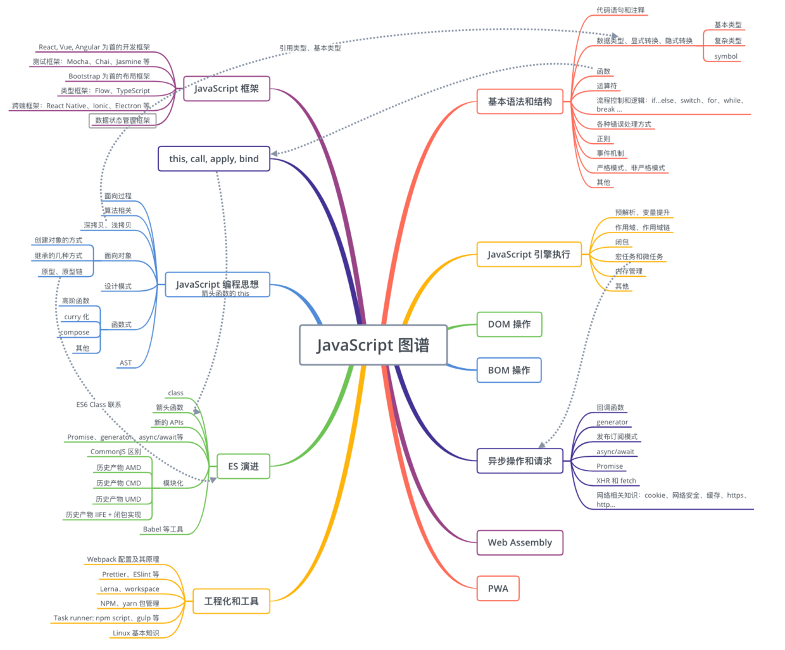

# 闭包

## 作用域

- 作用域：规定了变量的查找路径
- es5 作用域分为全局作用域和函数作用域
- es6 新增了 const 和 let 块级作用域
- let 或 const 声明变量，会针对这个变量形成一个封闭的块级作用域，在这个块级作用域当中，如果在声明变量前访问该变量，就会报 referenceError 错误
- 暂时性死区 TDZ（Temporal Dead Zone）就是在 let，const 变量声明之前无法访问到变量的区域


```js
// 极端例子：arg1 = arg2会当作暂时性死区
function foo(arg1 = arg2, arg2) {
  console.log(`${arg1} ${arg2}`);
}

foo(undefined, "arg2"); // Uncaught ReferenceError: arg2 is not defined

function foo(arg1 = arg2, arg2) {
  console.log(`${arg1} ${arg2}`);
}

foo(null, "arg2"); // null arg2
```

上面例子中，null 和 undefined 是不一样的，null 会当作有参数，不会认为“函数第一个参数缺省”。

## 执行上下文

- 执行上下文就是当前代码的执行环境/作用域
- JavaScript 执行主要分为两个阶段：
  - 代码预编译阶段，这个时候由编译器将 JavaScript 代码编译成可执行的代码。
    - 预编译阶段进行变量声明；
    - 预编译阶段变量声明进行提升，但是值为 undefined；
    - 预编译阶段所有非表达式的函数声明进行提升。
  - 代码执行阶段，执行上下文在这个阶段全部创建完成

作用域在预编译阶段确定，但是作用域链是在执行上下文的创建阶段完全生成的。因为函数在调用时，才会开始创建对应的执行上下文。执行上下文包括了：变量对象、作用域链以及 this 的指向。

代码执行的整个过程:

1. 在预编译阶段创建变量对象（Variable Object），此时只是创建，而未赋值。
2. 执行阶段，变量对象转为激活对象（Active Object），即完成 VO → AO。此时，作用域链也将被确定，它由当前执行环境的变量对象和所有外层已经完成的激活对象组成。这道工序保证了变量和函数的有序访问，即如果当前作用域中未找到变量，则继续向上查找直到全局作用域。

## 调用栈

在执行一个函数时，如果这个函数又调用了另外一个函数，而这个“另外一个函数”也调用了“另外一个函数”，便形成了一系列的调用栈。

正常来讲，在函数执行完毕并出栈时，函数内局部变量在下一个垃圾回收节点会被回收，该函数对应的执行上下文将会被销毁，这也正是我们在外界无法访问函数内定义的变量的原因。也就是说，只有在函数执行时，相关函数可以访问该变量，该变量在预编译阶段进行创建，在执行阶段进行激活，在函数执行完毕后，相关上下文被销毁。

## 闭包

函数嵌套函数时，内层函数引用了外层函数作用域下的变量，并且内层函数在全局环境下可访问，就形成了闭包。
函数执行完之后，上下文即被销毁。但是在（外层）函数中，如果我们返回了另一个函数，且这个返回的函数使用了（外层）函数内的变量，外界因而便能够通过这个返回的函数获取原（外层）函数内部的变量值。这就是闭包的基本原理。

## 内存管理

内存的生命周期

- 分配内存空间
- 读写内存
- 释放内存空间

内存空间可以分为栈空间和堆空间

- 栈空间: 由操作系统自动分配释放，存放函数的参数值，局部变量的值等
- 堆空间：一般由开发者分配释放，这部分空间就要考虑垃圾回收的问题。

一般情况下，基本数据类型保存在栈内存当中，引用类型保存在堆内存当中


内存泄漏是指内存空间明明已经不再被使用，但由于某种原因并没有被释放的现象。

内存泄漏场景

1. 下面代码中虽然移除了 dom，但是 element 变量还是存在。

```
var element = document.getElementById("element")
element.mark = "marked"

// 移除 element 节点
function remove() {
    element.parentNode.removeChild(element)
}
```

2. addEventListener 没有移除
3. 定时器没有清除
4. 闭包使用不当

## 浏览器垃圾回收

除了开发者主动保证以外，大部分的场景浏览器都会依靠：

- 标记清除
- 引用计数



## 闭包

MDN 对闭包的定义为：

- 闭包是指那些能够访问自由变量的函数。
- 自由变量是指在函数中使用的，但既不是函数参数也不是函数的局部变量的变量。

也就是说闭包是能够访问外部变量的函数。

在 ECMAScript 中，闭包指的是：

- 从理论角度：所有的函数。因为它们都在创建的时候就将上层上下文的数据保存起来了。哪怕是简单的全局变量也是如此，因为函数中访问全局变量就相当于是在访问自由变量，这个时候使用最外层的作用域。
- 从实践角度：以下函数才算是闭包：
  - 即使创建它的上下文已经销毁，它仍然存在（比如，内部函数从父函数中返回）
  - 在代码中引用了自由变量

举例来说：

```js
var scope = "global scope";
function checkscope() {
  var scope = "local scope";
  function f() {
    return scope;
  }
  return f;
}

var foo = checkscope();
foo();
```

当 foo() 执行完成后，实际 f 的上下文是：

```
fContext = {
    Scope: [AO, checkscopeContext.AO, globalContext.VO],
}
```

就是因为这个 Scope 作用域链，f 函数依然可以读取到 checkscopeContext.AO 的值，说明当 f 函数引用了 checkscopeContext.AO 中的值的时候，即使 checkscopeContext 被销毁了，但是 JavaScript 依然会让 checkscopeContext.AO 活在内存中，f 函数依然可以通过 f 函数的作用域链找到它，正是因为 JavaScript 做到了这一点，从而实现了闭包这个概念。

再分析下面案例：

```js
var data = [];

for (var i = 0; i < 3; i++) {
  data[i] = function () {
    console.log(i);
  };
}

data[0](); // 3
data[1](); // 3
data[2](); // 3
```

函数执行时，函数上下文如下：

```
fContext = {
  Scope: [AO, globalContext.VO]
}
```

所以会去全局变量对象里查找 i，此时 i 已经为 3。
