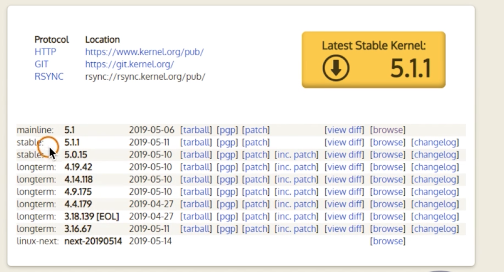

# linux 介绍

## 内核版本

-   https://www.kenel.org
-   内核版本分为三个部分
-   主版本号、次版本号、末版本号
-   次版本号是基数为开发版，偶数为稳定版



## 发行版本

-   redhat enterprise linux 8: 收费、经过测试(安全)
-   fedora: 也是 redhat 公司发行的，社区的，免费
-   centos: 免费、安全
-   debian、ubuntu: 有图形界面

## 系统镜像下载

7.6.1810 6 表示升级数，18 年 10 月发布

## 登录

root 后面是 #
普通用户后面是 \$
exit 退出登录

### 忘记 root 密码

1. 重启。
2. 在进入系统界面，按 e 进入编辑页面。
3. 找到`Linux16`开头的行，在最后面输入`init=/bin/sh`，然后`ctrl + x`进入单用户模式。
4. 进入`sh-4.2#`，输入`mount -o remount,rw /`。
5. 输入`passwd`回车。然后输入一个不少于 8 位的密码。
6. 输入`touch /.autorelabel` 回车。
7. 输入`exec /sbin/init`回车。
8. 等一会就是系统重启，再进入，用新密码登录即可。

## 常见目录介绍

```
/                # 根目录
├── root         # root用户的家目录
├── home         # 普通用户的家目录
├── etc          # 配置文件目录
├── bin          # 命令目录
└── sbin         # 管理系统目录
└── usr
    └── bin      # 系统预装的其它命令
    └── sbin     # 系统预装的其它命令
```

## 关机

init 0

## 帮助命令 man

man manual 的缩写

```bash
man [命令名称]
man ls
man [第几章] [命令名称] # 章节可以区分是命令还是文件等
man 7 man # 默认是 1
man 1 passwd
man 5 passwd
man -a passwd  # 用于查看有 passwd 关键字的命令
```

help 获取内置命令的帮助，man 内置命令获取的是解释器 bash 的帮助。
info

### pwd

### ls

```
ls /a /b
```

```s
[root@banli ~]# ls -l
total 591588
-rw-r--r--. 1 root root        63 Apr 26 10:36 1.txt
drwxr-xr-x. 2 root root        19 Apr 24 15:16 fs2
```

第一个 - 表示普通文件，d 表示目录。后面 9 个字符表示权限。
1 表示文件或文件夹里文件的个数
root 表示创建用户
root 表示用户组
文件大小
最后修改时间

```
ls -l 相当于 ls -l [.]
ls -a 显示隐藏文件
ls -r 逆向显示，默认按文件名 -t 表示按时间
ls -R 递归显示
-h 文件大小显示为可读格式，m
```

### cd

/etc/sysconfig/network-scripts/
cd - 回到上一个目录

### mkdir

```
mkdir a b c

# 创建多级目录
mkdir -p a/b/c
```

rmdir 只能删除空的目录，用的少

rm -r a/b 会一级级提示，-f 不用提示，支持删除多个目录

### cp 复制文件和目录

cp 复制文件
-r 复制目录
-v 显示复制过程
-p 保留原有的属性，如用户、操作时间等
-a 保留原有的属性和权限

### mv

移动和重命名

```
mv /tmp/a /b #移动并重命名，就是把a文件夹变成b文件夹
```

通配符

```
- 0个或多个字符
? 单个字符
[xyz] 匹配任意一个字符
[a-z] 匹配 a-z
[!xyz]或[^xyz] 不匹配
```

## 文本查看命令

```
cat  文本内容显示到终端
head 查看文件开头，默认10行  -5 表示 5 行
tail 查看文件结尾
    -f  内容更新后，显示信息同步更新
wc   统计文件内容信息
less
more
```

### 打包压缩

-   最早 linux 备份介质是磁带，使用的命令是 tar
-   可以打包后的磁带文件进行压缩存储，压缩命令是 gzip 和 bzip2
-   经常使用的扩展名是 .tar.gz tar.bz2 .tgz

白色是文件，蓝色是文件夹，红色是压缩文件

tar 的选项没有 -

```
# .tar 表示打包
tar cf /tmp/etc-backup.tar /etc

# .gz 表示压缩过，z表示gzip，j表示bzip2
tar czf /tmp/etc-backup.tar.gz /etc
tar cjf /tmp/etc-backup.tar.bz2 /etc

gzip 压缩更快
bzip2 压缩更小
c 打包
x 解包
f 指定操作的文件
-C
tar xf /tmp/etc-backup.tar -C /root
tar zxf /tmp/etc-backup.tar.gz -C /root
tar jxf /tmp/etc-backup.tar.bz2 -C /root

ls -lh /tmp/etc-backup.tar
```

.tar.bz2 可以缩写为 .tbz2 或 .tgz

## 用户管理

useradd 新增用户
userdel 删除用户
passwd 修改用户密码
usermod 修改用户属性
chage 修改用户属性

新增用户时，会新建一个同名的家目录，里面有些隐藏文件，还会在`/etc/passwd`、`/etc/shadow`(密码相关)里新增一条记录。

id 查看用户的信息，root 用户组为 0

```
id root
```

```
passwd banli
passwd
```

userdel 默认会保留用户家目录
-r 删除用户的家目录

## shell 脚本

### 管道与管道符

管道： 用于进程之间通信，在 shell 里用于两条命令可以通信。
重定向：可以用于将程序输入到控制台的内容输入到文件，也可以让文件代替键盘作为输入。

管道和信号一样，也是进程通信的方式之一。

匿名管道(管道符)是`|`，将前一个命令执行的结果传递给后面的命令

```s
ps | cat
echo 123 | ps
```
