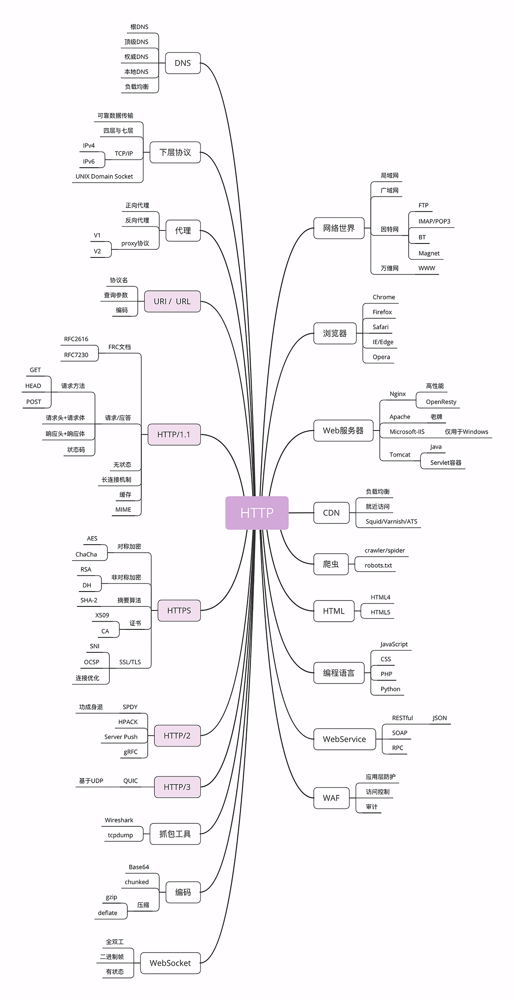

# http


## http 历史

**http 协议产生**

tim-lee: 互联网搭建超链接文档的构想

- URI: 唯一资源标识，资源的身份
- HTML: 超文本文档
- HTTP: 传输

**http0.9**

环境：计算机处理能力小、网速满、存储小，绝大多数资源都是纯文本，lee 认为所有文档都是只读的。

- 只有 get
- 纯文本格式
- 响应后立即关闭

**http1.0**
1996 年发布，并不是标准。

- 增加了 HEAD、POST 等新方法；
- 增加了响应状态码，标记可能的错误原因；
- 引入了协议版本号概念；
- 引入了 HTTP Header（头部）的概念，让 HTTP 处理请求和响应更加灵活；
- 传输的数据不再仅限于文本。

**http1.1**

1999 年，HTTP/1.1 发布了 RFC 文档，编号为 2616

> Request For Comments（RFC），是一系列以编号排定的文件。文件收集了有关互联网相关信息，以及 UNIX 和互联网社区的软件文件。RFC 文件是由 Internet Society（ISOC）赞助发行。几乎所有的互联网标准都有收录在 RFC 文件之中。

- 增加了 PUT、DELETE 等新的方法；
- 增加了缓存管理和控制；
- 明确了连接管理，允许持久连接；
- 允许响应数据分块（chunked），利于传输大文件；
- 强制要求 Host 头，让互联网主机托管成为可能。(同 ip，nginx 通过 host 分发?)

2014 年又做了一次修订，原来的一个大文档被拆分成了六份较小的文档，编号为 7230-7235，优化了一些细节

**http2**

互联网标准化组织以 Google SPDY 为基础开始制定新版本的 HTTP 协议，最终在 2015 年发布了 HTTP/2，RFC 编号 7540。

HTTP/2 的制定充分考虑了现今互联网的现状：宽带、移动、不安全，在高度兼容 HTTP/1.1 的同时在性能改善方面做了很大努力，主要的特点有：

- 二进制协议，不再是纯文本；
- 可发起多个请求，废弃了 1.1 里的管道；
- 使用专用算法压缩头部，减少数据传输量；
- 允许服务器主动向客户端推送数据；
- 增强了安全性，“事实上”要求加密通信。

HTTP/2 基于 Google 的 SPDY 协议，注重性能改善，但还未普及；

**http3**

HTTP/3 基于 Google 的 QUIC 协议，是将来的发展方向。

2018 年，互联网标准化组织 IETF 提议将“HTTP over QUIC”更名为“HTTP/3”并获得批准，HTTP/3 正式进入了标准化制订阶段，

## 什么是 http


超文本：可以是文本、html 带超链接等、图片、音频、视频混合
传输: A -> B 或 B->A ，中间可以有多个中介，A - C - D - B，可以压缩、加密等，但结果不变
协议：两个或多个参与者，也就是“协”,协议是对参与者的一种行为约定和规范，也就是“议”，通信的规范、控制和错误处理等。

HTTP 是一个在计算机世界里专门在两点之间传输文字、图片、音频、视频等超文本数据的约定和规范。

互联网通过 TCP/IP 协议把计算机连接到了一起;而叫万维网是运行在互联网之上,基于 HTML、URL 和 HTTP 这三个协议进一步把计算机上的信息资源连接到一起

## http 世界全览

CDN，全称是“Content Delivery Network”，翻译过来就是“内容分发网络”。
CDN 有什么好处呢？

简单来说，它可以缓存源站的数据，让浏览器的请求不用“千里迢迢”地到达源站服务器，直接在“半路”就可以获取响应。如果 CDN 的调度算法很优秀，更可以找到离用户最近的节点，大幅度缩短响应时间。

Web Service 是一种由 W3C 定义的应用服务开发规范，使用 client-server 主从架构，通常使用 WSDL 定义服务接口，使用 HTTP 协议传输 XML 或 SOAP 消息，也就是说，它是一个基于 Web（HTTP）的服务架构技术，既可以运行在内网，也可以在适当保护后运行在外网。

因为采用了 HTTP 协议传输数据，所以在 Web Service 架构里服务器和客户端可以采用不同的操作系统或编程语言开发。例如服务器端用 Linux+Java，客户端用 Windows+C#，具有跨平台跨语言的优点。

WAF 是近几年比较“火”的一个词，意思是“网络应用防火墙”。与硬件“防火墙”类似，它是应用层面的“防火墙”，专门检测 HTTP 流量，是防护 Web 应用的安全技术。

WAF 通常位于 Web 服务器之前，可以阻止如 SQL 注入、跨站脚本等攻击，目前应用较多的一个开源项目是 ModSecurity，它能够完全集成进 Apache 或 Nginx。

互联网上绝大部分资源都使用 HTTP 协议传输；
浏览器是 HTTP 协议里的请求方，即 User Agent；
服务器是 HTTP 协议里的应答方，常用的有 Apache 和 Nginx；
CDN 位于浏览器和服务器之间，主要起到缓存加速的作用；
爬虫是另一类 User Agent，是自动访问网络资源的程序。
Webservice 是服务，Web Server 是服务器

CDN 可以根据 User-Agent 来判断发起请求的一端是浏览器还是爬虫，对待爬虫可以特殊处理返回特定内容




TCP/IP 协议实际上是一系列网络通信协议的统称，其中最核心的两个协议是 TCP 和 IP，其他的还有 UDP、ICMP、ARP 等等，共同构成了一个复杂但有层次的协议栈。

这个协议栈有四层，最上层是“应用层”，最下层是“链接层”，TCP 和 IP 则在中间：TCP 属于“传输层”，IP 属于“网际层”。
IP 协议是“Internet Protocol”的缩写，主要目的是解决寻址和路由问题，以及如何在两点间传送数据包。
IP 协议使用“IP 地址”的概念来定位互联网上的每一台计算机。
现在我们使用的 IP 协议大多数是 v4 版，地址是四个用“.”分隔的数字，例如“192.168.0.1”，总共有 2^32，大约 42 亿个可以分配的地址。看上去好像很多，但互联网的快速发展让地址的分配管理很快就“捉襟见肘”。所以，就又出现了 v6 版，使用 8 组“:”分隔的数字作为地址，容量扩大了很多，有 2^128 个，在未来的几十年里应该是足够用了。
TCP 协议是“Transmission Control Protocol”的缩写，意思是“传输控制协议”，它位于 IP 协议之上，基于 IP 协议提供可靠的、字节流形式的通信，是 HTTP 协议得以实现的基础。
“可靠”是指保证数据不丢失，“字节流”是指保证数据完整，所以在 TCP 协议的两端可以如同操作文件一样访问传输的数据，就像是读写在一个密闭的管道里“流动”的字节。
HTTP 是一个"传输协议"，但它不关心寻址、路由、数据完整性等传输细节，而要求这些工作都由下层来处理。
HTTP 协议就运行在了 TCP/IP 上，HTTP 也就可以更准确地称为“HTTP over TCP/IP”。
DNS 域名系统,用有意义的名字来作为 IP 地址的等价替代在 DNS 中，“域名”（Domain Name）又称为“主机名”（Host）。域名用“.”分隔成多个单词，级别从左到右逐级升高，最右边的被称为“顶级域名”。但想要使用 TCP/IP 协议来通信仍然要使用 IP 地址，所以需要把域名做一个转换，“映射”到它的真实 IP，这就是所谓的“域名解析”。

URI/URL
有了 TCP/IP 和 DNS，是不是我们就可以任意访问网络上的资源了呢？

还不行，DNS 和 IP 地址只是标记了互联网上的主机，但主机上有那么多文本、图片、页面，到底要找哪一个呢？
URI（Uniform Resource Identifier），中文名称是 统一资源标识符，使用它就能够唯一地标记互联网上资源。URI 可以分为 URL,URN 或同时具备 locators 和 names 特性的一个东西。URN 作用就好像一个人的名字，URL 就像一个人的地址。URI 另一个更常用的表现形式是 URL（Uniform Resource Locator）， 统一资源定位符，也就是我们俗称的“网址”，它实际上是 URI 的一个子集，不过因为这两者几乎是相同的，差异不大，所以通常不会做严格的区分。
URL) 是 URI 的子集, 除了确定一个资源,还提供一种定位该资源的主要访问机制(如其网络“位置”)。让 URI 能成为 URL 的当然就是那个“访问机制”，“网络位置”。

```
http://www.ietf.org/rfc/rfc2396.txt (also a URL because of the protocol)
news:comp.infosystems.www.servers.unix (also a URL because of the protocol)
tel:+1-816-555-1212
```

HTTPS ： HTTP over SSL/TLS 也就是运行在 SSL/TLS 协议上的 HTTP。这里是 SSL/TLS，而不是 TCP/IP，它是一个负责加密通信的安全协议，建立在 TCP/IP 之上，所以也是个可靠的传输协议，可以被用作 HTTP 的下层。HTTPS 相当于“HTTP+SSL/TLS+TCP/IP”
SSL 的全称是“Secure Socket Layer”，由网景公司发明，当发展到 3.0 时被标准化，改名为 TLS，即“Transport Layer Security”，但由于历史的原因还是有很多人称之为 SSL/TLS，或者直接简称为 SSL。SSL 使用了许多密码学最先进的研究成果，综合了对称加密、非对称加密、摘要算法、数字签名、数字证书等技术，能够在不安全的环境中为通信的双方创建出一个秘密的、安全的传输通道，为 HTTP 套上一副坚固的盔甲。

代理（Proxy）是 HTTP 协议中请求方和应答方中间的一个环节，作为“中转站”，既可以转发客户端的请求，也可以转发服务器的应答。

代理有很多的种类，常见的有：

匿名代理：完全“隐匿”了被代理的机器，外界看到的只是代理服务器；
透明代理：顾名思义，它在传输过程中是“透明开放”的，外界既知道代理，也知道客户端；
正向代理：靠近客户端，代表客户端向服务器发送请求；
反向代理：靠近服务器端，代表服务器响应客户端的请求；
由于代理在传输过程中插入了一个“中间层”，所以可以在这个环节做很多有意思的事情，比如：

负载均衡：把访问请求均匀分散到多台机器，实现访问集群化；
内容缓存：暂存上下行的数据，减轻后端的压力；
安全防护：隐匿 IP,使用 WAF 等工具抵御网络攻击，保护被代理的机器；
数据处理：提供压缩、加密等额外的功能。

TCP/IP 是网络世界最常用的协议，HTTP 通常运行在 TCP/IP 提供的可靠传输基础上；
DNS 域名是 IP 地址的等价替代，需要用域名解析实现到 IP 地址的映射；
URI 是用来标记互联网上资源的一个名字，由“协议名+主机名+路径”构成，俗称 URL；
HTTPS 相当于“HTTP+SSL/TLS+TCP/IP”，为 HTTP 套了一个安全的外壳；
代理是 HTTP 传输过程中的“中转站”，可以实现缓存加速、负载均衡等功能。
CDN，实际上就是一种代理，它代替源站服务器响应客户端的请求，通常扮演着透明代理和反向代理的角色。
DNS 与 URI 有什么关系？
URI 是统一资源标识符，标定了客户端需要访问的资源所处的位置，如果 URI 中的主机名使用域名，则需要使用 DNS 来讲域名解析为 IP。

## HTTP 2.0

在 HTTP/1 中，为了性能考虑，我们会引入雪碧图、将小图内联、使用多个域名等等的方式。这一切都是因为浏览器限制了同一个域名下的请求数量（Chrome 下一般是限制六个连接），当页面中需要请求很多资源的时候，队头阻塞（Head of line blocking）会导致在达到最大请求数量时，剩余的资源需要等待其他资源请求完成后才能发起请求。

在 HTTP/2 中引入了多路复用的技术，这个技术可以只通过一个 TCP 连接就可以传输所有的请求数据。多路复用很好的解决了浏览器限制同一个域名下的请求数量的问题，同时也间接更容易实现全速传输，毕竟新开一个 TCP 连接都需要慢慢提升传输速度。

HTTP/2 中所有加强性能的核心点在于此。在之前的 HTTP 版本中，我们是通过文本的方式传输数据。在 HTTP/2 中引入了新的编码机制，所有传输的数据都会被分割，并采用二进制格式编码。

### 多路复用

HTTP 2.0 会对 HTTP 的头进行一定的压缩，将原来每次都要携带的大量 key value 在两端建立一个索引表，对相同的头只发送索引表中的索引。

HTTP 2.0 将所有的传输消息分隔成了更小的消息和帧，并对它们采用二进制格式编码，常见的帧有 Header 帧，用于传输 Header 内容，并且会开启一个新的流。再就是 Data 帧，用来传输正文实体，多个 Data 帧属于同一个流。

通过这两种机制，HTTP 2.0 的客户端可以将多个请求分到不同的流中，然后将请求内容拆分成帧，进行二进制传输，这些帧可以乱序发送，然后根据每个帧首部的流标志符重新组装，并且可以根据优先级，决定优先处理哪个流的数据。

举例来说，客户端请求三个资源，可以通过一个 TCP 连接，发送三个流给服务器，服务器将数据分成帧，乱序发送到一个 TCP 连接中。

多路复用，就是在一个 TCP 连接中可以存在多条流。换句话说，也就是可以发送多个请求，对端可以通过帧中的标识知道属于哪个请求。通过这个技术，可以避免 HTTP 旧版本中的队头阻塞问题，极大的提高传输性能。

### Header 压缩

HTTP 1.1 在应用层采用纯文本形式进行通信，每次都要带完整的 HTTP 头，而且不考虑 pipeline 模式的话，每次的过程总是一去一回，这在实时性、并发性上都存在问题。

为了解决这个问题，HTTP 2.0 会对 HTTP 头进行压缩，将原来每次都要携带的大量 key value 在两端建立一个索引表，对相同的头只发送索引表中的索引。

### 服务端 Push

## QUIC 协议

虽然 HTTP 2.0 大大增加了并发性，但是它还是基于 TCP 的，TCP 协议处理包时有严格的顺序。

如果一个包有问题，TCP 需要等待这个包重新发送确认后，才能继续。HTTP 2.0 的多个流的帧数据在一个 TCP 里，如果前面的帧没有收到，后面的帧也会受到阻塞。

所以 Google 制作了基于 UDP 的 QUIC 协议，它在 UDP 基础上，新增了多路复用、0-RTT、使用 TLS1.3 加密、流量控制、有序交付、重传等等功能。。它有如下特点：

### 自定义连接机制

TCP 连接是以四元组标识的，分别是源 IP、目标 IP、源端口、目标端口，一旦一个元素发生变化，就需要断开重连。在移动互联中，手机信号不稳定或经常 Wifi 和移动网络切换，都会导致重连。但是基于 UDP，可以在 QUIC 自己的逻辑里维护连接机制，不再以四元组进行标识，而是以一个 64 位随机数作为 ID 来标识，而且 UDP 是无连接的，所以当 IP 和端口变化时，只要 ID 不变，就不需要重新建立连接。

### 自定义重传机制

TCP 重传机制是，发送一个包，序号 100，超时后再发送一个 100，过一会后返回 ACK 101。那么怎么才算超时呢？这个超时是通过采样往返时间 RTT 不断调整的。那么这时往返时间是多少呢？是 ACK 到达的时间减去后一个 100 发送的时间，还是减去前一个 100 发送的时间呢?事实 是，第一种算法把时间算短了，第二种算法把时间算长了。

QUIC 的序列号是递增的，比如包 100，超时后再次发送，序列号加 1，为 101。如果返回 ACK 100，就是对第一个包的响应，返回 ACK 101 就是第二个包的响应，RTT 计算相对准确。

怎么知道 100 和 101 发送的是同样的内容呢？QUIC 定义一个 offset 概念，表示发送数据在数据流里的偏移量，可以通过它查看数据发到了哪里，这样只要这个 offset 的包没来，就要重发；如果来了，就按照 offset 拼接。

### 无阻塞多路复用

有了自定义的连接和重传机制，我们就可以解决上面 HTTP 2.0 的多路复用问题。
同 HTTP 2.0 一样，同一条 QUIC 连接上可以创建多个 stream，来发送多个 HTTP 请求。但是，QUIC 是基于 UDP 的，一个连接上的多个 stream 之间没有依赖。这样，假如 stream2 丢了一个 UDP 包，后 面跟着 stream3 的一个 UDP 包，虽然 stream2 的那个包需要重传，但是 stream3 的包无需等待，就 可以发给用户。

### 自定义流量控制

TCP 接收段的窗口起始点是下一个要接收并且 ACK 的包，即便后来的包已经到了，放入缓存里面，窗口也不能右移，因为 TCP 的 ACK 机制是基于序列号的累计应答，一旦 ACK 了一 个系列号，就说明前面的都到了，所以只要前面的没到，后面的到了也不能 ACK，就会导致后面的到 了，也有可能超时重传，浪费带宽。

QUIC 的 ACK 是基于 offset 的，每个 offset 包来了，进入缓存，就可以应答，应答后不会重发，窗口的起始位置是当前接收的最大 offset，从这个 offset 到当前 stream 所能容纳的最大缓存，是真正的窗口大小。显然，这样更加准确。

### 0-RTT

通过使用类似 TCP 快速打开的技术，缓存当前会话的上下文，在下次恢复会话的时候，只需要将之前的缓存传递给服务端验证通过就可以进行传输了。

### 纠错机制

假如说这次我要发送三个包，那么协议会算出这三个包的异或值并单独发出一个校验包，也就是总共发出了四个包。

当出现其中的非校验包丢包的情况时，可以通过另外三个包计算出丢失的数据包的内容。

当然这种技术只能使用在丢失一个包的情况下，如果出现丢失多个包就不能使用纠错机制了，只能使用重传的方式了。
