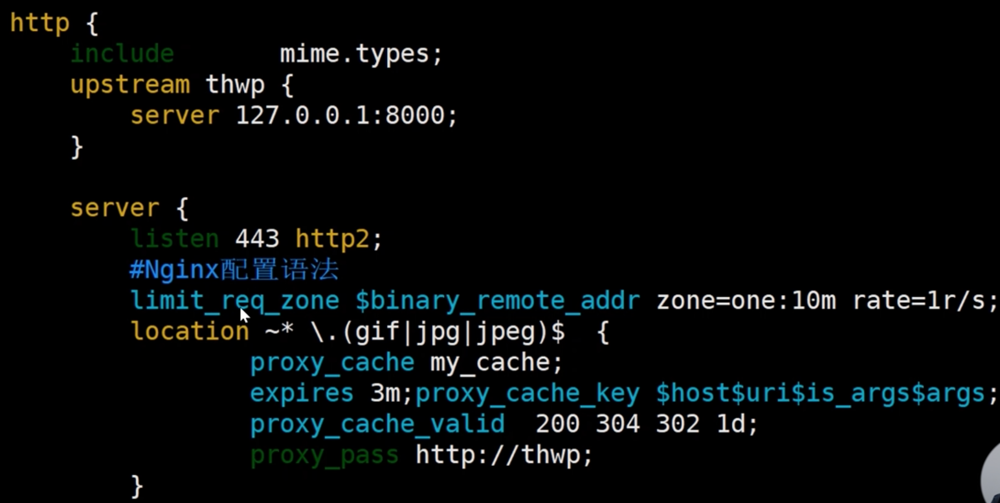

# nginx

3 个主要应用场景

-   静态资源服务
-   反响代理服务
    -   nginx 强大性能
    -   缓存
    -   负载均衡
-   API 服务
    -   OpenResty

为什么出现

-   互联网的数据快速增长
    -   互联网的快速普及
    -   全球化
    -   物联网
-   摩尔定律：心跟那个提升
-   低效的 Apache
    -   一个连接对应一个进程

5 个优点

-   高并发，高性能
-   可扩展性好，模块化，社区丰富
-   高可靠性
-   热部署，不停止服务的前提下升级
-   BSD 许可证，开源，可自己改

组成

-   nginx 二进制可执行文件：由各模块源码编译出的一个文件
-   nginx.conf 配置文件，控制 nginx 的行为
-   access.log 访问日志，记录每一条 http 请求信息
-   error.log 错误日志，定位问题

版本发布

-   feature
-   bugfix
-   change

mainline 主干版本
stable 稳定版本

开源版 nginx.org
商业版 nginx.com
阿里巴巴 tengine 不推荐，是 nginx 的分支，但是时间长脱离了。
开源 OpenResty: openresty.ory
商业 OpenResty: openresty.com 技术支持好些

编译 nginx

1. 下载
2. 介绍各目录

## nginx 配置语法

-   配置文件由指令和指令块构成。
-   每条指令以 ; 分号结尾，指令与参数间以空格符号分隔。
-   指令块以 {} 大括号将多条指令组织在一起。
-   include 语句允许组合多个配置文件以提升可维护性。
-   使用 # 符号添加注释，提高可读性。
-   使用 \$ 符号使用变量。
-   部分指令的参数支持正则表达式。

时间的单位

-   ms
-   s
-   m 分钟
-   h 时
-   d 天
-   w 周
-   M 月，30 天
-   y 年，365 天

空间的单位

-   默认 bytes
-   k/K
-   m/M
-   G

http 大括号里，表示里面的指令都是 http 模块来解析。

nginx 命令行

nginx -s reload
帮助 -? -h
使用指定的配置文件 -c
指定配置指令 -g
指定运行目录 -p
发送信号 -s

-   stop 立即停止服务 - quit 优雅的停止服务 - reload 重载配置文件 - reopen 重新开始记录日志文件

-   测试配置文件是否有语法错误 -t -T
-   打印 nginx 版本信息、编译信息 -v -V
