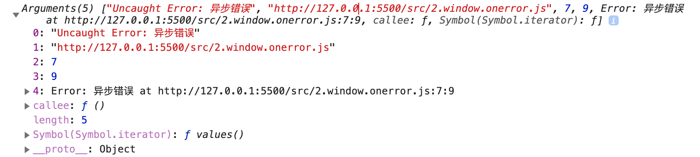

# 错误信息收集

错误监控首先需要收集错误，然后对错误再进行上报，下面来看看常见的错误有哪些:

1. 脚本错误，分为语法错误和运行时错误。
2. 网络加载错误
3. 页面崩溃
4. 框架错误

常见的处理方案是：

- `try...catch`
- `window.onerror` 事件

下面来详细看一下。

## try...catch

我们写代码，如果不保证代码正确的情况下，通常会用 `try...catch` 包裹起来。但是说实话，并不能保证没有包裹的代码一定是正确的。

`try...catch` 可以保证代码出错时，页面不崩溃。但是它有些问题：

1、不能处理语法错误。语法错误后，当前代码段后面的代码会停止执行。

```js
try{
    var a =\ 'a' // 后面代码停止执行
}catch(e){
    // 无法捕获
}
```

2、不能处理异步错误。
3、代码侵入性强。

在项目中进行手动包裹不太现实，可以使用 UglifyJS 自动化处理。

## window.onerror

```js
window.onerror = function (message, source, lineno, colno, error) {
  return true; // 防止错误上抛到控制台
};
```

- message: 错误信息提示
- source: 错误脚本地址
- lineno: 错误代码所在行号
- colno: 错误代码所在列号
- error: 错误对象



`window.onerror`的方式对代码侵入性小，可以捕获运行时的错误，包括异步错误。但是还是无法捕获语法错误和网络错误(网络请求异常不会事件冒泡)。

- 如果想要控制台不报错，需要`window.onerror`需要返回 true。
- 如果出现语法错误，当前代码段后面的代码就不执行了。
- 对于跨域的脚本，如第三方统计，由于安全问题，`window.onerror`不能捕获有效的异常信息，浏览器都统一返回`Script error`，返回的信息如下：

```js
message: Script error.
source:
lineno: 0
colno: 0
error: null
```

解决方法是 script 脚本设置 `crossorigin` 属性。然后服务器设置 HTTP 头`Access-Control-Allow-Origin`。

> 注: 可以用 [http-server](https://www.npmjs.com/package/http-server) 开 2 个服务进行实验，`--cors` 表示服务端开启`Access-Control-Allow-Origin`。

```js
<script src="http://xx.com/a.js" crossorigin="anonymous"></script>
```

然后就可以获取到错误信息了，如下：

```js
message: Uncaught ReferenceError: a is not defined
source: http://127.0.0.1:8081/index.js
lineno: 1
colno: 23
error: ReferenceError: a is not defined
    at index.js:1
```

## source map

通过上面的方法，以及可以获取到错误信息了。但是如果脚本经过压缩后，那么上面的方法返回的错误信息就很难分辨，比如代码压缩成 1 行，返回的行号总是 1。这时就需要 source map。一些构建工具都支持。

可以开启 webpack 的 source map。

## Promise 错误

Promise 一般使用 catch 来进行捕获错误。还可以使用 `eslint-plugin-promise` 插件可以提醒我们写 catch。不过最好的方式是通过`unhandledrejection`事件。

```js
window.addEventListener("unhandledrejection", (e) => {
  console.log(e.reason);
  // 防止默认处理（例如将错误输出到控制台）
  e.preventDefault();
});
```

Promise 里面写语法错误不会影响外面的同步代码，因为它是异步的。上面代码中，`e.preventDefault()`可以阻止控制台的报错。

## 网络加载错误

有时候因为网络不好，资源加载时可能会导致错误。可以通过 onerror 来捕获错误。

```js
<script onerror="errorHandler(this)" src="x.js"></script>
<link href="x.css" onerror="errorHandler(this)">
```

除了上面的方法，还可以使用 window.addEventListener('error') 的方式处理。但是这里无法使用 window.onerror 进行处理，因为网络加载错误不会进行事件冒泡。而 window.addEventListener 是通过事件捕获来捕获错误的。

```js
window.addEventListener(
  "error",
  (e) => {
    if (!e.message) {
      console.log(e); // 说明是网络加载错误
    }
  },
  true // false不行
);
```

注意，网络加载错误时，事件对象是没有 message 信息的，这也是我们判断网络资源加载错误的条件。不过目前无法区分具体的错误类别，如 404 资源不存在还是服务器错误，只能配合后端日志进行排查。

不支持冒泡的事件还有：鼠标聚焦 / 失焦（focus / blur）、鼠标移动相关事件（mouseleave / mouseenter）、一些 UI 事件（如 scroll、resize 等）。

### 页面崩溃错误

一个成熟的监控系统还需要监控页面崩溃和页面卡顿。监听页面崩溃可以通过监听 window 的 load 和 beforeunload 事件，并结合 sessionStorage 来实现。

```js
window.addEventListener("load", function () {
  sessionStorage.setItem("good_exit", "pending");
  setInterval(function () {
    // 定时器，记录页面崩溃的时间
    sessionStorage.setItem("time_before_crash", new Date().toString());
  }, 1000);
});

window.addEventListener("beforeunload", function () {
  sessionStorage.setItem("good_exit", "true");
});

if (
  sessionStorage.getItem("good_exit") &&
  sessionStorage.getItem("good_exit") !== "true"
) {
  alert(
    "上次页面异常退出了，时间是在：" +
      sessionStorage.getItem("time_before_crash")
  );
}
```

上面的代码，如果页面正常关闭，则会触发 beforeunload 事件，所以 good_exit 为 true，而页面崩溃时，不会触发 beforeunload 事件，所以重新访问页面时，good_exit 还是 pending，可以判断上次发生了页面崩溃。

但是上面方案有两个问题：

1. 通常页面崩溃后，用户会强制关闭网页或浏览器，再重新打开，sessionStorage 将不存在。
2. 如果用 localStorage 或 Cookie 存储，如果用户打开多个页面，但不关闭，good_exit 存储的一直都是 pending。所以新开一个网页，就会上报一次 crash。

所以，通常采用 Service Worker 实现页面崩溃的监控。Service Worker 的特点如下：

- 有独立的线程，页面崩溃了，它一般也不会崩溃。
- 生命周期一般比网页要长，可以用来监控网页的状态。
- 网页可以通过 navigator.serviceWorker.controller.postMessage 向掌管自己的 SW 发送消息。

## 框架的错误处理

React 16 之前，使用 unstable_handleError 来处理，React 16 之后，使用 componentDidCatch 来处理错误。

Vue 提供了 Vue.config.errorHandler 来处理错误。errorCaptured 生命周期用来捕获组件错误，它可以返回 false 阻止错误继续向上传播。

```js
Vue.config.errorHandler = function (err, vm, info) {
  // handle error
  // `info` 是 Vue 特定的错误信息，比如错误所在的生命周期钩子
  // 只在 2.2.0+ 可用
};
```

如果开发者没使用它捕获错误，错误会以 console.error 方式输出，避免应用崩溃。我们可以劫持 console.error 进行自己的处理。

```js
const nativeConsoleError = window.console.error;
window.console.error = (...args) => nativeConsoleError.apply(this, [args]);
```

## Ajax 错误

ajax 请求错误可以通过 xhr 的 error 事件进行处理。

```js
xhr.addEventListener('error', function (e) { //… })
```

框架里可以通过改写 XMLHttpRequest.prototype 或 fetch 来处理。或者开发者手动调用，如：

```
axios.interceptors.response.use(data => {
    return data;
}, error => {
    Sentry.captureException(error);
})
```
