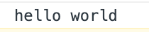
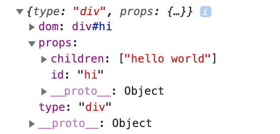
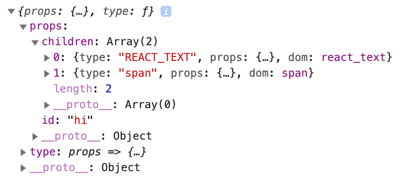
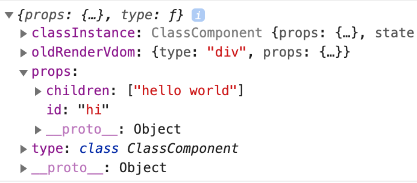

# React

React 渲染的大致流程是：

1. 将 jsx 编译成 R.createElement() 函数，它会返回一个 vdom 对象。
2. ReactDOM.render(vdom, root) 会根据 vdom 生成真实 dom，并将真实 dom 挂载到 root 上。
3. 调用 setState 时，会重新执行 render 方法，生成新的 newVdom。
4. 对比 newVdom 和 旧的 vdom 进行 patch 操作。

**文本**

```
el = "hello world"
console.log(el)
```



**普通组件**

```
el = <div id="hi">hello world</div>
console.log(el)
```



**函数组件**

```
const FunctionComponent = () => {}
el = <FunctionComponent id="hi">hello <span>world</span></FunctionComponent>
console.log(el)
```



**class 组件**

```
class ClassComponent extends Component {}
el = <ClassComponent id="hi">hello world</ClassComponent>
console.log(el)
```



## 事件处理

1. 将事件挂载到 `dom.store = {eventType: value}` 上
2. 委托给 document，让 `document.eventType = dispatchEvent`
3. 新建兼容的 event 对象 `syntheticEvent = {}`
4. 设置 setState 的批量更新为 true
5. dispatchEvent 里将 event 对象的属性拷贝到 syntheticEvent 上，循环寻找 target.parentNode 如果该 dom.store.eventType 有值，则执行，执行完成后将 syntheticEvent 重置
6. 批量更新内部的 setState

这里主要要做的事情就是：event 对象的兼容处理和 setState 的批量更新。

## setState 的原理

只有类组件内部能用 setState，它挂在 Component 的原型上。

- setState 是同步还是异步

> 在 react 的控制内是异步的，在控制外是同步的。内部有个开关控制是否批量更新，在事件触发时，会开启开关，然后把更新添加到一个队列中，事件执行最后会触发批量更新，然后关闭开关。
