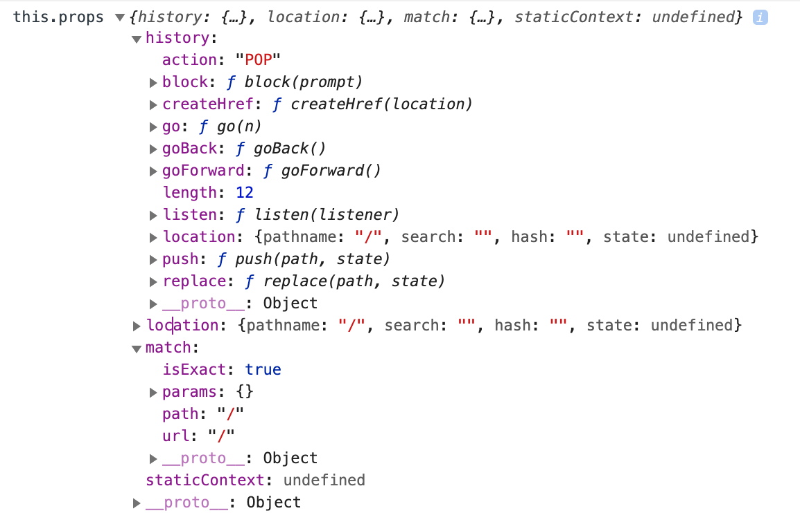

# React-Router

会在组件的 props 上挂载一些属性。



## path-to-regexp

- `?=` 正向前瞻，不会消耗字符
- `?!` 正向否定前瞻
- `?<=` 反向后瞻
- `?<!` 反向否定后瞻
- `(?<x>)` 命名分组

```js
// 后 ----> 前
// abc ->  a b
console.log("abc".match(/a(?=[a-z])([a-z])/));
console.log("abc".match(/(?<=[a-z])b/)); // b 后面是 [a-z]
```
