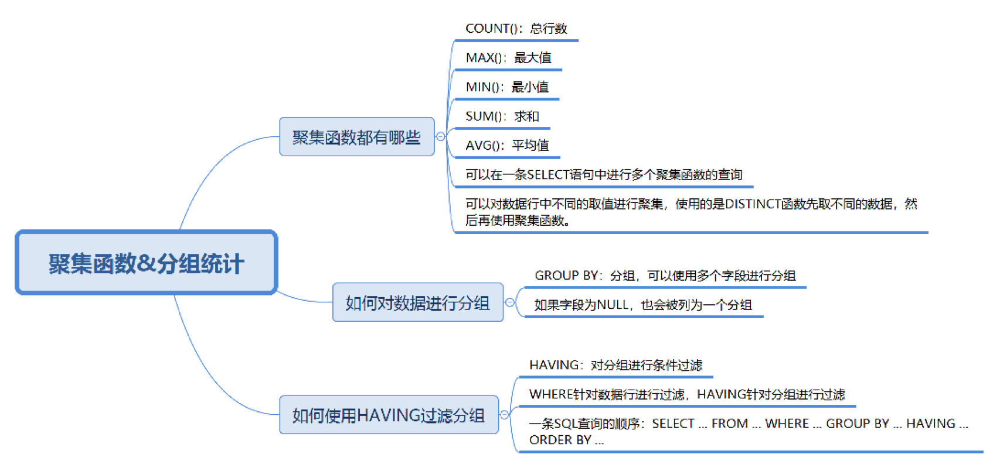

# SQL 必知必会

## 4 DDL

### 数据库

```sql
# 创建
CREATE DATABASE nba;
# 删除
DROP DATABASE nba;
```

### 修改数据表

```sql
# 添加字段
ALTER TABLE player ADD (age int(11));
# 重命名字段
ALTER TABLE player RENAME COLUMN age to player_age
# 修改字段结构
ALTER TABLE player MODIFY player_age float(3,1);
# 删除字段
ALTER TABLE player DROP COLUMN player_age;
```

### 创建表结构

```sql
DROP TABLE IF EXISTS `player`;
CREATE TABLE `player`  (
  `player_id` int(11) NOT NULL AUTO_INCREMENT,
  `team_id` int(11) NOT NULL,
  `player_name` varchar(255) CHARACTER SET utf8 COLLATE utf8_general_ci NOT NULL,
  `height` float(3, 2) NULL DEFAULT 0.00,
  PRIMARY KEY (`player_id`) USING BTREE,
  UNIQUE INDEX `player_name`(`player_name`) USING BTREE
) ENGINE = InnoDB CHARACTER SET = utf8 COLLATE = utf8_general_ci ROW_FORMAT = Dynamic;
```

数据表和字段都使用了反引号，这是为了避免它们的名称与 MySQL 保留字段相同。

其中 player_name 字段的字符集是 utf8，排序规则是 utf8_general_ci，代表对大小写不敏感，如果设置为 utf8_bin，代表对大小写敏感。

USING BTREE 表示使用索引，还有 HASH 方式。PRIMARY KEY 表示主键，索引有唯一索引(UNIQUE INDEX)和普通索引(NORMAL INDEX)。

约束: 目的是保证数据的准确性和一致性。

-   主键约束: 唯一不重复，不能为空，即 UNIQUE + NOT NULL，一个表主键只能有一个，主键可以是一个字段或多个字段复合组成。
-   外键约束：确保表与表之间引用的完整性，一个表中的外键对应另一张表的主键。外键可以重复，也可以为空。
-   唯一性约束：表示字段在表中数值是唯一的。
-   NOT NULL 约束
-   DEFAULT，字段的默认值
-   CHECK 约束，检查值的有效性，比如身高 ，`CHECK(height>=0 AND height <3)`

唯一性约束和普通索引的区别：唯一性约束相当于创建了一个约束和普通索引，目的是保证字段的正确性，而普通索引只是提升数据检索的速度，并不对字段的唯一性进行约束。

主键、外键和索引

### 设计数据表的原则

思考：

-   用户需要什么数据？需要在数据表中保存哪些数据？哪些数据经常被访问？如何提升检索效率？
-   如何保证数据表数据的正确性，当插入、删除、更新的时候该进行怎样的约束检查？如何降低数据表的数据冗余度，保证数据表不会因为用户量的增长而迅速扩张？
-   如何让负责数据库维护的人员更方便的使用数据库？

三少一多原则:

1. 数据表的个数越少越好

RDBMS 的核心在于对实体和联系的定义，也就是 E-R 图（Entity Relationship Diagram），数据表越少，证明实体和联系设计得越简洁，既方便理解又方便操作。

2. 数据表的字段个数越少越好

字段个数越多，数据冗余的可能性越大。设置字段个数少的前提是各个字段相互独立，而不是某个字段的取值可以由其他字段计算出来。当然字段个数少是相对的，我们通常会在数据冗余和检索效率中进行平衡。

3. 数据表中联合主键的字段个数越少越好

设置主键是为了确定唯一性，当一个字段无法确定唯一性的时候，就需要采用联合主键的方式（也就是用多个字段来定义一个主键）。联合主键中的字段越多，占用的索引空间越大，不仅会加大理解难度，还会增加运行时间和索引空间，因此联合主键的字段个数越少越好。

4. 使用主键和外键越多越好

数据库的设计实际上就是定义各种表，以及各种字段之间的关系。这些关系越多，证明这些实体之间的冗余度越低，利用度越高。这样做的好处在于不仅保证了数据表之间的独立性，还能提升相互之间的关联使用率。

“三少一多”原则的核心就是简单可复用。简单指的是用更少的表、更少的字段、更少的联合主键字段来完成数据表的设计。可复用则是通过主键、外键的使用来增强数据表之间的复用率。因为一个主键可以理解是一张表的代表。键设计得越多，证明它们之间的利用率越高。

## 5 select 查询数据


### select 基础语法

```sql
# 查询列， as别名
# 避免使用 *，因为写清列名，可以减少数据表查询的网络传输量，
SELECT name as n, age as a FROM heros;


# 查询常数，platform 在表中不存在，是 sql 构建出来的，在多表查询时可能有用
# 注意要用引号，否则会解析为列名，数字不需要引号
SELECT '王者荣耀' as platform, name FROM heros;
+--------------+--------------+
| platform     | name         |
+--------------+--------------+
| 王者荣耀     | 夏侯惇       |
| 王者荣耀     | 钟无艳       |
+--------------+--------------+


# 去除重复行，使用 DISTINCT 关键字
# DISTINCT需要放到所有列名的前面,
SELECT DISTINCT attack_range FROM heros;
# 多个列名时它实际是对一个组合（所有列名）的去重
SELECT DISTINCT attack_range, name FROM heros;


# 排序 ORDER BY
# 排序列名，可以一个或多个
# 排序规则，默认 ASC 递增、DESC 递减，如果是字符串，需要看具体设置，如 MYSQL 建字段时 BINARY 属性表示字段区分大小写
# 非选择性排序：即SELECT 没有列 name，也可以使用 ORDER BY name
# ORDER BY 通常位于 SELECT 最后一条子句，否则会报错
SELECT name, hp_max FROM heros ORDER BY mp_max, hp_max DESC


# 约束返回结果的数量 LIMIT
# MYSQL 中需要放在最后面
SELECT name, hp_max FROM heros ORDER BY hp_max LIMIT 4;
```

SELECT 执行顺序

1. 关键字顺序

```
SELECT ... FROM ... WHERE ... GROUP BY ... HAVING ... ORDER BY ...
```

2. 语句执行顺序

```
FROM > WHERE > GROUP BY > HAVING > SELECT的字段 > DISTINCT > ORDER BY > LIMIT
```

在 SELECT 语句执行这些步骤的时候，每个步骤都会产生一个虚拟表，然后将这个虚拟表传入下一个步骤中作为输入。

```
SELECT DISTINCT player_id, player_name, count(*) as num #顺序5
FROM player JOIN team ON player.team_id = team.team_id #顺序1
WHERE height > 1.80 #顺序2
GROUP BY player.team_id #顺序3
HAVING num > 2 #顺序4
ORDER BY num DESC #顺序6
LIMIT 2 #顺序7
```

SQL 的执行原理:

首先，你可以注意到，SELECT 是先执行 FROM 这一步的。在这个阶段，如果是多张表联查，还会经历下面的几个步骤：

首先先通过 CROSS JOIN 求笛卡尔积，相当于得到虚拟表 vt（virtual table）1-1；
通过 ON 进行筛选，在虚拟表 vt1-1 的基础上进行筛选，得到虚拟表 vt1-2；
添加外部行。如果我们使用的是左连接、右链接或者全连接，就会涉及到外部行，也就是在虚拟表 vt1-2 的基础上增加外部行，得到虚拟表 vt1-3。
当然如果我们操作的是两张以上的表，还会重复上面的步骤，直到所有表都被处理完为止。这个过程得到是我们的原始数据。

当我们拿到了查询数据表的原始数据，也就是最终的虚拟表 vt1，就可以在此基础上再进行 WHERE 阶段。在这个阶段中，会根据 vt1 表的结果进行筛选过滤，得到虚拟表 vt2。

然后进入第三步和第四步，也就是 GROUP 和 HAVING 阶段。在这个阶段中，实际上是在虚拟表 vt2 的基础上进行分组和分组过滤，得到中间的虚拟表 vt3 和 vt4。这中间会使用聚集函数进行计算，所以第四步 num>2 会在 SELECT 之前就可以使用。

当我们完成了条件筛选部分之后，就可以筛选表中提取的字段，也就是进入到 SELECT 和 DISTINCT 阶段。

首先在 SELECT 阶段会提取想要的字段，然后在 DISTINCT 阶段过滤掉重复的行，分别得到中间的虚拟表 vt5-1 和 vt5-2。

当我们提取了想要的字段数据之后，就可以按照指定的字段进行排序，也就是 ORDER BY 阶段，得到虚拟表 vt6。

最后在 vt6 的基础上，取出指定行的记录，也就是 LIMIT 阶段，得到最终的结果，对应的是虚拟表 vt7。

当然我们在写 SELECT 语句的时候，不一定存在所有的关键字，相应的阶段就会省略。

同时因为 SQL 是一门类似英语的结构化查询语言，所以我们在写 SELECT 语句的时候，还要注意相应的关键字顺序，所谓底层运行的原理，就是我们刚才讲到的执行顺序。

-   如何排序检索数据

-   什么情况下使用 select \*，如何提升 select 查询效率？

## 6 数据过滤

提升查询效率：约束返回结果的数量，指定筛选条件进行过滤。

目标：

1. WHERE 子句 + 比较运算符过滤
2. 使用逻辑运算符进行多条件过滤
3. 使用通配符进行复杂过滤

比较运算符：

```
=
<> 或 !=
<
<= 或 !>
>
>= 或 !<
BETWEEN 可以取到边界值
IS NULL
```

```sql
# 查询所有最大生命值大于 6000 的英雄
SELECT name, hp_max FROM heros WHERE hp_max > 6000;

SELECT name, hp_max FROM heros WHERE hp_max > 6000 ORDER BY hp_max;

# 查询所有最大生命值在5399到6811之间的英雄
SELECT name, hp_max FROM heros WHERE hp_max BETWEEN 5339 AND 6811;

# 对heros表中的hp_max字段进行空值检查
SELECT name, hp_max FROM heros WHERE hp_max IS NULL;
```

逻辑运算符

```
AND 并且
OR 或者
IN  在指定条件范围内
NOT 非
```

```sql
# 筛选最大生命值大于6000，最大法力大于1700的英雄，然后按照最大生命值和最大法力值之和从高到低进行排序
SELECT name, hp_max, mp_max FROM heros WHERE hp_max > 6000 AND mp_max > 1700 ORDER BY (hp_max+mp_max) DESC;


# 查询最大生命值加最大法力值大于8000的英雄，或者最大生命值大于6000并且最大法力值大于1700的英雄
# AND 优先级比 OR 高
SELECT name, hp_max, mp_max FROM heros WHERE (hp_max+mp_max) > 8000 OR hp_max > 6000 AND mp_max > 1700 ORDER BY (hp_max+mp_max) DESC;

# 查询主要定位或者次要定位是法师或是射手的英雄，同时英雄的上线时间不在2016-01-01到2017-01-01之间
SELECT name, role_main, role_assist, hp_max, mp_max, birthdate
FROM heros
WHERE (role_main IN ('法师', '射手') OR `role_assist` IN ('法师', '射手'))
AND DATE(birthdate) NOT BETWEEN '2016-01-01' AND '2017-01-01'
ORDER BY (hp_max+mp_max) DESC;
```

使用通配符进行过滤。注意它需要消耗数据库更长的时间来进行匹配。即使对 LIKE 检索的字段进行索引，索引的价值也可能消失。如果要让索引生效，LIKE 后面就不能以 % 开头，如`LIKE '%太'`会对全表扫描，而`LIKE '太%'`就不会。

-   `%` 表示 0 到多个字符。
-   `_` 表示 1 个字符。

```sql
# 名字包含张良的英雄
SELECT name FROM heros WHERE name LIKE '%张良%';

# 匹配东皇太一
SELECT name FROM heros WHERE name LIKE '_%太%';
```

```sql
# 请你编写SQL语句，对英雄名称、主要定位、次要定位、最大生命和最大法力进行查询，筛选条件为：主要定位是坦克或者战士，并且次要定位不为空，同时满足最大生命值大于8000或者最大法力小于1500的英雄，并且按照最大生命和最大法力之和从高到底的顺序进行排序。

SELECT name, role_main, role_assist, hp_max, mp_max
FROM heros
WHERE (role_main IN ('坦克', '战士') AND role_assist IS NOT NULL)
AND (hp_max > 8000 OR mp_max < 1500)
ORDER BY (hp_max + mp_max) DESC;
```


## 7 SQL 函数

函数分为内置函数和自定义函数。

内置函数：

-   算术函数
-   字符串函数
-   日期函数
-   转换函数(数据类型转换)

**算术函数**

-   ABS() 绝对值
-   MOD() 取余
-   ROUND() 四舍五入为指定的小数位数，需要两个参数：字段名、小数位数

```sql
# 2
SELECT ABS(-2);
# 2
SELECT MOD(101, 3);
# 37.3
SELECT ROUND(37.25, 1);
```

**字符串函数**

-   CONCAT() 将多个字符串拼接起来
-   LENGTH() 计算字段的长度，一个汉字算 3 个字符，一个数字或字母算一个字符
-   CHAR_LENGTH() 计算字段的长度，一个汉字、数字或字母都算一个字符
-   LOWER() 字符串转小写
-   UPPER() 字符串转大写
-   REPLACE() 替换函数，3 个参数分别是要替换的表达式或字段名，要查找的被替换字符串，替换成哪个字符串
-   SUBSTRING() 截取字符串，3 个参数分别是待截取的表达式或字符串，开始截取的位置(从 1 开始)，想要截取的长度

```sql
SELECT CONCAT('abc', 123)，运行结果为abc123。

SELECT LENGTH('你好')，运行结果为6。

SELECT CHAR_LENGTH('你好')，运行结果为2。

SELECT LOWER('ABC')，运行结果为abc。

SELECT UPPER('abc')，运行结果ABC。

SELECT REPLACE('fabcd', 'abc', 123)，运行结果为f123d。

SELECT SUBSTRING('fabcd', 1,3)，运行结果为fab。
```

**日期函数**

-   CURRENT_DATE() 系统当前日期
-   CURRENT_TIME() 系统当前时间，没有具体日期
-   CURRENT_TIMESTAMP() 抽取具体的年、月、日
-   DATE() 返回时间的日期部分
-   YEAR() 返回时间的年份部分
-   MONTH() 返回时间的月份部分
-   DAY() 返回时间的天数部分
-   HOUR() 返回时间的小时部分
-   MINUTE() 返回时间的分钟部分
-   SECOND() 返回时间的秒部分

```sql
SELECT CURRENT_DATE()，运行结果为2019-04-03。

SELECT CURRENT_TIME()，运行结果为21:26:34。

SELECT CURRENT_TIMESTAMP()，运行结果为2019-04-03 21:26:34。

SELECT EXTRACT(YEAR FROM '2019-04-03')，运行结果为2019。
# DATE日期格式必须是yyyy-mm-dd的形式。如果要进行日期比较，就要使用DATE函数，不要直接使用日期与字符串进行比较
SELECT DATE('2019-04-01 12:00:05')，运行结果为2019-04-01。
```

**转换函数**

-   CAST() 数据类型转换，通过 AS 分隔 2 个参数分别是原始数据和目标数据类型
-   COALESCE() 返回第一个非空数值

```sql
# 报错，小数不能转为整数
SELECT CAST(123.123 AS INT);
# 精度8（整数+小数位最多8位），小数位数为2位
SELECT CAST(123.123 AS DECIMAL(8, 2));
# 返回第一个非空值
SELECT COALESCE(null,'hi', 1, 2);
```

为什么使用 SQL 函数会带来问题？
版本兼容和不同的数据库可能不兼容。
大小写规范？
MYSQL 在 Linux，数据库名、表名、变量名严格区分大小写，字段名忽略大小写。而在 Windows 环境下全部不区分大小写。
所以

-   关键字和函数名称全部大写
-   数据库名、表名、字段名全部小写
-   分号结尾


```sql
# 将 attack_growth 四舍五入一位
SELECT name, attack_growth, ROUND(attack_growth, 1) FROM heros;

SELECT MAX(hp_max) FROM heros;
# 想显示英雄的名字，以及他们的名字字数，需要用到CHAR_LENGTH函数。
SELECT CHAR_LENGTH(name), name, hp_max FROM heros WHERE hp_max = (SELECT MAX(hp_max) FROM heros);

# 假如想要提取英雄上线日期（对应字段birthdate）的年份，只显示有上线日期的英雄即可（有些英雄没有上线日期的数据，不需要显示）
SELECT name, YEAR(birthdate) AS birthdate FROM heros WHERE birthdate IS NOT NULL;
SELECT name, EXTRACT(YEAR FROM birthdate) AS birthdate FROM heros WHERE birthdate IS NOT NULL;

# 假设我们需要找出在2016年10月1日之后上线的所有英雄。这里我们可以采用DATE函数来判断birthdate的日期是否大于2016-10-01，即WHERE DATE(birthdate)>'2016-10-01'，然后再显示符合要求的全部字段信息
SELECT name, birthdate FROM heros WHERE DATE(birthdate) > '2016-10-01';

# 假设我们需要知道在2016年10月1日之后上线英雄的平均最大生命值、平均最大法力和最高物攻最大值。同样我们需要先筛选日期条件，即WHERE DATE(birthdate)>'2016-10-01'，然后再选择AVG(hp_max), AVG(mp_max), MAX(attack_max)字段进行显示。

SElECT AVG(hp_max), AVG(mp_max), MAX(attack_max) FROM heros WHERE DATE(birthdate) > '2016-10-01';

# 计算英雄的最大生命平均值；显示出所有在2017年之前上线的英雄，如果英雄没有统计上线日期则不显示。
SELECT AVG(hp_max)  FROM heros WHERE birthdate IS NOT NULL AND YEAR(birthdate) < '2017';
```

## 8 聚集函数

用于对一组数据进行汇总的函数，输入是一组数据的集合，输出是单个值。

目标：

-   聚集函数有哪些，能否在一条 SELECT 语句中使用多个聚集函数。
-   如何对数据进行分组，并进行聚集统计。
-   如何使用 HAVING 过滤分组，HAVING 和 WHERE 的区别是什么。

### 5 个聚集函数

-   COUNT() 总行数
-   MAX()
-   MIN()
-   SUM()
-   AVG()

```sql
# 查询最大生命值大于6000的英雄数量
SELECT COUNT(*) FROM heros WHERE hp_max > 6000;

# 查询最大生命值大于6000，且有次要定位的英雄数量，需要使用COUNT函数。
# COUNT(x) 会忽略 x 为 NULL 的数据行
SELECT COUNT(role_assist) FROM heros WHERE hp_max > 6000;

# 查询射手（主要定位或者次要定位是射手）的最大生命值的最大值是多少，需要使用MAX函数
SELECT MAX(hp_max) FROM heros WHERE role_main = '射手' OR role_assist = '射手';

# 如果想要知道英雄的数量，我们使用的是COUNT(*)函数，求平均值、最大值、最小值，以及总的防御最大值，我们分别使用的是AVG、MAX、MIN和SUM函数。
SELECT COUNT(*), AVG(hp_max), MAX(mp_max), MIN(attack_max), SUM(defense_max) FROM heros WHERE role_main = '射手' or role_assist = '射手';

# MAX和MIN函数也可以用于字符串类型数据的统计，如果是英文字母，则按照A—Z的顺序排列，越往后，数值越大。如果是汉字则按照全拼拼音进行排列。先把name字段统一转化为gbk类型，使用CONVERT(name USING gbk)，然后再使用MIN和MAX取最小值和最大值。
SELECT MIN(CONVERT(name USING gbk)), MAX(CONVERT(name USING gbk)) FROM heros;

# 想要查询不同的生命最大值的英雄数量是多少
SELECT COUNT(DISTINCT hp_max) FROM heros;

SELECT DISTINCT birthdate FROM heros;

# 不同生命最大值英雄的平均生命最大值，保留小数点后两位。
SELECT ROUND(AVG(DISTINCT hp_max), 2)  FROM heros;
```

对数据进行分组，并进行聚合统计

```sql
# 想按照英雄的主要定位进行分组，并统计每组的英雄数量。
SELECT COUNT(*), role_main FROM heros GROUP BY role_main;
# 按次要定位进行分组
SELECT COUNT(*), role_assist FROM heros GROUP BY role_assist;

# 按照英雄的主要定位、次要定位进行分组，查看这些英雄的数量，并按照这些分组的英雄数量从高到低进行排序
SELECT COUNT(*) as num, role_main, role_assist FROM heros GROUP BY role_main, role_assist ORDER BY num DESC;

# 按照英雄的主要定位、次要定位进行分组，并且筛选分组中英雄数量大于5的组，最后按照分组中的英雄数量从高到低进行排序
SELECT COUNT(*) AS num, role_main, role_assist FROM heros GROUP BY role_main, role_assist HAVING num > 5 ORDER BY num DESC;


# 筛选最大生命值大于6000的英雄，按照主要定位、次要定位进行分组，并且显示分组中英雄数量大于5的分组，按照数量从高到低进行排序。
SElECT COUNT(*) AS num, role_main, role_assist FROM heros WHERE hp_max > 6000 GROUP BY role_main, role_assist HAVING num > 5 ORDER BY num DESC;
```

WHERE 用于对数据行进行过滤，HAVING 用于对分组进行过滤。并且 HAVING 支持所有 WHERE 操作。

```
SELECT ... FROM ... WHERE ... GROUP BY ... HAVING ... ORDER BY ...
```


