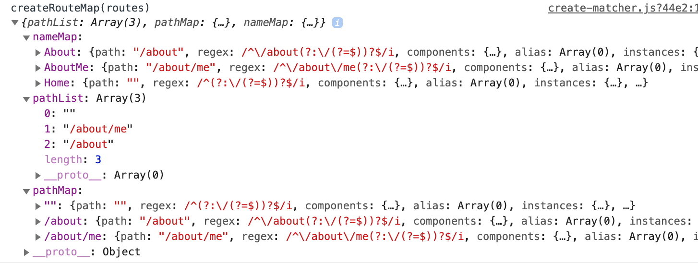

# vue-router 源码分析

vue-router 的作用是根据不同的路径映射到不同的视图。

一个基本例子如下：

```html
<div id="app">
  <h1>Hello App!</h1>
  <p>
    <router-link to="/foo">Go to Foo</router-link>
    <router-link to="/bar">Go to Bar</router-link>
  </p>
  <router-view></router-view>
</div>
```

```js
import Vue from "vue";
import VueRouter from "vue-router";
import App from "./App";

Vue.use(VueRouter);

const Foo = { template: "<div>foo</div>" };
const Bar = { template: "<div>bar</div>" };

const routes = [
  { path: "/foo", component: Foo },
  { path: "/bar", component: Bar },
];

const router = new VueRouter({
  routes,
});

const app = new Vue({
  el: "#app",
  render(h) {
    return h(App);
  },
  router,
});
```

上面 router 的使用其实和 Vuex 比较像。它主要是：

1. 在页面中使用 `<router-view>` 来存放匹配的视图
2. 通过 `<router-link>`来进行跳转
3. 通过 `Vue.use(VueRouter)` 安装路由
4. 在 `new Vue` 时注入 router 对象。routes 里面存放的是 `path:component` 的映射关系。

## 路由注册

在初始化时，beforeCreate 就执行了 2 次：


```
// 因为这里已经 mixin 混入了 router 的 beforeCreate 逻辑
import router from "./router";
// 在这里 Vuex里面时 new Vue({data:{$$state}}) 了的，
// 还一个 this._watcherVM = new Vue()
// 所以会执行 beforeCreate
import store from "./store";
```

## new Router 做了什么

- 构造方法里
  - 根据 routes 创建匹配器`this.matcher`，匹配器会返回四个方法：
    - match:
    - getRoute: 获取 route
    - addRoute: 动态添加路由用的
    - addRoutes: 动态添加多个路由
  - 兼容处理 mode: 比如用了 history,但是浏览器不支持，fallback 为 true，就需要回退到 hash
  - 根据不同的 mode 创建不同的 this.history 实例(兼容)
    - HTML5History
    - HashHistory
    - AbstractHistory
- install 时的 init 方法里
  - 将 Vue 实例存放到 `this.apps = []` 里面
  - 初始化跳转 history.transitionTo()，同时会设置监听回调
  - 设置监听，当 history 变化时，将所有 `app._route` 设置为当前的 route

## createMatcher

`createMatcher()` 会创建一个匹配器，用来根据路由匹配到要渲染的组件。它的内部流程如下：

- 首先根据 createRouteMap 创建一个路由映射对象(`name:组件`、`path:组件`)。
- 返回 4 个方法
  - addRoute 动态添加路由
  - addRoutes 能动态批量添加路由
  - getRoutes 获取所有的路由组件列表
  - match 根据 url 匹配到当前路由

### createRouteMap

`createRouteMap(routes)` 会将我们的路由配置转换成另一种更方便匹配的结构。

**原 routes**

```js
const routes = [
  {
    path: "/",
    name: "Home",
    component: Home,
  },
  {
    path: "/about",
    name: "About",
    component: () =>
      import(/* webpackChunkName: "about" */ "../views/About.vue"),
    children: [
      {
        path: "me",
        name: "AboutMe",
        component: () =>
          import(/* webpackChunkName: "aboutme" */ "../views/AboutMe.vue"),
      },
    ],
  },
];
```

经过`createRouteMap(routes)`后。



可以看到经过转换后生成了一个如下所示的对象：

```
{
  nameMap: 路由 name - 组件 的映射
  pathMap: 路由 path - 组件 的映射
  pathList: 所有的 path 列表
}
```

这样我们就可以快速的根据 name 和 path 来获取对应要渲染的组件了。
